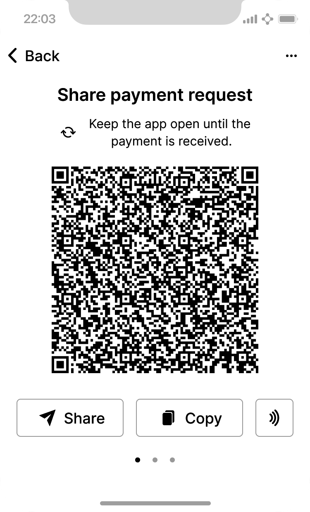
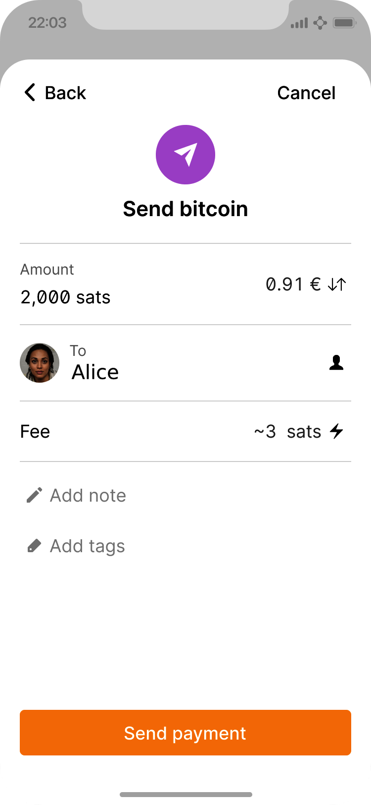

[role="pagenumrestart"]
[[ch01_intro_what_is_bitcoin]]
== Introduction

Bitcoin((("Bitcoin", "operational overview", id="bitcoin-operational-overview"))) is a collection of concepts and technologies that form the basis of a digital money ecosystem. Units of currency called bitcoin are used to store and transmit value among participants in the Bitcoin network. Bitcoin users communicate with each other using the Bitcoin protocol primarily via the internet, although other transport networks can also be used. The Bitcoin protocol stack, available as open source software, can be run on a wide range of computing devices, including laptops and smartphones, making the technology easily accessible.

[TIP]
====
In this book, the ((("bitcoins", "defined")))unit of currency is called "bitcoin" with a small _b_,
and the system is called "Bitcoin," with a capital _B_.
====

Users can transfer bitcoin over the network to do just about anything
that can be done with conventional currencies, including buying and selling
goods, sending money to people or organizations, or extending credit. Bitcoin
can be purchased, sold, and exchanged for other currencies at
specialized currency exchanges. Bitcoin is arguably the perfect form
of money for the internet because it is fast, secure, and borderless.

Unlike traditional currencies, the bitcoin currency is entirely virtual. There are no
physical coins or even individual digital coins. The coins are implied in
transactions that transfer value from spender to receiver. Users of
Bitcoin control keys that allow them to prove ownership of bitcoin in the
Bitcoin network. With these keys, they can sign transactions to unlock
the value and spend it by transferring it to a new owner. Keys are often
stored in a digital wallet on each user’s computer or smartphone.
Possession of the key that can sign a transaction is the only
prerequisite to spending bitcoin, putting the control entirely in the
hands of each user.

Bitcoin is a distributed, peer-to-peer system. As such, there is no
central server or point of control. Units of bitcoin
are created through a process((("bitcoins", "mining")))((("mining"))) called "mining," which involves repeatedly
performing a computational task that references a list of recent Bitcoin
transactions. Any participant in the Bitcoin network may operate as a
miner, using their computing devices to help secure
transactions. Every 10 minutes, on average, one Bitcoin miner can add security to
past transactions and is rewarded with both brand new
bitcoins and the fees paid by recent transactions. Essentially, Bitcoin
mining decentralizes the currency-issuance
and clearing functions of a central bank and replaces the need for any
central bank.

//-- Math for following paragraph --
//total_btc = 0
//for i in range(0, 10_000_000):
//  total_btc += (50 /  (2**int(i/210000)) )
//  if total_btc / 21e6 > 0.99:
//     print(i)
//     break

The Bitcoin protocol includes built-in algorithms that regulate the
mining function across the network. The difficulty of the computational
task that miners must perform is adjusted dynamically so that, on
average, someone succeeds every 10 minutes regardless of how many miners
(and how much processing) are competing at any moment. The protocol also
periodically decreases the number of new bitcoins that are created,
limiting the total number of bitcoins that will ever be created to a fixed total
just below 21 million coins. The result is that the number of bitcoins in
circulation closely follows an easily predictable curve where half of
the remaining coins are added to circulation every four years.  At
approximately block 1,411,200, which is expected to be produced around
the year 2035, 99% of all bitcoins
that will ever exist will have been issued.  Due to Bitcoin's
diminishing rate of issuance, over the long term, the Bitcoin currency
is deflationary.  Furthermore, nobody can force you to accept
any bitcoins that were created beyond the
expected issuance rate.

Behind the scenes, Bitcoin is also the name of the protocol, a peer-to-peer network, and a distributed computing innovation. Bitcoin builds on decades of research in cryptography and distributed systems and includes at least four key innovations brought together in a unique and powerful combination. Bitcoin consists of:

* A decentralized peer-to-peer network (the Bitcoin protocol)
* A public transaction journal (the blockchain)
* A set of rules for independent transaction validation and currency issuance (consensus rules)
* A mechanism for reaching global decentralized consensus on the valid blockchain (proof-of-work algorithm)

As a developer, I see Bitcoin as akin to the internet of money, a network for propagating value and securing the ownership of digital assets via distributed computation. There's a lot more to Bitcoin than first meets ((("Bitcoin", "operational overview", startref="bitcoin-operational-overview")))the eye.

In this chapter we'll get started by explaining some of the main concepts and terms, getting the necessary software, and using Bitcoin for simple transactions. In the following chapters, we'll start unwrapping the layers of technology that make Bitcoin possible and examine the inner workings of the Bitcoin network and protocol.

.Digital Currencies Before Bitcoin
****

The ((("digital currencies, history of")))((("history", "of digital currencies", secondary-sortas="digital currencies")))((("cryptography")))emergence of viable digital money is closely linked to developments in cryptography. This is not surprising when one considers the fundamental challenges involved with using bits to represent value that can be exchanged for goods and services. Three basic questions for anyone accepting digital money are:

*     Can I trust that the money is authentic and not counterfeit?
*     Can I trust that the digital money can only be spent once (known as the “double-spend” problem)?
*     Can I be sure that no one else can claim this money belongs to them and not me?

Issuers of paper money are constantly battling the counterfeiting problem by using increasingly sophisticated papers and printing technology.  Physical money addresses the double-spend issue easily because the same paper note cannot be in two places at once. Of course, conventional money is also often stored and transmitted digitally. In these cases, the counterfeiting and double-spend issues are handled by clearing all electronic transactions through central authorities that have a global view of the currency in circulation. For digital money, which cannot take advantage of esoteric inks or holographic strips, cryptography provides the basis for trusting the legitimacy of a user’s claim to value.  Specifically, cryptographic digital signatures enable a user to sign a digital asset or transaction proving the ownership of that asset. With the appropriate architecture, digital signatures also can be used to address the double-spend issue.

When cryptography started becoming more broadly available and understood in the late 1980s, many researchers began trying to use cryptography to build digital currencies. These early digital currency projects issued digital money, usually backed by a national currency or precious metal such as gold.

Although these earlier digital currencies worked, they were centralized and, as a result, were easy to attack by governments and hackers. Early digital currencies used a central clearinghouse to settle all transactions at regular intervals, just like a traditional banking system. Unfortunately, in most cases these nascent digital currencies were targeted by worried governments and eventually litigated out of existence. Some failed in spectacular crashes when the parent company liquidated abruptly. To be robust against intervention by antagonists, whether legitimate governments or criminal elements, a _decentralized_ digital currency was needed to avoid a single point of attack. Bitcoin is such a system, decentralized by design, and free of any central authority or point of control that can be attacked or corrupted.

****

=== History of Bitcoin

Bitcoin was((("Bitcoin", "history of")))((("history", "of Bitcoin", secondary-sortas="Bitcoin")))((("Nakamoto, Satoshi"))) first described in 2008 with the publication of a
paper titled "Bitcoin: A Peer-to-Peer Electronic Cash
System,"footnote:[https://oreil.ly/KUaBM["Bitcoin: A Peer-to-Peer Electronic Cash System"],
Satoshi Nakamoto.] written under the
alias of Satoshi Nakamoto (see <<satoshi_whitepaper>>). Nakamoto
combined several prior inventions such as digital signatures and Hashcash to create
a completely decentralized electronic cash system that does not rely on
a central authority for currency issuance or settlement and validation
of transactions. A key innovation was to use a distributed computation
system (called a "proof-of-work" algorithm) to conduct a global
lottery every 10 minutes on average, allowing the decentralized network to
arrive at _consensus_ about the state of transactions. This
elegantly solves the issue of double-spend where a single currency unit
can be spent twice. Previously, the double-spend problem was a weakness
of digital currency and was addressed by clearing all transactions
through a central clearinghouse.

The Bitcoin network started in 2009, based on a reference implementation
published by Nakamoto and since revised by many other programmers. The
number and power of machines running the((("proof-of-work algorithm", seealso="mining"))) proof-of-work algorithm
(mining) that provides security and resilience for Bitcoin have
increased exponentially, and their combined computational power now
exceeds the combined number of computing operations of the
world's top supercomputers.

Satoshi Nakamoto withdrew from the public in April 2011, leaving the responsibility of developing the code and network to a thriving group of volunteers. The identity of the person or people behind Bitcoin is still unknown. However, neither Satoshi Nakamoto nor anyone else exerts individual control over the Bitcoin system, which operates based on fully transparent mathematical principles, open source code, and consensus among participants. The invention itself is groundbreaking and has already spawned new science in the fields of distributed computing, economics, and econometrics.

.A Solution to a Distributed Computing Problem
****
Satoshi Nakamoto's invention ((("Byzantine Generals&#x27; Problem")))((("distributed computing problem")))is
also a practical and novel solution to a problem in distributed
computing, known as the "Byzantine Generals' Problem." Briefly, the
problem consists of trying to get multiple participants without a leader
to agree on a course of action by exchanging information over an
unreliable and potentially compromised network. Satoshi Nakamoto's solution, which uses the concept of
proof of work to achieve consensus _without a central trusted
authority_, represents a breakthrough in distributed computing.
****

=== Getting Started

Bitcoin is((("Bitcoin", "wallets", see="wallets")))((("wallets", "explained"))) a protocol that can be accessed using an
application that speaks the protocol. A "Bitcoin wallet" is the
most common user interface to the Bitcoin system, just like a web
browser is the most common user interface for the HTTP protocol. There
are many implementations and brands of Bitcoin wallets, just like there
are many brands of web browsers (e.g., Chrome, Safari, and Firefox).
And just like we all have our favorite browsers,
Bitcoin wallets vary in quality, performance, security, privacy, and
reliability. There is also a reference implementation of the Bitcoin
protocol that includes a wallet, known as "Bitcoin Core," which is
derived from the original implementation written by Satoshi Nakamoto.

==== Choosing a Bitcoin Wallet

Bitcoin wallets ((("wallets", "choosing")))((("selecting", "wallets")))((("choosing", see="selecting")))are one of the most actively developed applications in the Bitcoin ecosystem. There is intense competition, and while a new wallet is probably being developed right now, several wallets from last year are no longer actively maintained. Many wallets focus on specific platforms or specific uses and some are more suitable for beginners while others are filled with features for advanced users. Choosing a wallet is highly subjective and depends on the use and user expertise. Therefore, it would be pointless to recommend a specific brand or wallet. However, we can categorize Bitcoin wallets according to their platform and function and provide some clarity about all the different types of wallets that exist. It is worth trying out several different wallets until you find one that fits your needs.

===== Types of Bitcoin wallets
Bitcoin wallets ((("wallets", "types of", id="wallet-type")))can be categorized as follows, according to the platform:

Desktop wallet:: A ((("desktop wallets")))desktop wallet was the first type of Bitcoin wallet created as a reference implementation. Many users run desktop wallets for the features, autonomy, and control they offer. Running on general-use operating systems such as Windows and macOS has certain security disadvantages, however, as these platforms are often insecure and poorly configured.

Mobile wallet:: A ((("mobile wallets")))mobile wallet is the most common type of Bitcoin
wallet. Running on smart-phone operating systems such as Apple iOS and
Android, these wallets are often a great choice for new users. Many are
designed for simplicity and ease-of-use, but there are also fully
featured mobile wallets for power users.  To avoid downloading and
storing large amounts of data, most mobile wallets retrieve information
from remote servers, reducing your privacy by disclosing to third
parties information about your Bitcoin addresses and balances.

Web wallet:: Web wallets ((("web wallets")))are accessed through a web browser and store
the user's wallet on a server owned by a third party. This is similar to
webmail in that it relies entirely on a third-party server. Some of
these services operate using client-side code running in the user's
browser, which keeps control of the Bitcoin keys in the hands of the
user, although the user's dependence on the server still compromises
their privacy. Most, however, take control of the Bitcoin keys from
users in exchange for ease-of-use. It is inadvisable
to store large amounts of bitcoin on third-party systems.

Hardware signing devices:: Hardware signing devices((("hardware signing devices"))) are devices that can
store keys and sign transactions using special-purpose hardware and
firmware. They usually
connect to a desktop, mobile, or web wallet via USB cable,
near-field-communication (NFC), or a camera with QR codes.  By handling
all Bitcoin-related operations on the specialized hardware, these
wallets are less vulnerable to many types of attacks.  Hardware signing
devices are sometimes called "hardware wallets", but they need to be
paired with a full-featured wallet to send and receive transactions, and
the security and privacy offered by that paired wallet plays a critical
role in how much security and privacy the user obtains when using the
hardware signing device.

===== Full node versus Lightweight
Another way to categorize Bitcoin wallets is by their degree of autonomy and how they interact with the Bitcoin network:

Full node:: A full node ((("full nodes")))is a program that validates the
entire history of Bitcoin transactions (every transaction by every user, ever).  Optionally, full nodes can also store previously validated
transactions and serve data to other Bitcoin programs, either on the
same computer or over the internet.  A full node uses substantial
computer resources--about the same as watching an hour-long streaming
video for each day of Bitcoin transactions--but the full node offers
complete autonomy to its users.

Lightweight client:: 
A lightweight client,((("lightweight clients")))((("simplified-payment-verification (SPV) clients")))((("SPV (simplified-payment-verification) clients"))) also known as a simplified-payment-verification (SPV) client,
connects to a full node or other remote server for receiving and sending
Bitcoin transaction information, but stores the user wallet locally,
partially validates the transactions it receives, and independently
creates outgoing transactions.

Third-party API client:: A third-party
API client ((("third-party API clients")))is one that interacts with Bitcoin through a third-party
system of APIs rather than by
connecting to the Bitcoin network directly. The wallet may be stored by
the user or by third-party servers, but the client trusts the remote
server to provide it with accurate information and protect its ((("wallets", "types of", startref="wallet-type")))privacy.

[TIP]
====
Bitcoin ((("Bitcoin", "as peer-to-peer network", secondary-sortas="peer-to-peer network")))((("peer-to-peer networks, Bitcoin as")))((("peers")))((("clients")))is a peer-to-peer (P2P) network.  Full nodes are the _peers:_
each peer individually validates every confirmed transaction and can
provide data to its user with complete authority.  Lightweight wallets
and other software are _clients:_ each client depends on one or more peers
to provide it with valid data.  Bitcoin clients can perform secondary
validation on some of the data they receive and make connections to
multiple peers to reduce their dependence on the integrity of a single
peer, but the security of a client ultimately relies on the integrity of
its peers.
====

===== Who controls the keys

A very((("wallets", "key control")))((("keys, control of")))((("bitcoins", "key control"))) important additional consideration is _who controls the keys_. As
we will see in subsequent chapters, access to bitcoins is
controlled by "private keys," which are like very long PINs. If
you are the only one to have control over these private
keys, you are in control of your bitcoins. Conversely, if you do not have
control, then your bitcoins are managed by a third-party who
ultimately controls your funds on your behalf. Key management software falls into two
important categories based on control: _wallets_, where you
control the keys, and the funds and accounts with custodians where some
third-party controls the keys. To emphasize this point, I (Andreas)
coined the phrase: _Your keys, your coins. Not your keys, not your coins_.

Combining these categorizations, many Bitcoin wallets fall into a few
groups, with the three most common being desktop full node
(you control the keys), mobile lightweight wallet (you control the keys), and web-based
accounts with third parties (you don't control the keys). The lines between different categories
are sometimes blurry, as software runs on multiple platforms and can
interact with the network in different ways.

==== Quick Start

Alice is not a
technical user and only recently heard about Bitcoin from her friend
Joe. While at a party, Joe is enthusiastically explaining
Bitcoin to everyone around him and is offering a demonstration. Intrigued,
Alice asks how she can get started with Bitcoin. Joe says that a mobile
wallet is best for new users and he recommends a few of his favorite
wallets. Alice downloads one of Joe's recommendations
and installs it on her phone.

When Alice runs her wallet application for the first time, she chooses
the option to create a new Bitcoin wallet. Because the wallet she has
chosen is a ((("wallets", "noncustodial")))((("noncustodial wallets")))noncustodial wallet, Alice (and only Alice) will be in
control of her keys. Therefore, she bears responsibility for backing
them up, since losing the keys means she loses access to her bitcoins. To
facilitate this, her wallet produces a _recovery code_ that can be used
to restore her wallet.

[[recovery_code_intro]]
==== Recovery Codes

Most ((("wallets", "recovery codes", id="wallet-recovery")))((("recovery codes", id="recovery-code")))((("backing up", "recovery codes", see="recovery codes")))modern noncustodial Bitcoin wallets will provide a recovery
code for their user
to back up.  The recovery code usually consists of numbers, letters, or words
selected randomly by the software, and is used as the basis for the keys
that are generated by the wallet. See <<recovery_code_sample>> for
examples.

++++
<table id="recovery_code_sample">
<caption>Sample recovery codes</caption>
<thead>
<tr>
<th>Wallet</th>
<th>Recovery code</th>
</tr>
</thead>
<tbody>
<tr>
<td>
BlueWallet
</td>
<td>
(1) media (2) suspect (3) effort (4) dish (5) album (6) shaft (7) price (8) junk (9) pizza (10) situate (11) oyster (12) rib
</td>
</tr>
<tr>
<td>
Electrum
</td>
<td>
nephew dog crane clever quantum crazy purse traffic repeat fruit old clutch
</td>
</tr>
<tr>
<td>
Muun
</td>
<td>
LAFV TZUN V27E NU4D WPF4 BRJ4 ELLP BNFL
</td>
</tr>
</tbody>
</table>
++++

[TIP]
====
A recovery code is ((("mnemonic phrases", see="recovery codes")))((("seed phrases", see="recovery codes")))sometimes called a "mnemonic" or "mnemonic phrase,"
which implies you should memorize the phrase, but writing the phrase
down on paper takes less work and tends to be more reliable than most
people's memories.  Another alternative name is "seed phrase" because
it provides the input ("seed") to the function that generates all of
a wallet's keys.
====

If something happens to Alice's wallet, she can download a new copy of
her wallet software and enter this recovery code to rebuild the wallet
database of all the onchain transactions she's ever sent or received.
However, recovering from the recovery code will not by itself restore any additional
data Alice entered into her wallet, such as the labels she associated
with particular addresses or transactions.  Although losing access to
that metadata isn't as important as losing access to money, it can
still be important in its own way.  Imagine you need to review an old
bank or credit card statement and the name of every entity you paid (or
who paid you) has been blanked out.  To prevent losing metadata, many
wallets provide an additional backup feature beyond recovery codes.

For some wallets, that additional backup feature is even more important
today than it used to be.  Many Bitcoin payments ((("offchain technology")))are now made using
_offchain_ technology, where not every payment is stored in the public blockchain.  This reduces user's costs and improves privacy, among other
benefits, but it means that a mechanism like recovery codes that depends on
onchain data can't guarantee recovery of all of a user's bitcoins.  For
applications with offchain support, it's important to make frequent
backups of the wallet database.

Of note, when receiving funds to a new mobile wallet for the first time,
many wallets will often re-verify that you have securely backed-up your
recovery code. This can range from a simple prompt to requiring the
user to manually re-enter the code.

[WARNING]
====
Although many legitimate wallets will prompt you to re-enter
your recovery code, there are also many malware applications that mimic the
design of a wallet, insist you enter your recovery code, and then
relay any entered code to the malware developer so they can steal
your funds.  This is the equivalent of phishing websites that try to
trick you into giving them your bank passphrase.  For most wallet
applications, the only times they will ask for your recovery code are during
the initial set up (before you have received any bitcoins) and during
recovery (after you lost access to your original wallet).  If the application
asks for your recovery code any other time, consult with an expert to
ensure you aren't ((("wallets", "recovery codes", startref="wallet-recovery")))((("recovery codes", startref="recovery-code")))being phished.
====

==== Bitcoin Addresses

Alice is ((("addresses", "explained")))now ready to start using her new Bitcoin wallet.  Her wallet application randomly generated a private key (described in more detail in <<private_keys>>) that will be used to derive Bitcoin addresses that direct to her wallet. At this point, her Bitcoin addresses are not known to the Bitcoin network or "registered" with any part of the Bitcoin system. Her Bitcoin addresses are simply numbers that correspond to her private key that she can use to control access to the funds. The addresses are generated independently by her wallet without reference or registration with any service.

[TIP]
====
There
are a variety ((("invoices")))of Bitcoin addresses and invoice formats.  Addresses and
invoices can be shared with other Bitcoin users
who can use them to send bitcoins directly to your wallet.  You can share
an address or invoice with other people without worrying about the
security of your bitcoins.  Unlike a bank account number, nobody who
learns one of your Bitcoin addresses can withdraw money from your wallet--you
must initiate all spends.  However, if you give two people the same
address, they will be able to see how many bitcoins the other person sent
you.  If you post your address publicly, everyone will be able to see
how much bitcoin other people sent to that address.  To protect your privacy, you
should generate a new invoice with a new address each time you request a
payment.
====

==== Receiving Bitcoin

Alice((("bitcoins", "receiving")))((("receiving bitcoins"))) uses the _Receive_ button, which displays a QR code, shown in <<wallet_receive>>.

[role="width-50"]
[[wallet_receive]]
.Alice uses the Receive screen on her mobile Bitcoin wallet and displays her address in a QR code format.

The QR code is the square with a pattern of black and white dots, serving as a form of barcode that contains the same information in a format that can be scanned by Joe's smartphone camera.

[WARNING]
====
Any funds sent to the addresses in this book will be lost.  If you want
to test sending bitcoins, please consider donating it to a
bitcoin-accepting charity.
====

[[getting_first_bitcoin]]
==== Getting Your First Bitcoin

The((("bitcoins", "acquiring", id="bitcoin-acquire")))((("acquiring bitcoins", id="acquire-bitcoin"))) first task for new users is to acquire some bitcoin.

Bitcoin transactions are irreversible. Most electronic payment networks such as credit cards, debit cards, PayPal, and bank account transfers are reversible. For someone selling bitcoin, this difference introduces a very high risk that the buyer will reverse the electronic payment after they have received bitcoin, in effect defrauding the seller. To mitigate this risk, companies accepting traditional electronic payments in return for bitcoin usually require buyers to undergo identity verification and credit-worthiness checks, which may take several days or weeks. As a new user, this means you cannot buy bitcoin instantly with a credit card. With a bit of patience and creative thinking, however, you won't need to.

Here are some methods for acquiring bitcoin as a new user:

* Find a friend who has bitcoins and buy some from him or her directly. Many Bitcoin users start this way. This method is the least complicated. One way to meet people with bitcoins is to attend a local Bitcoin meetup listed at pass:[<a href="https://meetup.com" class="orm:hideurl">Meetup.com</a>].
* Earn bitcoin by selling a product or service for bitcoin. If you are a programmer, sell your programming skills. If you're a hairdresser, cut hair for bitcoins.
* Use a Bitcoin ATM in your city.  A Bitcoin ATM is a machine that accepts cash and sends bitcoins to your smartphone Bitcoin wallet.
* Use((("bitcoins", "currency exchanges")))((("currency exchanges"))) a Bitcoin currency exchange linked to your bank account. Many countries now have currency exchanges that offer a market for buyers and sellers to swap bitcoins with local currency. Exchange-rate listing services, such as https://bitcoinaverage.com[BitcoinAverage], often show a list of Bitcoin exchanges for each currency.

[TIP]
====
One of the advantages of
Bitcoin over other payment systems is that, when used correctly, it
affords users much more privacy. Acquiring, holding, and spending
bitcoin does not require you to divulge sensitive and personally
identifiable information to third parties. However, where bitcoin
touches traditional systems, such as currency exchanges, national and
international regulations often apply. In order to exchange bitcoin for
your national currency, you will often be required to provide proof of
identity and banking information. Users should be aware that once a
Bitcoin address is attached to an identity, other associated Bitcoin
transactions may also become easy to identify and track--including
transactions made earlier. This is one reason
many users choose to maintain dedicated exchange accounts independent from
their wallets.
====

Alice was introduced to Bitcoin by a friend, so she has an easy way to acquire her first bitcoins. Next, we will look at how she buys bitcoins from her friend Joe and how Joe sends the bitcoins to her ((("bitcoins", "acquiring", startref="bitcoin-acquire")))((("acquiring bitcoins", startref="acquire-bitcoin")))wallet.

[[bitcoin_price]]
==== Finding the Current Price of Bitcoin

Before ((("bitcoins", "exchange rate", id="bitcoin-exchange-rate")))((("exchange rate", id="exchange-rate")))((("current price of bitcoins", id="current-price")))Alice can buy bitcoin from Joe, they have to agree on the _exchange rate_ between bitcoin and US dollars. This brings up a common question for those new to Bitcoin: "Who sets the price
of bitcoins?" The short answer is that the price is set by markets.

Bitcoin, like most other currencies, has a _floating exchange rate_. That means that the value of bitcoin fluctuates according to supply and demand in the various markets where it is traded. For example, the "price" of bitcoin in US dollars is calculated in each market based on the most recent trade of bitcoins and US dollars. As such, the price tends to fluctuate minutely several times per second. A pricing service will aggregate the prices from several markets and calculate a volume-weighted average representing the broad market exchange rate of a currency pair (e.g., BTC/USD).

There are hundreds of applications and websites that can provide the current market rate. Here are some of the most popular:

https://bitcoinaverage.com[Bitcoin Average]:: A site that provides a simple view of the volume-weighted average for each currency.
https://coincap.io[CoinCap]:: A service listing the market capitalization and exchange rates of hundreds of cryptocurrencies, including bitcoins.
https://oreil.ly/ACieC[Chicago Mercantile Exchange Bitcoin Reference Rate]:: A reference rate that can be used for institutional and contractual reference, provided as part of investment data feeds by the CME.

In addition to these various sites and applications, some Bitcoin
wallets will automatically convert amounts between bitcoin and other currencies.

[[sending_receiving]]
==== Sending and Receiving Bitcoin

Alice ((("bitcoins", "spending", id="bitcoin-send")))((("spending bitcoins", id="send-bitcoin")))((("bitcoins", "receiving", id="bitcoin-receive")))((("receiving bitcoins", id="receive-bitcoin")))has
decided to buy 0.001 bitcoins. After she and Joe check the exchange rate,
she gives Joe an appropriate amount of cash, opens her mobile wallet
application, and selects Receive. This
displays a QR code with Alice's first Bitcoin address.

Joe then selects Send on his smartphone wallet and opens the QR code
scanner.  This allows Joe to scan the barcode with his smartphone camera
so that he doesn't have to type in Alice's Bitcoin address, which is
quite long.

Joe now has Alice's Bitcoin address set as the recipient. Joe enters the amount as 0.001 bitcoins (BTC); see <<wallet-send>>.  Some wallets may
show the amount in a different denomination: 0.001 BTC is 1 millibitcoin
(mBTC) or 100,000 satoshis (sats).

Some wallets may also suggest Joe enter a label for this transaction; if
so, Joe enters "Alice".  Weeks or months from now, this will help Joe
remember why he sent these 0.001 bitcoins.  Some wallets may also prompt
Joe about fees.  Depending on the wallet and how the transaction is
being sent, the wallet may ask Joe to either enter a transaction fee rate or
prompt him with a suggested fee (or fee rate).  The higher the transaction fee, the
faster the transaction will be confirmed (see <<confirmations>>).

[[wallet-send]]
.Bitcoin wallet send screen.

Joe then carefully checks to make sure he has entered the correct
amount, because he is about to transmit money and mistakes will soon become
irreversible. After double-checking the address and amount, he presses
Send to transmit the transaction. Joe's mobile Bitcoin wallet constructs
a transaction that assigns 0.001 BTC to the address provided by Alice,
sourcing the funds from Joe's wallet, and signing the transaction with
Joe's private keys. This tells the Bitcoin network that Joe has
authorized a transfer of value to Alice's new address. As the
transaction is transmitted via the peer-to-peer protocol, it quickly
propagates across the Bitcoin network. After just a few seconds, most of
the well-connected nodes in the network receive the transaction and see
Alice's address for the first time.

Meanwhile, Alice's wallet is constantly "listening" for new
transactions on the Bitcoin network, looking for any that match the
addresses it contains. A few seconds after Joe's wallet transmits the
transaction, Alice's wallet will indicate that it is receiving
0.001 BTC.

[[confirmations]]
.Confirmations
****
At first, ((("bitcoins", "clearing transactions")))((("clearing transactions")))((("transactions", "clearing")))((("confirmations")))Alice's address will show the transaction from Joe as "Unconfirmed." This means that the transaction has been propagated to the network but has not yet been recorded in the Bitcoin transaction journal, known as the blockchain. To be confirmed, a transaction must be included in a block and added to the blockchain, which happens every 10 minutes, on average. In traditional financial terms this is known as _clearing_. For more details on propagation, validation, and clearing (confirmation) of bitcoin transactions, see <<mining>>.
****

Alice is now the proud owner of 0.001 BTC that she can spend. Over the next few days, Alice buys more bitcoin using an ATM and((("bitcoins", "spending", startref="bitcoin-send")))((("spending bitcoins", startref="send-bitcoin")))((("bitcoins", "receiving", startref="bitcoin-receive")))((("receiving bitcoins", startref="receive-bitcoin"))) an exchange. In the next chapter we will look at her first purchase with Bitcoin, and examine the underlying transaction and propagation technologies in more detail.
