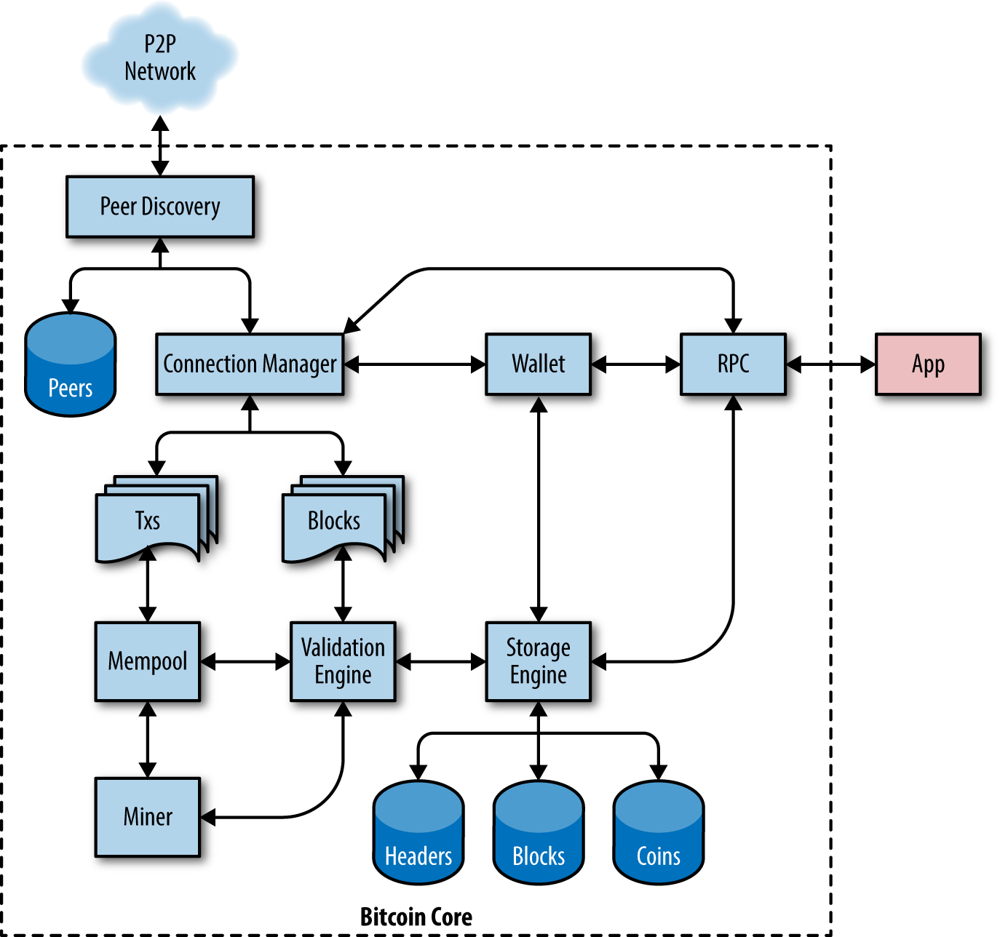

[[ch03_bitcoin_client]]
== Bitcoin Core: The Reference Implementation

People only accept money in exchange for their valuable goods and
services if they believe that they'll be able to spend that money later.
Money that is counterfeit or unexpectedly debased may not be spendable
later, so every person accepting bitcoins has a strong incentive to
verify the integrity of the bitcoins they receive.  The Bitcoin system
was designed so that it's possible for software running entirely on your
local computer to perfectly prevent counterfeiting, debasement, and
several other critical problems.  Software which provides that function
is called a _full verification node_ because it verifies every confirmed
Bitcoin transaction against every rule in the system.  Full ((("full nodes")))verification
nodes, _full nodes_ for short, may also provide tools and data for
understanding how Bitcoin works and what is currently happening in the
network.

In this chapter, we'll install Bitcoin Core, the implementation that
most full node operators have used since the beginning of the Bitcoin
network.   We'll then inspect blocks, transactions, and other data from
your node, data which is authoritative--not because some powerful entity
designated it as such but because your node independently verified it.
Throughout the rest of this book, we'll continue using Bitcoin Core to
create and examine data related to the blockchain and network.

=== From Bitcoin to Bitcoin Core

Bitcoin ((("Bitcoin Core", "explained", id="bitcoin-core-explain")))is an _open
source_ project and the source code is available under an open (MIT)
license, free to download and use for any purpose.  More than just being
open source, Bitcoin is developed by
an open community of volunteers. At first, that community consisted of
only ((("Nakamoto, Satoshi")))Satoshi Nakamoto. By 2023, Bitcoin's source code had more than 1,000
contributors with about a dozen developers working on the code almost
full time and several dozen more on a part-time basis. Anyone can
contribute to the code&#x2014;including you!

When Bitcoin was created by Satoshi Nakamoto, the
software was mostly completed before publication of the whitepaper (reproduced in
<<satoshi_whitepaper>>). Satoshi wanted to make sure the
implementation worked before publishing a paper about it. That first implementation, then simply
known as "Bitcoin," has been heavily modified and
improved. It has evolved into what is known as _Bitcoin Core_, to
differentiate it from other implementations. Bitcoin Core is
the _reference implementation_ of the Bitcoin system, meaning that it
provides a reference for how each part of the technology should be
implemented. Bitcoin Core implements all aspects of Bitcoin, including
wallets, a transaction and block validation engine, tools for block construction, and all modern parts
of Bitcoin peer-to-peer communication.

<<bitcoin_core_architecture>> shows the architecture of Bitcoin
Core.

[[bitcoin_core_architecture]]
.Bitcoin Core architecture (Source: Eric Lombrozo).

Although Bitcoin Core serves as a reference implementation for many
major parts of the system, the Bitcoin whitepaper describes several
early parts of the system.  Most major parts of the system since 2011
have been documented in a set of
https://oreil.ly/BCXAQ[Bitcoin Improvement
Proposals (BIPs)].  Throughout((("BIPs (Bitcoin Improvement Proposals)")))((("Bitcoin Improvement Proposals", see="BIPs"))) this book, we refer to BIP specifications
by their number; for example, BIP9 describes a mechanism used for
several major upgrades to((("Bitcoin Core", "explained", startref="bitcoin-core-explain"))) Bitcoin.

=== Bitcoin Development Environment

If you're a
developer, you will want to set up a development environment with all
the tools, libraries, and support software for writing Bitcoin
applications. In this highly technical chapter, we'll walk through that
process step by step. If the material becomes too dense (and you're not
actually setting up a development environment) feel free to skip to the
next chapter, which is less technical.

[[compiling_core]]
=== Compiling Bitcoin Core from the Source Code

Bitcoin Core's
source code((("Bitcoin Core", "compiling from source code", id="bitcoin-core-compile")))((("compiling Bitcoin Core from source code", id="compile-bitcoin-core")))((("source code, compiling Bitcoin Core", id="source-code-compile"))) can be downloaded as an archive or by cloning the
source repository from GitHub.  On the https://oreil.ly/hN9g1[Bitcoin Core download
page], select the most recent version and download the compressed
archive of the source code. Alternatively, use the Git command line to create a
local copy of the source code from the
https://oreil.ly/BdOwl[GitHub Bitcoin page].

[TIP]
====
In
many of the examples in this chapter, we will be using the operating
system's command-line interface (also known as a "shell"), accessed via
a "terminal" application. The shell will display a prompt, you type a
command, and the shell responds with some text and a new prompt for your
next command. The prompt may look different on your system, but in the
following examples, it is denoted by a +$+ symbol. In the examples, when
you see text after a +$+ symbol, don't type the +$+ symbol but type the
command immediately following it, then press Enter to execute the
command. In the examples, the lines below each command are the operating
system's responses to that command. When you see the next +$+ prefix,
you'll know it's a new command and you should repeat the process.
====

Here, we use the +git+ command to create a
local copy ("clone") of the source code:

----
$ git clone https://github.com/bitcoin/bitcoin.git
Cloning into 'bitcoin'...
remote: Enumerating objects: 245912, done.
remote: Counting objects: 100% (3/3), done.
remote: Compressing objects: 100% (2/2), done.
remote: Total 245912 (delta 1), reused 2 (delta 1), pack-reused 245909
Receiving objects: 100% (245912/245912), 217.74 MiB | 13.05 MiB/s, done.
Resolving deltas: 100% (175649/175649), done.
----

[TIP]
====
Git is the most widely used
distributed version control system, an essential part of any software
developer's toolkit. You may need to install the +git+ command, or a
graphical user interface for Git, on your operating system if you do not
have it already.
====

When the Git cloning operation has completed, you will have a complete
local copy of the source code repository in the directory _bitcoin_.
Change to this directory using the +cd+ command:

----
$ cd bitcoin
----

==== Selecting a Bitcoin Core Release

By default,((("Bitcoin Core", "compiling from source code", "selecting release version", id="bitcoin-core-compile-release")))((("compiling Bitcoin Core from source code", "selecting release version", id="compile-bitcoin-core-release")))((("source code, compiling Bitcoin Core", "selecting release version", id="source-code-compile-release")))((("release version (Bitcoin Core), selecting", id="release-select")))((("selecting", "release version (Bitcoin Core)", id="select-release"))) the local copy will be synchronized with the
most recent code, which might be an unstable or beta version of Bitcoin.
Before compiling the code, select a specific version by checking out a
release _tag_. This will synchronize the local copy with a specific
snapshot of the code repository identified by a keyword tag. Tags are
used by the developers to mark specific releases of the code by version
number. First, to find the available tags, we use the +git tag+ command:

----
$ git tag
v0.1.5
v0.1.6test1
v0.10.0
...
v0.11.2
v0.11.2rc1
v0.12.0rc1
v0.12.0rc2
...
----

The list of tags shows all the released versions of Bitcoin. By
convention, _release candidates_, which ((("release candidates")))are intended for testing, have
the suffix "rc." Stable releases that can be run on production systems
have no suffix. From the preceding list, select the highest version
release, which at the time of writing was v24.0.1. To synchronize the
local code with this version, use the +git checkout+ command:

----
$ git checkout v24.0.1
Note: switching to 'v24.0.1'.

You are in 'detached HEAD' state. You can look around, make experimental
changes and commit them, and you can discard any commits you make in this
state without impacting any branches by switching back to a branch.

HEAD is now at b3f866a8d Merge bitcoin/bitcoin#26647: 24.0.1 final changes
----

You can confirm you have the desired version "checked out" by((("Bitcoin Core", "compiling from source code", "selecting release version", startref="bitcoin-core-compile-release")))((("compiling Bitcoin Core from source code", "selecting release version", startref="compile-bitcoin-core-release")))((("source code, compiling Bitcoin Core", "selecting release version", startref="source-code-compile-release")))((("release version (Bitcoin Core), selecting", startref="release-select")))((("selecting", "release version (Bitcoin Core)", startref="select-release"))) issuing
the command +git status+:

----
HEAD detached at v24.0.1
nothing to commit, working tree clean
----

==== Configuring the Bitcoin Core Build

The((("Bitcoin Core", "compiling from source code", "configuring build", id="bitcoin-core-compile-configure")))((("compiling Bitcoin Core from source code", "configuring build", id="compile-bitcoin-core-configure")))((("source code, compiling Bitcoin Core", "configuring build", id="source-code-compile-configure")))((("configuring", "Bitcoin Core build", id="configure-build"))) source code includes documentation, which
can be found in a number of files. Review the main documentation located
in _README.md_ in the _bitcoin_ directory.
In this chapter, we will build the Bitcoin Core daemon
(server), also known as +bitcoind+ on Linux (a Unix-like system). Review the instructions for
compiling the +bitcoind+ command-line client on your platform by reading
_doc/build-unix.md_.  Alternative instructions can be found in
the _doc_ directory; for example, _build-windows.md_ for Windows
instructions.  As of this writing, instructions are available for
Android, FreeBSD, NetBSD, OpenBSD, macOS (OSX), Unix, and Windows.

Carefully review the build prerequisites, which are in the first part of
the build documentation. These are libraries that must be present on
your system before you can begin to compile Bitcoin. If these
prerequisites are missing, the build process will fail with an error. If
this happens because you missed a prerequisite, you can install it and
then resume the build process from where you left off. Assuming the
prerequisites are installed, you start the build process by generating a
set of build scripts using the _autogen.sh_ script:

----
$ ./autogen.sh
libtoolize: putting auxiliary files in AC_CONFIG_AUX_DIR, 'build-aux'.
libtoolize: copying file 'build-aux/ltmain.sh'
libtoolize: putting macros in AC_CONFIG_MACRO_DIRS, 'build-aux/m4'.
 ...
configure.ac:58: installing 'build-aux/missing'
src/Makefile.am: installing 'build-aux/depcomp'
parallel-tests: installing 'build-aux/test-driver'
----

The _autogen.sh_ script creates a set of automatic configuration scripts
that will interrogate your system to discover the correct settings and
ensure you have all the necessary libraries to compile the code. The
most important of these is the +configure+ script that offers a number
of different options to customize the build process. Use the
+--help+ flag to see the various options:

----
$ ./configure --help
`configure' configures Bitcoin Core 24.0.1 to adapt to many kinds of systems.

Usage: ./configure [OPTION]... [VAR=VALUE]...

...
Optional Features:
  --disable-option-checking  ignore unrecognized --enable/--with options
  --disable-FEATURE       do not include FEATURE (same as --enable-FEATURE=no)
  --enable-FEATURE[=ARG]  include FEATURE [ARG=yes]
  --enable-silent-rules   less verbose build output (undo: "make V=1")
  --disable-silent-rules  verbose build output (undo: "make V=0")
...
----

The +configure+ script allows you to enable or disable certain features
of +bitcoind+ through the use of the +--enable-FEATURE+ and
+--disable-FEATURE+ flags, where pass:[<code>FEATURE</code>] is replaced by the
feature name, as listed in the help output. In this chapter, we will
build the +bitcoind+ client with all the default features. We won't be
using the configuration flags, but you should review them to understand
what optional features are part of the client. If you are in an academic
setting, computer lab restrictions may require you to install
applications in your home directory (e.g., using +--prefix=$HOME+).

Here are some useful options that override the default behavior of the
+configure+ script:

++++
<dl>
<dt><code>--prefix=$HOME</code></dt>
<dd>
This overrides the default installation location (which is <em>/usr/local/</em>) for the resulting executable. Use <code>$HOME</code> to put everything in your home directory, or a different path.
</dd>

<dt><code>--disable-wallet</code></dt>
<dd>
This is used to disable the reference wallet implementation.
</dd>

<dt><code>--with-incompatible-bdb</code></dt>
<dd>
If you are building a wallet, allow the use of an incompatible version of the Berkeley DB library.
</dd>

<dt><code>--with-gui=no</code></dt>
<dd>
Don't build the graphical user interface, which requires the Qt library. This builds server and command-line Bitcoin Core only.
</dd>
</dl>
++++

Next, run the +configure+ script to automatically discover all the necessary libraries and create a customized build script for your system:

----
$ ./configure
checking for pkg-config... /usr/bin/pkg-config
checking pkg-config is at least version 0.9.0... yes
checking build system type... x86_64-pc-linux-gnu
checking host system type... x86_64-pc-linux-gnu
checking for a BSD-compatible install... /usr/bin/install -c
...
[many pages of configuration tests follow]
...
----

If all went well, the +configure+ command will end by creating the
customized build scripts that will allow us to compile +bitcoind+. If
there are any missing libraries or errors, the +configure+ command will
terminate with an error instead of creating the build scripts. If an
error occurs, it is most likely because of a missing or incompatible
library. Review the build documentation again and make sure you install
the missing prerequisites. Then run +configure+ again and see if that
fixes the((("Bitcoin Core", "compiling from source code", "configuring build", startref="bitcoin-core-compile-configure")))((("compiling Bitcoin Core from source code", "configuring build", startref="compile-bitcoin-core-configure")))((("source code, compiling Bitcoin Core", "configuring build", startref="source-code-compile-configure")))((("configuring", "Bitcoin Core build", startref="configure-build"))) error.

==== Building the Bitcoin Core Executables

Next, you
will ((("Bitcoin Core", "compiling from source code", "building executables")))((("compiling Bitcoin Core from source code", "building executables")))((("source code, compiling Bitcoin Core", "building executables")))((("executables (Bitcoin Core), building")))compile the source code, a process that can take up to an hour to
complete, depending on the speed of your CPU and available memory.
If an error
occurs, or the compilation process is interrupted, it can be resumed any
time by typing +make+ again. Type *+make+* to start compiling the
executable application:

----
$ make
Making all in src
  CXX      bitcoind-bitcoind.o
  CXX      libbitcoin_node_a-addrdb.o
  CXX      libbitcoin_node_a-addrman.o
  CXX      libbitcoin_node_a-banman.o
  CXX      libbitcoin_node_a-blockencodings.o
  CXX      libbitcoin_node_a-blockfilter.o
[... many more compilation messages follow ...]
----

On a fast system with more than one CPU, you might want to set the
number of parallel compile jobs. For instance, +make -j 2+ will use two
cores if they are available. If all goes well, Bitcoin Core is now
compiled. You should run the unit test suite with +make check+ to ensure
the linked libraries are not broken in obvious ways. The final step is
to install the various executables on your system using the +make
install+ command. You may be prompted for your user password because
this step requires administrative privileges:

----
$ make check && sudo make install
Password:
Making install in src
 ../build-aux/install-sh -c -d '/usr/local/lib'
libtool: install: /usr/bin/install -c bitcoind /usr/local/bin/bitcoind
libtool: install: /usr/bin/install -c bitcoin-cli /usr/local/bin/bitcoin-cli
libtool: install: /usr/bin/install -c bitcoin-tx /usr/local/bin/bitcoin-tx
...
----

The default installation of +bitcoind+
puts it in _/usr/local/bin_. You can confirm that Bitcoin Core is
correctly installed by asking the system for the path of the
executables, ((("Bitcoin Core", "compiling from source code", startref="bitcoin-core-compile")))((("compiling Bitcoin Core from source code", startref="compile-bitcoin-core")))((("source code, compiling Bitcoin Core", startref="source-code-compile")))as follows:

----
$ which bitcoind
/usr/local/bin/bitcoind

$ which bitcoin-cli
/usr/local/bin/bitcoin-cli
----

=== Running a Bitcoin Core Node

Bitcoin's ((("Bitcoin Core", "nodes", "running", id="bitcoin-core-nodes-running")))((("nodes", "running", id="nodes-running")))((("running nodes", id="running-nodes")))peer-to-peer
network is composed of network "nodes," run mostly by individuals and
some of the businesses that provide Bitcoin services. Those running
Bitcoin nodes have a direct and authoritative view of the Bitcoin
blockchain, with a local copy of all the spendable bitcoins
independently validated by their own system. By running a node, you
don't have to rely on any third party to validate a transaction.
Additionally, by using a Bitcoin node to fully validate the transactions
you receive to your wallet, you contribute to the Bitcoin network and
help make it more robust.

Running a node, however, requires downloading and processing over 500 GB
of data initially and about 400 MB of Bitcoin transactions per day.
These figures are for 2023 and will likely increase over time.  If you
shut down your node or get disconnected from the internet for several
days, your node will need to download the data that it missed.  For
example, if you close Bitcoin Core for 10 days, you will need to
download approximately 4 GB the next time you start it.

Depending on whether you choose to index all transactions and keep a
full copy of the blockchain, you may also need a lot of disk space--at
least 1 TB if you plan to run Bitcoin Core for several years.  By
default, Bitcoin nodes also transmit transactions and blocks to other
nodes (called "peers"), consuming upload internet bandwidth. If your
internet connection is limited, has a low data cap, or is metered
(charged by the gigabit), you should probably not run a Bitcoin node on
it, or run it in a way that constrains its bandwidth (see
<<bitcoincorenode_config>>).  You may connect your node instead to an
alternative network, such as a free satellite data provider like
https://oreil.ly/cIwf3[Blockstream Satellite].

[TIP]
====
Bitcoin Core keeps a full
copy of the blockchain by default, with nearly every transaction that has ever
been confirmed on the Bitcoin network since its inception in 2009. This
dataset is hundreds of gigabytes in size and is downloaded incrementally
over several hours or days, depending on the speed of your CPU and
internet connection. Bitcoin Core will not be able to process
transactions or update account balances until the full blockchain
dataset is downloaded. Make sure you have enough disk space, bandwidth,
and time to complete the initial synchronization. You can configure
Bitcoin Core to reduce the size of the blockchain by discarding old
blocks, but it will still download the
entire dataset.
====

Despite these resource requirements, thousands of people run Bitcoin
nodes. Some are running on systems as simple as a Raspberry Pi (a $35
USD computer the size of a pack of cards).

[role="less_space pagebreak-before"]
Why would you want to run a node? Here are some of the most common
reasons:

- You do not want to rely on any third party to validate the
  transactions you receive.

- You do not want to disclose to third parties which transactions belong
  to your wallet.

- You are developing Bitcoin software and need to rely on a Bitcoin
  node for programmable (API) access to the network and blockchain.

- You are building applications that must validate transactions
  according to Bitcoin's consensus rules. Typically, Bitcoin software
  companies run several nodes.

- You want to support Bitcoin. Running a node that you use to
  validate the transactions you receive to your wallet makes the network
  more robust.

If you're reading this book and interested in strong security, superior
privacy, or developing Bitcoin software, you should be running your ((("Bitcoin Core", "nodes", "running", startref="bitcoin-core-nodes-running")))((("nodes", "running", startref="nodes-running")))((("running nodes", startref="running-nodes")))own
node.

[[bitcoincorenode_config]]
=== Configuring the Bitcoin Core Node

Bitcoin Core will((("Bitcoin Core", "nodes", "configuring", id="bitcoin-core-nodes-configure")))((("nodes", "configuring", id="nodes-configure")))((("configuring", "nodes", id="configure-nodes"))) look for a
configuration file in its data directory on every start. In this section
we will examine the various configuration options and set up a
configuration file. To locate the configuration file, run +bitcoind
-printtoconsole+ in your terminal and look for the first couple of
lines:

----
$ bitcoind -printtoconsole
2023-01-28T03:21:42Z Bitcoin Core version v24.0.1
2023-01-28T03:21:42Z Using the 'x86_shani(1way,2way)' SHA256 implementation
2023-01-28T03:21:42Z Using RdSeed as an additional entropy source
2023-01-28T03:21:42Z Using RdRand as an additional entropy source
2023-01-28T03:21:42Z Default data directory /home/harding/.bitcoin
2023-01-28T03:21:42Z Using data directory /home/harding/.bitcoin
2023-01-28T03:21:42Z Config file: /home/harding/.bitcoin/bitcoin.conf
...
[a lot more debug output]
...
----

You can hit Ctrl-C to shut down the node once you determine the location
of the config file. Usually the configuration file is inside the
_.bitcoin_ data directory under your user's home directory. Open the
configuration file in your preferred editor.

Bitcoin Core offers more than 100 configuration options that modify the
behavior of the network node, the storage of the blockchain, and many
other aspects of its operation. To see a listing of these options, run
+bitcoind  --help+:

----
$ bitcoind --help
Bitcoin Core version v24.0.1

Usage:  bitcoind [options]                     Start Bitcoin Core

Options:

  -?
       Print this help message and exit

  -alertnotify=<cmd>
       Execute command when an alert is raised (%s in cmd is replaced by
       message)
...
[many more options]
----

Here are some of
the most important options that you can set in the configuration file,
or as command-line parameters to +bitcoind+:

++alertnotify++:: Run ((("alertnotify option (bitcoind option)")))a specified command or script to send emergency alerts
to the owner of this node.

++conf++:: An ((("conf option (bitcoind option)")))alternative location for the configuration file. This only
makes sense as a command-line parameter to +bitcoind+, as it can't be
inside the configuration file it refers to.

++datadir++:: Select((("datadir option (bitcoind option)"))) the directory and filesystem in which to put all the
blockchain data. By default this is the _.bitcoin_ subdirectory of your
home directory. Depending on your configuration, this can use from about 10
GB to almost 1 TB as of this writing, with the maximum size
expected to increase by several hundred gigabytes per year.

++prune++:: Reduce the((("prune option (bitcoind option)"))) blockchain disk space requirements to this many megabytes by
deleting old blocks. Use this on a resource-constrained node that can't
fit the full blockchain.  Other parts of the system will use other disk
space that can't currently be pruned, so you will still need at least
the minimum amount of space mentioned in the +datadir+ option.

++txindex++:: Maintain ((("txindex option (bitcoind option)")))an index of all transactions. This allows you to
programmatically retrieve any transaction by its ID provided that the
block containing that transaction hasn't been pruned.

[role="less_space pagebreak-before"]
++dbcache++:: The size((("dbcache option (bitcoind option)"))) of the UTXO cache. The default is 450 mebibytes (MiB). Increase
this size on high-end hardware to read and write from your disk less
often, or reduce the size on low-end hardware to save memory at the
expense of using your disk more frequently.

++blocksonly++:: Minimize ((("blocksonly option (bitcoind option)")))your bandwidth usage by only accepting blocks of
confirmed transactions from your peers instead of relaying unconfirmed
transactions.

++maxmempool++:: Limit ((("maxmempool option (bitcoind option)")))the transaction memory pool to this many megabytes.
Use it to reduce memory use on memory-constrained nodes.

[[txindex]]
.Transaction Database Index and txindex Option
****
By default,
Bitcoin Core builds((("txindex option (bitcoind option)")))((("transactions", "building complete index"))) a database containing _only_ the transactions
related to the user's wallet. If you want to be able to access _any_
transaction with commands like +getrawtransaction+ (see
<<exploring_and_decoding_transactions>>), you need to configure Bitcoin
Core to build a complete transaction index, which can be achieved with
the +txindex+ option. Set +txindex=1+ in the Bitcoin Core configuration
file. If you don't set this option at first and later set it to full
indexing, you need to
wait for it to rebuild the index.
****

<<full_index_node>> shows how you might combine the preceding options
with a fully indexed node, running as an API backend for a bitcoin
application.

[[full_index_node]]
.Sample configuration of a full-index node
====
----
alertnotify=myemailscript.sh "Alert: %s"
datadir=/lotsofspace/bitcoin
txindex=1
----
====

<<constrained_resources>> shows a resource-constrained node running on a
smaller server.

[[constrained_resources]]
.Sample configuration of a resource-constrained system
====
----
alertnotify=myemailscript.sh "Alert: %s"
blocksonly=1
prune=5000
dbcache=150
maxmempool=150
----
====

After you've edited the configuration file and set the options that best
represent your needs, you can test +bitcoind+ with this configuration.
Run Bitcoin Core with the option +printtoconsole+ to run in the
foreground with output to the console:

----
$ bitcoind -printtoconsole
2023-01-28T03:43:39Z Bitcoin Core version v24.0.1
2023-01-28T03:43:39Z Using the 'x86_shani(1way,2way)' SHA256 implementation
2023-01-28T03:43:39Z Using RdSeed as an additional entropy source
2023-01-28T03:43:39Z Using RdRand as an additional entropy source
2023-01-28T03:43:39Z Default data directory /home/harding/.bitcoin
2023-01-28T03:43:39Z Using data directory /lotsofspace/bitcoin
2023-01-28T03:43:39Z Config file: /home/harding/.bitcoin/bitcoin.conf
2023-01-28T03:43:39Z Config file arg: [main] blockfilterindex="1"
2023-01-28T03:43:39Z Config file arg: [main] maxuploadtarget="1000"
2023-01-28T03:43:39Z Config file arg: [main] txindex="1"
2023-01-28T03:43:39Z Setting file arg: wallet = ["msig0"]
2023-01-28T03:43:39Z Command-line arg: printtoconsole=""
2023-01-28T03:43:39Z Using at most 125 automatic connections 
2023-01-28T03:43:39Z Using 16 MiB out of 16 MiB requested for signature cache
2023-01-28T03:43:39Z Using 16 MiB out of 16 MiB requested for script execution 
2023-01-28T03:43:39Z Script verification uses 3 additional threads
2023-01-28T03:43:39Z scheduler thread start
2023-01-28T03:43:39Z [http] creating work queue of depth 16
2023-01-28T03:43:39Z Using random cookie authentication.
2023-01-28T03:43:39Z Generated RPC cookie /lotsofspace/bitcoin/.cookie
2023-01-28T03:43:39Z [http] starting 4 worker threads
2023-01-28T03:43:39Z Using wallet directory /lotsofspace/bitcoin/wallets
2023-01-28T03:43:39Z init message: Verifying wallet(s)…
2023-01-28T03:43:39Z Using BerkeleyDB version Berkeley DB 4.8.30
2023-01-28T03:43:39Z Using /16 prefix for IP bucketing
2023-01-28T03:43:39Z init message: Loading P2P addresses…
2023-01-28T03:43:39Z Loaded 63866 addresses from peers.dat  114ms
[... more startup messages ...]
----

You can hit Ctrl-C to interrupt the process once you are satisfied that
it is loading the correct settings and running as you expect.

To run Bitcoin Core in the background as a process, start it with the
+daemon+ option, as +bitcoind -daemon+.

To monitor the progress and runtime status of your Bitcoin node, start
it in daemon mode and then use the command +bitcoin-cli getblockchaininfo+:

----
$ bitcoin-cli getblockchaininfo
----

[source,json]
----
{
  "chain": "main",
  "blocks": 0,
  "headers": 83999,
  "bestblockhash": "[...]19d6689c085ae165831e934ff763ae46a2a6c172b3f1b60a8ce26f",
  "difficulty": 1,
  "time": 1673379796,
  "mediantime": 1231006505,
  "verificationprogress": 3.783041623201835e-09,
  "initialblockdownload": true,
  "chainwork": "[...]000000000000000000000000000000000000000000000100010001",
  "size_on_disk": 89087,
  "pruned": false,
  "warnings": ""
}
----

This shows a node with a blockchain height of 0 blocks and 83,999
headers. The node first fetches the block headers from its peers in
order to find the blockchain with the most proof of work and
afterward continues to download the full blocks, validating them as it
goes.

Once you are happy with the configuration options you have selected, you
should add Bitcoin Core to the startup scripts in your operating system, so
that it runs continuously and restarts when the operating system
restarts. You will find a number of example startup scripts for various
operating systems in Bitcoin Core's source directory under _contrib/init_ and
a _README.md_ file showing which system uses ((("Bitcoin Core", "nodes", "configuring", startref="bitcoin-core-nodes-configure")))((("nodes", "configuring", startref="nodes-configure")))((("configuring", "nodes", startref="configure-nodes")))which script.

=== Bitcoin Core API

Bitcoin Core
implements((("Bitcoin Core", "command-line interface", "help command", id="bitcoin-core-command-help")))((("command-line interface (Bitcoin Core)", "help command", id="command-help")))((("help command (Bitcoin Core)", id="help")))((("RPC commands", see="command-line interface (Bitcoin Core)")))((("bitcoin-cli command", see="command-line interface (Bitcoin Core)"))) a JSON-RPC interface that can also be accessed using
the command-line helper +bitcoin-cli+. The command line allows us to
experiment interactively with the capabilities that are also available
programmatically via the API. To start, invoke the +help+ command to see a list of
the available Bitcoin Core RPC commands:

[[bitcoind_commands]]

----
$ bitcoin-cli help
+== Blockchain ==
getbestblockhash
getblock "blockhash" ( verbosity )
getblockchaininfo
...
walletpassphrase "passphrase" timeout
walletpassphrasechange "oldpassphrase" "newpassphrase"
walletprocesspsbt "psbt" ( sign "sighashtype" bip32derivs finalize )
----

Each of these commands may take a number of parameters. To get
additional help, a detailed description, and information on the
parameters, add the command name after +help+. For example, to see help
on the +getblockhash+ RPC command:

----
$ bitcoin-cli help getblockhash
getblockhash height

Returns hash of block in best-block-chain at height provided.

Arguments:
1. height    (numeric, required) The height index

Result:
"hex"    (string) The block hash

Examples:
> bitcoin-cli getblockhash 1000
> curl --user myusername --data-binary '{"jsonrpc": "1.0", "id": "curltest",
  "method": "getblockhash", 
  "params": [1000]}' -H 'content-type: text/plain;' http://127.0.0.1:8332/
----

At the end of the help information you will see two examples of the RPC
command, using the +bitcoin-cli+ helper or the HTTP client +curl+. These
examples demonstrate how you might call the command. Copy the first
example and see the result:

----
$ bitcoin-cli getblockhash 1000
00000000c937983704a73af28acdec37b049d214adbda81d7e2a3dd146f6ed09
----

The result is a block hash, which is described in more detail in the
following chapters. But for now, this command should return the same
result on your system, demonstrating that your Bitcoin Core node is
running, is accepting commands, and has information about block 1,000 to
return to you.

In the next sections we will demonstrate some very useful RPC commands
and their expected ((("Bitcoin Core", "command-line interface", "help command", startref="bitcoin-core-command-help")))((("command-line interface (Bitcoin Core)", "help command", startref="command-help")))((("help command (Bitcoin Core)", startref="help")))output.

==== Getting Information on Bitcoin Core's Status

Bitcoin
Core provides((("Bitcoin Core", "command-line interface", "status information", id="bitcoin-core-command-status")))((("command-line interface (Bitcoin Core)", "status information", id="command-status")))((("status information (Bitcoin Core)", id="status-bitcoin-core"))) status reports on different modules through the JSON-RPC
interface. The most important commands include +getblockchaininfo+,
+getmempoo&#x2060;l&#x200b;info+, +getnetworkinfo+, and +getwalletinfo+.

Bitcoin's +getblockchaininfo+ RPC command was introduced earlier. The
+getnetwor&#x2060;k&#x200b;info+ command displays basic information about the status of
the Bitcoin network node. Use +bitcoin-cli+ to run it:

----
$ bitcoin-cli getnetworkinfo
----
[source,json]
----
{
  "version": 240001,
  "subversion": "/Satoshi:24.0.1/",
  "protocolversion": 70016,
  "localservices": "0000000000000409",
  "localservicesnames": [
    "NETWORK",
    "WITNESS",
    "NETWORK_LIMITED"
  ],
  "localrelay": true,
  "timeoffset": -1,
  "networkactive": true,
  "connections": 10,
  "connections_in": 0,
  "connections_out": 10,
  "networks": [
    "...detailed information about all networks..."
  ],
  "relayfee": 0.00001000,
  "incrementalfee": 0.00001000,
  "localaddresses": [
  ],
  "warnings": ""
}
----

The data is returned in JavaScript Object Notation (JSON), a format that
can easily be "consumed" by all programming languages but is also quite
human-readable. Among this data we see the version numbers for the
Bitcoin Core software and Bitcoin protocol.  We see
the current number of connections and various information about the
Bitcoin network and the settings related to this node.

[TIP]
====
It will take some time, perhaps more than a day, for +bitcoind+
to catch up to the current blockchain height as it downloads blocks from
other Bitcoin nodes and validates every transaction in those
blocks--almost a billion transactions as of this writing. You can check
its progress using
+getblockchaininfo+ to see the number of known blocks.  The examples in
the rest of this chapter assume you're at least at block 775,072.
Because the security of Bitcoin transactions depends on blocks, some of
the information in the following examples will change slightly depending
on how many blocks your ((("Bitcoin Core", "command-line interface", "status information", startref="bitcoin-core-command-status")))((("command-line interface (Bitcoin Core)", "status information", startref="command-status")))((("status information (Bitcoin Core)", startref="status-bitcoin-core")))node has.
====

[[exploring_and_decoding_transactions]]
==== Exploring and Decoding Transactions

In <<spending_bitcoin>>, Alice ((("Bitcoin Core", "command-line interface", "exploring/decoding transactions", id="bitcoin-core-command-transaction")))((("command-line interface (Bitcoin Core)", "exploring/decoding transactions", id="command-transaction")))((("transactions", "exploring/decoding", id="transactions-explore-decode")))((("exploring", "transactions", id="explore-transaction")))((("decoding", "transactions", id="decode-transaction")))made a purchase from Bob's store. Her
transaction was recorded on the blockchain.
Let's use the API to retrieve and examine that transaction by passing
the transaction ID (txid) as a parameter:

[[alice_tx_serialized]]
.Alice's serialized transaction
----
$ bitcoin-cli getrawtransaction 466200308696215bbc949d5141a49a41\
38ecdfdfaa2a8029c1f9bcecd1f96177

01000000000101eb3ae38f27191aa5f3850dc9cad00492b88b72404f9da13569
8679268041c54a0100000000ffffffff02204e0000000000002251203b41daba
4c9ace578369740f15e5ec880c28279ee7f51b07dca69c7061e07068f8240100
000000001600147752c165ea7be772b2c0acb7f4d6047ae6f4768e0141cf5efe
2d8ef13ed0af21d4f4cb82422d6252d70324f6f4576b727b7d918e521c00b51b
e739df2f899c49dc267c0ad280aca6dab0d2fa2b42a45182fc83e81713010000
0000
----

[TIP]
====
A transaction ID (txid)
is ((("transaction IDs (txid)")))not authoritative. Absence of a txid in the blockchain does not mean
the transaction was not processed. This is known as "transaction
malleability," because transactions can be modified prior to
confirmation in a block, changing their txids.  After a transaction is
included in a block, its txid cannot change unless there is a blockchain
reorganization where that block is removed from the best blockchain.
Reorganizations are rare after a transaction has several confirmations.
====

The command +getrawtransaction+ returns a serialized transaction in
hexadecimal notation. To decode that, we use the +decoderawtransaction+
command, passing the hex data as a parameter. You can copy the hex
returned by +getrawtransaction+ and paste it as a parameter to
+decoderawtransaction+:

++++
<pre data-type="programlisting">
$ bitcoin-cli decoderawtransaction 01000000000101eb3ae38f27191aa5f3850dc9cad0\
0492b88b72404f9da135698679268041c54a0100000000ffffffff02204e00000000000022512\
03b41daba4c9ace578369740f15e5ec880c28279ee7f51b07dca69c7061e07068f82401000000\
00001600147752c165ea7be772b2c0acb7f4d6047ae6f4768e0141cf5efe2d8ef13ed0af21d4f\
4cb82422d6252d70324f6f4576b727b7d918e521c00b51be739df2f899c49dc267c0ad280aca6\
dab0d2fa2b42a45182fc83e817130100000000
</pre>
++++

++++
<pre data-type="programlisting" data-code-language="json">
{
  "txid": "466200308696215bbc949d5141a49a4138ecdfdfaa2a8029c1f9bcecd1f96177",
  "hash": "f7cdbc7cf8b910d35cc69962e791138624e4eae7901010a6da4c02e7d238cdac",
  "version": 1,
  "size": 194,
  "vsize": 143,
  "weight": 569,
  "locktime": 0,
  "vin": [
    {
      "txid": "4ac541802679866935a19d4f40728bb89204d0cac90d85f3a51a19...aeb",
      "vout": 1,
      "scriptSig": {
        "asm": "",
        "hex": ""
      },
      "txinwitness": [
        "cf5efe2d8ef13ed0af21d4f4cb82422d6252d70324f6f4576b727b7d918e5...301"
      ],
      "sequence": 4294967295
    }
  ],
  "vout": [
    {
      "value": 0.00020000,
      "n": 0,
      "scriptPubKey": {
        "asm": "1 3b41daba4c9ace578369740f15e5ec880c28279ee7f51b07dca...068",
        "desc": "rawtr(3b41daba4c9ace578369740f15e5ec880c28279ee7f51b...6ev",
        "hex": "51203b41daba4c9ace578369740f15e5ec880c28279ee7f51b07d...068",
        "address": "bc1p8dqa4wjvnt890qmfws83te0v3qxzsfu7ul63kp7u56w8q...5qn",
        "type": "witness_v1_taproot"
      }
    },
    {
      "value": 0.00075000,
      "n": 1,
      "scriptPubKey": {
        "asm": "0 7752c165ea7be772b2c0acb7f4d6047ae6f4768e",
        "desc": "addr(bc1qwafvze0200nh9vkq4jmlf4sy0tn0ga5w0zpkpg)#qq404gts",
        "hex": "00147752c165ea7be772b2c0acb7f4d6047ae6f4768e",
        "address": "bc1qwafvze0200nh9vkq4jmlf4sy0tn0ga5w0zpkpg",
        "type": "witness_v0_keyhash"
      }
    }
  ]
}
</pre>
++++

The transaction decode shows all the components of this transaction,
including the transaction inputs and outputs. In this case we see that
the transaction used one input and generated two outputs. The input to
this transaction was the output from a previously confirmed transaction
(shown as the input +txid+). The two outputs correspond to the payment to
Bob and the change back to Alice.

We can further explore the blockchain by examining the previous
transaction referenced by its +txid+ in this transaction using the same
commands (e.g., [.keep-together]#+getrawtransaction+).# Jumping from transaction to
transaction, we can follow a chain of transactions back as the coins are
transmitted from one owner to the((("Bitcoin Core", "command-line interface", "exploring/decoding transactions", startref="bitcoin-core-command-transaction")))((("command-line interface (Bitcoin Core)", "exploring/decoding transactions", startref="command-transaction")))((("transactions", "exploring/decoding", startref="transactions-explore-decode")))((("exploring", "transactions", startref="explore-transaction")))((("decoding", "transactions", startref="decode-transaction"))) next.

==== Exploring Blocks

Exploring
blocks is((("Bitcoin Core", "command-line interface", "exploring blocks", id="bitcoin-core-command-blocks")))((("command-line interface (Bitcoin Core)", "exploring blocks", id="command-blocks")))((("blocks", "exploring", id="blocks-explore")))((("exploring", "blocks", id="explore-blocks"))) similar to exploring transactions. However, blocks can be
referenced either by the block _height_ or by the block _hash_. First,
let's find a block by its height.
We use the +getblockhash+ command, which takes the block height as the
parameter and returns the block _header hash_ for that block:

++++
<pre data-type="programlisting">
$ bitcoin-cli getblockhash 123456
0000000000002917ed80650c6174aac8dfc46f5fe36480aaef682ff6cd83c3ca
</pre>
++++

Now that we know the header hash for our chosen block, we can
query that block. We use the +getblock+ command with the block hash as
the parameter:

++++
<pre data-type="programlisting">
$ bitcoin-cli getblock 0000000000002917ed80650c6174aac8dfc46f5fe36480aaef682f\
f6cd83c3ca
</pre>
++++

++++
<pre data-type="programlisting" data-code-language="json">
{
  "hash": "0000000000002917ed80650c6174aac8dfc46f5fe36480aaef682ff6cd83c3ca",
  "confirmations": 651742,
  "height": 123456,
  "version": 1,
  "versionHex": "00000001",
  "merkleroot": "0e60651a9934e8f0decd1c[...]48fca0cd1c84a21ddfde95033762d86c",
  "time": 1305200806,
  "mediantime": 1305197900,
  "nonce": 2436437219,
  "bits": "1a6a93b3",
  "difficulty": 157416.4018436489,
  "chainwork": "[...]00000000000000000000000000000000000000541788211ac227bc",
  "nTx": 13,
  "previousblockhash": "[...]60bc96a44724fd72daf9b92cf8ad00510b5224c6253ac40095",
  "nextblockhash": "[...]00129f5f02be247070bf7334d3753e4ddee502780c2acaecec6d66",
  "strippedsize": 4179,
  "size": 4179,
  "weight": 16716,
  "tx": [
    "5b75086dafeede555fc8f9a810d8b10df57c46f9f176ccc3dd8d2fa20edd685b",
    "e3d0425ab346dd5b76f44c222a4bb5d16640a4247050ef82462ab17e229c83b4",
    "137d247eca8b99dee58e1e9232014183a5c5a9e338001a0109df32794cdcc92e",
    "5fd167f7b8c417e59106ef5acfe181b09d71b8353a61a55a2f01aa266af5412d",
    "60925f1948b71f429d514ead7ae7391e0edf965bf5a60331398dae24c6964774",
    "d4d5fc1529487527e9873256934dfb1e4cdcb39f4c0509577ca19bfad6c5d28f",
    "7b29d65e5018c56a33652085dbb13f2df39a1a9942bfe1f7e78e97919a6bdea2",
    "0b89e120efd0a4674c127a76ff5f7590ca304e6a064fbc51adffbd7ce3a3deef",
    "603f2044da9656084174cfb5812feaf510f862d3addcf70cacce3dc55dab446e",
    "9a4ed892b43a4df916a7a1213b78e83cd83f5695f635d535c94b2b65ffb144d3",
    "dda726e3dad9504dce5098dfab5064ecd4a7650bfe854bb2606da3152b60e427",
    "e46ea8b4d68719b65ead930f07f1f3804cb3701014f8e6d76c4bdbc390893b94",
    "864a102aeedf53dd9b2baab4eeb898c5083fde6141113e0606b664c41fe15e1f"
  ]
}
</pre>
++++

The +confirmations+ entry tells us the _depth_ of this block--how many
blocks have been built on top of it, indicating the difficulty of
changing any of the transactions in this block.  The +height+ tells us
how many blocks preceeded this block.  We see the block's version, the
time it was created (according to its miner), the median time of the 11
blocks that precede this block (a time measurement that's harder for
miners to manipulate), and the size of the block in three different
measurements (its legacy stripped size, its full size, and its size in
weight units).  We also see some fields used for security and
proof of work (merkle root, nonce, bits, difficulty, and chainwork);
we'll examine those ((("Bitcoin Core", "command-line interface", "exploring blocks", startref="bitcoin-core-command-blocks")))((("command-line interface (Bitcoin Core)", "exploring blocks", startref="command-blocks")))((("blocks", "exploring", startref="blocks-explore")))((("exploring", "blocks", startref="explore-blocks")))in detail in <<mining>>.

==== Using Bitcoin Core's Programmatic Interface

The
+bitcoin-cli+ helper is ((("Bitcoin Core", "command-line interface", "API access", id="bitcoin-core-command-api")))((("command-line interface (Bitcoin Core)", "API access", id="command-api")))((("API access", id="api")))very useful for exploring the Bitcoin Core API
and testing functions. But the whole point of an API is to access functions programmatically. In this section we
will demonstrate accessing Bitcoin Core from another program.

Bitcoin Core's API is a JSON-RPC interface. JSON is a very convenient way to present data that
both humans and programs can easily read. RPC stands for remote
[.keep-together]#procedure# call, which means that we are calling procedures (functions)
that are remote (on the Bitcoin Core node) via a network protocol. In
this case, the network protocol is HTTP.

When we used the +bitcoin-cli+ command to get help on a command, it
showed us an example of using +curl+, the versatile command-line HTTP
client to construct one of these JSON-RPC calls:

----
$ curl --user myusername --data-binary '{"jsonrpc": "1.0", "id":"curltest",
  "method": "getblockchaininfo", 
  "params": [] }' -H 'content-type: text/plain;' http://127.0.0.1:8332/
----

This command shows that +curl+ submits an HTTP request to the local host
(127.0.0.1), connecting to the default Bitcoin RPC port (8332), and
submitting a  +jsonrpc+ request for the +getblockchaininfo+ method using
+text/plain+ encoding.

You might notice that +curl+ will ask for credentials to be sent along
with the request. Bitcoin Core will create a random password on each
start and place it in the data directory under the name +.cookie+. The
+bitcoin-cli+ helper can read this password file given the data
directory. Similarly, you can copy the password and pass it to +curl+ (or
any higher-level Bitcoin Core RPC wrappers), ((("Bitcoin Core", "authentication")))((("authentication")))as seen in <<cookie_auth>>.

[[cookie_auth]]
.Using cookie-based authentication with Bitcoin Core
====
----
$ cat .bitcoin/.cookie
  __cookie__:17c9b71cef21b893e1a019f4bc071950c7942f49796ed061b274031b17b19cd0

$ curl 
  --user __cookie__:17c9b71cef21b893e1a019f4bc071950c7942f49796ed061b274031b17b19cd0 
  --data-binary '{"jsonrpc": "1.0", "id":"curltest", 
  "method": "getblockchaininfo", 
  "params": [] }' -H 'content-type: text/plain;' http://127.0.0.1:8332/

{"result":{"chain":"main","blocks":799278,"headers":799278,
"bestblockhash":"000000000000000000018387c50988ec705a95d6f765b206b6629971e6978879",
"difficulty":53911173001054.59,"time":1689703111,"mediantime":1689701260,
"verificationprogress":0.9999979206082515,"initialblockdownload":false,
"chainwork":"00000000000000000000000000000000000000004f3e111bf32bcb47f9dfad5b",
"size_on_disk":563894577967,"pruned":false,"warnings":""},"error":null,
"id":"curltest"}
----
====

Alternatively, you can
create a static password with the helper script provided in
[.keep-together]#_./share/rpcauth/rpcauth.py_# in Bitcoin Core's source directory.

If you're implementing a JSON-RPC call in your own program, you can use
a generic HTTP library to construct the call, similar to what is shown
in the preceding +curl+ example.

However, there ((("Bitcoin Core", "wrapper libraries")))((("wrapper libraries")))are libraries in most popular programming languages that
"wrap" the Bitcoin Core API in a way that makes this a lot simpler. We
will use the +python-bitcoinlib+ library to simplify API access.
This library is not part of the Bitcoin Core project and needs to be
installed the usual way you install Python libraries.
Remember, this requires you to have a running Bitcoin Core instance,
which will be used to make JSON-RPC calls.

The Python script in <<rpc_example>> makes a simple +getblockchaininfo+
call and prints the +block+ parameter from the data returned by Bitcoin
Core.

[[rpc_example]]
.Running +getblockchaininfo+ via Bitcoin Core's JSON-RPC API
====
[source,python]
----
include::code/rpc_example.py[]
----
====

Running it gives us the following result:

----
$ python rpc_example.py
773973
----

It tells us how many blocks our local Bitcoin Core node has in its
blockchain. Not a spectacular result, but it demonstrates the basic use
of the library as a simplified interface to Bitcoin Core's JSON-RPC API.

Next, let's((("Bitcoin Core", "command-line interface", "exploring/decoding transactions", id="bitcoin-core-command-transaction2")))((("command-line interface (Bitcoin Core)", "exploring/decoding transactions", id="command-transaction2")))((("transactions", "exploring/decoding", id="transactions-explore-decode2")))((("exploring", "transactions", id="explore-transaction2")))((("decoding", "transactions", id="decode-transaction2"))) use the +getrawtransaction+ and +decodetransaction+ calls to
retrieve the details of Alice's payment to Bob. In <<rpc_transaction>>,
we retrieve Alice's transaction and list the transaction's outputs. For
each output, we show the recipient address and value. As a reminder,
Alice's transaction had one output paying Bob and one output for
change back to Alice.

[[rpc_transaction]]
.Retrieving a transaction and iterating its outputs
====
[source,python]
----
include::code/rpc_transaction.py[]
----
====

Running this code, we get:

----
$ python rpc_transaction.py
bc1p8dqa4wjvnt890qmfws83te0v3qxzsfu7ul63kp7u56w8qc0qwp5qv995qn 0.00020000
bc1qwafvze0200nh9vkq4jmlf4sy0tn0ga5w0zpkpg 0.00075000
----

Both of the ((("Bitcoin Core", "command-line interface", "exploring/decoding transactions", startref="bitcoin-core-command-transaction2")))((("command-line interface (Bitcoin Core)", "exploring/decoding transactions", startref="command-transaction2")))((("transactions", "exploring/decoding", startref="transactions-explore-decode2")))((("exploring", "transactions", startref="explore-transaction2")))((("decoding", "transactions", startref="decode-transaction2")))preceding examples are rather simple. You don't really need
a program to run them; you could just as easily use the +bitcoin-cli+
helper. The next example, however, requires several hundred RPC calls
and more clearly demonstrates the use of a programmatic interface.

In <<rpc_block>>, we first ((("Bitcoin Core", "command-line interface", "exploring blocks", id="bitcoin-core-command-blocks2")))((("command-line interface (Bitcoin Core)", "exploring blocks", id="command-blocks2")))((("blocks", "exploring", id="blocks-explore2")))((("exploring", "blocks", id="explore-blocks2")))retrieve a block, then retrieve each of
the transactions within it by reference to each transaction ID. Next,
we iterate through each of the transaction's outputs and add up the
value.

[[rpc_block]]
.Retrieving a block and adding all the transaction outputs
====
[source,python]
----
include::code/rpc_block.py[]
----
====

Running this code, we get:

----
$ python rpc_block.py

Total value in block:  10322.07722534
----

Our example code calculates that the total value transacted in this
block is 10,322.07722534 BTC (including 25 BTC reward and 0.0909 BTC in
fees). Compare that to the amount reported by a block explorer site by
searching for the block hash or height. Some block explorers report the
total value excluding the reward and excluding the fees. See if you can
spot the ((("Bitcoin Core", "command-line interface", "API access", startref="bitcoin-core-command-api")))((("command-line interface (Bitcoin Core)", "API access", startref="command-api")))((("API access", startref="api")))((("Bitcoin Core", "command-line interface", "exploring blocks", startref="bitcoin-core-command-blocks2")))((("command-line interface (Bitcoin Core)", "exploring blocks", startref="command-blocks2")))((("blocks", "exploring", startref="blocks-explore2")))((("exploring", "blocks", startref="explore-blocks2")))difference.

[[alt_libraries]]
=== Alternative Clients, Libraries, and Toolkits

There
are many alternative clients, libraries, toolkits, and even full-node
implementations in the Bitcoin ecosystem. These are implemented in a
variety of programming languages, offering programmers native interfaces
in their preferred language.

The following sections list some of the best libraries, clients, and
toolkits, organized by programming languages.

==== C/C++
https://oreil.ly/BdOwl[Bitcoin Core] :: The reference((("C/C++ toolkits")))((("Bitcoin Core"))) implementation of Bitcoin

==== JavaScript
https://bcoin.io[bcoin]:: A modular((("JavaScript toolkits")))((("bcoin")))((("Bitcore"))) and scalable full-node implementation with API
https://bitcore.io[Bitcore] :: Full node, API, and library by Bitpay
https://oreil.ly/4iqf2[BitcoinJS] :: A pure JavaScript Bitcoin library for node.js and browsers

==== Java
https://bitcoinj.github.io[bitcoinj]:: A ((("Java toolkits")))((("bitcoinj")))Java full-node client library

==== Python
https://oreil.ly/xn_rg[python-bitcoinlib]::  A ((("Python toolkits")))((("python-bitcoinlib")))((("pycoin")))Python bitcoin library, consensus library, and node by Peter Todd
https://oreil.ly/wcpXP[pycoin]:: A Python bitcoin library by Richard Kiss

==== Go
https://oreil.ly/h5MEI[btcd]:: A ((("Go toolkits")))((("btcd")))Go language, full-node Bitcoin client

==== Rust
https://oreil.ly/me6gf[rust-bitcoin]:: Rust ((("Rust toolkits")))((("rust-bitcoin")))bitcoin library for serialization, parsing, and API calls

==== Scala
https://bitcoin-s.org[bitcoin-s]:: A ((("Scala toolkits")))((("bitcoin-s")))Bitcoin implementation in Scala

==== C#
https://oreil.ly/Qfjgq[NBitcoin]:: Comprehensive((("C# toolkits")))((("NBitcoin"))) bitcoin library for the .NET framework

Many more libraries exist in a variety of other programming languages,
and more are created all the time.

If you followed the instructions in this chapter, you now have Bitcoin
Core running and have begun exploring the network and blockchain using
your own full node.  From now on you can independently use software you
control—on a computer you control—to verify that any bitcoins you receive
follow every rule in the Bitcoin system without having to trust any
outside authority.  In the coming chapters, we'll learn more about the
rules of the system and how your node and your wallet use them to secure
your money, protect your privacy, and make spending and receiving
[.keep-together]#convenient.#
