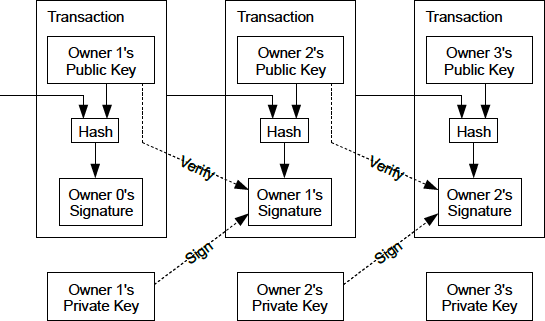
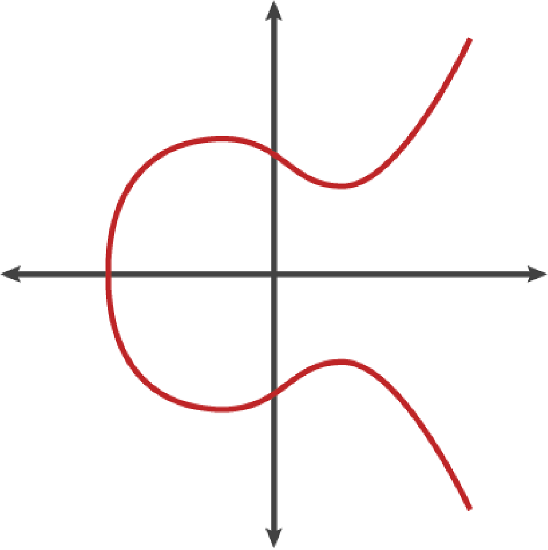
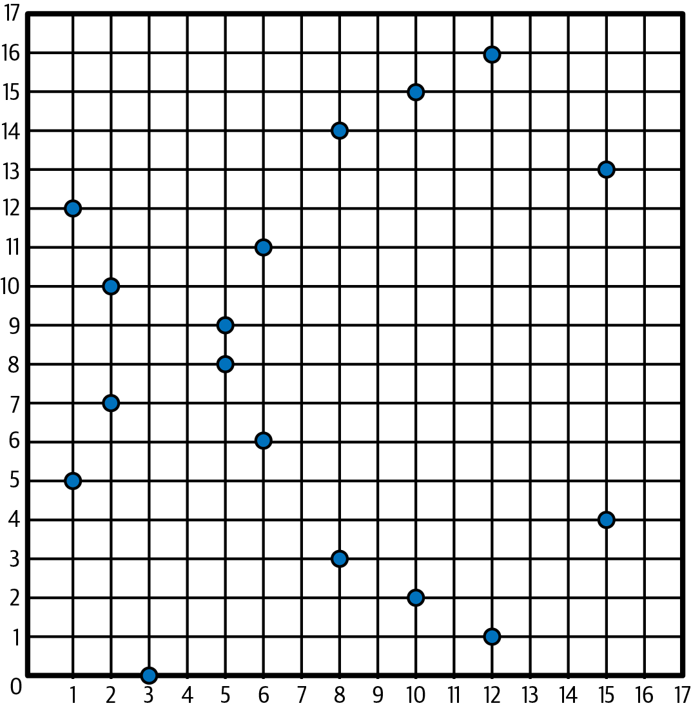
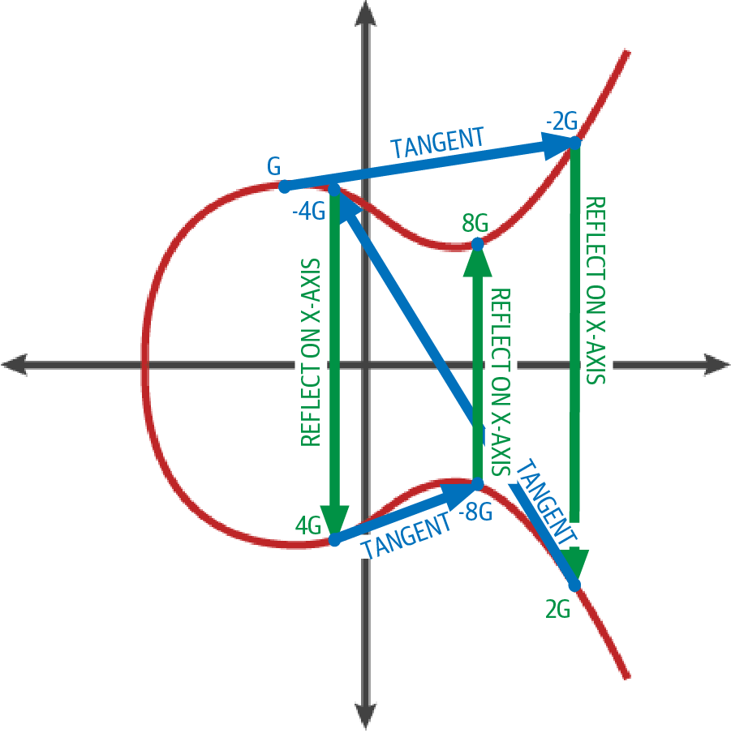
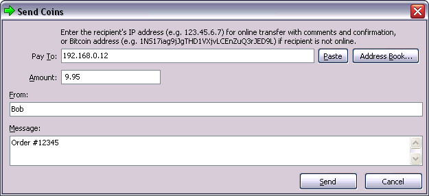
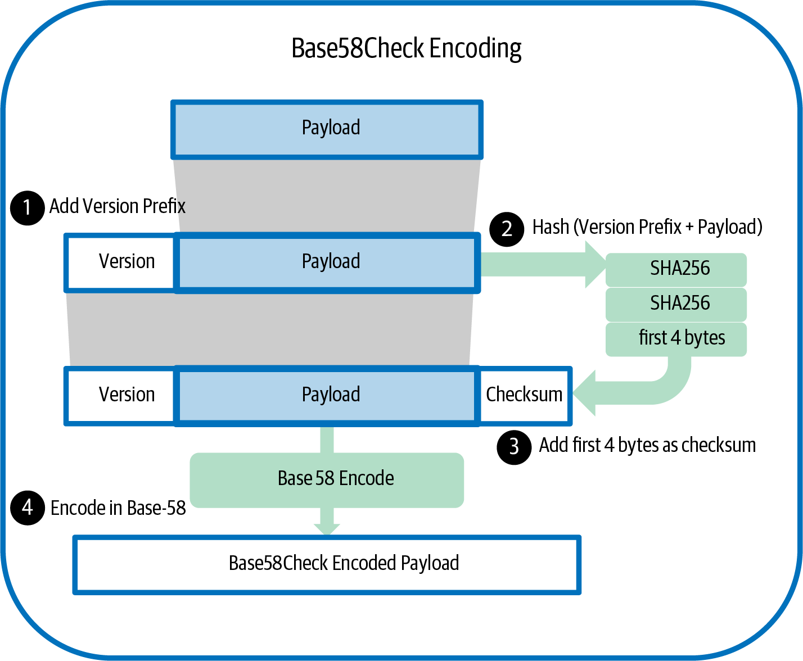
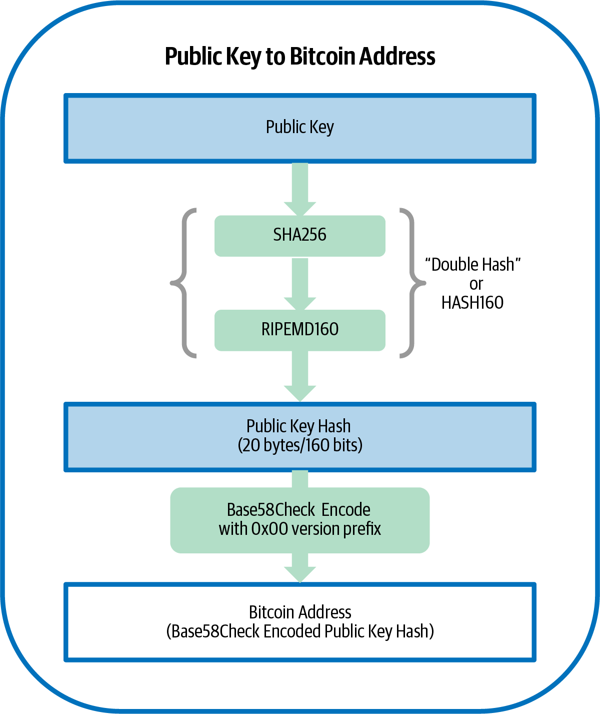
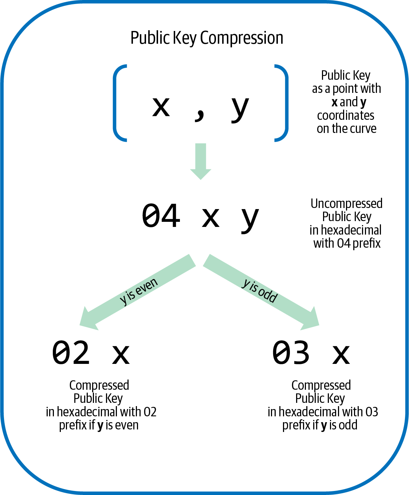
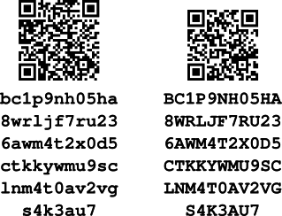
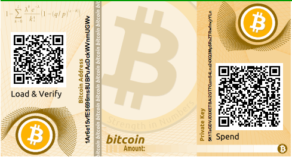

[[ch04_keys_addresses]]
== Keys and Addresses

Alice wants to pay Bob, but the thousands of Bitcoin full nodes who
will verify her transaction don't know who Alice or Bob are--and we want
to keep it that way to protect their privacy.  Alice needs to
communicate that Bob should receive some of her bitcoins without tying
any aspect of that transaction to Bob's real-world identity or to other
Bitcoin payments that Bob receives.  The method Alice uses must ensure
that only Bob can further spend the bitcoins he receives.

The original Bitcoin paper describes a very simple scheme for achieving
those goals, shown in <<pay-to-pure-pubkey>>.  

[[pay-to-pure-pubkey]]
.Transaction chain from original Bitcoin paper.

A receiver like Bob
accepts bitcoins to a public key in a transaction that is signed by the
spender (like Alice).  The bitcoins that Alice is spending had been
previously received to one of her public keys, and she uses the
corresponding private key to generate her signature.  Full nodes can
verify that Alice's signature commits to the output of a hash function
that itself commits to Bob's public key and other transaction details.

We'll examine public keys, private keys, signatures, and hash functions
in this chapter, and then use all of them together to describe
the addresses used by modern Bitcoin software.

=== Public Key Cryptography

Public ((("public key cryptography", id="pub-key")))key
cryptography was invented in the 1970s and is a mathematical foundation
for modern computer and information security.

Since the invention of public key cryptography, several suitable
mathematical functions, such as prime number exponentiation and elliptic
curve multiplication, have been discovered. These mathematical functions
are easy to calculate in
one direction and infeasible to calculate in the opposite direction
using the computers and algorithms available today.
Based on these mathematical functions, cryptography enables the creation
of unforgeable digital signatures. Bitcoin uses
elliptic curve addition and multiplication as the basis for its cryptography.

In Bitcoin, we can use public key cryptography to create a ((("key pairs", id="key-pair")))((("public keys", "purpose of")))((("private keys", "purpose of")))key pair that
controls access to bitcoins. The key pair consists of a private key
and a public key derived from the private key. The public key is used to
receive funds, and the private key is used to sign transactions to spend
the funds.

There is a mathematical relationship between the public and the private
key that allows the private key to be used to generate signatures on
messages. These signatures can be validated against the public key without
revealing the private key.

[TIP]
====
In some wallet
implementations, the private and public keys are stored together as a
_key pair_ for convenience. However, the public key can be calculated
from the private key, so storing only the private key is also possible.
====

A Bitcoin wallet contains a collection of key
pairs, each consisting of a private key and a public key. The private
key (_k_) is a number, usually derived from a number picked at random.
From the private key, we
use elliptic curve multiplication, a one-way cryptographic function, to
generate a public key (_K_).

[role="less_space pagebreak-before"]
.Why Use Asymmetric Cryptography (Public/Private Keys)?
****
Why is ((("asymmetric cryptography", see="public key cryptography")))((("public key cryptography", "purpose in Bitcoin")))((("digital signatures")))asymmetric
cryptography used in Bitcoin? It's not used to "encrypt" (make secret)
the transactions. Rather, a useful property of asymmetric cryptography
is the ability to generate _digital signatures_. A private key can be
applied to a transaction to produce a
numerical signature. This signature can only be produced by someone with
knowledge of the private key. However, anyone with access to the public
key and the transaction can use them to _verify_ the
signature. This useful property of asymmetric cryptography makes it
possible for anyone to verify every signature on every transaction,
while ensuring that only the owners of private keys can produce valid
signatures.
****

[[private_keys]]
==== Private Keys

A
private ((("private keys", "generating", id="private-key-generate")))key is simply a number, picked at random.  Control
over the private key is the root of user control over all funds
associated with the corresponding Bitcoin public key. The private key is
used to create signatures that are used to spend bitcoins by proving
control of funds used in a transaction. The private key must remain
secret at all times because revealing it to third parties is equivalent
to giving them control over the bitcoins secured by that key. The private
key must also be backed up and protected from accidental loss because
if it's lost, it cannot be recovered and the funds secured by it are
forever lost too.

[TIP]
====
A Bitcoin private key is just a number. You can pick your private keys
randomly using just a coin, pencil, and paper: toss a coin 256 times and
you have the binary digits of a random private key you can use in a
Bitcoin wallet. The public key can then be generated from the private
key.  Be careful, though, as any process that's less than completely
random can significantly reduce the security of your private key and the
bitcoins it controls.
====

The first and most important step in generating keys is to find a secure
source of randomness (which computer scientists ((("entropy")))call _entropy_). Creating a Bitcoin key is almost
the same as "Pick a number between 1 and 2^256^." The exact method you
use to pick that number does not matter as long as it is not predictable
or repeatable. Bitcoin software uses cryptographically secure random
number generators to produce 256 bits of entropy.

[role="less_space pagebreak-before"]
More precisely, the private key can be any number between 0 and _n_ -
1 inclusive, where _n_ is a constant (_n_ = 1.1578 × 10^77^, slightly less
than 2^256^) defined as the order of the elliptic curve used in Bitcoin
(see <<elliptic_curve>>). To create such a key, we randomly pick a
256-bit number and check that it is less than _n_. In programming terms,
this is usually achieved by feeding a larger string of random bits,
collected from a cryptographically secure source of randomness, into the
SHA256 hash algorithm, which will conveniently produce a 256-bit value
that can be interpreted as a number.
If the result is less than _n_, we have a suitable private key.
Otherwise, we simply try again with another random number.

[WARNING]
====
Do not write your own code to create a random
number or use a "simple" random number generator offered by your
programming language. Use a cryptographically secure pseudorandom number
generator (CSPRNG) with a seed from a source of sufficient entropy.
Study the documentation of the random number generator library you
choose to make sure it is cryptographically secure. Correct
implementation of the CSPRNG is critical to the security of the keys.
====

The following is a randomly generated private key (_k_) shown in
hexadecimal format (256 bits shown as 64 hexadecimal digits, each 4
bits):

----
1E99423A4ED27608A15A2616A2B0E9E52CED330AC530EDCC32C8FFC6A526AEDD
----

[TIP]
====
The size of Bitcoin's private key space (2^256^) is an unfathomably
large number. It is approximately 10^77^ in decimal. For comparison, the
visible universe is estimated to((("private keys", "generating", startref="private-key-generate"))) contain 10^80^ atoms.
====

[[elliptic_curve]]
==== Elliptic Curve Cryptography Explained

Elliptic curve cryptography (ECC) is((("public key cryptography", "elliptic curve cryptography as", id="pub-key-ecc")))((("elliptic curve cryptography (ECC)", id="ecc"))) a type of asymmetric
or public key cryptography based on the discrete logarithm problem as
expressed by addition and multiplication on the points of an elliptic
curve.

<<ecc-curve>> is an example of an elliptic curve, similar to that used
by Bitcoin.

[[ecc-curve]]
[role="width-50"]
.An elliptic curve.

Bitcoin uses a specific elliptic curve and set of mathematical
constants, as defined in a standard called +secp256k1+, established by
the National Institute of Standards and Technology (NIST). The
+secp256k1+ curve is defined by the following function, which produces
an elliptic curve:

[latexmath]
++++
\begin{equation}
{y^2 = (x^3 + 7)}~\text{over}~(\mathbb{F}_p)
\end{equation}
++++

or

[latexmath]
++++
\begin{equation}
{y^2 \mod p = (x^3 + 7) \mod p}
\end{equation}
++++

The _mod p_ (modulo prime number _p_) indicates that this curve is over a
finite field of prime order _p_, also written as latexmath:[\(
\mathbb{F}_p\)], where _p_ = 2^256^ – 2^32^ – 2^9^ – 2^8^ – 2^7^ – 2^6^ –
2^4^ – 1, a very large prime number.

Because this curve is defined over a finite field of prime order instead
of over the real numbers, it looks like a pattern of dots scattered in
two dimensions, which makes it difficult to visualize. However, the math
is identical to that of an elliptic curve over real numbers. As an
example, <<ecc-over-F17-math>> shows the same elliptic curve over a much
smaller finite field of prime order 17, showing a pattern of dots on a
grid. The +secp256k1+ Bitcoin elliptic curve can be thought of as a much
more complex pattern of dots on a unfathomably large grid.

[[ecc-over-F17-math]]
.Elliptic curve cryptography: visualizing an elliptic curve over F(p), with p=17.

So, for example, the following is a point P with coordinates (x, y) that
is a point on the +secp256k1+ curve:

[source, python]
----
P = 
(55066263022277343669578718895168534326250603453777594175500187360389116729240,
32670510020758816978083085130507043184471273380659243275938904335757337482424)
----

<<example_4_1>> shows how you can check this yourself using Python.

[[example_4_1]]
.Using Python to confirm that this point is on the elliptic curve
====
[source, pycon]
----
Python 3.10.6 (main, Nov 14 2022, 16:10:14) [GCC 11.3.0] on linux
Type "help", "copyright", "credits" or "license" for more information.
> p = 115792089237316195423570985008687907853269984665640564039457584007908834671663
> x = 55066263022277343669578718895168534326250603453777594175500187360389116729240
> y = 32670510020758816978083085130507043184471273380659243275938904335757337482424
> (x ** 3 + 7 - y**2) % p
0
----
====

[role="less_space pagebreak-before"]
In elliptic curve math, there is a point called the "point at infinity,"
which roughly corresponds to the role of zero in addition. On computers,
it's sometimes represented by x = y = 0 (which doesn't satisfy the
elliptic curve equation, but it's an easy separate case that can be
checked).

There is also a pass:[+] operator, called "addition," which has some
properties similar to the traditional addition of real numbers that
gradeschool children learn. Given two points P~1~ and P~2~ on the
elliptic curve, there is a third point P~3~ = P~1~ + P~2~, also on the
elliptic curve.

Geometrically, this third point P~3~ is calculated by drawing a line
between P~1~ and P~2~. This line will intersect the elliptic curve in
exactly one additional place. Call this point P~3~' = (x, y). Then
reflect in the x-axis to get P~3~ = (x, –y).

There are a couple of special cases that explain the need for the "point
at infinity."

If P~1~ and P~2~ are the same point, the line "between" P~1~ and P~2~
should extend to be the tangent on the curve at this point P~1~. This
tangent will intersect the curve in exactly one new point. You can use
techniques from calculus to determine the slope of the tangent line.
These techniques curiously work, even though we are restricting our
interest to points on the curve with two integer coordinates!

In some cases (i.e., if P~1~ and P~2~ have the same x values but
different y values), the tangent line will be exactly vertical, in which
case P~3~ = "point at infinity."

If P~1~ is the "point at infinity," then P~1~ + P~2~ = P~2~. Similarly,
if P~2~ is the point at infinity, then P~1~ + P~2~ = P~1~. This shows
how the point at infinity plays the role of zero.

It turns out that pass:[+] is associative, which means that (A pass:[+]
B) pass:[+] C = A pass:[+] (B pass:[+] C). That means we can write A
pass:[+] B pass:[+] C without parentheses and without ambiguity.

Now that we have defined addition, we can define multiplication in the
standard way that extends addition. For a point P on the elliptic curve,
if k is a whole number, then kP = P + P + P + ... + P (k times). Note
that k is sometimes confusingly called an "exponent" in ((("public key cryptography", "elliptic curve cryptography as", startref="pub-key-ecc")))((("elliptic curve cryptography (ECC)", startref="ecc")))this case.

[[public_key_derivation]]
==== Public Keys

The ((("public keys", "generating", id="public-key-generate")))((("elliptic curve multiplication", id="elliptic-multiply")))public key is calculated from
the private key using elliptic curve multiplication, which is
irreversible: _K_ = _k_ × _G_, where _k_ is the private key, _G_ is a
constant point called the _generator point_, and _K_ is the resulting
public key. The reverse operation, known as "finding the discrete
logarithm"—calculating _k_ if you know __K__—is as difficult as trying
all possible values of _k_ (i.e., a brute-force search). Before we
demonstrate how to generate a public key from a private key, let's look
at elliptic curve cryptography in a bit more detail.

[TIP]
====
Elliptic curve multiplication is a type of function that cryptographers
call a "trap door" function: it is easy to do in one direction
(multiplication) and impossible to do in the reverse direction
(division). Someone with a private key can easily create the public
key and then share it with the world knowing that no one can reverse the
function and calculate the private key from the public key. This
mathematical trick becomes the basis for unforgeable and secure digital
signatures that prove control over bitcoin funds.
====

Starting with a private key in the
form of a randomly generated number _k_, we multiply it by a
predetermined point on the curve called the _generator point_ _G_ to
produce another point somewhere else on the curve, which is the
corresponding public key _K_. The generator point is specified as part
of the +secp256k1+ standard and is always the same for all keys in
bitcoin:

[latexmath]
++++
\begin{equation}
{K = k \times G}
\end{equation}
++++

where _k_ is the private key, _G_ is the generator point, and _K_ is the
resulting public key, a point on the curve. Because the generator point
is always the same for all Bitcoin users, a private key _k_ multiplied
with _G_ will always result in the same public key _K_. The relationship
between _k_ and _K_ is fixed but can only be calculated in one
direction, from _k_ to _K_. That's why a Bitcoin public key (_K_) can be
shared with anyone and does not reveal the user's private key (_k_).

[TIP]
====
A private key can be converted into a public key, but a public key
cannot be converted back into a private key because the math only works
one way.
====

Implementing the elliptic curve multiplication, we take the private key
_k_ generated previously and multiply it with the generator point _G_ to
find the public key _K_:

[source, python]
----
K = 1E99423A4ED27608A15A2616A2B0E9E52CED330AC530EDCC32C8FFC6A526AEDD × G
----

Public key _K_ is defined as a point _K_ = (_x_, _y_):

[latexmath]
++++
\begin{equation}
K = (x, y)
\end{equation}
++++

where,

----
x = F028892BAD7ED57D2FB57BF33081D5CFCF6F9ED3D3D7F159C2E2FFF579DC341A
y = 07CF33DA18BD734C600B96A72BBC4749D5141C90EC8AC328AE52DDFE2E505BDB
----

To visualize multiplication of a point with an integer, we will use the
simpler elliptic curve over real numbers&#x2014;remember, the math is
the same. Our goal is to find the multiple _kG_ of the generator point
_G_, which is the same as adding _G_ to itself, _k_ times in a row. In
elliptic curves, adding a point to itself is the equivalent of drawing a
tangent line on the point and finding where it intersects the curve
again, then reflecting that point on the x-axis.

<<ecc_illustrated>> shows the process for deriving _G_, _2G_, _4G_, as a
geometric operation on the curve.

[TIP]
====
Many Bitcoin implementations use
the https://oreil.ly/wD60m[libsecp256k1 cryptographic
library] to do the elliptic curve((("public keys", "generating", startref="public-key-generate")))((("elliptic curve multiplication", startref="elliptic-multiply"))) math.
====

[[ecc_illustrated]]
.Elliptic curve cryptography: visualizing the multiplication of a point G by an integer k on an elliptic curve.

=== Output and Input Scripts

Although((("public key cryptography", "input/output scripts", id="pub-key-input-output")))((("input scripts", id="input-script")))((("output scripts", id="output-script")))((("scripts", "input/output", id="script-input-output"))) the illustration from the original Bitcoin paper, <<pay-to-pure-pubkey>>,
shows public keys (pubkeys) and signatures (sigs) being used directly,
the first version of Bitcoin instead had payments sent to a field called
_output script_ and had spends of those bitcoins authorized by a field called _input script_.
These fields allow additional operations to be performed in addition to
(or instead of) verifying that a signature corresponds to a public key.
For example, an output script can contain two public keys and require two
corresponding signatures be placed in the spending input script.

Later, in <<tx_script>>, we'll learn about scripts in detail.  For now,
all we need to understand is that bitcoins are received to an
output script that acts like a public key, and bitcoin spending is
authorized by an input script that acts like a ((("public key cryptography", "input/output scripts", startref="pub-key-input-output")))((("input scripts", startref="input-script")))((("output scripts", startref="output-script")))((("scripts", "input/output", startref="script-input-output")))signature.

[[p2pk]]
=== IP Addresses: The Original Address for Bitcoin (P2PK)

We've ((("public key cryptography", "IP address payments and", id="pub-key-ipaddress")))((("IP addresses for Bitcoin payments", id="ipaddress-payment")))((("payments", "via IP addresses", id="payment-ipaddress")))((("P2PK (pay to public key)", id="p2pk-ch4")))((("addresses", "P2PK (pay to public key)", id="address-p2pk-ch4")))established that Alice can pay Bob by assigning some of her
bitcoins to one of Bob's public keys.  But how does Alice get one of
Bob's public keys?  Bob could just give her a copy, but let's look again
at the public key we worked with in <<public_key_derivation>>.  Notice
that it's quite long.  Imagine Bob trying to read that to Alice over the
phone:

----
x = F028892BAD7ED57D2FB57BF33081D5CFCF6F9ED3D3D7F159C2E2FFF579DC341A
y = 07CF33DA18BD734C600B96A72BBC4749D5141C90EC8AC328AE52DDFE2E505BDB
----

Instead of direct public key entry, the earliest version of Bitcoin
software allowed a spender to enter the receiver's IP address, as shown in <<bitcoin_01_send>>.  This
feature was later removed--there are many problems
with using IP addresses--but a quick description of it will help us
better understand why certain features may have been added to the
Bitcoin protocol.

[[bitcoin_01_send]]
.Early send screen for Bitcoin via https://oreil.ly/IDV1a[The Internet Archive].

If Alice entered Bob's IP address in Bitcoin 0.1, her full node would
establish a connection with his full node and receive a new public key
from Bob's wallet that his node had never previously given anyone.  This
being a new public key was important to ensure that different
transactions paying Bob couldn't be connected together by someone
looking at the blockchain and noticing that all of the transactions paid
the same public key.

Using the public key her node received from Bob's node, Alice's wallet
would construct a transaction output paying a very simple output script:

----
<Bob's public key> OP_CHECKSIG
----

Bob would later be able to spend that output with an input script consisting
entirely of his signature:

----
<Bob's signature>
----

To figure out what an output and input script are doing, you can
combine them together (input script first) and then note that each piece of
data (shown in angle brackets) is placed at the top of a list of items,
called a stack.  When an operation code (opcode) is encountered, it uses
items from the stack, starting with the topmost items.  Let's look at
how that works by beginning with the combined script:

----
<Bob's signature> <Bob's public key> OP_CHECKSIG
----

For this script, Bob's signature is put on the stack, then Bob's public
key is placed on top of it.  The +OP_CHECKSIG+ operation consumes two
elements, starting with the public key and followed by the signature,
removing them from the stack.  It verifies the signature corresponds to
the public key and also commits to (signs) the various fields in the
transaction.  If the signature is correct, +OP_CHECKSIG+ replaces itself
on the stack with the value 1; if the signature was not correct, it
replaces itself with a 0.  If there's a nonzero item on top of the stack at the
end of evaluation, the script passes.  If all scripts in a transaction
pass, and all of the other details about the transaction are valid, then
full nodes will consider the transaction to be valid.

In short, the preceding script uses the same public key and signature
described in the original paper but adds in the complexity of two script
fields and an opcode.  That seems like extra work here, but we'll begin
to see the benefits when we look at the following section.

This type of output is known today as _pay to public key_, or _P2PK_ for
short.  It was never widely used for payments, and no widely used
program has supported IP address payments for almost((("public key cryptography", "IP address payments and", startref="pub-key-ipaddress")))((("IP addresses for Bitcoin payments", startref="ipaddress-payment")))((("payments", "via IP addresses", startref="payment-ipaddress")))((("P2PK (pay to public key)", startref="p2pk-ch4")))((("addresses", "P2PK (pay to public key)", startref="address-p2pk-ch4"))) a decade.

[[addresses_for_p2pkh]]
=== Legacy Addresses for P2PKH

Entering ((("public key cryptography", "hash functions and", id="pub-key-hash")))((("hash functions", "Bitcoin payments and", id="hash-payment")))((("payments", "with hash functions", secondary-sortas="hash functions", id="payment-hash")))((("P2PKH (pay to public key hash)", id="p2pkh-legacy")))((("addresses", "P2PKH (pay to public key hash)", id="address-p2pkh-legacy")))the IP address of the person you want to pay has a number of
advantages, but it also has a number of downsides.  One particular
downside is that the receiver needs their wallet to be online at their
IP address, and it needs to be accessible from the outside world.  For
a lot of people, that isn't an option.  They turn their computers off at
night, their laptops go to sleep, they're behind firewalls, or they're
using Network Address Translation (NAT).

This brings us back to the problem of receivers like Bob having to give
spenders like Alice a long public key.  The shortest version of Bitcoin
public keys known to the developers of early Bitcoin were 65 bytes, the
equivalent of 130 characters when written in hexadecimal.  However, Bitcoin
already contains several data structures much larger than 65 bytes
that need to be securely referenced in other parts of Bitcoin using the
smallest amount of data that was secure.

Bitcoin accomplishes that with a _hash function_, a function that takes
a potentially large amount of data, scrambles it (hashes it), and outputs a
fixed amount of data.  A cryptographic hash function will always produce
the same output when given the same input, and a secure function will
also make it impractical for somebody to choose a different input that
produces a previously-seen output.  That makes the ((("commitments", id="commitment")))output a _commitment_
to the input.  It's a promise that, in practice, only input _x_ will
produce output _X_.

For example, imagine I want to ask you a question and also give you my
answer in a form that you can't read immediately.  Let's say the
question is, "in what year did Satoshi Nakamoto start working on
Bitcoin?"  I'll give you a commitment to my answer in the form of
output from the((("SHA256 hash function"))) SHA256 hash function, the function most commonly used in
Bitcoin:

----
94d7a772612c8f2f2ec609d41f5bd3d04a5aa1dfe3582f04af517d396a302e4e
----

Later, after you tell me your guess to the answer of the question, I can
reveal my answer and prove to you that my answer, as input to the hash
function, produces exactly the same output I gave you earlier:

----
$ echo "2007.  He said about a year and a half before Oct 2008" | sha256sum
94d7a772612c8f2f2ec609d41f5bd3d04a5aa1dfe3582f04af517d396a302e4e
----

Now imagine that we ask Bob the question, "what is your public key?" Bob
can use a hash function to give us a cryptographically secure commitment
to his public key.  If he later reveals his key, and we verify it
produces the same commitment he previously gave us, we can be sure it
was the exact same key that was used to create that earlier commitment.

The SHA256 hash function is considered to be very secure and produces
256 bits (32 bytes) of output, less than half the size of original
Bitcoin public keys.  However, there are other slightly less secure hash
functions that produce smaller output, such as the ((("RIPEMD-160 hash function")))RIPEMD-160 hash
function whose output is 160 bits (20 bytes).  For reasons Satoshi
Nakamoto never stated, the original version of Bitcoin made commitments
to public keys by first hashing the key with SHA256 and then hashing
that output with RIPEMD-160; this produced a 20-byte commitment to the
public key.

[role="less_space pagebreak-before"]
We can look at that algorithmically.
Starting with the public key _K_, we compute the SHA256 hash and then
compute the RIPEMD-160 hash of the result, producing a 160-bit (20-byte)
number:

[latexmath]
++++
\begin{equation}
{A = RIPEMD160(SHA256(K))}
\end{equation}
++++

where _K_ is the public key and _A_ is the resulting commitment.

Now that we understand how to make a commitment to a public key, we need
to figure out how to use it in a transaction.  Consider the following
output script:

----
OP_DUP OP_HASH160 <Bob's commitment> OP_EQUAL OP_CHECKSIG
----

And also the following input script:

----
<Bob's signature> <Bob's public key>
----

Together, they form the following script:

----
<sig> <pubkey> OP_DUP OP_HASH160 <commitment> OP_EQUALVERIFY OP_CHECKSIG
----

As we did in <<p2pk>>, we start putting items on the stack.  Bob's
signature goes on first; his public key is then placed on top of the
stack.  The +OP_DUP+ operation duplicates the top item, so the top and
second-to-top item on the stack are now both Bob's public key.  The
+OP_HASH160+ operation consumes (removes) the top public key and
replaces it with the result of hashing it with +RIPEMD160(SHA256(K))+,
so now the top of the stack is a hash of Bob's public key.  Next, the
commitment to Bob's public key is added to the top of the stack.  The
+OP_EQUALVERIFY+ operation consumes the top two items and verifies that
they are equal; that should be the case if the public key Bob provided
in the input script is the same public key used to create the commitment in
the output script that Alice paid.  If +OP_EQUALVERIFY+ fails, the whole
script fails.  Finally, we're left with a stack containing just Bob's
signature and his public key; the +OP_CHECKSIG+ opcode verifies they
correspond with each other and that the signature commits to the
transaction.

Although this process of paying to a public key hash (_P2PKH_) may seem
convoluted, it allows Alice's payment to
Bob to contain only a 20 byte commitment to his public key instead of
the key itself, which would've been 65 bytes in the original version of
Bitcoin.  That's a lot less data for Bob to have to communicate to
Alice.

However, we haven't yet discussed how Bob gets those 20 bytes from his
Bitcoin wallet to Alice's wallet.  There are commonly used encodings for
byte values, such as hexadecimal, but any mistake made in copying a
commitment would result in the bitcoins being sent to an unspendable
output, causing them to be lost forever.  In the next section, we'll
look at compact encoding and reliable ((("public key cryptography", "hash functions and", startref="pub-key-hash")))((("hash functions", "Bitcoin payments and", startref="hash-payment")))((("payments", "with hash functions", secondary-sortas="hash functions", startref="payment-hash")))((("P2PKH (pay to public key hash)", startref="p2pkh-legacy")))((("addresses", "P2PKH (pay to public key hash)", startref="address-p2pkh-legacy")))((("commitments", startref="commitment")))checksums.

[[base58]]
=== Base58check Encoding

In order((("public key cryptography", "base58check encoding", id="pub-key-base58")))((("base58check encoding", id="base58-ch4")))((("encoding", "base58check", id="encode-base58"))) to represent long numbers in a compact way,
using fewer symbols, many computer systems use mixed-alphanumeric
representations with a base (or radix) higher than 10. For example,
whereas the traditional decimal system uses 10 numerals, 0 through 9,
the hexadecimal system uses 16, with the letters A through F as the six
additional symbols. A number represented in hexadecimal format is
shorter than the equivalent decimal representation. Even more compact,
base64 representation ((("base64 encoding")))uses 26 lowercase letters, 26 capital letters, 10
numerals, and 2 more characters such as "+" and "/" to
transmit binary data over text-based media such as email.

Base58 is a similar encoding to
base64, using upper- and lowercase letters and numbers,
but omitting some characters that are frequently mistaken for one
another and can appear identical when displayed in certain fonts.
Specifically, base58 is base64 without the 0 (number zero), O (capital
o), l (lower L), I (capital i), and the symbols "+" and
"/." Or, more simply, it is a set of lowercase and capital letters and
numbers without the four (0, O, l, I) just mentioned. <<base58alphabet>>
shows the full base58 alphabet.

[[base58alphabet]]
.Bitcoin's base58 alphabet
====
----
123456789ABCDEFGHJKLMNPQRSTUVWXYZabcdefghijkmnopqrstuvwxyz
----
====

To add extra security against typos or transcription errors, base58check
includes((("checksums"))) a _checksum_ encoded in the base58 alphabet. The checksum is an
additional four bytes
added to the end of the data that is being encoded. The checksum is
derived from the hash of the encoded data and can therefore be used to
detect transcription and typing errors. When presented with
base58check code, the decoding software will calculate the checksum of
the data and compare it to the checksum included in the code. If the two
do not match, an error has been introduced and the base58check data is
invalid. This prevents a mistyped Bitcoin address from being accepted by
the wallet software as a valid destination, an error that would
otherwise result in loss of funds.

To convert data (a number) into a base58check format, we first add a
prefix to the data, called ((("version prefixes", id="version-prefix")))the "version byte," which serves to easily
identify the type of data that is encoded. For example, the prefix zero
(0x00 in hex) indicates that the data should be used as the commitment (hash) in
a legacy P2PKH output script.  A list of common version prefixes is shown
in <<base58check_versions>>.

Next, we compute the "double-SHA" checksum, meaning we apply the SHA256
hash-algorithm twice on the previous result (the prefix concatenated
with the data):

----
checksum = SHA256(SHA256(prefix||data))
----

From the resulting 32-byte hash (hash-of-a-hash), we take only the first
four bytes. These four bytes serve as the error-checking code, or
checksum. The checksum is appended to the end.

The result is composed of three items: a prefix, the data, and a
checksum. This result is encoded using the base58 alphabet described
previously. <<base58check_encoding>> illustrates the base58check
encoding process.

[[base58check_encoding]]
.Base58check encoding: a base58, versioned, and checksummed format for unambiguously encoding bitcoin data.

++++

In Bitcoin, other data besides public key commitments are presented to the user in
base58check encoding to make that data compact, easy to read, and easy to detect
errors. The version prefix in base58check encoding is used to create
easily distinguishable formats, which when encoded in base58 contain
specific characters at the beginning of the base58check-encoded payload.
These characters make it easy for humans to identify the type of data
that is encoded and how to use it. This is what differentiates, for
example, a base58check-encoded Bitcoin address that starts with a 1 from
a base58check-encoded private key wallet import format (WIF) that starts with a 5. Some example
version prefixes and the resulting base58 characters are shown in
<a data-type="xref" href="#base58check_versions">#base58check_versions</a>.

++++

++++
<table id="base58check_versions">
<caption>Base58check version prefix and encoded result examples</caption>
<thead>
<tr>
<th>Type</th>
<th>Version prefix (hex)</th>
<th>Base58 result prefix</th>
</tr>
</thead>
<tbody>
<tr>
<td>
Address for pay to public key hash (P2PKH)
</td>
<td>
0x00
</td>
<td>
1
</td>
</tr>
<tr>
<td>
Address for pay to script hash (P2SH)
</td>
<td>
0x05
</td>
<td>
3
</td>
</tr>
<tr>
<td>
Testnet Address for P2PKH
</td>
<td>
0x6F
</td>
<td>
m or n
</td>
</tr>
<tr>
<td>
Testnet Address for P2SH
</td>
<td>
0xC4
</td>
<td>
2
</td>
</tr>
<tr>
<td>
Private Key WIF
</td>
<td>
0x80
</td>
<td>
5, K, or L
</td>
</tr>
<tr>
<td>
BIP32 Extended Public Key
</td>
<td>
0x0488B21E
</td>
<td>
xpub
</td>
</tr>
</tbody>
</table>
++++

Combining public keys, hash-based commitments, and base58check
encoding, <<pubkey_to_address>> illustrates the conversion of a public key
into a Bitcoin ((("public key cryptography", "base58check encoding", startref="pub-key-base58")))((("base58check encoding", startref="base58-ch4")))((("encoding", "base58check", startref="encode-base58")))((("version prefixes", startref="version-prefix")))address.

[[pubkey_to_address]]
.Public key to Bitcoin address: conversion of a public key to a Bitcoin address.

[[comp_pub]]
=== Compressed Public Keys

//https://lists.linuxfoundation.org/pipermail/bitcoin-dev/2011-November/000778.html

When ((("public key cryptography", "compressed public keys", id="pub-key-compress")))((("compressed public keys", id="compress-pub-key")))((("uncompressed public keys", id="uncompress-pub-key")))Bitcoin was first authored, its developers only knew how to create
65-byte public keys.  However, a later developer became aware of an
alternative encoding for public keys that used only 33 bytes and which
was backward compatible with all Bitcoin full nodes at the time,
so there was no need to change the Bitcoin protocol.  Those 33-byte
public keys are known as _compressed public keys_, and the original 65-byte keys are known as _uncompressed public keys_.  Using smaller public keys
results in smaller transactions, allowing more payments to be made in the same
block.

As we saw in the section <<public_key_derivation>>, a public key is a point [.keep-together]#(x, y)# on an
elliptic curve. Because the curve expresses a mathematical function, a
point on the curve represents a solution to the equation and, therefore,
if we know the _x_ coordinate, we can calculate the _y_ coordinate by
solving the equation [.keep-together]#y^2^ mod p = (x^3^ + 7) mod p.# That allows us to
store only the _x_ coordinate of the public key point, omitting the _y_
coordinate and reducing the size of the key and the space required to
store it by 256 bits. An almost 50% reduction in size in every
transaction adds up to a lot of data saved over time!

Here is the public key generated by the private key we created in
<<public_key_derivation>>:

----
x = F028892BAD7ED57D2FB57BF33081D5CFCF6F9ED3D3D7F159C2E2FFF579DC341A
y = 07CF33DA18BD734C600B96A72BBC4749D5141C90EC8AC328AE52DDFE2E505BDB
----

Here's the same public key shown as a 520-bit number (130 hex digits)
with the prefix +04+ followed by +x+ and then +y+ coordinates, as +04 x
y+:

++++
<pre data-type="programlisting">
K = 04F028892BAD7ED57D2FB57BF33081D5CFCF6F9ED3D3D7F159C2E2FFF579DC341A\
    07CF33DA18BD734C600B96A72BBC4749D5141C90EC8AC328AE52DDFE2E505BDB
</pre>
++++

Whereas uncompressed public keys have a prefix of +04+, compressed
public keys start with either a +02+ or a +03+ prefix. Let's look at why
there are two possible prefixes: because the left side of the equation
is __y__^2^, the solution for _y_ is a square root, which can have a
positive or negative value. Visually, this means that the resulting _y_
coordinate can be above or below the x-axis. As you can see from the
graph of the elliptic curve in <<ecc-curve>>, the curve is symmetric,
meaning it is reflected like a mirror by the x-axis. So, while we can
omit the _y_ coordinate, we have to store the _sign_ of _y_ (positive or
negative); in other words, we have to remember if it was above or
below the x-axis because each of those options represents a different
point and a different public key. When calculating the elliptic curve in
binary arithmetic on the finite field of prime order p, the _y_
coordinate is either even or odd, which corresponds to the
positive/negative sign as explained earlier. Therefore, to distinguish
between the two possible values of _y_, we store a compressed public key
with the prefix +02+ if the _y_ is even, and +03+ if it is odd, allowing
the software to correctly deduce the _y_ coordinate from the _x_
coordinate and uncompress the public key to the full coordinates of the
point. Public key compression is illustrated in <<pubkey_compression>>.

[[pubkey_compression]]
.Public key compression.

Here's the same public key generated in <<public_key_derivation>>, shown as a compressed
public key stored in 264 bits (66 hex digits) with the prefix +03+
indicating the _y_ coordinate is odd:

----
K = 03F028892BAD7ED57D2FB57BF33081D5CFCF6F9ED3D3D7F159C2E2FFF579DC341A
----

This compressed public key corresponds to the same private key, meaning
it is generated from the same private key. However, it looks different
from the uncompressed public key. More importantly, if we convert this
compressed public key to a commitment using the HASH160
function (+RIPEMD160(SHA256(K))+), it will produce a _different_
commitment than the uncompressed public key, leading to a different
address. This can be confusing because it means that a single private
key can produce a public key expressed in two different formats
(compressed and uncompressed) that produce two different Bitcoin
addresses. However, the private key is identical for both Bitcoin
addresses.

Compressed public keys are now the default in almost all Bitcoin
software and were required when using certain new features added
in later protocol upgrades.

However, some software still needs to support uncompressed public keys,
such as a wallet application importing private keys from an older
wallet.  When the new wallet scans the blockchain for old P2PKH outputs
and inputs, it needs to know whether to scan the 65-byte keys (and
commitments to those keys) or 33-byte keys (and their commitments).  Failure
to scan for the correct type can lead to the user not being able to
spend their full balance.  To resolve this issue, when private keys are
exported from a wallet, the WIF that is used to
represent them is implemented slightly differently in newer Bitcoin
wallets to indicate that these private keys have been used to produce((("public key cryptography", "compressed public keys", startref="pub-key-compress")))((("compressed public keys", startref="compress-pub-key")))((("uncompressed public keys", startref="uncompress-pub-key")))
compressed public keys.

[[addresses_for_p2sh]]
=== Legacy Pay to Script Hash (P2SH)

As we've ((("public key cryptography", "hash functions and", id="pub-key-hash2")))((("hash functions", "Bitcoin payments and", id="hash-payment2")))((("payments", "with hash functions", secondary-sortas="hash functions", id="payment-hash2")))((("P2SH (pay to script hash)", id="p2sh-ch4")))((("addresses", "P2SH (pay to script hash)", id="address-p2sh-ch4")))seen in preceding sections, someone receiving bitcoins (like
Bob) can require that payments to him contain certain constraints in their
output script.  Bob will need to fulfill those constraints using an
input script when he spends those bitcoins.  In <<p2pk>>, the constraint
was simply that the input script needed to provide an appropriate
signature.  In <<addresses_for_p2pkh>>, an appropriate public key also needed to be
provided.

++++

For a spender (like Alice) to place the constraints Bob wants
in the output script she uses to pay him, Bob needs to communicate those
constraints to her.  This is similar to the problem of Bob needing to
communicate his public key to her.  Like that problem, where
public keys can be fairly large, the constraints Bob uses can also be
quite large—potentially thousands of bytes.  That's not only thousands
of bytes that need to be communicated to Alice, but thousands of bytes
for which she needs to pay transaction fees every time she wants to spend money to Bob.  However, the solution of using hash functions to create
small commitments to large amounts of data also applies here.

++++

The BIP16 upgrade to the Bitcoin protocol in 2012 allows an
output script to ((("redeem scripts", id="redeem-script")))commit to a _redemption script_ (_redeem script_).  When
Bob spends his bitcoins, his input script needs to provide a redeem script
that matches the commitment and also any data necessary to satisfy the
redeem script (such as signatures).  Let's start by imagining Bob wants
to require two signatures to spend his bitcoins, one signature from his
desktop wallet and one from a hardware signing device.  He puts those
conditions into a redeem script:

----
<public key 1> OP_CHECKSIGVERIFY <public key 2> OP_CHECKSIG
----

He then creates a commitment to the redeem script using the same
HASH160 mechanism used for P2PKH commitments, +RIPEMD160(SHA256(script))+.
That commitment is placed into the output script using a special
template:

----
OP_HASH160 <commitment> OP_EQUAL
----

[WARNING]
====
When using pay to script hash (P2SH), you must use the specific P2SH template
with no extra data or conditions in the output script.  If the
output script is not exactly +OP_HASH160 <20 bytes> OP_EQUAL+, the
redeem script will not be used and any bitcoins may either be unspendable
or spendable by anyone (meaning anyone can take them).
====

When Bob goes to spend the payment he received to the commitment for his
script, he uses an input script that includes the redeem script, with it
serialized as a single data element.  He also provides the signatures
he needs to satisfy the redeem script, putting them in the order that
they will be consumed by the opcodes:

----
<signature2> <signature1> <redeem script>
----

When Bitcoin full nodes receive Bob's spend, they'll verify that the
serialized redeem script will hash to the same value as the commitment.
Then they'll replace it on the stack with its deserialized value:

----
<signature2> <signature1> <pubkey1> OP_CHECKSIGVERIFY <pubkey2> OP_CHECKSIG
----

The script is executed and, if it passes and all of the other
transaction details are correct, the transaction is valid.

Addresses for P2SH are also created with
base58check.  The version prefix is set to 5, which results in an
encoded address starting with a +3+. An example of a P2SH address is
+3F6i6kwkevjR7AsAd4te2YB2zZyASEm1HM+.

[TIP]
====
P2SH is not necessarily the same as a multisignature
transaction. A P2SH address _most often_ represents a multisignature
script, but it might also represent a script encoding other types of
transactions.
====

P2PKH and P2SH are the only two script templates used with base58check
encoding.  They are now known as legacy addresses and have become less
common over time.
Legacy addresses were supplanted by the bech32 family of ((("redeem scripts", startref="redeem-script")))addresses.

[[p2sh_collision_attacks]]
.P2SH Collision Attacks
****
All addresses ((("collision attacks", id="collision")))based on hash functions are theoretically vulnerable to an
attacker independently finding the same input that produced the hash
function output (commitment).  In the case of Bitcoin, if they find the
input the same way the original user did, they'll know the user's private
key and be able to spend that user's bitcoins.  The chance of an attacker
independently generating the input for an existing commitment is
proportional to the strength of the hash algorithm.  For a secure
160-bit algorithm like HASH160, the probability is 1-in-2^160^.  This ((("preimage attacks")))is
a _preimage attack_.

An attacker can also try to generate two different inputs (e.g., redeem
scripts) that produce the same commitment.  For addresses created
entirely by a single party, the chance of an attacker generating a
different input for an existing commitment is also about 1-in-2^160^ for
the HASH160 algorithm.  This is((("second preimage attacks"))) a _second preimage attack_.

However, this changes when an attacker is able to influence the original input
value. For example, an attacker participates in the creation of a
multisignature script where they don't need to submit their public key until after they learn all of the other partys' public keys.
In that case, the strength of hash algorithm is reduced to its square
root.  For HASH160, the probability becomes 1-in-2^80^.  This is a
_collision attack_.

// bits80=$( echo '2^80' | bc )
// seconds_per_hour="$(( 60 * 60))"
// bitcoin-cli getmininginfo | jq "(.networkhashps / $bits80 * $seconds_per_hour)"
// 0.8899382363032076

To put those numbers in context, as of early 2023, all Bitcoin miners
combined execute about 2^80^ hash functions every hour.  They run a
different hash function than HASH160, so their existing hardware can't
create collision attacks for it, but the existence of the Bitcoin
network proves that collision attacks against 160-bit functions like
HASH160 are ((("HASH160")))practical.  Bitcoin miners have spent the equivalent of
billions of US dollars on special hardware, so creating a collision
attack wouldn't be cheap, but there are organizations that expect to
receive billions of dollars in bitcoins to addresses generated by
processes involving multiple parties, which could make the attack
profitable.

There are well-established cryptographic protocols for preventing
collision attacks, but a simple solution that doesn't require any
special knowledge on the part of wallet developers is to simply use
a stronger hash function.  Later upgrades to Bitcoin made that possible,
and newer Bitcoin addresses provide at least 128 bits of collision
resistance.  To perform 2^128^ hash operations would take all current
Bitcoin miners about 32 billion years.

Although we do not believe there is any immediate threat to anyone
creating new P2SH addresses, we recommend all new wallets use newer
types of addresses to eliminate address collision attacks((("public key cryptography", "hash functions and", startref="pub-key-hash2")))((("hash functions", "Bitcoin payments and", startref="hash-payment2")))((("payments", "with hash functions", secondary-sortas="hash functions", startref="payment-hash2")))((("P2SH (pay to script hash)", startref="p2sh-ch4")))((("addresses", "P2SH (pay to script hash)", startref="address-p2sh-ch4"))) as a concern.
****

=== Bech32 Addresses

In 2017, the ((("public key cryptography", "bech32 addresses", "advantages of", id="pub-key-bech32-adv")))((("addresses", "bech32", "advantages of", id="address-bech32-adv")))((("bech32 addresses", "advantages of", id="bech32-adv")))Bitcoin protocol was upgraded.  When the upgrade is used,
it prevents transaction
identifiers (txids) from being changed without the consent of a spending
user (or a quorum of signers when multiple signatures are required).
The upgrade, ((("segregated witness (segwit)", id="segwit-bech32")))called _segregated witness_ (or _segwit_ for short),  also
provided additional capacity for transaction data in blocks and several
other benefits.  However, users wanting direct access to segwit's
benefits had to accept payments to new output scripts.

As mentioned in <<p2sh>>, one of the advantages of the P2SH output type
was that a spender (such as Alice) didn't need to know the details of
the script the receiver (such as Bob) used.  The segwit upgrade was
designed to use this mechanism, allowing users to
immediately begin accessing many of the new benefits by using a P2SH
address.  But for Bob to gain access to all of the benefits, he would
need Alice's wallet to pay him using a different type of script.  That
would require Alice's wallet to upgrade to support the new scripts.

At first, Bitcoin developers proposed BIP142, which would continue using
base58check with a new version byte, similar to the P2SH upgrade.  But
getting all wallets to upgrade to new scripts with a new base58check
version was expected to require almost as much work as getting them to
upgrade to an entirely new address format, so several Bitcoin
contributors set out to design the best possible address format.  They
identified several problems((("public key cryptography", "base58check encoding")))((("base58check encoding")))((("encoding", "base58check"))) with base58check:

- Its mixed-case presentation made it inconvenient to read aloud or
  transcribe.  Try reading one of the legacy addresses in this chapter
  to a friend who you have transcribe it.  Notice how you have to prefix
  every letter with the words "uppercase" and "lowercase."  Also, note
  when you review their writing that the uppercase and lowercase
  versions of some letters can look similar in many people's
  handwriting.

- It can detect errors, but it can't help users correct those errors.
  For example, if you accidentally transpose two characters when manually
  entering an address, your wallet will almost certainly warn that a
  mistake exists, but it won't help you figure out where the error is
  located.  It might take you several frustrating minutes to eventually
  discover the mistake.

- A mixed-case alphabet also requires extra space to encode in QR codes,
  which are commonly used to share addresses and invoices
  between wallets.  That extra space means QR codes need to be larger at
  the same resolution or they become harder to scan quickly.

[role="less_space pagebreak-before"]
- It requires every spender wallet upgrade to support new protocol
  features like P2SH and segwit.  Although the upgrades themselves might
  not require much code, experience shows that many wallet authors are
  busy with other work and can sometimes delay upgrading for years.
  This adversely affects everyone who wants to use the new features.

The developers working on an address format for segwit found solutions
for each of these problems in a new address format called
bech32 (pronounced with a soft "ch", as in "besh thirty-two").  The
"bech" stands for BCH, the initials of the three individuals who
discovered the cyclic code in 1959 and 1960 upon which bech32 is based.
The "32" stands for the number of characters in the bech32 alphabet
(similar to the 58 in base58check):

- Bech32 uses only numbers and a single case of letters (preferably
  rendered in lowercase).  Despite its alphabet being almost half the
  size of the base58check alphabet, a bech32 address for a pay to witness public key hash (P2WPKH) script
  is only slightly longer than a legacy address for an equivalent P2PKH
  script.

- Bech32 can both detect and help correct errors.  In an address of an
  expected length, it is mathematically guaranteed to detect any error
  affecting four characters or less; that's more reliable than
  base58check.  For longer errors, it will fail to detect them less than
  one time in a billion, which is roughly the same reliability as
  base58check.  Even better, for an address typed with just a few
  errors, it can tell the user where those errors occurred, allowing them to
  quickly correct minor transcription mistakes.  See <<bech32_typo_detection>>
  for an example of an address entered with errors.
+
[[bech32_typo_detection]]
.Bech32 typo detection
====
Address:
  bc1p9nh05ha8wrljf7ru236awpass:[<u><strong>n</strong></u>]4t2x0d5ctkkywmpass:[<u><strong>v</strong></u>]9sclnm4t0av2vgs4k3au7

Detected errors shown in bold and underlined.  Generated using the
https://oreil.ly/paWIx[bech32 address decoder demo].
====

- Bech32 is preferably written with only lowercase characters, but those
  lowercase characters can be replaced with uppercase characters before
  encoding an address in a QR code.  This allows the use of a special QR
  encoding mode that uses less space.  Notice the difference in size and
  complexity of the two QR codes for the same address in
  <<bech32_qrcode_uc_lc>>.
+
[[bech32_qrcode_uc_lc]]
.The same bech32 address QR encoded in lowercase and uppercase.

- Bech32 takes advantage of an upgrade mechanism designed as part of
  segwit to make it possible for spender wallets to be able to pay
  output types that aren't in use yet.  The goal was to allow developers
  to build a wallet today that allows spending to a bech32 address
  and have that wallet remain able to spend to bech32 addresses for
  users of new features added in future protocol upgrades.  It was
  hoped that we might never again need to go through the system-wide
  upgrade cycles necessary to allow people to fully use P2SH and((("public key cryptography", "bech32 addresses", "advantages of", startref="pub-key-bech32-adv")))((("addresses", "bech32", "advantages of", startref="address-bech32-adv")))((("bech32 addresses", "advantages of", startref="bech32-adv")))((("segregated witness (segwit)", startref="segwit-bech32"))) segwit.

==== Problems with Bech32 Addresses

Bech32 addresses((("public key cryptography", "bech32 addresses", "problems with", id="pub-key-bech32-prob")))((("addresses", "bech32", "problems with", id="address-bech32-prob")))((("bech32 addresses", "problems with", id="bech32-prob"))) would have been a success in every area except for one
problem.  The mathematical guarantees about their ability to detect
errors only apply if the length of the address you enter into a wallet
is the same length of the original address.  If you add or remove any
characters during transcription, the guarantee doesn't apply and your
wallet may spend funds to a wrong address.  However, even without the
guarantee, it was thought that it would be very unlikely that a user adding
or removing characters would produce a string with a valid checksum, ensuring
users' funds were safe.

Unfortunately, the choice for one of the constants in the bech32
algorithm just happened to make it very easy to add or remove the letter
"q" in the penultimate position of an address that ends with the letter
"p."  In those cases, you can also add or remove the letter "q" multiple
times.  This will be caught by the checksum some of the time, but it
will be missed far more often than the one-in-a-billion expectations for
bech32's substitution errors.  For an example, see <<bech32_length_extension_example>>.

[role="less_space pagebreak-before"]
[[bech32_length_extension_example]]
.Extending the length of bech32 address without invalidating its checksum
====
----
Intended bech32 address:
bc1pqqqsq9txsqp

Incorrect addresses with a valid checksum:
bc1pqqqsq9txsqqqqp
bc1pqqqsq9txsqqqqqqp
bc1pqqqsq9txsqqqqqqqqp
bc1pqqqsq9txsqqqqqqqqqp
bc1pqqqsq9txsqqqqqqqqqqqp
----
====
//from segwit_addr import *
//
//for foo in range(0,1000):
//    addr = encode('bc', 1, foo.to_bytes(3,'big'))
//    print(foo, addr)

For the initial version of segwit (version 0), this wasn't a practical
concern.  Only two valid lengths were defined for v0 segwit outputs: 22
bytes and 34 bytes.  Those correspond to bech32 addresses that are 42 characters
or 62 characters long, so someone would need to add or remove the letter "q"
from the penultimate position of a bech32 address 20 times in order to
send money to an invalid address without a wallet being able to detect
it.  However, it would become a problem for users in the future if
a segwit-based upgrade were ever to be ((("public key cryptography", "bech32 addresses", "problems with", startref="pub-key-bech32-prob")))((("addresses", "bech32", "problems with", startref="address-bech32-prob")))((("bech32 addresses", "problems with", startref="bech32-prob")))implemented.

==== Bech32m

Although((("public key cryptography", "bech32 addresses", "bech32m", id="pub-key-bech32-bech32m")))((("bech32 addresses", "bech32m", id="bech32-bech32m")))((("addresses", "bech32m", id="address-bech32m")))((("bech32m addresses", id="bech32m"))) bech32 worked well for segwit v0, developers didn't want to
unnecessarily constrain output sizes in later versions of segwit.
Without constraints, adding or removing a single "q" in a bech32 address
could result in a user accidentally sending their money to an
output that was either unspendable or spendable by anyone (allowing
those bitcoins to be taken by anyone).  Developers exhaustively analyzed the bech32
problem and found that changing a single constant in their algorithm
would eliminate the problem, ensuring that any insertion or deletion of
up to five characters will only fail to be detected less often than one
time in a billion.

//https://gist.github.com/sipa/a9845b37c1b298a7301c33a04090b2eb

The version of bech32 with a single different constant is known as
bech32 modified (bech32m).  All of the characters in bech32 and bech32m
addresses for the same underlying data will be identical except for the
last six (the checksum).  That means a wallet will need to know which
version is in use in order to validate the checksum, but both address
types contain an internal version byte that makes determining that easy.

To work with both bech32 and((("encoding", "bech32m addresses", id="encode-bech32m")))((("decoding", "addresses", see="addresses"))) bech32m, we'll look at the encoding and parsing rules for
bech32m Bitcoin addresses since they encompass the ability to parse
bech32 addresses and are the current recommended address format for
Bitcoin wallets.

Bech32m addresses start with a human readable part (HRP).  There are
rules in BIP173 for creating your own HRPs, but for Bitcoin you only
need to know about the HRPs already chosen, shown in
<<bech32_hrps_for_bitcoin>>.

++++
<table id="bech32_hrps_for_bitcoin">
<caption>Bech32 HRPs for Bitcoin</caption>
<thead>
<tr>
<th>HRPs</th>
<th>Network</th>
</tr>
</thead>
<tbody>
<tr>
<td>
bc
</td>
<td>
Bitcoin mainnet
</td>
</tr>
<tr>
<td>
tb
</td>
<td>
Bitcoin testnet
</td>
</tr>
</tbody>
</table>
++++

The HRP is followed by a separator, the number "1."  Earlier proposals
for a protocol separator used a colon but some operating systems and
applications that allow a user to double-click a word to highlight
it for copy and pasting won't extend the highlighting to and past a
colon.  A number ensured double-click highlighting would work with any
program that supports bech32m strings in general (which include other
numbers).  The number "1" was chosen because bech32 strings don't
otherwise use it in order to prevent accidental transliteration between
the number "1" and the lowercase letter "l."

The other part of a bech32m address is called the "data part."  There
are three elements to this part:

Witness version::
  A single byte that encodes as a single character
  in a bech32m Bitcoin address immediately following the separator.
  This letter represents the segwit version.  The letter "q" is the
  encoding of "0" for segwit v0, the initial version of segwit where
  bech32 addresses were introduced.  The letter "p" is the encoding of
  "1" for segwit v1 (also called taproot) where bech32m began to be
  used.  There are seventeen possible versions of segwit and it's
  required for Bitcoin that the first byte of a bech32m data part decode
  to the number 0 through 16 (inclusive).

Witness program::
  From 2 to 40 bytes.  For segwit v0, this witness program
  must be either 20 or 32 bytes; no other length is valid.  For segwit
  v1, the only defined length as of this writing is 32 bytes but other
  lengths may be defined later.

Checksum::
  Exactly 6 characters.  This is created using a BCH code, a type of
  error correction code (although for Bitcoin addresses, we'll see later
  that it's essential to use the checksum only for error detection--not
  correction).
//TODO

Let's illustrate these rules by walking through an example of creating
bech32 and bech32m addresses.  For all of the following examples, we'll use the
https://oreil.ly/gpTT6[bech32m reference code
for Python].

We'll start by generating four output scripts, one for each of the
different segwit outputs in use at the time of publication, plus one for
a future segwit version that doesn't yet have a defined meaning.  The
scripts are listed in <<scripts_for_diff_segwit_outputs>>.

// bc1q9d3xa5gg45q2j39m9y32xzvygcgay4rgc6aaee
// 2b626ed108ad00a944bb2922a309844611d25468
//
// bc1qvj9r9egtd7mu2gemy28kpf4zefq4ssqzdzzycj7zjhk4arpavfhsct5a3p
// 648a32e50b6fb7c5233b228f60a6a2ca4158400268844c4bc295ed5e8c3d626f
//
// bc1p9nh05ha8wrljf7ru236awm4t2x0d5ctkkywmu9sclnm4t0av2vgs4k3au7
// 2ceefa5fa770ff24f87c5475d76eab519eda6176b11dbe1618fcf755bfac5311
//
// bc1sqqqqkfw08p
// O_16 OP_PUSH2 0000

++++
<table id="scripts_for_diff_segwit_outputs">
<caption>Scripts for different types of segwit outputs</caption>
<thead>
<tr>
<th>Output type</th>
<th>Example script</th>
</tr>
</thead>
<tbody>
<tr>
<td>
P2WPKH
</td>
<td>
<code>OP_0 2b626ed108ad00a944bb2922a309844611d25468</code>
</td>
</tr>
<tr>
<td>
P2WSH
</td>
<td>
<code>OP_0 648a32e50b6fb7c5233b228f60a6a2ca4158400268844c4bc295ed5e8c3d626f</code>
</td>
</tr>
<tr>
<td>
P2TR
</td>
<td>
<code>OP_1 2ceefa5fa770ff24f87c5475d76eab519eda6176b11dbe1618fcf755bfac5311</code>
</td>
</tr>
<tr>
<td>
Future Example
</td>
<td>
<code>OP_16 0000</code>
</td>
</tr>
</tbody>
</table>
++++

For the P2WPKH output, the witness program contains a commitment constructed in exactly the same
way as the commitment for a P2PKH output seen in <<addresses_for_p2pkh>>.  A public key is passed into a SHA256 hash
function.  The resultant 32-byte digest is then passed into a RIPEMD-160
hash function.  The digest of that function (the commitment) is placed
in the witness program.

For the pay to witness script hash (P2WSH) output, we don't use the P2SH algorithm.  Instead we take
the script, pass it into a SHA256 hash function, and use the 32-byte
digest of that function in the witness program.  For P2SH, the SHA256
digest was hashed again with RIPEMD-160, but that may not be secure in
some cases; for details, see <<p2sh_collision_attacks>>.  A result of
using SHA256 without RIPEMD-160 is that P2WSH commitments are 32 bytes
(256 bits) instead of 20 bytes (160 bits).

For the pay-to-taproot (P2TR) output, the witness program is a point on
the secp256k1 curve.  It may be a simple public key, but in most cases
it should be a public key that commits to some additional data.  We'll
learn more about that commitment in <<taproot>>.

++++

For the example of a future segwit version, we simply use the highest
possible segwit version number (16) and the smallest allowed witness
program (2 bytes) with a null value.

++++

Now that we know the version number and the witness program, we can
convert each of them into a bech32 address.  Let's use the bech32m reference
library for Python to quickly generate those addresses, and then take a
deeper look at what's happening:

----
$ github="https://raw.githubusercontent.com"
$ wget $github/sipa/bech32/master/ref/python/segwit_addr.py

$ python
>>> from segwit_addr import *
>>> from binascii import unhexlify

>>> help(encode)
encode(hrp, witver, witprog)
    Encode a segwit address.

>>> encode('bc', 0, unhexlify('2b626ed108ad00a944bb2922a309844611d25468'))
'bc1q9d3xa5gg45q2j39m9y32xzvygcgay4rgc6aaee'
>>> encode('bc', 0,
unhexlify('648a32e50b6fb7c5233b228f60a6a2ca4158400268844c4bc295ed5e8c3d626f'))
'bc1qvj9r9egtd7mu2gemy28kpf4zefq4ssqzdzzycj7zjhk4arpavfhsct5a3p'
>>> encode('bc', 1, 
unhexlify('2ceefa5fa770ff24f87c5475d76eab519eda6176b11dbe1618fcf755bfac5311'))
'bc1p9nh05ha8wrljf7ru236awm4t2x0d5ctkkywmu9sclnm4t0av2vgs4k3au7'
>>> encode('bc', 16, unhexlify('0000'))
'bc1sqqqqkfw08p'
----

If we open the file __segwit_addr.py__ and look at what the code is doing,
the first thing we will notice
is the sole difference between bech32 (used for segwit v0) and bech32m
(used for later segwit versions) is the constant:

----
BECH32_CONSTANT = 1
BECH32M_CONSTANT = 0x2bc830a3
----

Next we notice the code that produces the checksum.  In the final step of the
checksum, the appropriate constant is merged into the value using an xor
operation.  That single value is the only difference between bech32 and
bech32m.

With the checksum created, each 5-bit character in the data part
(including the witness version, witness program, and checksum) is
converted to alphanumeric characters.

For decoding back into an output script, we work in reverse.  First let's
use the reference library to decode two of our addresses:

----
>>> help(decode)
decode(hrp, addr)
    Decode a segwit address.

>>> _ = decode("bc", "bc1q9d3xa5gg45q2j39m9y32xzvygcgay4rgc6aaee")
>>>  _[0], bytes(_[1]).hex()
(0, '2b626ed108ad00a944bb2922a309844611d25468')
>>> _ = decode("bc",
        "bc1p9nh05ha8wrljf7ru236awm4t2x0d5ctkkywmu9sclnm4t0av2vgs4k3au7")
>>> _[0], bytes(_[1]).hex()
(1, '2ceefa5fa770ff24f87c5475d76eab519eda6176b11dbe1618fcf755bfac5311')
----

We get back both the witness version and the witness program.  Those can
be inserted into the template for our output script:

----
<version> <program>
----

For example:

----
OP_0 2b626ed108ad00a944bb2922a309844611d25468
OP_1 2ceefa5fa770ff24f87c5475d76eab519eda6176b11dbe1618fcf755bfac5311
----

[WARNING]
====
One
possible mistake here to be aware of is that a witness version of `0` is
for `OP_0`, which uses the byte 0x00--but a witness version of `1` uses
`OP_1`, which is byte 0x51.  Witness versions `2` through `16` use 0x52
through 0x60, respectively.
====

When implementing bech32m encoding or decoding, we very strongly
recommend that you use the test vectors provided in BIP350.  We also ask
that you ensure your code passes the test vectors related to paying future segwit
versions that haven't been defined yet.  This will help make your
software usable for many years to come even if you aren't able to add
support for new Bitcoin features as soon as they become ((("public key cryptography", "bech32 addresses", "bech32m", startref="pub-key-bech32-bech32m")))((("bech32 addresses", "bech32m", startref="bech32-bech32m")))((("addresses", "bech32m", startref="address-bech32m")))((("bech32m addresses", startref="bech32m")))((("encoding", "bech32m addresses", startref="encode-bech32m")))available.

[[priv_formats]]
==== Private Key Formats

The ((("private keys", "formats", id="private-key-format")))private key
can be represented in a number of different formats, all of which
correspond to the same 256-bit number. <<table_4-2>> shows several common
formats used to represent private keys. Different formats are used in
different circumstances. Hexadecimal and raw binary formats are used
internally in software and rarely shown to users. The WIF is used for
import/export of keys between wallets and often used in QR code
(barcode) representations of private keys.

.Modern Relevancy of Private Key Formats
****
Early Bitcoin ((("wallets", "private key formats")))wallet software generated one or more independent private
keys when a new user wallet was initialized.  When the initial set of
keys had all been used, the wallet might generate additional private
keys.  Individual private keys could be exported or imported.  Any time
new private keys were generated or imported, a new backup of the wallet
needed to be created.

Later Bitcoin wallets began using deterministic wallets where all
private keys are generated from a single seed value.  These wallets only
ever need to be backed up once for typical onchain use.  However, if a
user exports a single private key from one of these wallets and an
attacker acquires that key plus some nonprivate data about the wallet,
they can potentially derive any private key in the wallet--allowing the
attacker to steal all of the wallet funds.  Additionally, keys cannot be
imported into deterministic wallets.  This means almost no modern
wallets support the ability to export or import an individual key.  The
information in this section is mainly of interest to anyone needing
compatibility with early Bitcoin wallets.

See <<hd_wallets>> for more information.

****

++++
<table id="table_4-2">
<caption>Private key representations (encoding formats)</caption>
<thead>
<tr>
<th>Type</th>
<th>Prefix</th>
<th>Description</th>
</tr>
</thead>
<tbody>
<tr>
<td>
Hex
</td>
<td>
None
</td>
<td>
64 hexadecimal digits
</td>
</tr>
<tr>
<td>
WIF
</td>
<td>
5
</td>
<td>
Base58check encoding: base58 with version prefix of 128 and 32-bit checksum
</td>
</tr>
<tr>
<td>
WIF-compressed
</td>
<td>
K or L
</td>
<td>
As above, with added suffix 0x01 before encoding
</td>
</tr>
</tbody>
</table>
++++

<<table_4-3>> shows the private key generated in several different formats.

++++
<table id="table_4-3">
<caption>Example: Same key, different formats</caption>
<thead>
<tr>
<th>Format</th>
<th>Private key</th>
</tr>
</thead>
<tbody>
<tr>
<td>
Hex
</td>
<td>
1e99423a4ed27608a15a2616a2b0e9e52ced330ac530edcc32c8ffc6a526aedd
</td>
</tr>
<tr>
<td>
WIF
</td>
<td>
5J3mBbAH58CpQ3Y5RNJpUKPE62SQ5tfcvU2JpbnkeyhfsYB1Jcn
</td>
</tr>
<tr>
<td>
WIF-compressed
</td>
<td>
KxFC1jmwwCoACiCAWZ3eXa96mBM6tb3TYzGmf6YwgdGWZgawvrtJ
</td>
</tr>
</tbody>
</table>
++++

All of these representations are different ways of showing the same
number, the same private key. They look different, but any one format
can easily be converted to any other((("private keys", "formats", startref="private-key-format"))) format.

[[comp_priv]]
==== Compressed Private Keys

The commonly((("private keys", "compressed", id="private-key-compress")))((("compressed private keys", id="compress-private-key"))) used term "compressed private key" is a misnomer, because when a private
key is exported as WIF-compressed, it is actually one byte _longer_ than
an "uncompressed" private key. That is because the private key has an
added one-byte suffix (shown as 01 in hex in <<table_4-4>>), which
signifies that the private key is from a newer wallet and should only be
used to produce compressed public keys. Private keys are not themselves
compressed and cannot be compressed. The term _compressed private key_
really means "private key from which only compressed public keys should
be derived," whereas _uncompressed private key_ really means "private
key from which only uncompressed public keys should be derived." You
should only refer to the export format as "WIF-compressed" or "WIF" and
not refer to the private key itself as "compressed" to avoid further
confusion

<<table_4-4>> shows the same key, encoded in WIF and WIF-compressed formats.

++++
<table id="table_4-4">
<caption>Example: Same key, different formats</caption>
<thead>
<tr>
<th>Format</th>
<th>Private key</th>
</tr>
</thead>
<tbody>
<tr>
<td>
Hex
</td>
<td>
1E99423A4ED27608A15A2616A2B0E9E52CED330AC530EDCC32C8FFC6A526AEDD
</td>
</tr>
<tr>
<td>
WIF
</td>
<td>
5J3mBbAH58CpQ3Y5RNJpUKPE62SQ5tfcvU2JpbnkeyhfsYB1Jcn
</td>
</tr>
<tr>
<td>
Hex-compressed
</td>
<td>
1E99423A4ED27608A15A2616A2B0E9E52CED330AC530EDCC32C8FFC6A526AEDD01
</td>
</tr>
<tr>
<td>
WIF-compressed
</td>
<td>
KxFC1jmwwCoACiCAWZ3eXa96mBM6tb3TYzGmf6YwgdGWZgawvrtJ
</td>
</tr>
</tbody>
</table>
++++

Notice that the hex-compressed private key format has one extra byte at
the end (01 in hex). While the base58 encoding version prefix is the
same (0x80) for both WIF and WIF-compressed formats, the addition of one
byte on the end of the number causes the first character of the base58
encoding to change from a 5 to either a _K_ or _L_. Think of this as the
base58 equivalent of the decimal encoding difference between the number
100 and the number 99. While 100 is one digit longer than 99, it also
has a prefix of 1 instead of a prefix of 9. As the length changes, it
affects the prefix. In base58, the prefix 5 changes to a _K_ or _L_ as
the length of the number increases by one byte.

Remember, these formats are _not_ used interchangeably. In a newer
wallet that implements compressed public keys, the private keys will
only ever be exported as WIF-compressed (with a _K_ or _L_ prefix). If
the wallet is an older implementation and does not use compressed public
keys, the private keys will only ever be exported as WIF (with a 5
prefix). The goal here is to signal to the wallet importing these
private keys whether it must search the blockchain for compressed or
uncompressed public keys and addresses.

If a Bitcoin wallet is able to implement compressed public keys, it will
use those in all transactions. The private keys in the wallet will be
used to derive the public key points on the curve, which will be
compressed. The compressed public keys will be used to produce Bitcoin
addresses and those will be used in transactions. When exporting private
keys from a new wallet that implements compressed public keys, the WIF
is modified, with the addition of a one-byte suffix +01+ to the private
key. The resulting base58check-encoded private key is called a
"compressed WIF" and starts with the letter _K_ or _L_ instead of
starting with "5," as is the case with WIF-encoded (uncompressed) keys
from((("private keys", "compressed", startref="private-key-compress")))((("compressed private keys", startref="compress-private-key"))) older wallets.

=== Advanced Keys and Addresses

In the
following sections we will look at advanced forms of keys and addresses,
such as vanity addresses and paper wallets.

==== Vanity Addresses

Vanity((("public key cryptography", "vanity addresses", id="pub-key-vanity")))((("vanity addresses", id="vanity-addr")))((("addresses", "vanity", id="address-vanity"))) addresses are valid Bitcoin
addresses that contain human-readable messages. For example,
+1LoveBPzzD72PUXLzCkYAtGFYmK5vYNR33+ is a valid address that contains
the letters forming the word "Love" as the first four base58 letters.
Vanity addresses require generating and testing billions of candidate
private keys until a Bitcoin address with the desired pattern is found.
Although there are some optimizations in the vanity generation
algorithm, the process essentially involves picking a private key at
random, deriving the public key, deriving the Bitcoin address, and
checking to see if it matches the desired vanity pattern, repeating
billions of times until a match is found.

Once a vanity address matching the desired pattern is found, the private
key from which it was derived can be used by the owner to spend bitcoins
in exactly the same way as any other address. Vanity addresses are no
less or more secure than any other address. They depend on the same
elliptic curve cryptography (ECC) and secure hash algorithm (SHA) as any other address. You can
no more easily find the private key of an address starting with a vanity
pattern than you can any other address.

Eugenia is a children's
charity director operating in the Philippines. Let's say that Eugenia is
organizing a fundraising drive and wants to use a vanity Bitcoin
address to publicize the fundraising. Eugenia will create a vanity
address that starts with "1Kids" to promote the children's charity
fundraiser. Let's see how this vanity address will be created and what
it means for the security of Eugenia's charity.

===== Generating vanity addresses

It's important to realize that a Bitcoin address is simply a number
represented by symbols in the base58 alphabet. The search for a pattern
like "1Kids" can be seen as searching for an address in the range from
+1Kids11111111111111111111111111111+ to
+1Kidszzzzzzzzzzzzzzzzzzzzzzzzzzzzz+. There are approximately 58^29^
(approximately 1.4 × 10^51^) addresses in that range, all starting with
"1Kids." <<table_4-11>> shows the range of addresses that have the
prefix 1Kids.

++++
<table id="table_4-11">
<caption>The range of vanity addresses starting with “1Kids”</caption>
<tbody>
<tr>
<td>
<strong>From</strong>
</td>
<td>
<code>1Kids11111111111111111111111111111</code>
</td>
</tr>
<tr>
<td/>
<td>
<code>1Kids11111111111111111111111111112</code>
</td>
</tr>
<tr>
<td/>
<td>
<code>1Kids11111111111111111111111111113</code>
</td>
</tr>
<tr>
<td/>
<td>
<code>…​</code>
</td>
</tr>
<tr>
<td>
<strong>To</strong>
</td>
<td>
<code>1Kidszzzzzzzzzzzzzzzzzzzzzzzzzzzzz</code>
</td>
</tr>
</tbody>
</table>
++++

Let's look at the pattern "1Kids" as a number and see how frequently we
might find this pattern in a Bitcoin address (see <<table_4-12>>). An
average desktop computer PC, without any specialized hardware, can
search approximately 100,000 keys per second.

++++
<table id="table_4-12">
<caption>The frequency of a vanity pattern (1KidsCharity) and average search time on a desktop PC</caption>
<thead>
<tr>
<th>Length</th>
<th>Pattern</th>
<th>Frequency</th>
<th>Average search time</th>
</tr>
</thead>
<tbody>
<tr>
<td>
1
</td>
<td>
1K
</td>
<td>
1 in 58 keys
</td>
<td>
&lt; 1 milliseconds
</td>
</tr>
<tr>
<td>
2
</td>
<td>
1Ki
</td>
<td>
1 in 3,364
</td>
<td>
50 milliseconds
</td>
</tr>
<tr>
<td>
3
</td>
<td>
1Kid
</td>
<td>
1 in 195,000
</td>
<td>
&lt; 2 seconds
</td>
</tr>
<tr>
<td>
4
</td>
<td>
1Kids
</td>
<td>
1 in 11 million
</td>
<td>
1 minute
</td>
</tr>
<tr>
<td>
5
</td>
<td>
1KidsC
</td>
<td>
1 in 656 million
</td>
<td>
1 hour
</td>
</tr>
<tr>
<td>
6
</td>
<td>
1KidsCh
</td>
<td>
1 in 38 billion
</td>
<td>
2 days
</td>
</tr>
<tr>
<td>
7
</td>
<td>
1KidsCha
</td>
<td>
1 in 2.2 trillion
</td>
<td>
3–4 months
</td>
</tr>
<tr>
<td>
8
</td>
<td>
1KidsChar
</td>
<td>
1 in 128 trillion
</td>
<td>
13–18 years
</td>
</tr>
<tr>
<td>
9
</td>
<td>
1KidsChari
</td>
<td>
1 in 7 quadrillion
</td>
<td>
800 years
</td>
</tr>
<tr>
<td>
10
</td>
<td>
1KidsCharit
</td>
<td>
1 in 400 quadrillion
</td>
<td>
46,000 years
</td>
</tr>
<tr>
<td>
11
</td>
<td>
1KidsCharity
</td>
<td>
1 in 23 quintillion
</td>
<td>
2.5 million years
</td>
</tr>
</tbody>
</table>
++++

As you can see, Eugenia won't be creating the vanity address
"1KidsCharity" anytime soon, even if she had access to several thousand
computers. Each additional character increases the difficulty by a
factor of 58. Patterns with more than seven characters are usually found
by specialized hardware, such as custom-built desktops with multiple
graphics processing units (GPUs).
Vanity searches on GPU systems are many orders of magnitude
faster than on a general-purpose CPU.

Another((("vanity pools"))) way to find a vanity address is to outsource the work to a pool
of vanity miners. A https://oreil.ly/99K81[vanity pool] is a service that
allows those with fast hardware to earn bitcoin searching for vanity
addresses for others. For a fee, Eugenia can outsource the search for a
seven-character pattern vanity address and get results in a few hours
instead of having to run a CPU search for months.

Generating a vanity address is a brute-force exercise: try a random key,
check the resulting address to see if it matches the desired pattern,
repeat until successful.

===== Vanity address security and privacy

Vanity addresses((("privacy", "vanity addresses", id="privacy-vanity"))) were popular in the
early years of Bitcoin but have almost entirely disappeared from use as
of 2023.  There are two likely causes for this trend:

Deterministic wallets:: As we saw in <<recovery_code_intro>>, it's possible to
back up every key in most modern wallets by simply writing down a few
words or characters.  This is achieved by deriving every key in the
wallet from those words or characters using a deterministic algorithm.
It's not possible to use vanity addresses with a deterministic wallet
unless the user backs up additional data for every vanity address they
create.  More practically, most wallets using deterministic key
generation simply don't allow importing a private key or key tweak from
a vanity generator.

Avoiding address reuse:: Using a vanity address to receive multiple
payments to the same address creates a link between all of those
payments.  This might be acceptable to Eugenia if her nonprofit needs
to report its income and expenditures to a tax authority anyway.
However, it also reduces the privacy of people who either pay Eugenia or
receive payments from her.  For example, Alice may want to donate
anonymously and Bob may not want his other customers to know that he
gives discount pricing to Eugenia.

// https://github.com/MakisChristou/vanitybech

We don't expect to see many vanity addresses in
the future unless the preceding problems are((("addresses", "vanity", startref="address-vanity")))((("vanity addresses", startref="vanity-addr")))((("public key cryptography", "vanity addresses", startref="pub-key-vanity"))) solved.

[[paper_wallets]]
==== Paper Wallets

Paper wallets((("public key cryptography", "paper wallets", id="pub-key-paper")))((("paper wallets", id="paper-wallet")))((("wallets", "paper", id="wallet-paper"))) are private keys printed on paper.
Often the paper wallet also includes the corresponding Bitcoin address
for convenience, but this is not necessary because it can be derived
from the private key.

[WARNING]
====
Paper wallets are an OBSOLETE technology and are dangerous for most
users. There are many subtle pitfalls involved in generating them, not least of which is the possibility that the generating code is compromised
with a "back door." Many bitcoins have been stolen this way. Paper
wallets are shown here for informational purposes only and should not be
used for storing bitcoin. Use a recovery code to back up your
keys, possibly with a hardware signing device to store keys and sign transactions. DO NOT
USE PAPER [.keep-together]#WALLETS.#
====

Paper wallets come in many designs and sizes, with many different
features. <<paper_wallet_simple>> shows a sample paper wallet.

[[paper_wallet_simple]]
.An example of a simple paper wallet.

Some are intended to be given as gifts and have seasonal themes, such as
Christmas and New Year's. Others are designed for storage in a
bank vault or safe with the private key hidden in some way, either with
opaque scratch-off stickers or folded and sealed with tamper-proof
adhesive foil.  Other designs feature additional copies of the key and
address, in the form of detachable stubs similar to ticket stubs,
allowing you to store multiple copies to protect against fire, flood, or
other natural disasters.

From the original public-key focused design of Bitcoin to modern addresses
and scripts like bech32m and pay to taproot--and even addresses for
future Bitcoin upgrades--you've learned how the Bitcoin protocol allows
spenders to identify the wallets that should receive their payments.
But when it's actually your wallet receiving the payments, you're going
to want the assurance that you'll still have access to that money even
if something happens to your wallet data.  In the next chapter, we'll
look at how Bitcoin wallets are designed to protect their funds ((("public key cryptography", "paper wallets", startref="pub-key-paper")))((("paper wallets", startref="paper-wallet")))((("wallets", "paper", startref="wallet-paper")))from a
variety of threats.
