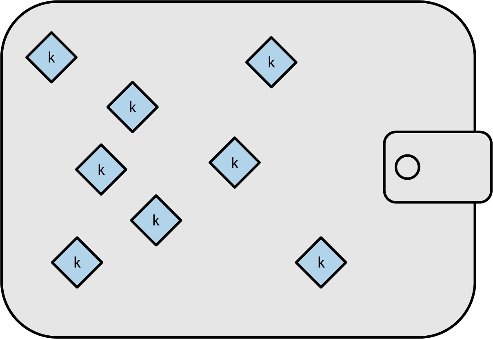
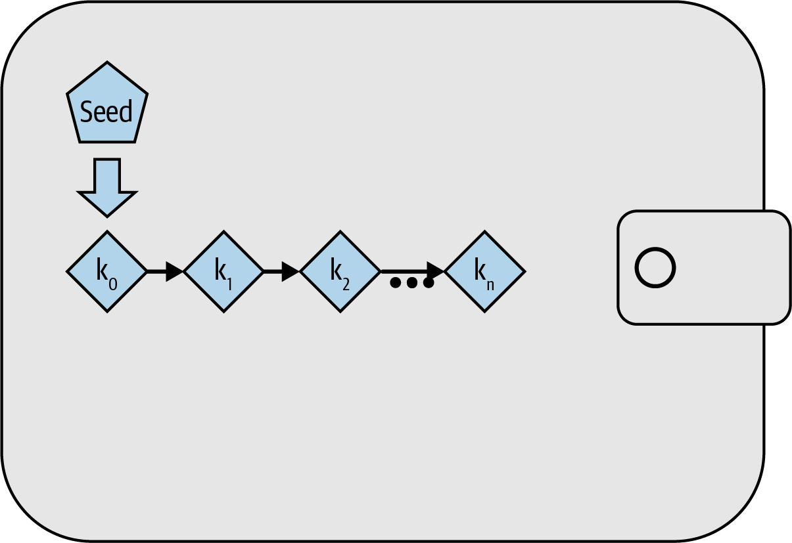
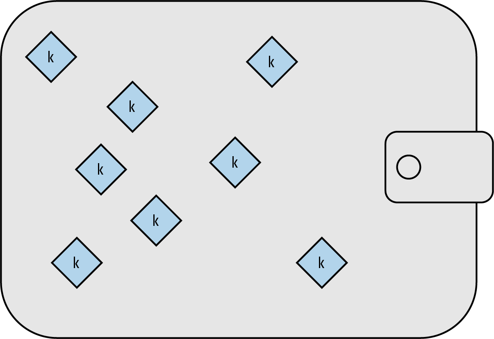
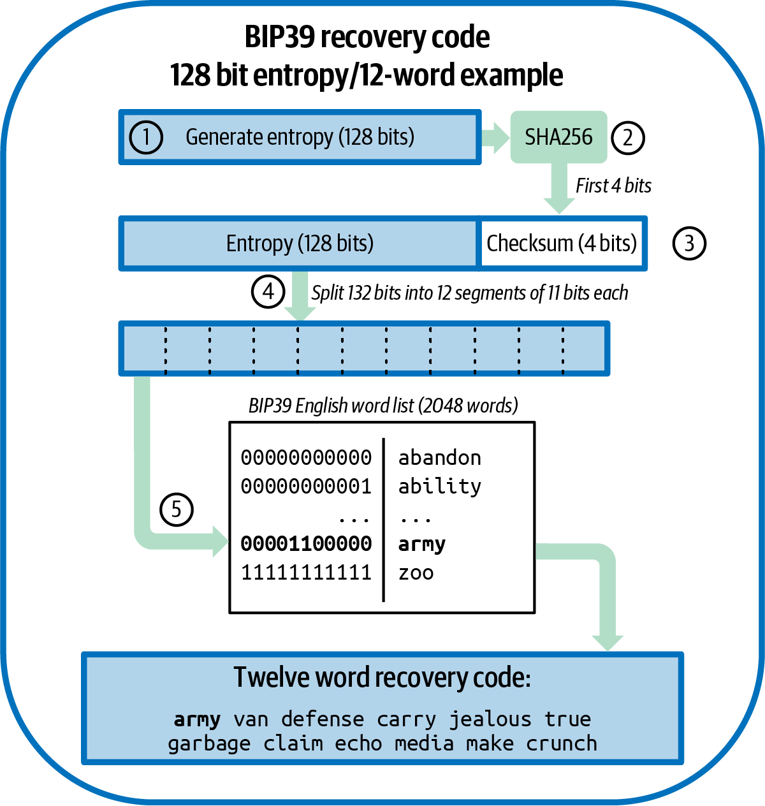
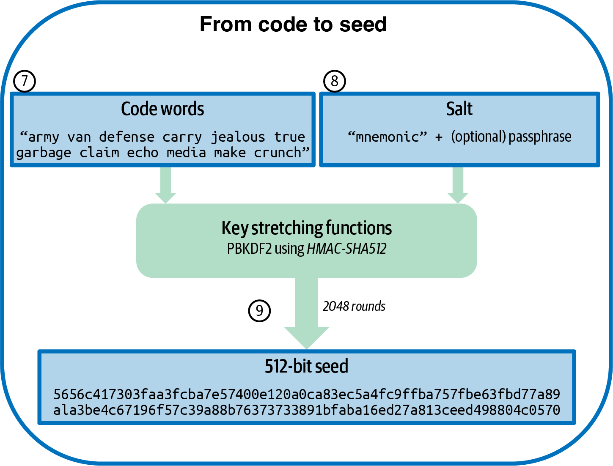
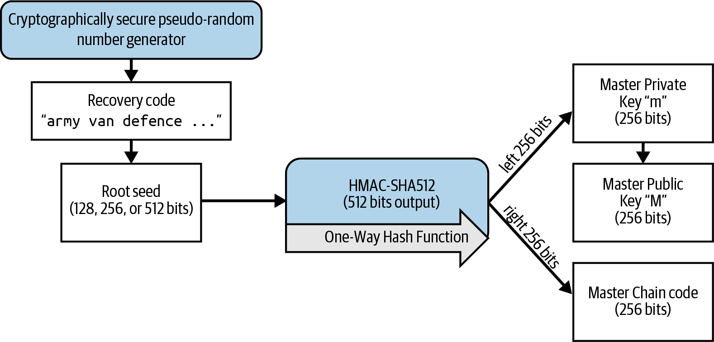
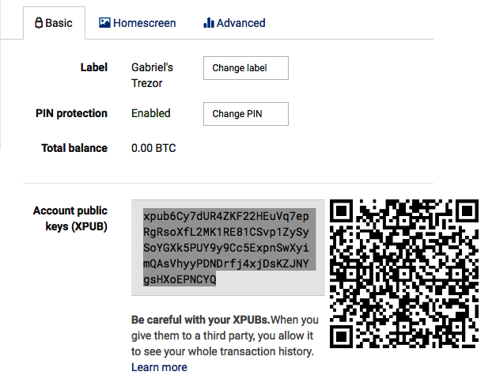

//FIXME:reduce difficulty / we ramp up too quick Lesmes feedback
[[ch05_wallets]]
== Wallet Recovery

Creating pairs of private and public keys is a crucial part of allowing
Bitcoin wallets to receive and spend bitcoins.  But losing access to a
private key can make it impossible for anyone to ever spend the bitcoins
received to the corresponding public key.  Wallet and protocol
developers over the years have worked to design systems that allow users
to recover access to their bitcoins after a problem without compromising
security the rest of the time.

In((("wallets", "key generation", "independent", id="wallet-keygen-independent")))((("key generation", "independent", id="keygen-independent")))((("independent key generation", id="independent-keygen")))((("public key cryptography", "wallet recovery key generation", see="key generation"))) this chapter, we'll examine some of the different methods employed by
wallets to prevent the loss of data from becoming a loss of money.
Some solutions have almost no downsides and are universally adopted by
modern wallets.  We'll simply recommend those solutions as best
practices.  Other solutions have both advantages and disadvantages,
leading different wallet authors to make different trade-offs.
In those cases, we'll describe the various options available.

=== Independent Key Generation

++++

Wallets for physical cash hold that cash,
so it's unsurprising that many people mistakenly believe that
Bitcoin wallets contain bitcoins.  In fact, what many people call a
Bitcoin wallet—which we call a <em>wallet database</em> to distinguish it
from wallet applications—contains only keys.  Those keys are associated
with bitcoins recorded on the blockchain.  By proving to Bitcoin full nodes that you
control the keys, you can spend the associated bitcoins.

++++

Simple wallet databases contain both the public keys to which bitcoins
are received and the private keys that allow creating the signatures
necessary to authorize spending those bitcoins.  Other wallets' databases
may contain only public keys, or only some of the private keys necessary
to authorize a spending transaction.  Their wallet applications produce
the necessary signatures by working with external tools, such as
hardware signing devices or other wallets in a multisignature scheme.

It's possible for a wallet application to independently generate each of
the wallet keys it later plans to use, as illustrated in
<<Type0_wallet>>.  All early Bitcoin wallet applications did
this, but it required users to back up the wallet database each time they
generated and distributed new keys, which could be as often as each time
they generated a new address to receive a new payment.  Failure to back
up the wallet database on time would lead to the user losing access to
any funds received to keys that had not been backed up.

For each independently generated key, the user would need to back up
about 32 bytes, plus overhead.  Some users and wallet applications tried
to minimize the amount of data that needed to be backed up
by only using a single key.  Although that can be secure, it severely
reduces the privacy of that user and all of the people with whom they
transact.  People who valued their privacy and those of their peers
created new key pairs for each transaction, producing wallet databases
that could only reasonably be backed up using digital media.

[[Type0_wallet]]
[role="width-60"]
.Nondeterministic key generation: a collection of independently generated keys stored in a wallet database.

Modern wallet applications don't independently generate keys but instead
derive them from a single random seed using a ((("wallets", "key generation", "independent", startref="wallet-keygen-independent")))((("key generation", "independent", startref="keygen-independent")))((("independent key generation", startref="independent-keygen")))repeatable (deterministic)
algorithm.

==== Deterministic Key Generation

A hash function((("wallets", "key generation", "deterministic", id="wallet-keygen-determine")))((("key generation", "deterministic", id="keygen-determine")))((("deterministic key generation", id="determine-keygen")))((("hash functions", "deterministic key generation", id="hash-determine"))) will always produce the same output when given the same
input, but if the input is changed even slightly, the output will be
different.  If the function is cryptographically secure, nobody should
be able to predict the new output--not even if they know the new input.

This allows us to take one random value and transform it into a
practically unlimited number of seemingly random values.  Even more
useful, later using the same hash function with the same ((("seeds")))input
(called a _seed_) will produce the same seemingly random values:

----
# Collect some entropy (randomness)
$ dd if=/dev/random count=1 status=none | sha256sum
f1cc3bc03ef51cb43ee7844460fa5049e779e7425a6349c8e89dfbb0fd97bb73  -

# Set our seed to the random value
$ seed=f1cc3bc03ef51cb43ee7844460fa5049e779e7425a6349c8e89dfbb0fd97bb73

# Deterministically generate derived values
$ for i in {0..2} ; do echo "$seed + $i" | sha256sum ; done
50b18e0bd9508310b8f699bad425efdf67d668cb2462b909fdb6b9bd2437beb3  -
a965dbcd901a9e3d66af11759e64a58d0ed5c6863e901dfda43adcd5f8c744f3  -
19580c97eb9048599f069472744e51ab2213f687d4720b0efc5bb344d624c3aa  -
----

If we use the derived values as our private keys, we can later generate
exactly those same private keys by using our seed value with the
algorithm we used before.  A user of deterministic key generation can
back up every key in their wallet by simply recording their seed and
a reference to the deterministic algorithm they used.  For example, even
if Alice has a million bitcoins received to a million different
addresses, all she needs to back up in order to later recover access to
those bitcoins is:

----
f1cc 3bc0 3ef5 1cb4 3ee7 8444 60fa 5049
e779 e742 5a63 49c8 e89d fbb0 fd97 bb73
----

A logical diagram of basic sequential deterministic key generation is
shown in <<Type1_wallet>>.  However, modern wallet applications have a
more clever way of accomplishing this that allows public keys to be
derived separately from their corresponding private keys, making it
possible to store private keys more securely than ((("wallets", "key generation", "deterministic", startref="wallet-keygen-determine")))((("key generation", "deterministic", startref="keygen-determine")))((("deterministic key generation", startref="determine-keygen")))((("hash functions", "deterministic key generation", startref="hash-determine")))public keys.

[[Type1_wallet]]
[role="width-70"]
.Deterministic key generation: a deterministic sequence of keys derived from a seed for a wallet database.

[[public_child_key_derivation]]
==== Public Child Key Derivation

In <<public_key_derivation>>, we learned((("wallets", "key generation", "public child key derivation", id="wallet-keygen-public-child")))((("key generation", "public child key derivation", id="keygen-public-child")))((("public child key derivation", id="public-child-derive")))((("child key pair derivation", id="child-key-pair"))) how to create a public key from a private key
using elliptic curve cryptography (ECC).  Although operations on an
elliptic curve are not intuitive, they are analogous to the addition,
subtraction, and multiplication operations used in regular
arithmetic.  In other words, it's possible to add or subtract from a
public key, or to multiply it.  Consider the operation we used in
<<public_key_derivation>> for
generating a public key (_K_) from a private key (_k_) using the generator
point (_G_):

[latexmath]
++++
\begin{equation}
{K = k \times G}
\end{equation}
++++

It's possible to create a derived key pair, called a child key pair, by
simply adding the same value to both sides of the equation:

////
[latexmath]
++++
\begin{equation}
K + (123 \times G) =\!\!\!= (k + 123) \times G
\end{equation}
++++
////

++++

<math xmlns="http://www.w3.org/1998/Math/MathML" alttext="upper K plus left-parenthesis 123 times upper G right-parenthesis equals equals left-parenthesis k plus 123 right-parenthesis times upper G" display="block">
  <mrow>
    <mi>K</mi>
    <mo>+</mo>
    <mo>(</mo>
    <mn>123</mn>
    <mo>×</mo>
    <mi>G</mi>
    <mo>)</mo>
    <mo>==</mo>
    <mo>(</mo>
    <mi>k</mi>
    <mo>+</mo>
    <mn>123</mn>
    <mo>)</mo>
    <mo>×</mo>
    <mi>G</mi>
  </mrow>
</math>

++++

[TIP]
====
In equations throughout this book, we use a single equals sign for
operations such as _K_ = _k_ × _G_ where the value of a variable is
calculated.  We use a double equals sign to show both sides of an
equation are equivalent, or that an operation should return false (not
true) if the two sides aren't equivalent.
====

An interesting consequence of this is that adding 123 to the public
key can be done using entirely public information.  For example, Alice
generates public key _K_ and gives it to Bob.  Bob doesn't know the
private key, but he does know the global constant _G_, so he can add any
value to the public key to produce a derived public child key.  If he
then tells Alice the value he added to the public key, she can add the
same value to the private key, producing a derived private child key
that corresponds to the public child key Bob created.

In other words, it's possible to create child public keys even if you
don't know anything about the parent private key.  The value added to a
public key is ((("key tweaks")))known as a _key tweak._  If a deterministic algorithm is
used for generating the key tweaks, then it's possible for someone
who doesn't know the private key to create an essentially unlimited
sequence of public child keys from a single public parent key. The
person who controls the private parent key can then use the same key
tweaks to create all the corresponding private child keys.

This technique is commonly used to separate wallet application
frontends (which don't require private keys) from signing operations
(which do require private keys).  For example, Alice's frontend
distributes her public keys to people wanting to pay her.  Later, when
she wants to spend the received money, she can provide the key tweaks
she used((("hardware signing devices"))) to a _hardware signing device_ (sometimes confusingly called a
_hardware wallet_) that securely stores her original private key.  The
hardware signer uses the tweaks to derive the necessary child private
keys and uses them to sign the transactions, returning the signed
transactions to the less-secure frontend for broadcast to the Bitcoin
network.

Public child key derivation can produce a linear sequence of keys
similar to the previously seen <<Type1_wallet>>, but modern wallet
applications use one more trick to provide a tree of keys instead a
single sequence, as described in the((("wallets", "key generation", "public child key derivation", startref="wallet-keygen-public-child")))((("key generation", "public child key derivation", startref="keygen-public-child")))((("public child key derivation", startref="public-child-derive")))((("child key pair derivation", startref="child-key-pair"))) following section.

[[hd_wallets]]
==== Hierarchical Deterministic (HD) Key Generation (BIP32)

Every ((("wallets", "key generation", "HD (hierarchical deterministic)")))((("key generation", "HD (hierarchical deterministic)")))((("HD (hierarchical deterministic) key generation")))((("BIP32 HD (hierarchical deterministic) key generation", primary-sortas="BIP032")))modern Bitcoin wallet of which we're aware uses hierarchical
deterministic (HD) key generation by default.  This standard, defined in
BIP32, uses deterministic key generation and optional public child key
derivation with an algorithm that produces a tree of keys.
In this tree, any key can be the parent of a sequence of child keys, and
any of those child keys can be a parent for another sequence of
child keys (grandchildren of the original key).  There's no arbitrary
limit on the depth of the tree.  This tree structure is illustrated in
<<Type2_wallet>>.

[[Type2_wallet]]
.HD wallet: a tree of keys generated from a single seed.

The tree structure can be used to express additional
organizational meaning, such as when a specific branch of subkeys is
used to receive incoming payments and a different branch is used to
receive change from outgoing payments. Branches of keys can also be used
in corporate settings, allocating different branches to departments,
subsidiaries, specific functions, or accounting categories.

We'll provide a detailed exploration of HD wallets in <<hd_wallet_details>>.

==== Seeds and Recovery Codes

HD wallets((("wallets", "recovery codes", id="wallet-recovery2")))((("recovery codes", id="recovery-code2"))) are a very powerful mechanism for managing many
keys all derived from a single seed.  If your wallet database
is ever corrupted or lost, you can regenerate all of the private keys
for your wallet using your ((("seeds")))original seed.  But, if someone else gets
your seed, they can also generate all of the private keys, allowing them
to steal all of the bitcoins from a single-sig wallet and reduce the
security of bitcoins in multisignature wallets.  In this section, we'll
look at several _recovery codes_, which are intended to make backups
easier and safer.

Although seeds are large random numbers, usually 128 to 256 bits, most
recovery codes use human-language words.  A large part of the motivation
for using words was to make a recovery code easy to remember.  For
example, consider the recovery code encoded using both hexadecimal and
words in <<hex_seed_vs_recovery_words>>.

[[hex_seed_vs_recovery_words]]
.A seed encoded in hex and in English words
====
----
Hex-encoded:
0C1E 24E5 9177 79D2 97E1 4D45 F14E 1A1A

Word-encoded:
army van defense carry jealous true
garbage claim echo media make crunch
----
====

There may be cases where ((("memorizing recovery codes")))remembering a recovery code is a powerful
feature, such as when you are unable to transport physical belongings
(like a recovery code written on paper) without them being seized or
inspected by an outside party that might steal your bitcoins.  However,
most of the time, relying on memory alone is dangerous:

- If you forget your recovery code and lose access to your original
  wallet database, your bitcoins are lost to you forever.

- If you die or suffer a severe injury, and your heirs don't have access
  to your original wallet database, they won't be able to inherit your
  bitcoins.

- If someone thinks you have a recovery code memorized that will give
  them access to bitcoins, they may attempt to coerce you into
  disclosing that code.  As of this writing, Bitcoin contributor Jameson
  Lopp has
  https://oreil.ly/aw5XM[documented]
  over 100 physical attacks against suspected owners of bitcoin and
  other digital assets, including at least three deaths and numerous
  occasions where someone was tortured, held hostage, or had their
  family threatened.

[TIP]
====
Even if you use a type of recovery code that was designed for easy
memorization, we very strongly encourage you to consider writing it down.
====

Several ((("wallets", "recovery codes", "types of", id="wallet-recovery-type")))((("recovery codes", "types of", id="recovery-code-type")))different types of recovery codes are in wide use as of this
writing:

BIP39::
  The most ((("BIP39 recovery codes", primary-sortas="BIP039")))popular method for generating recovery codes for the
  past decade, BIP39 involves generating a random sequence of bytes,
  adding a checksum to it, and encoding the data into a series of 12 to
  24 words (which may be localized to a user's native language).  The
  words (plus an optional passphrase) are run through a _key-stretching
  function_, and the output is used as a seed.  BIP39 recovery codes have
  several shortcomings, which later schemes attempt to address.

Electrum v2::
  Used in((("Electrum v2 recovery codes"))) the Electrum wallet (version 2.0 and above), this word-based
  recovery code has several advantages over BIP39.  It doesn't rely on a
  global word list that must be implemented by every version of every
  compatible program, plus its recovery codes include a version number that
  improves reliability and efficiency.  Like BIP39, it supports an optional
  passphrase (which Electrum calls a _seed extension_) and uses the same
  key-stretching function.

Aezeed::
  Used in ((("Aezeed recovery codes")))the LND wallet, this is another word-based recovery code that
  offers improvements over BIP39.  It includes two version numbers: one
  is internal and eliminates several issues with upgrading wallet
  applications (like Electrum v2's version number); the other version
  number is external, which can be incremented to change the underlying
  cryptographic properties of the recovery code.  
  It also includes a _wallet birthday_
  in the recovery code, a reference to the date when the user created
  the wallet database. This allows a restoration process to find all of
  the funds associated with a wallet without scanning the entire
  blockchain, which is especially useful for privacy-focused lightweight clients.
  It includes support for changing the passphrase or changing other
  aspects of the recovery code without needing to move funds to a new
  seed--the user need only back up a new recovery code.  One
  disadvantage compared to Electrum v2 is that, like BIP39, it depends
  on both the backup and the recovery software supporting the same
  word list.

[role="less_space pagebreak-before"]
Muun::
  Used in ((("Muun recovery codes")))the Muun wallet, which defaults to requiring spending
  transactions be signed by multiple keys, this is a nonword code that
  must be accompanied by additional information (which Muun currently
  provides in a PDF).  This recovery code is unrelated to the seed and
  is instead used to decrypt the private keys [.keep-together]#contained# in the PDF.
  Although this is unwieldy compared to the BIP39, Electrum v2, and
  Aezeed recovery codes, it provides support for new technologies and
  standards that are becoming more common in new wallets, such as
  Lightning Network (LN) support, output script descriptors, and miniscript.

SLIP39::
  A successor ((("SLIP39 recovery codes")))to BIP39 with some of the same authors, SLIP39 allows
  a single seed to be distributed using multiple recovery codes that can
  be stored in different places (or by different people).  When you
  create the recovery codes, you can specify how many will be required
  to recover the seed.  For example, you create five recovery codes but
  only require three of them to recover the seed.  SLIP39 provides
  support for an optional passphrase, depends on a global word list, and
  doesn't directly provide versioning.

[NOTE]
====
A new system((("Codex32 recovery codes"))) for distributing recovery codes with similarities to SLIP39
was proposed during the writing of this book.  Codex32 allows creating
and validating recovery codes with nothing except printed instructions,
scissors, a precision knife, brass fasteners, and a pen--plus privacy
and a few hours of spare time.  Alternatively, those who trust computers can create recovery codes
instantly using software on a digital device.  You can create up to 31
recovery codes to be stored in different places, specifying how many of
them will be required in order to recover the seed.  As a new proposal,
details about Codex32 may change significantly before this book is
published, so we encourage ((("wallets", "recovery codes", "types of", startref="wallet-recovery-type")))((("recovery codes", "types of", startref="recovery-code-type")))any readers interested in distributed
recovery codes to investigate its https://oreil.ly/Xx_Zq[current
status].
====

.Recovery Code Passphrases
****
The BIP39, ((("wallets", "recovery codes", "passphrases", id="wallet-recovery-passphrase")))((("recovery codes", "passphrases", id="recovery-code-passphrase")))((("passphrases (for recovery codes)", id="passphrase")))Electrum v2, Aezeed, and SLIP39 schemes may all be used with an
optional passphrase.  If the only place you keep this passphrase is in
your memory, it has the same advantages and disadvantages as memorizing
your recovery code.  However, there's a further set of trade-offs
specific to the way the passphrase is used by the recovery code.

Three of the schemes (BIP39, Electrum v2, and SLIP39) do not include the optional passphrase in the
checksum they use to protect against data entry mistakes.  Every
passphrase (including not using a passphrase) will result in producing a
seed for a BIP32 tree of keys, but they won't be the same trees.
Different passphrases will result in different keys.  That can be a
positive or a negative, depending on your perspective:

- On the positive, if someone obtains your recovery code (but not your
  passphrase), they will see a valid BIP32 tree of keys.
  If you prepared for that contingency and sent some bitcoins to the
  nonpassphrase tree, they will steal that money.  Although having some
  of your bitcoins stolen is normally a bad thing, it can also provide
  you with a warning that your recovery code has been compromised,
  allowing you to investigate and take corrective measures.
  The ability to create multiple passphrases for the same recovery code
  that all look valid is a type of _plausible deniability_.

- On the negative, if you're coerced to give an attacker a recovery
  code (with or without a passphrase) and it doesn't yield the amount of
  bitcoins they expected, they may continue trying to coerce you until
  you give them a different passphrase with access to more bitcoins.
  Designing for plausible deniability means there's no way to prove to
  an attacker that you've revealed all of your information, so they may
  continue trying to coerce you even after you've given them all of
  your bitcoins.

- An additional negative is the reduced amount of error detection.  If
  you enter a slightly wrong passphrase when restoring from a backup,
  your wallet can't warn you about the mistake.  If you were expecting
  a balance, you will know something is wrong when your wallet
  application shows you a zero balance for the regenerated key tree.
  However, novice users may think their money was permanently lost and do
  something foolish, such as give up and throw away their recovery code.
  Or, if you were actually expecting a zero balance, you might use the
  wallet application for years after your mistake until the next time
  you restore with the correct passphrase and see a zero balance.
  Unless you can figure out what typo you previously made, your funds
  are gone.

Unlike the other schemes, the Aezeed seed encryption scheme
authenticates its optional passphrase and will return an error if you
provide an incorrect value.  This eliminates plausible deniability, adds
error detection, and makes it possible to prove that the passphrase has been
revealed.

Many users and developers disagree on which approach is better, with
some strongly in favor of plausible deniability and others preferring the
increased safety that error detection gives novice users and those under
duress.  We suspect the debate will continue for as long as recovery
codes continue to be widely ((("wallets", "recovery codes", startref="wallet-recovery2")))((("recovery codes", startref="recovery-code2")))((("passphrases (for recovery codes)", startref="passphrase")))((("wallets", "recovery codes", "passphrases", startref="wallet-recovery-passphrase")))((("recovery codes", "passphrases", startref="recovery-code-passphrase")))used.
****

==== Backing Up Nonkey Data

The ((("wallets", "nonkey data, backing up", id="wallet-nonkey-backups")))((("nonkey data, backing up", id="nonkey-backups")))((("backing up", "nonkey data", id="backup-nonkey")))most important data in a wallet database is its private keys.  If
you lose access to the private keys, you lose the ability to spend your
bitcoins.  Deterministic key derivation and recovery codes provide a
reasonably robust solution for backing up and recovering your keys and
the bitcoins they control.  However, it's important to consider that
many wallet databases store more than
just keys--they also store user-provided information about every
transaction they sent or received.

For example, when Bob creates a new address as part of sending an
invoice to Alice, he ((("labels, backing up", id="label-backup")))adds a _label_ to the address he generates
so that he can distinguish her payment
from other payments he receives.  When Alice pays Bob's address, she
labels the transaction as paying Bob for the same reason.  Some wallets
also add other useful information to transactions, such as the current
exchange rate, which can be useful for calculating taxes in some
jurisdictions.  These labels are stored entirely within their own
wallets--not shared with the network--protecting their privacy
and keeping unnecessary personal data out of the blockchain.  For
an example, see <<alice_tx_labels>>.

++++
<table id="alice_tx_labels">
<caption>Alice’s transaction history with each transaction labeled</caption>
<thead>
<tr>
<th>Date</th>
<th>Label</th>
<th>BTC</th>
</tr>
</thead>
<tbody>
<tr>
<td>
2023-01-01
</td>
<td>
Bought bitcoins from Joe
</td>
<td>
+0.00100
</td>
</tr>
<tr>
<td>
2023-01-02
</td>
<td>
Paid Bob for podcast
</td>
<td>
−0.00075
</td>
</tr>
</tbody>
</table>
++++

However, because address and transaction labels are stored only in each
user's wallet database and because they aren't deterministic, they can't
be restored by using just a recovery code.  If the only recovery is
seed-based, then all the user will see is a list of approximate
transaction times and bitcoin amounts.  This can make it quite difficult
to figure out how you used your money in the past.  Imagine reviewing a
bank or credit card statement from a year ago that had the date and
amount of every transaction listed but a blank entry for the
"description" field.

Wallets should provide their users with a convenient way to back up
label data.  That seems obvious, but there are a number of
widely used wallet applications that make it easy to create and use
recovery codes but that provide no way to back up or restore label
data.

Additionally, it may be useful for wallet applications to provide a
standardized format to export labels so that they can be used in other
applications (e.g., accounting software).  A standard for that format is
proposed in BIP329.

Wallet applications implementing additional protocols beyond basic
Bitcoin support may also need or want to store other data.  For example,
as of 2023, an increasing number of applications have added support for
sending and receiving transactions over the Lightning Network (LN).
Although the LN protocol provides a method to recover
funds in the event of a data loss, called _static channel backups_, it
can't guarantee results.  If the node your wallet connects to realizes
you've lost data, it may be able to steal bitcoins from you.  If it
loses its wallet database at the same time you lose your database, and
neither of you has an adequate backup, you'll both lose funds.

Again, this means users and wallet applications need to do more than just back up a
recovery code.

One solution implemented by a few wallet applications is to frequently
and automatically create complete backups of their wallet database
encrypted by one of the keys derived from their seed.  Bitcoin keys must
be unguessable and modern encryption algorithms are considered very
secure, so nobody should be able to open the encrypted backup except
someone who can generate the seed. This makes it safe to store the backup on
untrusted computers such as cloud hosting services or even random
network peers.

Later, if the original wallet database is lost, the user can enter their
recovery code into the wallet application to restore their seed.  The
application can then retrieve the latest backup file, regenerate the
encryption key, decrypt the backup, and restore all of the user's labels
and additional ((("wallets", "nonkey data, backing up", startref="wallet-nonkey-backups")))((("nonkey data, backing up", startref="nonkey-backups")))((("backing up", "nonkey data", startref="backup-nonkey")))protocol data.

==== Backing Up Key Derivation Paths

In a ((("wallets", "key generation", "backing up derivation paths", id="wallet-keygen-backups")))((("key generation", "backing up derivation paths", id="keygen-backups")))((("backing up", "key derivation paths", id="backup-key-derive")))BIP32 tree of keys, there are approximately four billion first-level
keys; each of those keys can have its own four billion children, with
those children each potentially having four billion children of their
own, and so on.  It's not possible for a wallet application to generate
even a small fraction of every possible key in a BIP32 tree, which means
that recovering from data loss requires knowing more than just the
recovery code, the algorithm for obtaining your seed (e.g., BIP39), and
the deterministic key derivation algorithm
(e.g., BIP32)—it also requires knowing what paths in the tree of keys
your wallet application used for generating the specific keys it distributed.

Two solutions to this problem have been adopted.  The first is using
standard paths.  Every time there's a change related to the addresses
that wallet applications might want to generate, someone creates a BIP
defining what key derivation path to use.  For example, BIP44 defines
`m/44'/0'/0'` as the path to use for keys in P2PKH scripts (a
legacy address).  A wallet application implementing this standard uses
the keys in that path both when it is first started and after a
restoration from a recovery code.  We call((("implicit paths", id="implicit-path"))) this solution _implicit
paths_. Several popular implicit paths defined by BIPs are shown in <<bip_implicit_paths>>

++++
<table id="bip_implicit_paths">
<caption>Implicit script paths defined by various BIPs</caption>
<thead>
<tr>
<th>Standard</th>
<th>Script</th>
<th>BIP32 path</th>
</tr>
</thead>
<tbody>
<tr>
<td>
BIP44
</td>
<td>
P2PKH
</td>
<td>
<code>m/44'/0'/0'</code>
</td>
</tr>
<tr>
<td>
BIP49
</td>
<td>
Nested P2WPKH
</td>
<td>
<code>m/49'/1'/0'</code>
</td>
</tr>
<tr>
<td>
BIP84
</td>
<td>
P2WPKH
</td>
<td>
<code>m/84'/0'/0'</code>
</td>
</tr>
<tr>
<td>
BIP86
</td>
<td>
P2TR Single-key
</td>
<td>
<code>m/86'/0'/0'</code>
</td>
</tr>
</tbody>
</table>
++++

[role="less_space pagebreak-before"]
The second solution is to back up the path information with the recovery
code, making it clear which path is used with which scripts.  We ((("explicit paths", id="explicit-path")))call
this _explicit paths_.

The advantage of implicit paths is that users don't need to keep a record
of what paths they use.  If the user enters their recovery code into the
same wallet application they previously used, of the same version or
higher, it will automatically regenerate keys for the same paths it
previously used.

The disadvantage of implicit scripts is their inflexibility.  When a
recovery code is entered, a wallet application must generate the keys
for every path it supports and it must scan the blockchain for
transactions involving those keys, otherwise it might not find all of a
user's transactions.  This is wasteful in wallets that support many
features each with their own path if the user only tried a few of those
features.

For implicit path recovery codes that don't include a version number,
such as BIP39 and SLIP39, a new version of a wallet application that drops support
for an older path can't warn users during the restore process that some
of their funds may not be found.  The same problem happens in reverse if
a user enters their recovery code into older software: it won't find
newer paths to which the user may have received funds.  Recovery codes
that include version information, such as Electrum v2 and Aezeed, can
detect that a user is entering an older or newer recovery code and
direct them to appropriate resources.

The final consequence of implicit paths is that they can only include
information that is either universal (such as a standardized path) or
derived from the seed (such as keys).  Important nondeterministic
information that's specific to a certain user can't be restored using
a recovery code.  For example, Alice, Bob, and Carol receive funds that
can only be spent with signatures from two out of three of them.  Although
Alice only needs either Bob's or Carol's signature to spend, she needs
both of their public keys in order to find their joint funds on the
blockchain.  That means each of them must back up the public keys for
all three of them.  As multisignature and other advanced scripts become
more common on Bitcoin, the inflexibility of implicit paths becomes more
significant.

The advantage of explicit paths is that they can describe exactly what
keys should be used with what scripts.  There's no need to support
outdated scripts, no problems with backward or forward compatibility,
and any extra information (like the public keys of other users) can be
included directly.  Their disadvantage is that they require users to back
up additional information along with their recovery code.  The
additional information usually can't compromise a user's security, so it
doesn't require as much protection as the recovery code, although it can
reduce their privacy and does require some protection.

[role="less_space pagebreak-before"]
Almost all wallet applications that use explicit paths as of this
writing use the _output script descriptors_ standard (called
_descriptors_ for short) as specified in BIPs 380, 381, 382, 383, 384,
385, 386, and 389.  Descriptors
describe a script and the keys (or key paths) to be used with it.
A few example descriptors are shown in <<sample_descriptors>>.

++++
<table id="sample_descriptors">
<caption>Sample descriptors from Bitcoin Core documentation (with elision)</caption>
<thead>
<tr>
<th>Descriptor</th>
<th>Explanation</th>
</tr>
</thead>
<tbody>
<tr>
<td>
<code>pkh(02c6…​9ee5)</code>
</td>
<td>
P2PKH script for the provided public key
</td>
</tr>
<tr>
<td>
<code>sh(multi(2,022f…​2a01,03ac…​ccbe))</code>
</td>
<td>
P2SH multisignature requiring two signatures corresponding to these two keys
</td>
</tr>
<tr>
<td>
<code>pkh([d34db33f/44'/0'/0']xpub6ERA…​RcEL/1/*)</code>
</td>
<td>
P2PKH scripts for the BIP32 <code>d34db33f</code> with the extended public key (xpub) at the path <code>M/44'/0'/0'</code>, which is <code>xpub6ERA…​RcEL</code>, using the keys at <code>M/1/*</code> of that xpub
</td>
</tr>
</tbody>
</table>
++++

It has long been the trend for wallet applications designed only for
single signature scripts to use implicit paths.  Wallet applications
designed for multiple signatures or other advanced scripts are
increasingly adopting support for explicit paths using descriptors.
Applications that do both will usually conform to the standards for
implicit paths and also provide ((("wallets", "key generation", "backing up derivation paths", startref="wallet-keygen-backups")))((("key generation", "backing up derivation paths", startref="keygen-backups")))((("backing up", "key derivation paths", startref="backup-key-derive")))((("implicit paths", startref="implicit-path")))((("explicit paths", startref="explicit-path")))descriptors.

=== A Wallet Technology Stack in Detail

Developers of modern wallets can choose from a variety of different
technologies to help users create and use backups--and new solutions
appear every year.  Instead of going into detail about each of the
options we described earlier in this chapter, we'll focus the rest of
this chapter on the stack of technologies we think is most widely
used in wallets as of early 2023:

- BIP39 recovery codes
- BIP32 HD key derivation
- BIP44-style implicit paths

All of these standards have been around since 2014 or earlier, and
you'll have no problem finding additional resources for using them.
However, if you're feeling bold, we do encourage you to investigate more
modern standards that may provide additional features or safety.

[[recovery_code_words]]
==== BIP39 Recovery Codes

BIP39 ((("wallets", "recovery codes", id="wallet-recovery-bip39")))((("recovery codes", id="recovery-code-bip39")))((("BIP39 recovery codes", primary-sortas="BIP039", id="bip39-recovery")))recovery codes are word
sequences that represent (encode) a random number used as a seed to
derive a deterministic wallet. The sequence of words is sufficient to
re-create the seed and from there, re-create all the
derived keys. A wallet application that implements deterministic wallets
with a BIP39 recovery code will show the user a sequence of 12 to 24 words when
first creating a wallet. That sequence of words is the wallet backup and
can be used to recover and re-create all the keys in the same or any
compatible wallet application. Recovery codes make it easier for users
to back up because they are easy to read and correctly
transcribe.

[TIP]
====
Recovery codes((("brainwallets"))) are often confused with
"brainwallets." They are not the same. The primary difference is that a
brainwallet consists of words chosen by the user, whereas recovery codes
are created randomly by the wallet and presented to the user. This
important difference makes recovery codes much more secure because
humans are very poor sources of randomness.
====

Note that BIP39 is one implementation of a recovery code standard.
BIP39 was proposed by the company behind the Trezor hardware wallet and
is compatible with many other wallets applications, although certainly
not all.

BIP39 defines the creation of a recovery code and seed, which we
describe here in nine steps. For clarity, the process is split into two
parts: steps 1 through 6 are shown in <<generating_recovery_words>> and
steps 7 through 9 are shown in <<recovery_to_seed>>.

[[generating_recovery_words]]
===== Generating a recovery code

Recovery((("wallets", "recovery codes", "generating", id="wallet-recovery-bip39-generate")))((("recovery codes", "generating", id="recovery-code-bip39-generate")))((("BIP39 recovery codes", "generating", primary-sortas="BIP039", id="bip39-recovery-generate")))((("entropy", "recovery code generation", id="entropy-recovery-generate"))) codes are generated automatically by the wallet application using the
standardized process defined in BIP39. The wallet starts from a source
of entropy, adds a checksum, and then maps the entropy to a word list:

1. Create a random sequence (entropy) of 128 to 256 bits.

2. Create a checksum of the random sequence by taking the first
(entropy-length/32) bits of its SHA256 hash.

3. Add the checksum to the end of the random sequence.

4. Split the result into 11-bit length segments.

5. Map each 11-bit value to a word from the predefined dictionary of
2,048 words.

6. The recovery code is the sequence of words.

<<generating_entropy_and_encoding>> shows how entropy is used to
generate a BIP39 recovery code.

[[generating_entropy_and_encoding]]
.Generating entropy and encoding as a recovery code.

<<table_4-5>> shows the relationship between the size of the entropy
data and the length of recovery code in((("wallets", "recovery codes", "generating", startref="wallet-recovery-bip39-generate")))((("recovery codes", "generating", startref="recovery-code-bip39-generate")))((("BIP39 recovery codes", "generating", primary-sortas="BIP039", startref="bip39-recovery-generate")))((("entropy", "recovery code generation", startref="entropy-recovery-generate"))) words.

++++
<table id="table_4-5">
<caption>BIP39: entropy and word length</caption>
<thead>
<tr>
<th>Entropy (bits)</th>
<th>Checksum (bits)</th>
<th>Entropy <strong>+</strong> checksum (bits)</th>
<th>Recovery code words</th>
</tr>
</thead>
<tbody>
<tr>
<td>
128
</td>
<td>
4
</td>
<td>
132
</td>
<td>
12
</td>
</tr>
<tr>
<td>
160
</td>
<td>
5
</td>
<td>
165
</td>
<td>
15
</td>
</tr>
<tr>
<td>
192
</td>
<td>
6
</td>
<td>
198
</td>
<td>
18
</td>
</tr>
<tr>
<td>
224
</td>
<td>
7
</td>
<td>
231
</td>
<td>
21
</td>
</tr>
<tr>
<td>
256
</td>
<td>
8
</td>
<td>
264
</td>
<td>
24
</td>
</tr>
</tbody>
</table>
++++

[role="less_space pagebreak-before"]
[[recovery_to_seed]]
===== From recovery code to seed

The ((("wallets", "recovery codes", "seed generation", id="wallet-recovery-bip39-seed")))((("recovery codes", "seed generation", id="recovery-code-bip39-seed")))((("BIP39 recovery codes", "seed generation", primary-sortas="BIP039", id="bip39-recovery-seed")))((("entropy", "seed generation", id="entropy-seed-generate")))((("seeds", "generating", id="seed-generate")))((("key-stretching functions", id="key-stretch")))recovery code
represents entropy with a length of 128 to 256 bits. The entropy is then
used to derive a longer (512-bit) seed through the use of the
https://oreil.ly/6lwbd[key-stretching function PBKDF2]. The seed produced is then used to build
a deterministic wallet and derive its keys.

The key-stretching function takes two
parameters: the entropy and((("salt"))) a _salt_. The purpose of a salt in a
key-stretching function is to make it difficult to build a lookup table
enabling a brute-force attack. In the BIP39 standard, the salt has
another purpose--it allows the introduction of a passphrase that
serves as an additional security factor protecting the seed, as we will
describe in more detail in <<recovery_passphrase>>.

[TIP]
====
The key-stretching function, with its 2,048 rounds of hashing, makes it
slightly harder to brute-force attack the recovery code using software.
Special-purpose hardware is not significantly affected.  For an attacker
who needs to guess a user's entire recovery code, the length of the code
(128 bits at a minimum) provides more than sufficient security.  But for
cases where an attacker might learn a small part of the user's code,
key-stretching adds some security by slowing down how fast an attacker
can check different recovery code combinations.  BIP39's parameters were
considered weak by modern standards even when it was first published
almost a decade ago, although that's likely a consequence of being
designed for compatibility with hardware signing devices with low-powered
CPUs.  Some alternatives to BIP39 use stronger key-stretching
parameters, such as Aezeed's 32,768 rounds of hashing using the more
complex Scrypt algorithm, although they may not be as convenient to run
on hardware signing devices.
====

The process described in steps 7 through 9 continues from the process
described previously in <<generating_recovery_words>>:

++++
<ol start="7">
  <li>The first parameter to the PBKDF2 key-stretching function is the
  <em>entropy</em> produced from step 6.</li>

  <li>The second parameter to the PBKDF2 key-stretching function is a
  <em>salt</em>. The salt is composed of the string constant
  "<code>mnemonic</code>" concatenated with an optional user-supplied
  passphrase string.</li>

  <li>PBKDF2 stretches the recovery code and salt parameters using 2,048
  rounds of hashing with the HMAC-SHA512 algorithm, producing a 512-bit
  value as its final output. That 512-bit value is the seed.</li>
</ol>
++++

<<fig_5_7>> shows how a recovery code is used to generate a seed.

[[fig_5_7]]
.From recovery code to seed.

Tables pass:[<a data-type="xref" href="#bip39_128_no_pass"
data-xrefstyle="select: labelnumber">#bip39_128_no_pass</a>],
pass:[<a data-type="xref" href="#bip39_128_w_pass"
data-xrefstyle="select: labelnumber">#bip39_128_w_pass</a>], and
pass:[<a data-type="xref" href="#bip39_256_no_pass"
data-xrefstyle="select: labelnumber">#bip39_256_no_pass</a>] show
some examples of recovery codes and the seeds ((("key-stretching functions", startref="key-stretch")))they produce.

++++
<table id="bip39_128_no_pass">
<caption>128-bit entropy BIP39 recovery code, no passphrase, resulting seed</caption>
<tbody>
<tr>
<td>
<strong>Entropy input (128 bits)</strong>
</td>
<td>
<code>0c1e24e5917779d297e14d45f14e1a1a</code>
</td>
</tr>
<tr>
<td>
<strong>Recovery Code (12 words)</strong>
</td>
<td>
<code>army van defense carry jealous true garbage claim echo media make crunch</code>
</td>
</tr>
<tr>
<td>
<strong>Passphrase</strong>
</td>
<td>
(none)
</td>
</tr>
<tr>
<td>
<strong>Seed  (512 bits)</strong>
</td>
<td>
<code>5b56c417303faa3fcba7e57400e120a0ca83ec5a4fc9ffba757fbe63fbd77a89a1a3be4</code>
<code>c67196f57c39a88b76373733891bfaba16ed27a813ceed498804c0570</code>
</td>
</tr>
</tbody>
</table>

<table id="bip39_128_w_pass" class="pagebreak-before less_space">
<caption>128-bit entropy BIP39 recovery code, with passphrase, resulting seed</caption>
<tbody>
<tr>
<td>
<strong>Entropy input (128 bits)</strong>
</td>
<td>
<code>0c1e24e5917779d297e14d45f14e1a1a</code>
</td>
</tr>
<tr>
<td>
<strong>Recovery Code (12 words)</strong>
</td>
<td>
<code>army van defense carry jealous true garbage claim echo media make crunch</code>
</td>
</tr>
<tr>
<td>
<strong>Passphrase</strong>
</td>
<td>
SuperDuperSecret
</td>
</tr>
<tr>
<td>
<strong>Seed  (512 bits)</strong>
</td>
<td>
<code>3b5df16df2157104cfdd22830162a5e170c0161653e3afe6c88defeefb0818c793dbb28</code>
<code>ab3ab091897d0715861dc8a18358f80b79d49acf64142ae57037d1d54</code>
</td>
</tr>
</tbody>
</table>
<table id="bip39_256_no_pass">
<caption>256-bit entropy BIP39 recovery code, no passphrase, resulting seed</caption>
<tbody>
<tr>
<td>
<strong>Entropy input (256 bits)</strong>
</td>
<td>
<code>2041546864449caff939d32d574753fe684d3c947c3346713dd8423e74abcf8c</code>
</td>
</tr>
<tr>
<td>
<strong>Recovery Code (24 words)</strong>
</td>
<td>
<code>cake apple borrow silk endorse fitness top denial coil riot stay wolf
luggage oxygen faint major edit measure invite love trap field dilemma oblige</code>
</td>
</tr>
<tr>
<td>
<strong>Passphrase</strong>
</td>
<td>
(none)
</td>
</tr>
<tr>
<td>
<strong>Seed (512 bits)</strong>
</td>
<td>
<code>3269bce2674acbd188d4f120072b13b088a0ecf87c6e4cae41657a0bb78f5315b33b3</code>
<code>a04356e53d062e55f1e0deaa082df8d487381379df848a6ad7e98798404</code>
</td>
</tr>
</tbody>
</table>
++++

.How Much Entropy Do You Need?
****
BIP32 allows seeds to be from 128 to 512 bits.  BIP39 accepts from 128
to 256 bits of entropy; Electrum v2 accepts 132 bits of entropy; Aezeed
accepts 128 bits of entropy; SLIP39 accepts either 128 or 256 bits.  The
variation in these numbers makes it unclear how much entropy is needed
for safety.  We'll try to demystify that.

BIP32 extended private keys consist of a 256-bit key and a 256-bit chain
code, for a total of 512 bits.  That means there's a maximum of 2^512^
different possible extended private keys.  If you start with more than
512 bits of entropy, you'll still get an extended private key containing
512 bits of entropy--so there's no point in using more than 512 bits
even if any of the standards we mentioned allowed that.

However, even though there are 2^512^ different extended private keys,
there are only (slightly less than) 2^256^ regular private keys--and its
those private keys that actually secure your bitcoins.  That means, if
you use more than 256 bits of entropy for your seed, you still get private keys
containing only 256 bits of entropy.  There may be future
Bitcoin-related protocols where extra entropy in the extended keys
provides extra security, but that's not currently the case.

The security strength of a Bitcoin public key is 128 bits.  An attacker
with a classical computer (the only kind which can be used for a
practical attack as of this writing) would need to perform about 2^128^
operations on Bitcoin's elliptic curve in order to find a private key
for another user's public key.  The implication of a security strength
of 128 bits is that there's no apparent benefit to using more than 128
bits of entropy (although you need to ensure your generated private
keys are selected uniformly from within the entire 2^256^ range of
private keys).

There is one extra benefit of greater entropy: if a fixed percentage of
your recovery code (but not the whole code) is seen by an attacker, the
greater the entropy, the harder it will be for them to figure out part
of the code they didn't see.  For example, if an attacker sees half of a
128-bit code (64 bits), it's plausible that they'll be able to brute
force the remaining 64 bits.  If they see half of a 256-bit code (128
bits), it's not plausible that they can brute force the other half.  We
don't recommend relying on this defense--either keep your recovery codes
very safe or use a method like SLIP39 that lets you distribute your
recovery code across multiple locations without relying on the safety of
any individual code.

As of 2023, most modern wallets generate 128 bits of entropy for their
recovery codes (or a value near 128, such as((("wallets", "recovery codes", "seed generation", startref="wallet-recovery-bip39-seed")))((("recovery codes", "seed generation", startref="recovery-code-bip39-seed")))((("BIP39 recovery codes", "seed generation", primary-sortas="BIP039", startref="bip39-recovery-seed")))((("entropy", "seed generation", startref="entropy-seed-generate")))((("seeds", "generating", startref="seed-generate"))) Electrum v2's 132 bits).
****

[[recovery_passphrase]]
===== Optional passphrase in BIP39

The((("wallets", "recovery codes", "passphrases", id="wallet-recovery-bip39-passphrase")))((("recovery codes", "passphrases", id="recovery-code-bip39-passphrase")))((("BIP39 recovery codes", "passphrases", primary-sortas="BIP039", id="bip39-recovery-passphrase")))((("passphrases (for recovery codes)", id="passphrase-optional"))) BIP39 standard allows the use of an optional
passphrase in the derivation of the seed. If no passphrase is used, the
recovery code is stretched with a salt consisting of the constant string
+"mnemonic"+, producing a specific 512-bit seed from any given recovery code.
If a passphrase is used, the stretching function produces a _different_
seed from that same recovery code. In fact, given a single recovery code, every
possible passphrase leads to a different seed. Essentially, there is no
"wrong" passphrase. All passphrases are valid and they all lead to
different seeds, forming a vast set of possible uninitialized wallets.
The set of possible wallets is so large (2^512^) that there is no
practical possibility of brute-forcing or accidentally guessing one that
is in use.

[TIP]
====
There are no "wrong" passphrases in BIP39. Every passphrase leads to
some wallet, which unless previously used will be empty.
====

The optional passphrase creates two important features:

- A second factor (something memorized) that makes a recovery code useless on
  its own, protecting recovery codes from compromise by a casual thief.  For
  protection from a tech-savvy thief, you will need to use a very strong
  passphrase.

- A form of plausible deniability or "duress wallet," where a chosen
  passphrase leads to a wallet with a small amount of funds used to
  distract an attacker from the "real" wallet that contains the majority
  of funds.

It's important to note that the use of a passphrase also introduces the risk of loss:

* If the wallet owner is incapacitated or dead and no one else knows the passphrase, the seed is useless and all the funds stored in the wallet are lost forever.

* Conversely, if the owner backs up the passphrase in the same place as the seed, it defeats the purpose of a second((("wallets", "recovery codes", startref="wallet-recovery-bip39")))((("recovery codes", startref="recovery-code-bip39")))((("BIP39 recovery codes", primary-sortas="BIP039", startref="bip39-recovery")))((("wallets", "recovery codes", "passphrases", startref="wallet-recovery-bip39-passphrase")))((("recovery codes", "passphrases", startref="recovery-code-bip39-passphrase")))((("BIP39 recovery codes", "passphrases", primary-sortas="BIP039", startref="bip39-recovery-passphrase")))((("passphrases (for recovery codes)", startref="passphrase-optional"))) factor.

++++

While passphrases are very useful, they should only be used in
combination with a carefully planned process for backup and recovery,
considering the possibility of surviving the owner and allowing his or
her family to recover the cryptocurrency estate.

++++

[[hd_wallet_details]]
==== Creating an HD Wallet from the Seed

HD wallets ((("wallets", "key generation", "HD (hierarchical deterministic)", id="wallet-keygen-hd")))((("key generation", "HD (hierarchical deterministic)", id="keygen-hd")))((("HD (hierarchical deterministic) key generation", id="hd-keygen")))((("BIP32 HD (hierarchical deterministic) key generation", primary-sortas="BIP032", id="bip32")))((("seeds", "HD wallet creation", id="seed-hdwallet")))are created from a ((("root seeds")))single _root seed_, which is a
128-, 256-, or 512-bit random number. Most commonly, this seed is
generated by or decrypted from a recovery code as detailed in the previous section.

Every key in the HD wallet is deterministically derived from this root
seed, which makes it possible to re-create the entire HD wallet from
that seed in any compatible HD wallet. This makes it easy to back up,
restore, export, and import HD wallets containing thousands or even
millions of keys by simply transferring only the recovery code that the root
seed is derived from. The process of creating the master keys and master chain code for an HD
wallet is shown in <<HDWalletFromSeed>>.

[[HDWalletFromSeed]]
.Creating master keys and chain code from a root seed.

The root seed is input into the HMAC-SHA512 algorithm and the resulting
hash is used to create a _master private key_ (_m_) and a _master chain
code_ (_c_).

The master private key (_m_) then generates a corresponding master public
key (_M_) using the normal elliptic curve multiplication process _m_ × _G_
that we saw in <<public_key_derivation>>.

The master chain code (_c_) is used to introduce entropy in the function that
creates child keys from parent keys, as we will see in the next section.

===== Private child key derivation

HD wallets ((("key generation", "HD (hierarchical deterministic)", "private child key derivation", id="keygen-hd-private-child")))((("HD (hierarchical deterministic) key generation", "private child key derivation", id="hd-keygen-private-child")))((("private child key derivation", id="private-child")))((("child key pair derivation", "private keys", id="child-key-pair-private")))use a _child key derivation_ (CKD)
function to derive child keys from parent keys.

The child key derivation functions are based on a one-way hash function
that [.keep-together]#combines:#

* A parent private or public key (uncompressed key)
* A seed called a chain code (256 bits)
* An index number (32 bits)

The chain code is used to introduce deterministic random data to the
process, so that knowing the index and a child key is not sufficient to
derive other child keys. Knowing a child key does not make it possible
to find its siblings unless you also have the chain code. The initial
chain code seed (at the root of the tree) is made from the seed, while
subsequent child chain codes are derived from each parent chain code.

These three items (parent key, chain code, and index) are combined and
hashed to generate children keys, as follows.

The parent public key, chain code, and the index number are combined and
hashed with the HMAC-SHA512 algorithm to produce a 512-bit hash. This
512-bit hash is split into two 256-bit halves. The right-half 256 bits
of the hash output become the chain code for the child. The left-half
256 bits of the hash are added to the parent private key to produce the
child private key. In <<CKDpriv>>, we see this illustrated with the
index set to 0 to produce the "zero" (first by index) child of the
parent.

[[CKDpriv]]
.Extending a parent private key to create a child private key.
image::images/mbc3_0507.png["ChildPrivateDerivation"]

Changing the index allows us to extend the parent and create the other
children in the sequence (e.g., Child 0, Child 1, Child 2, etc.). Each
parent key can have 2,147,483,647 (2^31^) children (2^31^ is half of the
entire 2^32^ range available because the other half is reserved for a
special type of derivation we will talk about later in this chapter).

Repeating the process one level down the tree, each child can in turn
become a parent and create its own children, in an infinite number of
generations.

===== Using derived child keys

Child private keys are indistinguishable from nondeterministic (random)
keys. Because the derivation function is a one-way function, the child
key cannot be used to find the parent key. The child key also cannot be
used to find any siblings. If you have the n^th^ child, you cannot find
its siblings, such as the n–1 child or the n+1 child, or any
other children that are part of the sequence. Only the parent key and
chain code can derive all the children. Without the child chain code,
the child key cannot be used to derive any grandchildren either. You
need both the child private key and the child chain code to start a new
branch and derive grandchildren.

So what can the child private key be used for on its own? It can be used
to make a public key and a Bitcoin address. Then, it can be used to sign
transactions to spend anything paid to that address.

[TIP]
====
A child private key, the corresponding public key, and the Bitcoin
address are all indistinguishable from keys and addresses created
randomly. The fact that they are part of a sequence is not visible
outside of the HD wallet function that created them. Once created, they
operate exactly((("key generation", "HD (hierarchical deterministic)", "private child key derivation", startref="keygen-hd-private-child")))((("HD (hierarchical deterministic) key generation", "private child key derivation", startref="hd-keygen-private-child")))((("private child key derivation", startref="private-child")))((("child key pair derivation", "private keys", startref="child-key-pair-private"))) as "normal" keys.
====

===== Extended keys

As
we saw ((("key generation", "HD (hierarchical deterministic)", "extended keys", id="keygen-hd-extend")))((("HD (hierarchical deterministic) key generation", "extended keys", "explained", id="hd-keygen-extend")))((("extended keys", "explained", id="extend-key")))earlier, the key derivation function can be used to create
children at any level of the tree, based on the three inputs: a key, a
chain code, and the index of the desired child. The two essential
ingredients are the key and chain code, and combined these are called an
_extended key_. The term "extended key" could also be thought of as
"extensible key" because such a key can be used to derive children.

Extended keys are stored and represented simply as the concatenation of
the key and chain code. There
are two types of extended keys. An extended private key is the
combination of a private key and chain code and can be used to derive
child private keys (and from them, child public keys). An extended
public key is a public key and chain code, which can be used to create
child public keys (_public only_), as described in
<<public_key_derivation>>.

Think of an extended key as the root of a branch in the tree structure
of the HD wallet. With the root of the branch, you can derive the rest
of the branch. The extended private key can create a complete branch,
whereas the extended public key can _only_ create a branch of public
keys.

Extended keys are encoded using base58check, to easily export and import
between different BIP32-compatible wallets. The base58check
coding for extended keys uses a special version number that results in
the prefix "xprv" and "xpub" when encoded in base58 characters to make
them easily recognizable. Because the extended key contains many more
bytes than regular addresses,
it is also much longer than other base58check-encoded strings we have
seen previously.

Here's an example of an extended _private_ key, encoded in base58check:

----
xprv9tyUQV64JT5qs3RSTJkXCWKMyUgoQp7F3hA1xzG6ZGu6u6Q9VMNjGr67Lctvy5P8oyaYAL9CA
WrUE9i6GoNMKUga5biW6Hx4tws2six3b9c
----

Here's the corresponding extended _public_ key, encoded in base58check:

----
xpub67xpozcx8pe95XVuZLHXZeG6XWXHpGq6Qv5cmNfi7cS5mtjJ2tgypeQbBs2UAR6KECeeMVKZBP
LrtJunSDMstweyLXhRgPxdp14sk9tJPW9
----

[role="less_space pagebreak-before"]
[[public__child_key_derivation]]
===== Public child key derivation

As
mentioned  previously, ((("key generation", "HD (hierarchical deterministic)", "public child key derivation", id="keygen-hd-public-child")))((("HD (hierarchical deterministic) key generation", "public child key derivation", id="hd-keygen-public-child")))((("public child key derivation", id="public-child")))((("child key pair derivation", "public keys", id="child-key-pair-public")))a very useful characteristic of HD wallets is the
ability to derive public child keys from public parent keys _without_
having the private keys. This gives us two ways to derive a child public
key: either from the child private key or directly from the parent
public key.

An extended public key can be used, therefore, to derive all of the
_public_ keys (and only the public keys) in that branch of the HD wallet
structure.

This shortcut can be used to create public key–only
deployments where a server or application has a copy of an extended
public key and no private keys whatsoever. That kind of deployment can
produce an infinite number of public keys and Bitcoin addresses but
cannot spend any of the money sent to those addresses. Meanwhile, on
another, more secure server, the extended private key can derive all the
corresponding private keys to sign transactions and spend the money.

One common application of this solution is to install an extended public
key on a web server that serves an ecommerce application. The web server
can use the public key derivation function to create a new Bitcoin
address for every transaction (e.g., for a customer shopping cart). The
web server will not have any private keys that would be vulnerable to
theft. Without HD wallets, the only way to do this is to generate
thousands of Bitcoin addresses on a separate secure server and then
preload them on the ecommerce server. That approach is cumbersome and
requires constant maintenance to ensure that the ecommerce server
doesn't "run out" of keys.

.Mind the Gap
****
An ((("gap limit", id="gap-limit")))extended public key can generate approximately 4 billion direct
child keys, far more than any store or application should ever need.
However, it would also take a wallet application an unreasonable amount
of time to generate all 4 billion keys and scan the blockchain for
transactions involving those keys.  For that reason, most wallets only
generate a few keys at a time, scan for payments involving those keys,
and generate additional keys in the sequence as the previous keys are used.
For example, Alice's wallet generates 100 keys.  When it sees a payment
to the first key, it generates the 101st key.

Sometimes a wallet application will distribute a key to someone who
later decides not to pay, creating a gap in the key chain.  That's fine as
long as the wallet has already generated keys after the gap so that it
finds later payments and continues generating more keys.  The maximum
number of unused keys in a row that can fail to receive a payment
without causing problems is called the _gap limit_.

When a wallet application has distributed all of the keys up to its gap
limit and none of those keys have received a payment, it has three
options about how to handle future requests for new keys:

[role="less_space pagebreak-before"]
1. It can refuse the requests, preventing it from receiving any further
payments.  This is obviously an unpalatable option, although it's the
simplest to implement.

2. It can generate new keys beyond its gap limit.  This ensures that
every person requesting to pay gets a unique key, preventing address
reuse and improving privacy.  However, if the wallet needs to be
restored from a recovery code, or if the wallet owner is using other
software loaded with the same extended public key, those other wallets
won't see any payments received after the extended gap.

3. It can distribute keys it previously distributed, ensuring a smooth
recovery but potentially reducing the privacy of the wallet owner and
the people with whom they transact.

Open source production systems for online merchants, such as BTCPay
Server, attempt to dodge this problem by using very large gap limits and
limiting the rate at which they generate invoices.  Other solutions have
been proposed, such as
asking the spender's wallet to construct (but not broadcast) a
transaction paying a possibly reused address before they receive a fresh
address for the actual transaction.  However, these other solutions have
not been used in production as of this((("gap limit", startref="gap-limit"))) writing.
****

Another common application of this solution is for
cold-storage or hardware signing devices. In that scenario, the extended
private key can be stored on a paper wallet or hardware device, while
the extended public key can be kept online. The
user can create "receive" addresses at will, while the private keys are
safely stored offline. To spend the funds, the user can use the extended
private key on an offline software wallet application or
the hardware signing device. <<CKDpub>> illustrates the
mechanism for extending a parent public key to derive child ((("wallets", "key generation", "HD (hierarchical deterministic)", startref="wallet-keygen-hd")))((("key generation", "HD (hierarchical deterministic)", startref="keygen-hd")))((("HD (hierarchical deterministic) key generation", startref="hd-keygen")))((("BIP32 HD (hierarchical deterministic) key generation", primary-sortas="BIP032", startref="bip32")))((("seeds", "HD wallet creation", startref="seed-hdwallet")))((("key generation", "HD (hierarchical deterministic)", "public child key derivation", startref="keygen-hd-public-child")))((("HD (hierarchical deterministic) key generation", "public child key derivation", startref="hd-keygen-public-child")))((("public child key derivation", startref="public-child")))((("child key pair derivation", "public keys", startref="child-key-pair-public")))public keys.

[[CKDpub]]
.Extending a parent public key to create a child public key.
image::images/mbc3_0508.png["ChildPublicDerivation"]

==== Using an Extended Public Key on a Web Store

Let's see ((("key generation", "HD (hierarchical deterministic)", "extended keys", id="keygen-hd-extend-webstore")))((("HD (hierarchical deterministic) key generation", "extended keys", "web store example", id="hd-keygen-extend-webstore")))((("extended keys", "web store example", id="extend-key-webstore")))((("web store example (extended keys)", id="webstore-extend-key")))how HD wallets are used by looking at
Gabriel's web store.

Gabriel first set up his web store as a hobby, based on a simple hosted
WordPress page. His store was quite basic with only a few pages and an
order form with a single Bitcoin address.

Gabriel used the first Bitcoin address generated by his regular wallet as
the main Bitcoin address for his store.
Customers would submit an order using the form and send payment to
Gabriel's published Bitcoin address, triggering an email with the order
details for Gabriel to process. With just a few orders each week, this
system worked well enough, even though it weakened the privacy of
Gabriel, his clients, and the people he paid.

However, the little web store became quite successful and attracted many
orders from the local community. Soon, Gabriel was overwhelmed. With all
the orders paying the same address, it became difficult to correctly
match orders and transactions, especially when multiple orders for the
same amount came in close together.

The only metadata that is chosen by the receiver of a typical Bitcoin
transaction are the amount and payment address.  There's no subject
or message field that can be used to hold a unique identifier invoice number.

Gabriel's HD wallet offers a much better solution through the ability to
derive public child keys without knowing the private keys. Gabriel can
load an extended public key (xpub) on his website, which can be used to
derive a unique address for every customer order.  The unique address
immediately improves privacy and also gives each order a unique
identifier that can be used for tracking which invoices have been paid.

Using the HD wallet allows Gabriel to spend the
funds from his personal wallet application, but the xpub loaded on the website can only
generate addresses and receive funds. This feature of HD wallets is a
great security feature. Gabriel's website does not contain any private
keys and therefore any hack of it can only steal the funds Gabriel would
have received in the future, not any funds he received in the past.

To export the xpub from his Trezor hardware signing device, Gabriel uses
the web-based Trezor wallet application. The Trezor device must be plugged in
for the public keys to be exported. Note that most hardware signing devices will
never export private keys--those always remain on the device.

Gabriel copies the xpub to his web store's Bitcoin payment processing
software, such as the widely used open source BTCPay Server.

===== Hardened child key derivation

The ((("private child key derivation", "hardened derivation", id="private-child-harden")))((("child key pair derivation", "hardened derivation", id="child-key-pair-harden")))((("hardened child key derivation", id="harden-child-key")))ability to derive a branch
of public keys from an xpub is very useful, but it comes with a
potential risk. Access to an xpub does not give access to child private
keys. However, because the xpub contains the chain code, if a child
private key is known, or somehow leaked, it can be used with the chain
code to derive all the other child private keys. A single leaked child
private key, together with a parent chain code, reveals all the private
keys of all the children. Worse, the child private key together with a
parent chain code can be used to deduce the parent private key.

To counter this risk, HD wallets provide an alternative derivation function
called _hardened derivation_, which breaks the relationship between
parent public key and child chain code. The hardened derivation function
uses the parent private key to derive the child chain code, instead of
the parent public key. This creates a "firewall" in the parent/child
sequence, with a chain code that cannot be used to compromise a parent
or sibling private key. The hardened derivation function looks almost
identical to the normal child private key derivation, except that the
parent private key is used as input to the hash function, instead of the
parent public key, as shown in the diagram in <<CKDprime>>.

[[CKDprime]]
.Hardened derivation of a child key; omits the parent public key.

When the hardened private derivation function is used, the resulting
child private key and chain code are completely different from what
would result from the normal derivation function. The resulting "branch"
of keys can be used to produce extended public keys that are not
vulnerable because the chain code they contain cannot be exploited to
reveal any private keys for their siblings or parents. Hardened derivation is therefore used to create
a "gap" in the tree above the level where extended public keys are used.

In simple terms, if you want to use the convenience of an xpub to derive
branches of public keys, without exposing yourself to the risk of a
leaked chain code, you should derive it from a hardened parent rather
than a normal parent. As a best practice, the level-1 children of the
master keys are always derived through the hardened derivation to
prevent compromise of the master keys.

===== Index numbers for normal and hardened derivation

The index number ((("index numbers for hardened derivation")))used in the derivation function is a 32-bit integer. To
easily distinguish between keys created through the normal derivation
function versus keys derived through hardened derivation, this index
number is split into two ranges. Index numbers between 0 and
2^31^ &#x2013; 1 (0x0 to 0x7FFFFFFF) are used _only_ for normal
derivation. Index numbers between 2^31^ and 2^32^ &#x2013; 1 (0x80000000
to 0xFFFFFFFF) are used _only_ for hardened derivation. Therefore, if
the index number is less than 2^31^, the child is normal, whereas if the
index number is equal or above 2^31^, the child is hardened.

To make the index number easier to read and display, the index number
for hardened children is displayed starting from zero, but with a prime
symbol. The first normal child key is therefore displayed as 0, whereas
the first hardened child (index 0x80000000) is displayed as 0++&#x27;++.
In a sequence then, the second hardened key would have index 0x80000001
and would be displayed as 1++&#x27;++, and so on. When you see an HD
wallet index i++&#x27;++, that means 2^31^+i.  In regular ASCII text, the
prime symbol is substituted with either a single apostrophe or the
letter _h_.  For situations, such as in output script descriptors, where
text may be used in a shell or other context where a single apostrophe
has special meaning, using the letter _h_ is ((("private child key derivation", "hardened derivation", startref="private-child-harden")))((("child key pair derivation", "hardened derivation", startref="child-key-pair-harden")))((("hardened child key derivation", startref="harden-child-key")))recommended.

===== HD wallet key identifier (path)

Keys in ((("path references in HD wallets")))((("key generation", "HD (hierarchical deterministic)", "path references")))((("HD (hierarchical deterministic) key generation", "path references")))an HD wallet are
identified using a "path" naming convention, with each level of the tree
separated by a slash (/) character (see <<table_4-8>>). Private keys
derived from the master private key start with "m." Public keys derived
from the master public key start with "M." Therefore, the first child
private key of the master private key is m/0. The first child public key
is M/0. The second grandchild of the first child is m/0/1, and so on.

The "ancestry" of a key is read from right to left, until you reach the
master key from which it was derived. For example, identifier m/x/y/z
describes the key that is the z-th child of key m/x/y, which is the y-th
child of key m/x, which is the x-th child of m.

++++
<table id="table_4-8" class="pagebreak-before less_space">
<caption>HD wallet path examples</caption>
<thead>
<tr>
<th>HD path</th>
<th>Key described</th>
</tr>
</thead>
<tbody>
<tr>
<td>
m/0
</td>
<td>
The first (0) child private key from the master private key (m)
</td>
</tr>
<tr>
<td>
m/0/0
</td>
<td>
The first grandchild private key from the first child (m/0)
</td>
</tr>
<tr>
<td>
m/0'/0
</td>
<td>
The first normal grandchild private key from the first <em>hardened</em> child (m/0')
</td>
</tr>
<tr>
<td>
m/1/0
</td>
<td>
The first grandchild private key from the second child (m/1)
</td>
</tr>
<tr>
<td>
M/23/17/0/0
</td>
<td>
The first great-great-grandchild public key from the first great-grandchild from the 18th grandchild from the 24th child
</td>
</tr>
</tbody>
</table>
++++

===== Navigating the HD wallet tree structure

The((("tree structure in HD wallets", id="tree-hd-wallet")))((("key generation", "HD (hierarchical deterministic)", "tree structure", id="keygen-hd-tree")))((("HD (hierarchical deterministic) key generation", "tree structure", id="hd-keygen-tree"))) HD wallet tree structure offers tremendous flexibility. Each parent
extended key can have 4 billion children: 2 billion normal children and
2 billion hardened children. Each of those children can have another 4
billion children, and so on. The tree can be as deep as you want, with
an infinite number of generations. With all that flexibility, however,
it becomes quite difficult to navigate this infinite tree. It is
especially difficult to transfer HD wallets between implementations
because the possibilities for internal organization into branches and
subbranches are endless.

Two BIPs offer a solution to this complexity by creating some proposed
standards for the structure of HD wallet trees. ((("BIP43 HD wallet tree structure", primary-sortas="BIP043")))BIP43 proposes the use
of the first hardened child index as a special identifier that signifies
the "purpose" of the tree structure. Based on BIP43, an HD wallet
should use only one level-1 branch of the tree, with the index number
identifying the structure and namespace of the rest of the tree by
defining its purpose. For example, an HD wallet using only branch
m/i++&#x27;++/ is intended to signify a specific purpose, and that
purpose is identified by index number "i."

Extending that specification, ((("BIP44 HD wallet tree structure", primary-sortas="BIP044", id="bip44")))BIP44 proposes a multiaccount structure
as "purpose" number +44'+ under BIP43. All HD wallets following the
BIP44 structure are identified by the fact that they only used one
branch of the tree: m/44++'++/.

BIP44 specifies the structure as consisting of five predefined tree levels:

-----
m / purpose' / coin_type' / account' / change / address_index
-----

The first-level "purpose" is always set to ++44'++. The second-level
"coin_type" specifies the type of cryptocurrency coin, allowing for
multicurrency HD wallets where each currency has its own subtree under
the second level.  Bitcoin is m/44++&apos;++/0++&apos;++ and Bitcoin Testnet is m/44++&apos;++/1++&apos;++.

The third level of the tree is "account," which allows users to
subdivide their wallets into separate logical subaccounts for
accounting or organizational purposes. For example, an HD wallet might
contain two Bitcoin "accounts": m/44++&#x27;++/0++&#x27;++/0++&#x27;++
and m/44++&#x27;++/0++&#x27;++/1++&#x27;++. Each account is the root of
its own subtree.

On the
fourth level, "change," an HD wallet has two subtrees, one for creating
receiving addresses and one for creating change addresses. Note that
whereas the previous levels used hardened derivation, this level uses
normal derivation. This is to allow this level of the tree to export
extended public keys for use in a nonsecured environment. Usable
addresses are derived by the HD wallet as children of the fourth level,
making the fifth level of the tree the "address_index." For example, the
third receiving address for payments in the primary account
would be M/44++&#x27;++/0++&#x27;++/0++&#x27;++/0/2. <<table_4-9>> shows
a few more examples.

++++
<table id="table_4-9">
<caption>BIP44 HD wallet structure examples</caption>
<thead>
<tr>
<th>HD path</th>
<th>Key described</th>
</tr>
</thead>
<tbody>
<tr>
<td>
M/44<code>'</code>/0<code>'</code>/0<code>'</code>/0/2
</td>
<td>
The third receiving public key for the primary Bitcoin account
</td>
</tr>
<tr>
<td>
M/44<code>'</code>/0<code>'</code>/3<code>'</code>/1/14
</td>
<td>
The fifteenth change-address public key for the fourth Bitcoin account
</td>
</tr>
<tr>
<td>
m/44<code>'</code>/2<code>'</code>/0<code>'</code>/0/1
</td>
<td>
The second private key in the Litecoin main account, for signing transactions
</td>
</tr>
</tbody>
</table>
++++

Many people ((("BIP44 HD wallet tree structure", primary-sortas="BIP044", startref="bip44")))focus on securing their bitcoins against theft and other
attacks, but one of the leading causes of lost bitcoins--perhaps _the_
leading cause--is data loss.  If the keys and other essential data
required to spend your bitcoins is lost, those bitcoins will forever be
unspendable.  Nobody can get them back for you.  In this chapter, we
looked at the systems that modern wallet applications use to help you
prevent losing that data.  Remember, however, that it's up to you to
actually use the systems available to make good backups and ((("key generation", "HD (hierarchical deterministic)", "extended keys", startref="keygen-hd-extend-webstore")))((("HD (hierarchical deterministic) key generation", "extended keys", "web store example", startref="hd-keygen-extend-webstore")))((("extended keys", "web store example", startref="extend-key-webstore")))((("web store example (extended keys)", startref="webstore-extend-key")))((("tree structure in HD wallets", startref="tree-hd-wallet")))((("key generation", "HD (hierarchical deterministic)", "tree structure", startref="keygen-hd-tree")))((("HD (hierarchical deterministic) key generation", "tree structure", startref="hd-keygen-tree")))regularly
test them.
