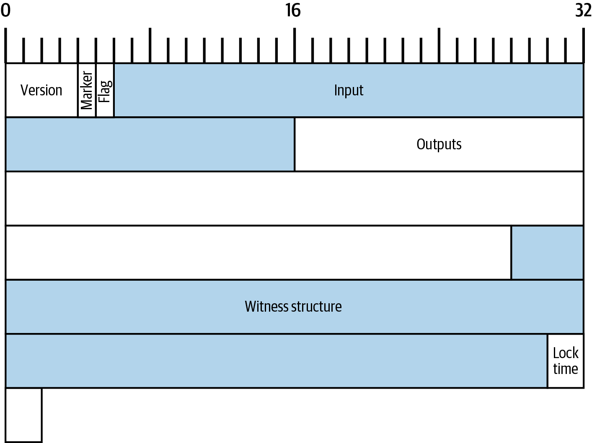
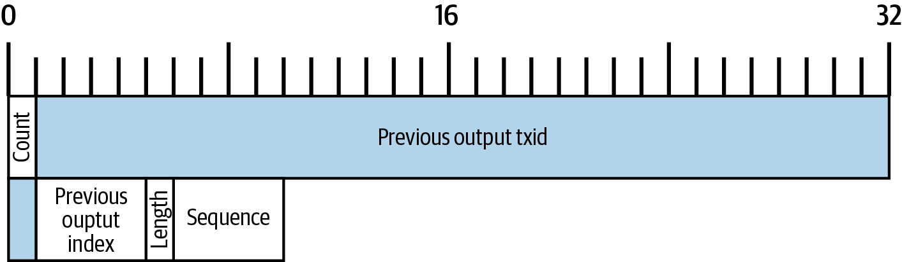
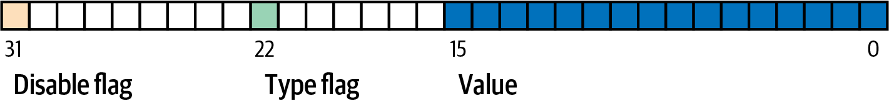
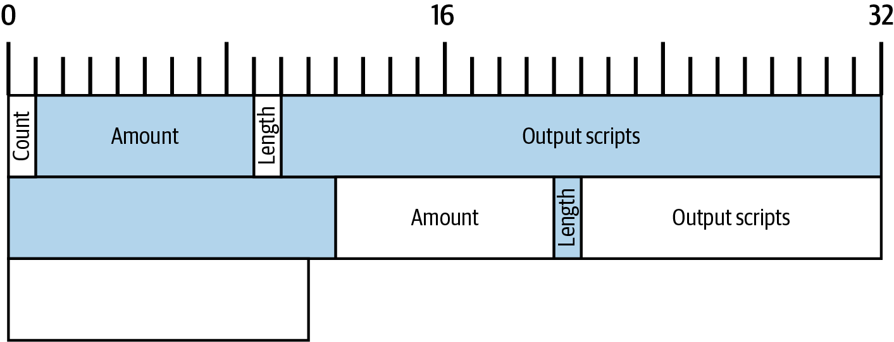
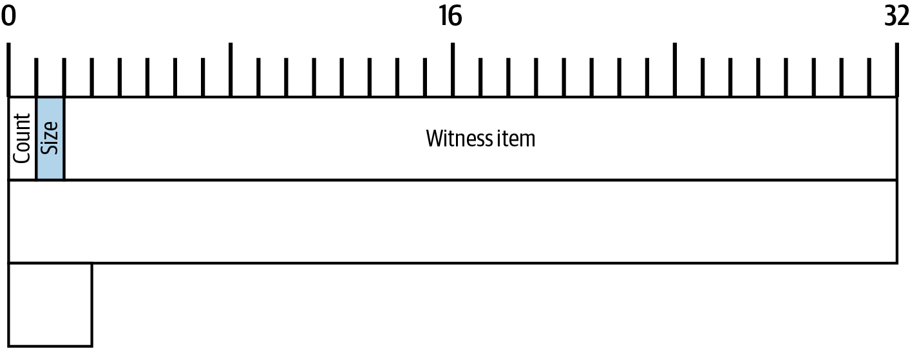
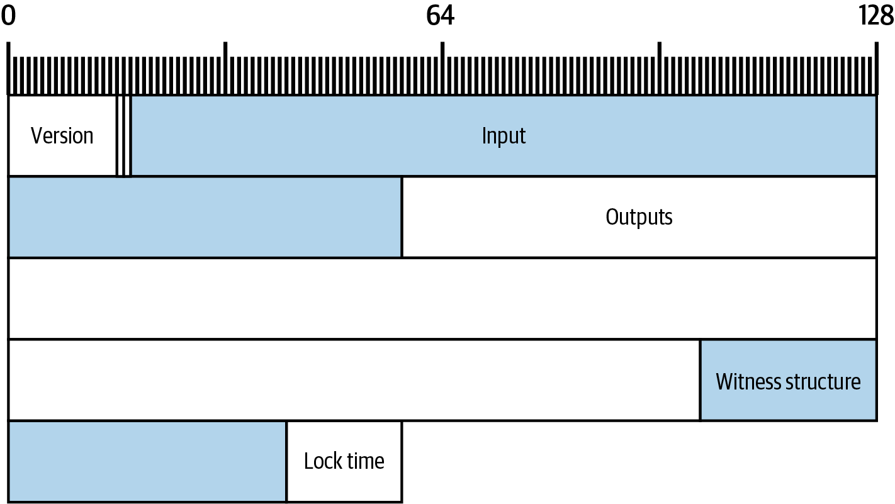

[[c_transactions]]
== Transactions

The way we typically transfer physical cash has little resemblance to
the way we transfer bitcoins.  Physical cash is a bearer token.  Alice
pays Bob by handing him some number of tokens, such as dollar bills.
By comparison, bitcoins don't exist either physically or as digital
data--Alice can't hand Bob some bitcoins or send them by email.

Instead, consider how Alice might transfer control over a parcel of land
to Bob.  She can't physically pick up the land and hand it to Bob.
Rather there exists some sort of record (usually maintained by a local
government) that describes the land Alice owns.  Alice transfers that
land to Bob by convincing the government to update the record to say
that Bob now owns the land.

Bitcoin works in a similar way.  There exists a database on every
Bitcoin full node that says that Alice controls some number of
bitcoins. Alice pays Bob by convincing full nodes to update their
database to say that some of Alice's bitcoins are now controlled by Bob.
The data that Alice uses to convince full nodes to update their
databases is called a _transaction_.  This is done without directly
using either Alice's or Bob's identities, as we'll see in
<<c_authorization_authentication>>.

In this chapter we'll deconstruct a Bitcoin transaction and examine each
of its parts to see how they facilitate the transfer of value in a way
that's highly expressive and amazingly reliable.

[[tx_structure]]
=== A Serialized Bitcoin Transaction

In <<exploring_and_decoding_transactions>>, we ((("transactions", "serialized", id="transaction-serialize")))((("serialized transactions", id="serial-transactions")))((("Bitcoin Core", "serialized transactions", id="bitcoin-core-serial-transaction")))used Bitcoin Core with
the txindex option enabled to retrieve a copy of Alice's payment to Bob.
Let's retrieve the transaction containing that payment again, as shown in <<alice_tx_serialized_reprint>>.

[[alice_tx_serialized_reprint]]
.Alice's serialized transaction
====
----
$ bitcoin-cli getrawtransaction 466200308696215bbc949d5141a49a41\
38ecdfdfaa2a8029c1f9bcecd1f96177

01000000000101eb3ae38f27191aa5f3850dc9cad00492b88b72404f9da13569
8679268041c54a0100000000ffffffff02204e0000000000002251203b41daba
4c9ace578369740f15e5ec880c28279ee7f51b07dca69c7061e07068f8240100
000000001600147752c165ea7be772b2c0acb7f4d6047ae6f4768e0141cf5efe
2d8ef13ed0af21d4f4cb82422d6252d70324f6f4576b727b7d918e521c00b51b
e739df2f899c49dc267c0ad280aca6dab0d2fa2b42a45182fc83e81713010000
0000
----
====

Bitcoin Core's serialization format is special because it's the format
used to make commitments to transactions and to relay them across
Bitcoin's P2P network, but otherwise programs can use
a different format as long as they transmit all of the
same data.  However, Bitcoin Core's format is reasonably compact for the
data it transmits and simple to parse, so many other Bitcoin programs
use this format.

[TIP]
====
The only ((("partially signed bitcoin transaction (PSBT) format")))((("PSBT (partially signed bitcoin transaction) format")))other widely used transaction serialization format that
we're aware of is the partially signed bitcoin transaction (PSBT) format
documented in BIPs 174 and 370 (with extensions documented in other
BIPs).  PSBT allows an untrusted program to produce a transaction
template that can be verified and updated by trusted programs (such as
hardware signing devices) that have the necessary private keys or
other sensitive data to fill in the template.  To accomplish this, PSBT
allows storing a significant amount of metadata about a transaction,
making it much less compact than the standard serialization format.
This book does not go into detail about PSBT, but we strongly recommend
it to developers of wallets that plan to support signing
with multiple keys.
====

The transaction displayed in hexadecimal in <<alice_tx_serialized_reprint>> is
replicated as a byte map in <<alice_tx_byte_map>>.  Note that it takes
64 hexadecimal characters to display 32 bytes.  This map shows only the
top-level fields.  We'll examine each of them in the order they appear
in the transaction and describe any additional fields that they((("transactions", "serialized", startref="transaction-serialize")))((("serialized transactions", startref="serial-transactions")))((("Bitcoin Core", "serialized transactions", startref="bitcoin-core-serial-transaction"))) contain.

[[alice_tx_byte_map]]
.A byte map of Alice's transaction.

[[version]]
=== Version

The first ((("transactions", "version of", id="transactions-version")))((("version (of transactions)", id="version-transactions")))four bytes of a serialized Bitcoin transaction are its
version.  The original version of Bitcoin transactions was version 1
(0x01000000).  All transactions in Bitcoin must follow
the rules of version 1 transactions, with many of those rules being
described throughout this book.

Version 2 Bitcoin transactions were introduced in the BIP68 soft fork
change to Bitcoin's consensus rules.  BIP68 places additional
constraints on the sequence field, but those constraints only apply to
transactions with version 2 or higher.  Version 1 transactions are
unaffected.  BIP112, which was part of the same soft fork as BIP68,
upgraded an opcode (++OP_CHECKSEQUENCEVERIFY++), which will now fail if it is
evaluated as part of a transaction with a version less than 2.  Beyond
those two changes, version 2 transactions are identical to version 1
transactions.

[role="less_space pagebreak-before"]
.Protecting Presigned Transactions
****
The last step ((("transactions", "presigned", id="transaction-presign")))((("presigned transactions", id="presign-transaction")))before broadcasting a transaction to the network for
inclusion in the blockchain is to sign it.  However, it's possible to
sign a transaction without broadcasting it immediately.  You can save
that presigned transaction for months or years in the belief that it
can be added to the blockchain later when you do broadcast it.  In the
interim, you may even lose access to the private key (or keys) necessary
to sign an alternative transaction spending the funds.  This isn't
hypothetical: several protocols built on Bitcoin, including Lightning
Network, depend on presigned [.keep-together]#transactions.#

This creates a challenge for protocol developers when they assist users
in upgrading the Bitcoin consensus protocol.  Adding new
constraints--such as BIP68 did to the sequence field--may invalidate
some presigned transactions.  If there's no way to create a new
signature for an equivalent transaction, then the money being spent in
the presigned transaction is permanently lost.

This problem is solved by reserving some transaction features for
upgrades, such as version numbers.  Anyone creating presigned
transactions prior to BIP68 should have been using version 1
transactions, so only applying BIP68's additional constraints on
sequence to transactions v2 or higher should not invalidate any
presigned [.keep-together]#transactions.#

If you implement a protocol that uses presigned transactions, ensure
that it doesn't use any features that are reserved for future upgrades.
Bitcoin Core's default transaction relay policy does not allow the use
of reserved features.  You can test whether a transaction complies with
that policy by using Bitcoin Core's +testmempoolaccept+ RPC on Bitcoin
mainnet.
****

As of this writing, a proposal to begin using version 3 transactions is
being widely considered.  That proposal does not seek to change the
consensus rules but only the policy that Bitcoin full nodes use to relay
transactions.  Under the proposal, version 3 transactions would be
subject to additional constraints in order to prevent certain denial of
service (DoS) attacks that we'll discuss((("transactions", "version of", startref="transactions-version")))((("version (of transactions)", startref="version-transactions"))) further in <<transaction_pinning>>.

=== Extended Marker and Flag

The next two fields((("transactions", "extended serialization format")))((("extended serialization format")))((("BIP144 extended serialization format"))) of the example serialized transaction were added as
part of the segregated witness (segwit) soft fork change to Bitcoin's
consensus rules.  The rules were changed according to BIPs 141 and 143,
but the _extended serialization format_ is defined in BIP144.

[role="less_space pagebreak-before"]
If the transaction includes a witness structure (which we'll describe in
<<witness_structure>>), the marker must be zero (0x00) and the flag must be
nonzero.  In the current P2P protocol, the flag should always be one
(0x01); alternative flags are reserved for later protocol upgrades.

If the transaction doesn't need a witness stack, the marker and flag must not
be present.  This is compatible with the original version of Bitcoin's
transaction serialization format, now called _legacy serialization_.
For details, see <<legacy_serialization>>.

In ((("transactions", "legacy serialization")))((("legacy serialization")))legacy serialization, the marker byte would have been interpreted as
the number of inputs (zero).  A transaction can't have zero inputs, so
the marker signals to modern programs that extended serialization is
being used.  The flag field provides a similar signal and also
simplifies the process of updating the serialization format in the
future.

[[inputs]]
=== Inputs

The((("transactions", "inputs", id="transaction-input")))((("inputs", id="input-transaction"))) inputs field contains several other fields, so let's start by showing a
map of those bytes in <<alice_tx_input_map>>.

[[alice_tx_input_map]]
.Map of bytes in the inputs field of Alice's transaction.

==== Length of Transaction Input List

The ((("transactions", "inputs", "length of list", id="transaction-input-length")))((("inputs", "length of list", id="input-transaction-length")))transaction input list starts with an integer indicating the number of inputs
in the transaction.  The minimum value is one.  There's no explicit
maximum value, but restrictions on the maximum size of a transaction
effectively limit transactions to a few thousand inputs.  The number is
encoded as a compactSize unsigned integer.

[role="less_space pagebreak-before"]
.CompactSize Unsigned Integers
****
Unsigned integers((("compactSize  unsigned integers", id="compactsize")))((("unsigned integers", id="unsigned"))) in Bitcoin that often have low values, but which may
sometimes have high values, are usually encoded using the compactSize
data type.  CompactSize is a version of a variable-length integer, so
it's sometimes called var_int or varint (see, for example, documentation
for BIPs 37 and 144).

[WARNING]
====
Several varieties of variable length integers are used
in different programs, including in different Bitcoin programs.  For
example, Bitcoin Core serializes its UTXO database using a data type it
calls +VarInts+, which is different from compactSize.  Additionally, the
nBits field in a Bitcoin block header is encoded using a custom data
type known as +Compact+, which is unrelated to compactSize.  When
talking about the variable length integers used in Bitcoin transaction
serialization and other parts of the Bitcoin P2P protocol, we will
always use the full name compactSize.
====

For numbers from 0 to 252, compactSize unsigned integers are identical
to the C-language data type +uint8_t+, which is probably the native
encoding familiar to any programmer.  For other numbers up to
0xffffffffffffffff, a byte is prefixed to the number to indicate its
length—but otherwise the numbers look like regular C-language encoded
unsigned integers:

++++
<table>
<thead>
<tr>
<th>Value</th>
<th>Bytes used</th>
<th>Format</th>
</tr>
</thead>
<tbody>
<tr>
<td>
≥ <code>0</code> &amp;&amp; ≤ <code>252</code> (<code>0xfc</code>)
</td>
<td>
<code>1</code>
</td>
<td>
<code>uint8_t</code>
</td>
</tr>
<tr>
<td>
≥ <code>253</code> &amp;&amp; ≤ <code>0xffff</code>
</td>
<td>
3
</td>
<td>
<code>0xfd</code> followed by the number as <code>uint16_t</code>
</td>
</tr>
<tr>
<td>
≥ <code>0x10000</code> &amp;&amp; ≤ <code>0xffffffff</code>
</td>
<td>
<code>5</code>
</td>
<td>
<code>0xfe</code> followed by the number as <code>uint32_t</code>
</td>
</tr>
<tr>
<td>
≥ <code>0x100000000</code> &amp;&amp; ≤ <code>0xffffffffffffffff</code>
</td>
<td>
<code>9</code>
</td>
<td>
<code>0xff</code> followed by the number as <code>uint64_t</code>
</td>
</tr>
</tbody>
</table>
++++
****

Each input in a transaction must contain three fields: an _outpoint_ field, a length-prefixed _input script_ field, and a _sequence_

We'll look at each of those fields in the following sections.  Some
inputs also include a witness stack, but this is serialized at the end of a
transaction so we'll ((("transactions", "inputs", "length of list", startref="transaction-input-length")))((("inputs", "length of list", startref="input-transaction-length")))examine it later.

[[outpoints]]
==== Outpoint

A Bitcoin ((("transactions", "inputs", "outpoint field", id="transaction-input-outpoint")))((("inputs", "outpoint field", id="input-transaction-outpoint")))((("outpoint field (transaction inputs)", id="outpoint")))transaction is a request for full nodes to update their
database of coin ownership information.  For Alice to transfer control
of some of her bitcoins to Bob, she first needs to tell full nodes how
to find the previous transfer where she received those bitcoins.  Since
control over bitcoins is assigned in transaction outputs, Alice _points_
to the previous _output_ using an _outpoint_ field.  Each input must
contain a single outpoint.

The outpoint contains a 32-byte txid for the
transaction where Alice received the bitcoins she now wants to spend.
This txid is in Bitcoin's internal byte order for hashes; see
<<internal_and_display_order>>.

Because transactions may contain multiple outputs, Alice also needs to
identify which particular output from that transaction to use, ((("output indexes")))called
its _output index_.  Output indexes are 4-byte unsigned
integers starting from zero.

When a full node encounters an outpoint, it uses that information to try
to find the referenced output.  Full nodes are only required to look at earlier
transactions in the blockchain.  For example, Alice's transaction is
included in block 774,958.  A full node verifying her transaction
only looks for the previous output referenced by her outpoint in that
block and previous blocks, not any later blocks.  Within block 774,958,
they will only look at transactions placed in the block prior to Alice's
transaction, as determined by the order of leaves in the block's merkle
tree (see <<merkle_trees>>).

Upon finding the previous output, the full node obtains several critical
pieces of information from it:

- The amount of bitcoins assigned to that previous output.  All of those
  bitcoins will be transferred in this transaction.  In the example
  transaction, the value of the previous output was 100,000 satoshis.

- The authorization conditions for that previous output.  These are the
  conditions that must be fulfilled in order to spend the bitcoins
  assigned to that previous output.

- For confirmed transactions, the height of the block that confirmed it
  and the median time past (MTP) for that block.  This is required for
  relative timelocks (described in <<relative_timelocks>>) and outputs
  of coinbase transactions (described in <<coinbase_transactions>>).

- Proof that the previous output exists in the blockchain (or as a known
  unconfirmed transaction) and that no other transaction has spent it.
  One of Bitcoin's consensus rules forbids any output from being spent
  more than once within a valid blockchain.  This is the((("double spending")))((("conflicting transactions"))) rule against
  _double spending_: Alice can't use the same previous output to pay
  both Bob and Carol in separate transactions.  Two transactions that each try to spend the
  same previous output are called _conflicting transactions_ because
  only one of them can be included in a valid blockchain.

Different approaches to tracking previous outputs have been tried by
different full node implementations at various times.  Bitcoin Core
currently uses the solution believed to be most effective at retaining
all necessary information while minimizing disk space: it keeps a
database that stores every UTXO and
essential metadata about it (like its confirmation block height).  Each
time a new block of transactions arrives, all of the outputs they spend
are removed from the UTXO database and all of the outputs they create
are added to the((("transactions", "inputs", "outpoint field", startref="transaction-input-outpoint")))((("inputs", "outpoint field", startref="input-transaction-outpoint")))((("outpoint field (transaction inputs)", startref="outpoint"))) database.

[[internal_and_display_order]]
.Internal and Display Byte Orders
****
Bitcoin uses ((("hash functions", "digests")))((("digests")))((("internal byte order")))((("display byte order")))the output of hash functions, called _digests_, in various
ways.  Digests provide unique identifiers for blocks and transactions;
they're used in commitments for addresses, blocks, transactions,
signatures, and more; and digests are iterated upon in Bitcoin's
proof-of-work function. In some cases, hash digests are displayed to
users in one byte order but are used internally in a different byte
order, creating confusion.  For example, consider the previous output
txid from the outpoint in our example transaction:

----
eb3ae38f27191aa5f3850dc9cad00492b88b72404f9da135698679268041c54a
----

If we try using that txid to retrieve that transaction using
Bitcoin Core, we get an error and must reverse its byte order:

----
$ bitcoin-cli getrawtransaction \
  eb3ae38f27191aa5f3850dc9cad00492b88b72404f9da135698679268041c54a
error code: -5
error message:
No such mempool or blockchain transaction. 
Use gettransaction for wallet transactions.

$ echo eb3ae38f27191aa5f3850dc9cad00492b88b72404f9da135698679268041c54a \
  | fold -w2 | tac | tr -d "\n"
4ac541802679866935a19d4f40728bb89204d0cac90d85f3a51a19278fe33aeb

$ bitcoin-cli getrawtransaction \
  4ac541802679866935a19d4f40728bb89204d0cac90d85f3a51a19278fe33aeb
02000000000101c25ae90c9f3d40cc1fc509ecfd54b06e35450702...
----

This odd behavior is probably an unintentional consequence of a
https://oreil.ly/01JH2[design
decision in early Bitcoin software].  As a practical matter, it means
developers of Bitcoin software need to remember to reverse the order of
bytes in transaction and block identifiers they show to users.

In this book, we use the term _internal byte order_ for the data that
appears within transactions and blocks.  We use _display byte order_ for
the form displayed to users.  Another set of common terms is
_little-endian byte order_ for the internal version and _big-endian byte
order_ for the display version.
****

==== Input Script

The ((("transactions", "inputs", "input script")))((("inputs", "input script")))((("input scripts")))input script field is a remnant of the legacy transaction format.  Our
example transaction input spends a native segwit output that doesn't
require any data in the input script, so the length prefix for the
input script is set to zero (0x00).

For an example of a length-prefixed input script that spends a legacy
output, we use one from an arbitrary transaction in the most recent
block as of this writing:

----
6b483045022100a6cc4e8cd0847951a71fad3bc9b14f24d44ba59d19094e0a8c
fa2580bb664b020220366060ea8203d766722ed0a02d1599b99d3c95b97dab8e
41d3e4d3fe33a5706201210369e03e2c91f0badec46c9c903d9e9edae67c167b
9ef9b550356ee791c9a40896
----

The length prefix is a compactSize unsigned integer indicating the
length of the serialized input script field.  In this case, it's a single
byte (0x6b) indicating the input script is 107 bytes.  We'll cover parsing
and using scripts in detail in <<c_authorization_authentication>>.

[[sequence]]
==== Sequence

The ((("transactions", "inputs", "sequence field", id="transaction-input-sequence")))((("inputs", "sequence field", id="input-transaction-sequence")))((("sequence field (transaction inputs)", id="sequence-field")))final four bytes of an input are its _sequence_ number.
The use and meaning of this field has changed over time.

[[original_tx_replacement]]
===== Original sequence-based transaction replacement

The ((("sequence-based transaction replacement", id="sequence-replace")))sequence field was originally intended to allow creation of
multiple versions of the same transaction, with later versions replacing
earlier versions as candidates for confirmation.  The sequence number
tracked the version of the transaction.

For example, imagine Alice and Bob want to bet on a game of cards.  They
start by each signing a transaction that deposits some money into an
output with a script that requires signatures from both of them to ((("multisignature scripts")))((("setup transactions")))spend, a
_multisignature_ script (_multisig_ for short).  This is called the
_setup transaction_.  They then create a transaction that spends that
output:

- The first version of the transaction, with nSequence 0 (0x00000000),
  pays Alice and Bob back the money they initially deposited.  This is
  called a _refund transaction_.  Neither of them broadcasts the refund
  transaction at this time.  They only need it if there's a problem.

- Alice wins the first round of the card game, so the second version of
  the transaction, with sequence 1, increases the amount of money paid
  to Alice and decreases Bob's share.  They both sign the updated
  transaction.  Again, they don't need to broadcast this version of the
  transaction unless there's a problem.

- Bob wins the second round, so the sequence is incremented to 2,
  Alice's share is decreased, and Bob's share is increased.  They again
  sign but don't broadcast.

- After many more rounds where the sequence is incremented, the
  funds redistributed, and the resulting transaction is signed but not
  broadcast, they decide to finalize the transaction.  Creating a
  transaction with the final balance of funds, they set sequence to its
  maximum value (0xffffffff), finalizing the transaction.  They broadcast
  this version of the transaction, it's relayed across the network, and
  eventually confirmed by miners.

We can see the replacement rules for sequence at work if we consider
alternative scenarios:

- Imagine that Alice broadcasts the final transaction, with a sequence of
  0xffffffff, and then Bob broadcasts one of the earlier transactions
  where his balance was higher.  Because Bob's version of the
  transaction has a lower sequence number, full nodes using the original
  Bitcoin code won't relay it to miners, and miners who also used the
  original code won't mine it.

- In another scenario, imagine that Bob broadcasts an earlier version of
  the transaction a few seconds before Alice broadcasts the final
  version.  Nodes will relay Bob's version and miners will attempt to
  mine it, but when Alice's version with its higher sequence number
  arrives, nodes will also relay it and miners using the original
  Bitcoin code will try to mine it instead of Bob's version.  Unless Bob
  got lucky and a block was discovered before Alice's version arrived,
  it's Alice's version of the transaction that will get confirmed.

This type of protocol is what we now ((("payment channels")))call a _payment channel_.
Bitcoin's creator, in an email attributed to him, called((("high-frequency transactions"))) these
_high-frequency transactions_ and described a number of features added to
the protocol to support them.  We'll learn about several of those other
features later and also discover how modern versions of payment channels
are increasingly being used in Bitcoin today.

There were a few problems with purely sequence-based payment channels.
The first was that the rules for replacing a lower-sequence transaction
with a higher-sequence transaction were only a matter of software
policy.  There was no direct incentive for miners to prefer one version
of the transaction over any other.  The second problem was that the
first person to send their transaction might get lucky and have it
confirmed even if it wasn't the highest-sequence transaction.  A
security protocol that fails a few percent of the time due to bad luck
isn't a very effective protocol.

The third problem was that it was possible to replace one version of a
transaction with a different version an unlimited number of
times.  Each replacement would consume the bandwidth of all the relaying full nodes
on the network.  For example, as of this writing, there are about 50,000
relaying full nodes; an attacker creating 1,000 replacement transactions
per minute at 200 bytes each would use about 20 KB of their
personal bandwidth but about 10 GB of full node network bandwidth
every minute.  Except for the cost of their 20 KB/minute bandwidth and
the occasional fee when a transaction got confirmed, the attacker wouldn't
need to pay any costs for the enormous burden they placed on full node
operators.

To eliminate the risk of this attack, the original type of
sequence-based transaction replacement was disabled in an early version
of the Bitcoin software.  For several years, Bitcoin full nodes would
not allow an unconfirmed transaction containing a particular input (as
indicated by its outpoint) to be replaced by a different transaction
containing the same input.  However, that situation didn't ((("sequence-based transaction replacement", startref="sequence-replace")))last forever.

[[sequence-bip125]]
===== Opt-in transaction replacement signaling

After the((("opt-in transaction replacement")))((("replace by fee (RBF)")))((("transaction fees", "opt-in transaction replacement"))) original sequence-based transaction replacement was disabled
due to the potential for abuse, a solution was proposed: programming
Bitcoin Core and other relaying full node software to allow a
transaction that paid a higher transaction fee rate to replace a
conflicting transaction that paid a lower fee rate.  This is called
_replace by fee_, or _RBF_ for short.  Some users and businesses
objected to adding support for transaction replacement back into Bitcoin
Core, so a compromise was reached that once again used the sequence
field in support of replacement.

As documented in BIP125, an unconfirmed transaction with any input that
has a sequence set to a value below 0xfffffffe (i.e., at least 2 below
the maximum value) signals to the network that its signer wants it to be
replaceable by a conflicting transaction paying a higher fee rate.
Bitcoin Core allowed those unconfirmed transactions to be replaced and
continued to disallow other transactions from being replaced.  This
allowed users and businesses that objected to replacement to simply
ignore unconfirmed transactions containing the BIP125 signal until they
became confirmed.

There's more to modern transaction replacement policies than fee rates
and sequence signals, which we'll see in <<rbf>>.

[[relative_timelocks]]
===== Sequence as a consensus-enforced relative timelock

In <<version>>, we learned ((("relative timelocks", id="relative-timelock")))that the BIP68 soft fork added
a new constraint to transactions with version numbers 2 or higher.  That
constraint applies to the sequence field.

Transaction inputs with sequence values less than 2^31^ are
interpreted as having a relative timelock. Such a transaction may only
be included in the blockchain once the previous output (referenced by the
outpoint) has aged by the relative timelock amount. For example, a
transaction with one input with a relative timelock of 30 blocks can
only be confirmed in a block with at least 29 blocks between it and the
block containing the output being spent on the same blockchain.
Since sequence is a per-input field, a transaction may contain any
number of timelocked inputs, all of which must have sufficiently aged
for the transaction to be valid. A disable flag allows a transaction to
include both inputs with a relative timelock (sequence < 2^31^) and
inputs without a relative timelock (sequence ≥ 2^31^).

The sequence value is specified in either blocks or seconds.
A type-flag
is used to differentiate between values counting blocks and values
counting time in seconds. The type-flag is set in the 23rd
least-significant bit (i.e., value 1<<22). If the type-flag is set, then
the sequence value is interpreted as a multiple of 512 seconds. If
the type-flag is not set, the sequence value is interpreted as a
number of blocks.

When interpreting sequence as a relative timelock, only the 16 least
significant bits are considered. Once the flags (bits 32 and 23) are
evaluated, the sequence value is usually "masked" with a 16-bit mask
(e.g., +sequence+ & 0x0000FFFF).  The multiple of 512 seconds is
roughly equal to the average amount of time between blocks, so the
maximum relative timelock in both blocks and seconds from 16 bits
(2^16^) is a bit more than one year.

<<bip_68_def_of_nseq>> shows the binary layout of the sequence value,
as defined by BIP68.

[[bip_68_def_of_nseq]]
.BIP68 definition of sequence encoding (Source: BIP68).

Note that any transaction that sets a relative timelock using sequence
also sends the signal for opt-in replace by fee ((("transactions", "inputs", startref="transaction-input")))((("inputs", startref="input-transaction")))((("transactions", "inputs", "sequence field", startref="transaction-input-sequence")))((("inputs", "sequence field", startref="input-transaction-sequence")))((("sequence field (transaction inputs)", startref="sequence-field")))as described in
<<sequence-bip125>>.

=== Outputs

The ((("transactions", "outputs", id="transaction-output")))((("outputs", id="output-transaction")))outputs field of a transaction contains several fields related to
specific outputs.  Just as we did with the inputs field, we'll start by
looking at the specific bytes of the outputs field from the example
transaction where Alice pays Bob, displayed as
a map of those bytes in <<output-byte-map>>.

[[output-byte-map]]
.A byte map of the outputs field from Alice's transaction.

==== Outputs Count

Identical((("transactions", "outputs", "count")))((("outputs", "count"))) to the start of the inputs section of a transaction, the outputs
field begins with a count indicating the number of outputs in this
transaction.  It's a compactSize integer and must be greater than zero.

The example transaction has two outputs.

==== Amount

The first((("transactions", "outputs", "amount field", id="transaction-output-amount")))((("outputs", "amount field", id="output-transaction-amount")))((("amount field (transaction outputs)", id="amount-field"))) field of a specific output is its _amount_, also called
"value" in Bitcoin Core.  This is an 8-byte signed integer indicating
the number of satoshis to transfer.  A satoshi is the smallest unit of
bitcoin that can be represented in an onchain Bitcoin transaction.
There are 100 million satoshis in a bitcoin.

Bitcoin's consensus rules allow an output to have a value as small as
zero and as large as 21 million bitcoins (2.1 quadrillion satoshis).

//TODO:describe early integer overflow problem

[[uneconomical_outputs]]
===== Uneconomical outputs and disallowed dust

Despite not ((("uneconomical outputs", id="uneconomical")))((("dust policies", id="dust")))having any value, a zero-value output can be spent under
the same rules as any other output.  However, spending an output (using
it as the input in a transaction) increases the size of a transaction,
which increases the amount of fee that needs to be paid.  If the value
of the output is less than the cost of the additional fee, then it doesn't
make economic sense to spend the output.  Such outputs are known as
_uneconomical outputs_.

A zero-value output is always an uneconomical output; it wouldn't
contribute any value to a transaction spending it even if the
transaction's fee rate was zero.  However, many other outputs with low
values can be uneconomical as well, even unintentionally.  For example,
at a typical fee rate on the network today, an output might add more
value to a transaction than it costs to spend--but tomorrow, fee rates
might rise and make the output uneconomical.

The need for full nodes to keep track of all UTXOs, as described in <<outpoints>>, means that every UTXO makes it
slightly harder to run a full node.  For UTXOs containing significant
value, there's an incentive to eventually spend them, so they aren't a
problem.  But there's no incentive for the person controlling an
uneconomical UTXO to ever spend it, potentially making it a perpetual
burden on operators of full nodes.  Because Bitcoin's decentralization
depends on many people being willing to run full nodes, several full
node implementations such as Bitcoin Core discourage the creation of
uneconomical outputs using policies that affect the relay and mining of
unconfirmed transactions.

[role="less_space pagebreak-before"]
The policies against relaying or mining transactions creating new
uneconomical outputs are called _dust_ policies, based on a metaphorical
comparison between outputs with very small values and particles with
very small size.  Bitcoin Core's dust policy is complicated and contains
several arbitrary numbers, so many programs we're aware of simply
assume outputs with less than 546 satoshis are dust and will not be
relayed or mined by default.  There are occasionally proposals to lower
dust limits, and counterproposals to raise them, so we encourage
developers using presigned transactions or multiparty protocols to
check whether the policy has changed since publication of this book.

[TIP]
====
Since Bitcoin's inception, every full node has needed to keep a copy of
every UTXO, but that might not always be
the case.  Several developers have been working on((("Utreexo"))) Utreexo, a project
that allows full nodes to store a commitment to the set of UTXOs rather
than the data itself.  A minimal commitment might be only a kilobyte or
two in size--compare that to the over five gigabytes Bitcoin Core stores
as of this writing.

However, Utreexo will still require some nodes to store all UTXO data,
especially nodes serving miners and other operations that need to
quickly validate new blocks.  That means uneconomical outputs can still
be a problem for full nodes even in a possible future where most nodes
use Utreexo.
====

Bitcoin Core's policy rules about dust do have one exception: output
scripts starting with +OP_RETURN+, called _data carrier outputs_,
can have a value of zero.  The +OP_RETURN+ opcode causes the script to
immediately fail no matter what comes after it, so these outputs can
never be spent.  That means full nodes don't need to keep track of them,
a feature Bitcoin Core takes advantage of to allow users to store small
amounts of arbitrary data in the blockchain without increasing the size
of its UTXO database.  Since the outputs are unspendable, they aren't
uneconomical--any satoshis assigned to them become
permanently unspendable--so allowing the amount to be zero ensures
satoshis aren't being ((("transactions", "outputs", "amount field", startref="transaction-output-amount")))((("outputs", "amount field", startref="output-transaction-amount")))((("amount field (transaction outputs)", startref="amount-field")))((("uneconomical outputs", startref="uneconomical")))((("dust policies", startref="dust")))destroyed.

==== Output Scripts

The ((("transactions", "outputs", "output scripts", id="transaction-output-script")))((("outputs", "output scripts", id="output-transaction-script")))((("output scripts", id="output-script2")))output amount is followed by a compactSize integer indicating the
length of the _output script_, the script that contains the
conditions that will need to be fulfilled in order to spend the
bitcoins.  According to Bitcoin's
consensus rules, the minimum size of an output script is zero.

The consensus maximum allowed size of an output script varies depending on
when it's being checked.  There's no explicit limit on the size of an
output script in the output of a transaction, but a later transaction can
only spend a previous output with a script of 10,000 bytes or
smaller.  Implicitly, an output script can be almost as large as the
transaction containing it, and a transaction can be almost as large as
the block containing it.

[[anyone-can-spend]]
[TIP]
====
An output script with zero length can be spent by an input script containing
++OP_TRUE++.  Anyone can create that input script, which means anyone
can spend an empty output script.  There are an essentially unlimited
number of scripts that anyone can spend, and they are known to Bitcoin
protocol developers as _anyone can spends_.  Upgrades to Bitcoin's
script language often take an existing anyone-can-spend script and add
new constraints to it, making it only spendable under the new
conditions.  Application developers should never need to use an
anyone-can-spend script, but if you do, we highly recommend that you
loudly announce your plans to Bitcoin users and developers so that
future upgrades don't accidentally interfere with your system.
====

Bitcoin Core's policy for relaying and mining transactions effectively
limits output scripts to just a few templates, ((("standard transaction outputs")))called _standard
transaction outputs_.  This was originally implemented after the
discovery of several early bugs in Bitcoin related to the Script
language and is retained in modern Bitcoin Core to support
anyone-can-spend upgrades and to encourage the best practice of placing
script conditions in P2SH redeem scripts, segwit v0 witness scripts, and
segwit v1 (taproot) leaf scripts.

We'll look at each of the current standard transaction templates and
learn how to ((("transactions", "outputs", startref="transaction-output")))((("outputs", startref="output-transaction")))((("transactions", "outputs", "output scripts", startref="transaction-output-script")))((("outputs", "output scripts", startref="output-transaction-script")))((("output scripts", startref="output-script2")))parse scripts in <<c_authorization_authentication>>.

[[witness_structure]]
=== Witness Structure

In court,((("transactions", "witnesses", id="transaction-witness")))((("witnesses", id="witness"))) a witness is someone who testifies that they saw something
important happen.  Human witnesses aren't always reliable, so courts
have various processes for interrogating witnesses to (ideally) only
accept evidence from those who are reliable.

Imagine what a witness would look like for a math problem.  For example,
if the important problem was _x + 2 == 4_ and someone claimed they
witnessed the solution, what would we ask them?  We'd want a
mathematical proof that showed a value that could be summed with two to
equal four.  We could even omit the need for a person and just use the
proposed value for _x_ as our witness.  If we were told that the witness
was _two_, then we could fill in the equation, check that it was correct, and
decide that the important problem had been solved.

When spending bitcoins, the important problem we want to solve is
determining whether the spend was authorized by the person or people who
control those bitcoins.  The thousands of full nodes that enforce
Bitcoin's consensus rules can't interrogate human witnesses, but they can
accept _witnesses_ that consist entirely of data for solving math
problems.  For example, a witness of _2_ will allow spending bitcoins
protected by the following script:

----
2 OP_ADD 4 OP_EQUAL
----

Obviously, allowing your bitcoins to be spent by anyone who can solve a
simple equation wouldn't be secure.  As we'll see in <<c_signatures>>, an
unforgeable digital signature scheme uses an equation that can only be
solved by someone in possession of certain data they're able to
keep secret.  They're able to reference that secret data using a public
identifier.  That public identifier is ((("public keys")))((("digital signatures")))((("signatures", see="digital signatures")))called a _public key_ and a
solution to the equation is called a _signature_.

The following script contains a public key and an opcode that requires
a corresponding signature commit to the data in the spending transaction.  Like
the number _2_ in our simple example, the signature is our witness:

----
<public key> OP_CHECKSIG
----

Witnesses, the values used to solve the math problems that protect
bitcoins, need to be included in the transactions where they're used in
order for full nodes to verify them.  In the legacy transaction format
used for all early Bitcoin transactions, signatures and other data are
placed in the input script field.  However, when developers started to
implement contract protocols on Bitcoin, such as we saw in
<<original_tx_replacement>>, they discovered several significant
problems with placing witnesses in the input script field.

==== Circular Dependencies

Many ((("transactions", "witnesses", "circular dependencies", id="transaction-witness-circular")))((("witnesses", "circular dependencies", id="witness-circular")))((("circular dependencies", id="circular")))contract protocols for Bitcoin involve a series of transactions
that are signed out of order.  For example, Alice and Bob want to
deposit funds into a script that can only be spent with signatures from
both of them, but they each also want to get their money back if the
other person becomes unresponsive.  A simple solution is to sign
transactions out of order:

- Tx~0~ pays money from Alice and money from Bob into an output with a
  script that requires signatures from both Alice and Bob to spend.

- Tx~1~ spends the previous output to two outputs, one refunding Alice
  her money and one refunding Bob his money (minus a small amount for
  transaction fees).

- If Alice and Bob sign Tx~1~ before they sign Tx~0~, then they're both
  guaranteed to be able to get a refund at any time.  The protocol
  doesn't require either of them to trust the other, making ((("trustless protocols")))it a _trustless
  protocol_.

A problem with this construction in the legacy transaction format is
that every field, including the input script field that contains
signatures, is used to derive a [.keep-together]#transaction's# identifier (txid).  The
txid for Tx~0~ is part of the input's outpoint in Tx~1~.  That means
there's no way for Alice and Bob to construct Tx~1~ until both
signatures for Tx~0~ are known--but if they know the signatures for
Tx~0~, one of them can broadcast that transaction before signing the
refund transaction, eliminating the guarantee of a refund.  This is a
_circular dependency_.

==== Third-Party Transaction Malleability

A more ((("transactions", "witnesses", "third-party transaction malleability", id="transaction-witness-third-party")))((("witnesses", "third-party transaction malleability", id="witness-circular-third-party")))((("third-party transaction malleability", id="third-party")))complex series of transactions can sometimes eliminate a circular
dependency, but many protocols will then encounter a new concern: it's
often possible to solve the same script in different ways.  For example,
consider our simple script from <<witness_structure>>:

----
2 OP_ADD 4 OP_EQUAL
----

We can make this script pass by providing the value _2_ in an input script,
but there are several ways to put that value on the stack in Bitcoin.
Here are just a few:

----
OP_2
OP_PUSH1 0x02
OP_PUSH2 0x0002
OP_PUSH3 0x000002
...
OP_PUSHDATA1 0x0102
OP_PUSHDATA1 0x020002
...
OP_PUSHDATA2 0x000102
OP_PUSHDATA2 0x00020002
...
OP_PUSHDATA4 0x0000000102
OP_PUSHDATA4 0x000000020002
...
----

Each alternative encoding of the number _2_ in an input script will produce
a slightly different transaction with a completely different txid.  Each
different version of the transaction spends the same inputs (outpoints)
as every other version of the transaction, making them all _conflict_
with each other.  Only one version of a set of conflicting transactions
can be contained within a valid blockchain.

Imagine Alice creates one version of the transaction with +OP_2+ in the
input script and an output that pays Bob.  Bob then immediately spends that
output to Carol.  Anyone on the network can replace +OP_2+ with
+OP_PUSH1 0x02+, creating a conflict with Alice's original version.  If
that conflicting transaction is confirmed, then there's no way to
include Alice's original version in the same blockchain, which means
there's no way for Bob's transaction to spend its output.
Bob's payment to Carol has been made invalid even though neither Alice,
Bob, nor Carol did anything wrong.  Someone not involved in the
transaction (a third party) was able to change (mutate) Alice's
transaction, a problem called _unwanted third-party transaction
malleability_.

[TIP]
====
There are cases when people want their transactions to be malleable and
Bitcoin provides several features to support that, most notably the
signature hashes (sighash) we'll learn about in <<sighash_types>>.  For
example, Alice can use a sighash to allow Bob to help her pay some
transaction fees.  This mutates Alice's transaction but only in a way
that Alice wants.  For that reason, we will occasionally prefix the
word _unwanted_ to the term _transaction malleability_.  Even when we
and other Bitcoin technical writers use the shorter term, we're almost
certainly talking about the unwanted variant of((("transactions", "witnesses", "third-party transaction malleability", startref="transaction-witness-third-party")))((("witnesses", "third-party transaction malleability", startref="witness-circular-third-party")))((("third-party transaction malleability", startref="third-party"))) malleability.
====

==== Second-Party Transaction Malleability

When the ((("transactions", "witnesses", "second-party transaction malleability", id="transaction-witness-second-party")))((("witnesses", "second-party transaction malleability", id="witness-circular-second-party")))((("second-party transaction malleability", id="second-party")))legacy transaction format was the only transaction format,
developers worked on proposals to minimize third-party malleability,
such as BIP62.  However, even if they were able to entirely eliminate
third-party malleability, users of contract protocols faced another problem:
if they required a signature from someone else involved in the protocol,
that person could generate alternative signatures and change the txid.

For example, Alice and Bob have deposited their money into a script
requiring a signature from both of them to spend.  They've also created
a refund transaction that allows each of them to get their money back at
any time.  Alice decides she wants to spend just some of the
money, so she cooperates with Bob to create a chain of transactions:

- Tx~0~ includes signatures from both Alice and Bob, spending its
  bitcoins to two outputs.  The first output spends some of Alice's
  money; the second output returns the remainder of the bitcoins back to
  the script requiring Alice and [.keep-together]#Bob's signatures.#  Before signing this
  transaction, they create a new refund transaction, Tx~1~.

- Tx~1~ spends the second output of Tx~0~ to two new outputs, one to
  Alice for her share of the joint funds, and one to Bob for his share.
  Alice and Bob both sign this transaction before they sign Tx~0~.

There's no circular dependency here and, if we ignore third-party
transaction malleability, this looks like it should provide us with a
trustless protocol.  However, it's a property of Bitcoin signatures that
the signer has to choose a large random number when creating their
signature.  Choosing a different random number will produce a different
signature even if everything being signed stays the same.  It's sort of
like how, if you provide a handwritten signature for two copies of the
same contract, each of those physical signatures will look slightly
different.

This mutability of signatures means that, if Alice tries to broadcast
Tx~0~ (which contains Bob's signature), Bob can generate an alternative
signature to create a conflicting transaction with a different txid.  If
Bob's alternative version of Tx~0~ gets confirmed, then Alice can't use
the presigned version of Tx~1~ to claim her refund.  This type of
mutation ((("transactions", "witnesses", "second-party transaction malleability", startref="transaction-witness-second-party")))((("witnesses", "second-party transaction malleability", startref="witness-circular-second-party")))((("second-party transaction malleability", startref="second-party")))is called _unwanted second-party transaction malleability_.

[[segwit]]
==== Segregated Witness

As ((("transactions", "witnesses", "segregated witness", id="transaction-witness-segwit")))((("witnesses", "segregated witness", id="witness-segwit")))((("segregated witness (segwit)", id="segregated-witness-segwit")))early as https://oreil.ly/---bp[2011],
protocol developers knew how to solve the problems of circular
dependence, third-party malleability, and second-party malleability.  The
idea was to avoid including the input script in the calculation that
produces a transaction's txid.  Recall that an abstract name for the data
held by an input script is a _witness_.  The idea of separating the rest of
the data in a transaction from its witness for the purpose of generating
a txid is called _segregated witness_ (segwit).

The obvious method for implementing segwit requires a
change to Bitcoin's consensus rules that would not be compatible with
older full nodes, also ((("hard forks")))((("forks", "hard forks")))called
a _hard fork_.  Hard forks come with a lot of challenges, as we'll
discuss further in <<hard_forks>>.

An alternative approach to segwit was described in late 2015.  This
would use a backward-compatible change to the consensus rules, ((("soft forks")))((("forks", "soft forks")))called a
_soft fork_.  Backward compatible means that full nodes implementing
the change must not accept any blocks that full nodes without the change
would consider invalid.  As long as they obey that rule, newer full
nodes can reject blocks that older full nodes would accept, giving them
the ability to enforce new consensus rules (but only if the newer full
nodes represent the economic consensus among Bitcoin users--we'll
explore the details of upgrading Bitcoin's consensus rules in
<<mining>>).

The soft fork segwit approach is based on anyone-can-spend
output scripts.  A script that starts with any of the numbers 0 to 16
and followed by 2 to 40 bytes of data is defined as a segwit
output script template.  The number indicates its version (e.g., 0 is
segwit version 0, or _segwit v0_).  The data is called a _witness
program_.  It's also possible to wrap the segwit template in a P2SH
commitment, but we won't deal with that in this chapter.

From the perspective of old nodes, these output script templates can be
spent with an empty input script.  From the perspective of a new node that
is aware of the new segwit rules, any payment to a segwit output script
template must only be spent with an empty input script.  Notice the
difference here: old nodes _allow_ an empty input script; new nodes
_require_ an empty input script.

[role="less_space pagebreak-before"]
An empty input script keeps witnesses from affecting the txid, eliminating
circular dependencies, third-party transaction malleability, and
second-party transaction malleability.  But, with no ability to put
data in an input script, users of segwit output script templates need a
new field.  That field is called the _witness structure_.

The introduction of witness programs and the witness structure complicates Bitcoin,
but it follows an existing trend of increasing abstraction.  Recall from
<<ch04_keys_addresses>> that the original Bitcoin whitepaper describes a system
where bitcoins were received to public keys (pubkeys) and spent with
signatures (sigs).  The public key defined who was _authorized_ to spend
the bitcoins (whoever controlled the corresponding private key) and the
signature provided _authentication_ that the spending transaction came
from someone who controlled the private key.  To make that system more
flexible, the initial release of Bitcoin introduced scripts that allow
bitcoins to be received to output scripts and spent with input scripts.
Later experience with contract protocols inspired allowing bitcoins to
be received to witness programs and spent with the witness structure. The terms and fields used in different versions of Bitcoin((("transactions", "witnesses", "segregated witness", startref="transaction-witness-segwit")))((("witnesses", "segregated witness", startref="witness-segwit")))((("segregated witness (segwit)", startref="segregated-witness-segwit"))) are shown in <<terms_used_authorization_authentication>>.

++++
<table id="terms_used_authorization_authentication">
<caption>Terms used for authorization and authentication data in different parts of Bitcoin</caption>
<thead>
<tr>
<th/>
<th>
Authorization
</th>
<th class="right">
Authentication
</th>
</tr></thead>
<tbody>
<tr>
<td class="fakeheader">
<strong>Whitepaper</strong>
</td>
<td>
Public key
</td>
<td class="right">
Signature
</td>
</tr>
<tr>
<td  class="fakeheader">
<strong>Original (Legacy)</strong>
</td>
<td>
Output script
</td>
<td class="right">
Input script
</td>
</tr>
<tr>
<td  class="fakeheader">
<strong>Segwit</strong>
</td>
<td>
Witness program
</td>
<td class="right">
Witness structure
</td>
</tr>
</tbody>
</table>
++++

==== Witness Structure Serialization

Similar to((("transactions", "witnesses", "count", id="transaction-witness-count")))((("witnesses", "count", id="witness-count"))) the inputs and outputs fields, the witness structure contains
other fields, so we'll start with a map of those bytes from
Alice's transaction in <<alice_tx_witness_map>>.

[[alice_tx_witness_map]]
.A byte map of the witness structure from Alice's transaction.

Unlike the inputs and outputs fields, the overall witness structure doesn't
start with any indication of the total number of witness stacks it contains.
Instead, this is implied by the inputs field--there's one witness
stack for every input in a transaction.

The witness structure for a particular input does start with a count of the
number of elements they contain.  Those elements are ((("witness items")))called _witness
items_.  We'll explore them in detail in
<<c_authorization_authentication>>, but for now we need to know that
each witness item is prefixed by a compactSize integer indicating its
size.

Legacy inputs don't contain any witness items, so their witness stack
consists entirely of a count of zero (0x00).

Alice's transaction contains one input and one ((("transactions", "witnesses", startref="transaction-witness")))((("witnesses", startref="witness")))((("transactions", "witnesses", "count", startref="transaction-witness-count")))((("witnesses", "count", startref="witness-count")))witness item.

[[lock_time]]
=== Lock Time

The ((("transactions", "lock time")))((("lock time")))final field in a serialized transaction is its lock time.  This
field was part of Bitcoin's original serialization format, but it was
initially only enforced by Bitcoin's policy for choosing which
transactions to mine.  Bitcoin's earliest known soft fork added a rule
that, starting at block height 31,000, forbid the inclusion of a
transaction in a block unless it satisfies one of the following rules:

- The transaction indicates that it should be eligible for inclusion in
  any block by setting its lock time to 0.

- The transaction indicates that it wants to restrict which blocks it
  can be included in by setting its lock time to a value less than
  500,000,000.  In this case, the transaction can only be included in a
  block that has a height equal to the lock time or higher.  For
  example, a transaction with a lock time of 123,456 can be included in
  block 123,456 or any later block.

- The transaction indicates that it wants to restrict when it can be
  included in the blockchain by setting its lock time to a value of
  500,000,000 or greater.  In this case, the field is parsed as epoch
  time (the number of seconds since 1970-01-01T00:00 UTC) and the
  transaction can only be included in a ((("median time past (MTP)")))((("MTP (median time past)")))block with a _median time past_
  (MTP) greater than the lock time.  MTP is normally about an hour or
  two behind the current time.  The rules for MTP are described in
  <<mtp>>.

[[coinbase_transactions]]
=== Coinbase Transactions

The first ((("transactions", "coinbase", id="transaction-coinbase2")))((("coinbase transactions", id="coinbase-transaction")))((("generation transactions")))transaction in each block is a special case.  Most older
documentation calls this a _generation transaction_, but most newer
documentation calls it a _coinbase transaction_ (not to be confused with
transactions created by the company named "Coinbase").

Coinbase transactions are created by the miner of the block that
includes them and gives the miner the option to claim any fees paid by
transactions in that block.  Additionally, up until block 6,720,000,
miners are allowed to claim a subsidy consisting of bitcoins that have
never previously been circulated, called ((("block subsidy")))((("block reward")))the _block subsidy_.  The total
amount a miner can claim for a block--the combination of fees and
subsidy--is called the _block reward_.

Some of the special rules for coinbase transactions include:

- They may only have one input.

- The single input must have an outpoint with a null txid (consisting entirely
  of zeros) and a maximal output index (0xffffffff).  This prevents the
  coinbase transaction from referencing a previous transaction output,
  which would (at the very least) be confusing given that the coinbase
  transaction pays out fees and subsidy.

- The field that would contain an input script in a normal transaction is
  called a _coinbase_.  It's this field that gives the coinbase
  transaction its name.  The coinbase field must be at least two bytes
  and not longer than 100 bytes.  This script is not executed but legacy
  transaction limits on the number of signature-checking operations
  (sigops) do apply to it, so any arbitrary data placed in it should be
  prefixed by a data-pushing opcode.  Since a 2013 soft fork defined in
  BIP34, the first few bytes of this field must follow additional rules
  we'll describe in <<duplicate_transactions>>.

- The sum of the outputs must not exceed the value of the fees collected
  from all the transactions in that block plus the subsidy.  The subsidy
  started at 50 BTC per block and halves every 210,000 blocks
  (approximately every four years).  Subsidy values are rounded down to the
  nearest satoshi.

- Since the 2017 segwit soft fork documented in BIP141, any block that contains
  a transaction spending a segwit output must contain an output to the
  coinbase transaction that commits to all of the transactions in the
  block (including their witnesses).  We'll explore this commitment in
  <<mining>>.

A coinbase transaction can have any other outputs that would be valid in
a normal transaction.  However, a transaction spending one of those
outputs cannot be included in any block until after the coinbase
transaction has received 100 confirmations.  This is called the
_maturity rule_, and ((("maturity rule")))coinbase transaction outputs that don't yet have
100 confirmations are called _immature_.

//TODO:stretch goal to describe the reason for the maturity rule and,
//by extension the reason for no expiring timelocks

Most Bitcoin software doesn't need to deal with coinbase transactions,
but their special nature does mean they can occasionally be the cause of
unusual problems in software that's not designed to expect((("transactions", "coinbase", startref="transaction-coinbase2")))((("coinbase transactions", startref="coinbase-transaction"))) them.

// Useful content deleted
// - no input amount in transactions
// - no balances in transactions
//   - UTXO model theory?
// Coin selection
// Change
// Inability for lightweight clients to get old UTXOs

=== Weight and Vbytes

Each ((("transactions", "weights", id="transactions-weight")))((("weights (of transactions)", id="weights")))((("vbytes", id="vbytes")))Bitcoin block is limited in the amount of transaction data it can
contain, so most Bitcoin software needs to be able to measure the
transactions it creates or processes.  The modern unit of measurement
for Bitcoin is called _weight_.  An alternative version of weight is
_vbytes_, where four units of weight equal one vbyte, providing an easy
comparison to the original _byte_ measurement unit used in legacy
Bitcoin blocks.

Blocks are limited to 4 million weight.  The block header takes up 240
weight.  An additional field, the transaction count, uses either 4 or
12 weight.  All of the remaining weight may be used for transaction
data.

To calculate the weight of a particular field in a transaction, the size
of that serialized field in bytes is multiplied by a factor.  To
calculate the weight of a transaction, sum together the weights of all
of its fields.  The factors for each of the fields in a transaction are
shown in <<weight_factors>>.  To provide an example, we also calculate
the weight of each field in this chapter's example transaction from
Alice to Bob.

The factors, and the fields to which they are applied, were chosen to
reduce the weight used when spending a UTXO.  This helps discourage the
creation of uneconomical outputs as described in
<<uneconomical_outputs>>.

++++
<table id="weight_factors">
<caption>Weight factors for all fields in a Bitcoin transaction</caption>
<thead>
<tr>
<th>
Field
</th>
<th>
Factor
</th>
<th>
Weight in Alice’s Tx
</th>
</tr> </thead>
<tbody>
<tr>
<td>
Version
</td>
<td>
4
</td>
<td>
16
</td>
</tr>
<tr>
<td>
Marker &amp; Flag
</td>
<td>
1
</td>
<td>
2
</td>
</tr>
<tr>
<td>
Inputs Count
</td>
<td>
4
</td>
<td>
4
</td>
</tr>
<tr>
<td>
Outpoint
</td>
<td>
4
</td>
<td>
144
</td>
</tr>
<tr>
<td>
Input script
</td>
<td>
4
</td>
<td>
4
</td>
</tr>
<tr>
<td>
Sequence
</td>
<td>
4
</td>
<td>
16
</td>
</tr>
<tr>
<td>
Outputs Count
</td>
<td>
4
</td>
<td>
4
</td>
</tr>
<tr>
<td>
Amount
</td>
<td>
4
</td>
<td>
64 (2 outputs)
</td>
</tr>
<tr>
<td>
Output script
</td>
<td>
4
</td>
<td>
232 (2 outputs with different scripts)
</td>
</tr>
<tr>
<td>
Witness Count
</td>
<td>
1
</td>
<td>
1
</td>
</tr>
<tr>
<td>
Witness items
</td>
<td>
1
</td>
<td>
66
</td>
</tr>
<tr>
<td>
Lock time
</td>
<td>
4
</td>
<td>
16
</td>
</tr>
<tr>
<td>
<strong>Total</strong>
</td>
<td>
<em>N/A</em>
</td>
<td>
<strong>569</strong>
</td>
</tr>
</tbody>
</table>
++++

[role="less_space pagebreak-before"]
We can verify our weight calculation by getting the total for Alice's
transaction from Bitcoin Core:

----
$ bitcoin-cli getrawtransaction 466200308696215bbc949d5141a49a41\
38ecdfdfaa2a8029c1f9bcecd1f96177 2 | jq .weight
569
----

Alice's transaction from <<alice_tx_serialized_reprint>> at the beginning of
this chapter is shown represented in weight units in
<<alice_tx_weight_map>>.  You can see the factor at work by comparing
the difference in size between the various fields in the ((("transactions", "weights", startref="transactions-weight")))((("weights (of transactions)", startref="weights")))((("vbytes", startref="vbytes")))two images.

[[alice_tx_weight_map]]
.A byte map of Alice's transaction.

[[legacy_serialization]]
=== Legacy Serialization

The ((("transactions", "legacy serialization")))((("legacy serialization")))serialization format described in this chapter is used for the
majority of new Bitcoin transactions as of the writing of this book, but
an older serialization format is still used for many transactions.  That
older format, called _legacy serialization_, must be used on the Bitcoin
P2P network for any transaction with an empty witness structure (which is only
valid if the transaction doesn't spend any witness programs).

Legacy serialization does not include the marker, flag, and witness structure
fields.

++++

In this chapter, we looked at each of the fields in a transaction and
discovered how they communicate to full nodes the details about the
bitcoins to be transferred between users.  We only briefly looked at the
output script, input script, and witness structure that allow specifying and
satisfying conditions that restrict who can spend what bitcoins.
Understanding how to construct and use these conditions is essential to
ensuring that only Alice can spend her bitcoins, so they will be the
subject of the next chapter.

++++

//TODO:text long section or full chapter about psbts
