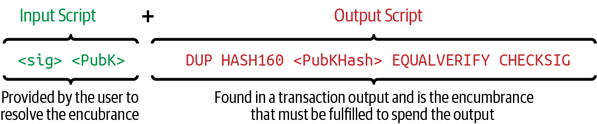
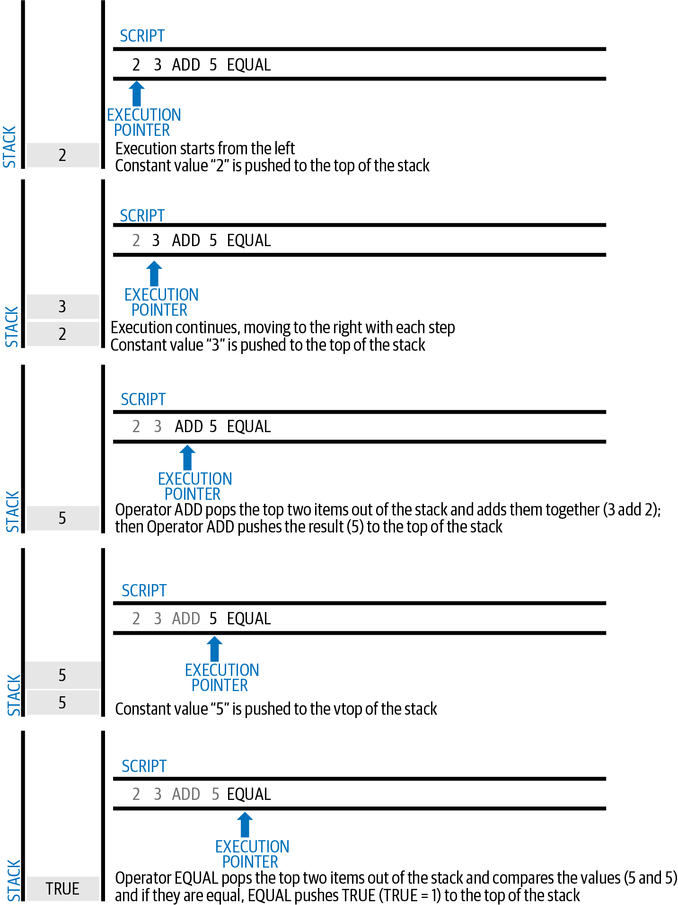
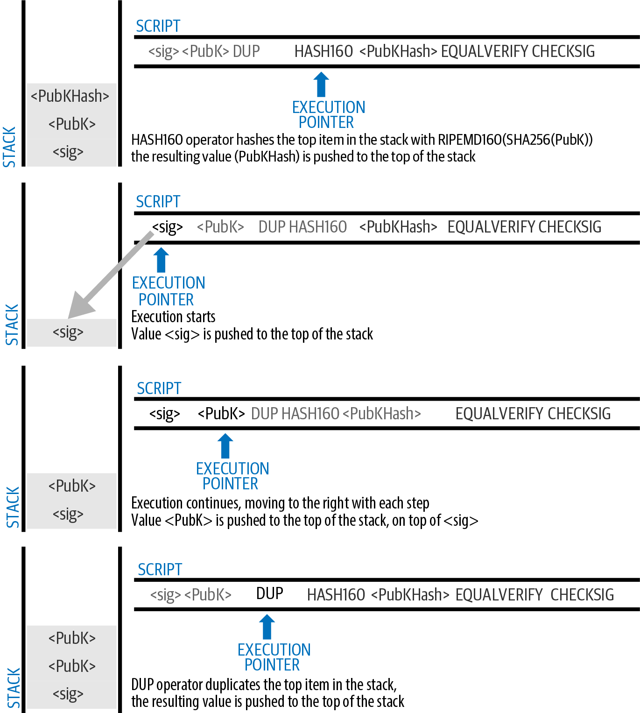
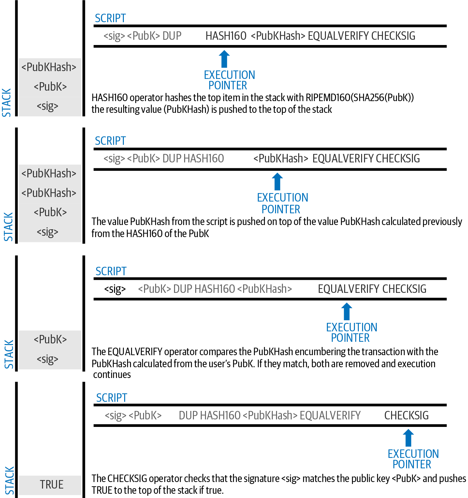
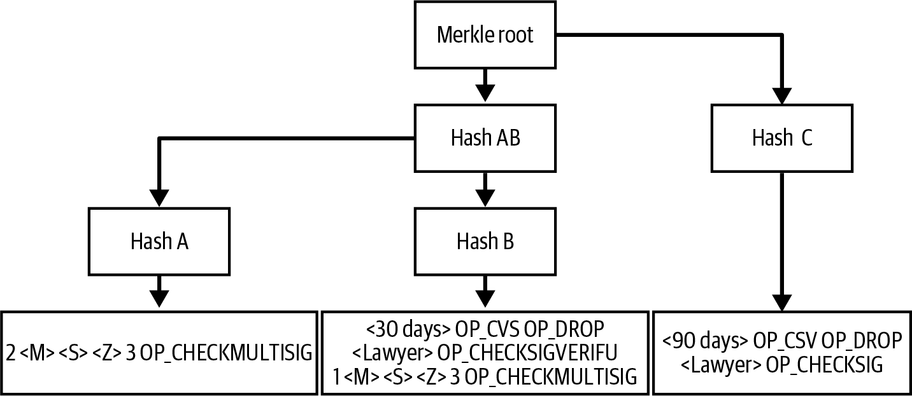
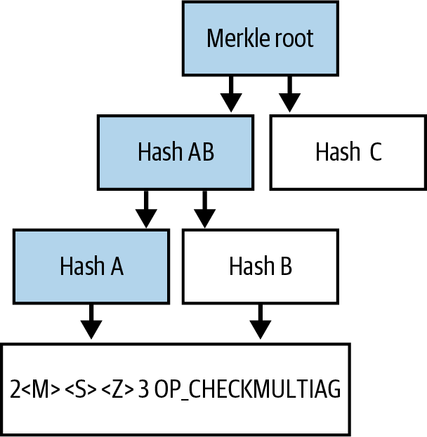
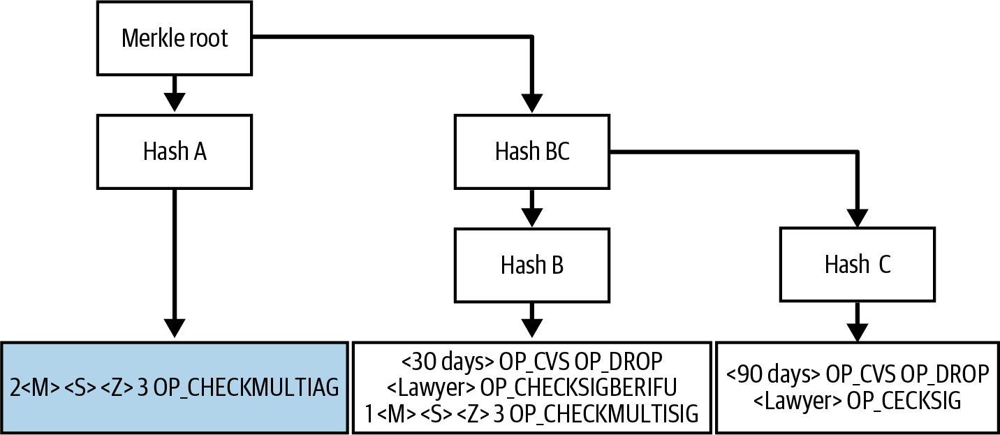
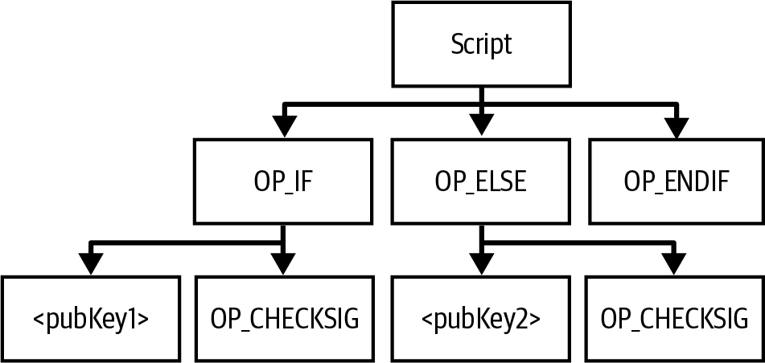
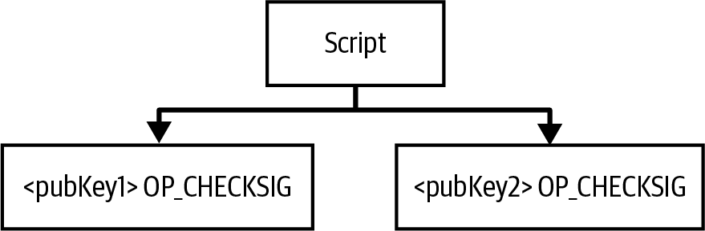

[[c_authorization_authentication]]
== Authorization and Authentication

When you receive bitcoins, you have to decide who will have permission
to spend them, ((("authorization")))((("authentication")))called _authorization_.  You also have to decide how full
nodes will distinguish the authorized spenders from everyone else,
called _authentication_.  Your authorization instructions and the
spender proof of authentication will be checked by thousands of
independent full nodes, which all need to come to the same conclusion
that a spend was authorized and authenticated in order for the transaction
containing it to be valid.

The original description of Bitcoin used a public key for authorization.
Alice paid Bob by putting his public key in the output of a transaction.
Authentication came from Bob in the form of a signature that committed to a
spending transaction, such as from Bob to Carol.

The actual version of Bitcoin that was originally released provided a
more flexible mechanism for both authorization and authentication.
Improvements since then have only increased that flexibility.  In this
chapter, we'll explore those features and see how they're most commonly
used.

[[tx_script]]
=== Transaction Scripts and Script Language

The((("transaction scripts", see="scripts")))((("Script programming language"))) original version of Bitcoin introduced a new
programming language called _Script_, a Forth-like stack-based
language.  Both the script placed in an output and the legacy
input script used in a spending transaction are written in this scripting
language.

Script is a very simple language.  It requires minimal processing and
cannot easily do many of the fancy things modern programming languages
can do.

When legacy transactions were the
most commonly used type of transaction, the majority of transactions processed
through the Bitcoin network had the form "Payment to Bob's Bitcoin
address" and used a script called a pay to public key hash (P2PKH) script.
However, Bitcoin transactions are not limited to the "Payment to Bob's
Bitcoin address" script. In fact, scripts can be written to express a
vast variety of complex conditions. In order to understand these more
complex scripts, we must first understand the basics of transaction
scripts and Script language.

In this section, we will demonstrate the basic components of the Bitcoin
transaction scripting language and show how it can be used to express
conditions for spending and how those conditions can be satisfied.

[TIP]
====
Bitcoin transaction validation((("transactions", "validating")))((("validating", "transactions"))) is not based on
a static pattern but instead is achieved through the execution of a
scripting language. This language allows for a nearly infinite variety
of conditions to be expressed.
====

==== Turing Incompleteness

The ((("scripts", "Turing incompleteness")))((("Turing Complete")))Bitcoin transaction script language
contains many operators, but is deliberately limited in one important
way--there are no loops or complex flow control capabilities other than
conditional flow control. This ensures that the language is not _Turing
Complete_, meaning that scripts have limited complexity and predictable
execution times. Script is not a general-purpose language.
These
limitations ensure that the language cannot be used to create an
infinite loop or other form of "logic bomb" that could be embedded in a
transaction in a way that causes a denial-of-service attack against the
Bitcoin network. Remember, every transaction is validated by every full
node on the Bitcoin network. A limited language prevents the transaction
validation mechanism from being used as a vulnerability.

==== Stateless Verification

The ((("scripts", "stateless verification")))((("stateless script verification")))((("verifying", "scripts")))Bitcoin transaction script language is
stateless, in that there is no state prior to execution of the script
or state saved after execution of the script. All the
information needed to execute a script is contained within the script
and the transaction executing the script.  A
script will predictably execute the same way on any system. If your
system verified a script, you can be sure that every other system in the
Bitcoin network will also verify the script, meaning that a valid
transaction is valid for everyone and everyone knows this. This
predictability of outcomes is an essential benefit of the Bitcoin
system.

[[tx_lock_unlock]]
==== Script Construction

Bitcoin's ((("scripts", "input/output", "constructing", id="script-input-output-construct")))((("input scripts", "constructing", id="input-script-construct")))((("output scripts", "constructing", id="output-script-construct")))legacy transaction validation engine relies on two parts of scripts
to validate transactions: an output script and an input script.

An output script
specifies the conditions that must be met to spend the output in the
future, such as who is authorized to spend the output and how they will
be authenticated.

An input script is a script that satisfies the
conditions placed in an output script and allows the output
to be spent. Input scripts are part of every transaction input. Most
of the time in legacy transactions they contain a digital signature produced by the user's
wallet from his or her private key, but not all input scripts
must contain signatures.

Every Bitcoin((("transactions", "validating")))((("validating", "transactions"))) validating node will validate transactions by executing
the output and input scripts.  As we saw in
<<c_transactions>>, each input contains an outpoint that refers to a
previous transaction output.  The input also contains an input script.  The
validation software will copy the input script, retrieve the UTXO
referenced by the input, and copy the output script from that UTXO. The
input and output scripts are then executed together. The input is
valid if the input script satisfies the output script's conditions
(see <<script_exec>>). All the inputs are validated independently as
part of the overall validation of the transaction.

Note that the preceding steps involve making copies of all data.  The
original data in the previous output and current input is never changed.
In particular, the previous output is invariable and unaffected by
failed attempts to spend it.  Only a valid transaction that correctly
satisfies the conditions of the output script results in the output being
considered as "spent."

<<input_and_output_scripts_legacy>> is an example of the output and
input scripts for the most common type of legacy Bitcoin transaction (a
payment to a public key hash), showing the combined script resulting
from the concatenation of the scripts prior to
validation.

[[input_and_output_scripts_legacy]]
.Combining input and output scripts to evaluate a transaction script.

===== The script execution stack

Bitcoin's ((("scripts", "stack", id="script-stack")))((("stack", id="stack")))scripting language is called a stack-based language because it
uses a data structure called a _stack_. A stack is a very simple data
structure that can be visualized as a stack of cards. A stack has two
base operations: push and pop. Push adds an item on top of the stack. Pop
removes the top item from the stack.

The scripting language executes the script by processing each item from
left to right. Numbers (data constants) are pushed onto the stack.
Operators push or pop one or more parameters from the stack, act on
them, and might push a result onto the stack. For example, +OP_ADD+ will
pop two items from the stack, add them, and push the resulting sum onto
the stack.

Conditional operators evaluate a condition, producing a boolean result
of +TRUE+ or +FALSE+. For example, +OP_EQUAL+ pops two items from the stack
and pushes +TRUE+ (+TRUE+ is represented by the number 1) if they are equal
or +FALSE+ (represented by 0) if they are not equal. Bitcoin
transaction scripts usually contain a conditional operator so that they
can produce the +TRUE+ result that signifies a valid ((("scripts", "stack", startref="script-stack")))((("stack", startref="stack")))transaction.

===== A simple script

Now let's ((("scripts", "input/output", "examples of", id="script-input-output-example")))((("input scripts", "examples of", id="input-script-example")))((("output scripts", "examples of", id="output-script-example")))apply what we've learned about scripts and stacks to some simple examples.

As we will see in <<simplemath_script>>, the script +2 3 OP_ADD 5 OP_EQUAL+
demonstrates the arithmetic addition operator +OP_ADD+, adding two
numbers and putting the result on the stack, followed by the conditional
operator +OP_EQUAL+, which checks that the resulting sum is equal to
+5+. For brevity, the +OP_+ prefix may sometimes be omitted in examples
in this book. For more details on the available script operators and
functions, see https://oreil.ly/21vH9[Bitcoin Wiki's script
page].

Although most legacy output scripts refer to a public key hash (essentially, a
legacy Bitcoin address), thereby requiring proof of ownership to spend the
funds, the script does not have to be that complex. Any combination of
output and input scripts that results in a +TRUE+ value is valid. The
simple arithmetic we used as an example of the scripting language is
also a valid script.

Use part of the arithmetic example script as the output script:

----
3 OP_ADD 5 OP_EQUAL
----

which can be satisfied by a transaction containing an input with the
input script:

----
2
----

The validation software combines the scripts:

----
2 3 OP_ADD 5 OP_EQUAL
----

As we see in <<simplemath_script>>, when
this script is executed, the result is +OP_TRUE+, making the transaction valid.  Although this is a valid transaction
output script, note that the resulting UTXO can be spent by anyone with
the arithmetic skills
to know that the number 2 satisfies the script.

[[simplemath_script]]
.Bitcoin's script validation doing simple math.

[TIP]
====
Transactions are valid if the
top result on the stack is +TRUE+, which is any
nonzero value.
Transactions are invalid if the top value on the stack is +FALSE+ (the
value zero or an empty stack), the script
execution is halted explicitly by an operator (such as +VERIFY+,
+OP_RETURN+), or the script was not semantically valid (such as
containing an +OP_IF+ statement that was not terminated by an +OP_ENDIF+
opcode).  For details, see https://oreil.ly/J2DXt[Bitcoin
Wiki's script page].
====

The following is a slightly more complex script, which calculates
2 + 7 – 3 + 1. Notice that when the script contains several operators in
a row, the stack allows the results of one operator to be acted upon by
the next operator:

----
2 7 OP_ADD 3 OP_SUB 1 OP_ADD 7 OP_EQUAL
----

Try validating the preceding script yourself using pencil and paper.
When the script execution ends, you should be left with a +TRUE+ value
on the ((("scripts", "input/output", "examples of", startref="script-input-output-example")))((("input scripts", "examples of", startref="input-script-example")))((("output scripts", "examples of", startref="output-script-example")))stack.

[[script_exec]]
===== Separate execution of output and input scripts

In the ((("scripts", "input/output", "separate execution")))((("input scripts", "separate execution from output scripts")))((("output scripts", "separate execution from input scripts")))original Bitcoin
client, output and input scripts were concatenated and executed
in sequence. For security reasons, this was changed in 2010 because of
a vulnerability known as the +1 OP_RETURN+ bug.  In the current
implementation, the scripts are executed separately with the stack
transferred between the two executions.

First, the input script is executed using the stack execution
engine. If the input script is executed without errors and has
no operations left over, the stack is copied and the
output script is executed. If the result of executing the output script
with the stack data copied from the input script is +TRUE+,
the input script has succeeded in resolving the conditions imposed
by the output script and, therefore, the input is a valid authorization
to spend the UTXO. If any result other than +TRUE+ remains after
execution of the combined script, the input is invalid because it has
failed to satisfy the spending conditions placed on the output.

//SOMEDAY:implications of not being able to use script in input script

[[p2pkh]]
==== Pay to Public Key Hash

A ((("P2PKH (pay to public key hash)")))((("addresses", "P2PKH (pay to public key hash)")))((("scripts", "P2PKH (pay to public key hash)")))pay to public key hash (P2PKH) script uses an output script that
contains a hash that commits to a public key.  P2PKH is best known as
the basis for a legacy Bitcoin address. A P2PKH output can be spent by
presenting a public key that matches the hash commitment and a digital
signature created by the corresponding private key (see
<<c_signatures>>).  Let's look at an example of a P2PKH output script:

----
OP_DUP OP_HASH160 <Key Hash> OP_EQUALVERIFY OP_CHECKSIG
----

[role="less_space pagebreak-before"]
The +Key Hash+ is the data that would be encoded into a legacy base58check
address.  Most applications would show the _public key hash_ in a script
using hexadecimal encoding and not the familiar Bitcoin
address base58check format that begins with [.keep-together]#a "1."#

The preceding output script can be satisfied with an input script
of the form:

----
<Signature> <Public Key>
----

The two scripts together would form the following combined validation
script:

----
<Sig> <Pubkey> OP_DUP OP_HASH160 <Hash> OP_EQUALVERIFY OP_CHECKSIG
----

The result will be +TRUE+ if the input script
has a valid signature from Bob's private key that corresponds to
the public key hash set as an encumbrance.

Figures pass:[<a data-type="xref" href="#P2PubKHash1"
data-xrefstyle="select: labelnumber">#P2PubKHash1</a>] and pass:[<a
data-type="xref" href="#P2PubKHash2" data-xrefstyle="select:
labelnumber">#P2PubKHash2</a>] show (in two parts) a step-by-step
execution of the combined script, which will prove this is a valid
transaction.

[[P2PubKHash1]]
.Evaluating a script for a P2PKH transaction (part 1 of 2).

[[P2PubKHash2]]
.Evaluating a script for a P2PKH transaction (part 2 of 2).

[[multisig]]
=== Scripted Multisignatures

Multisignature scripts((("scripted multisignatures", id="script-multisignature")))((("multisignature scripts", id="multi-script"))) set a condition where _k_ public keys
are recorded in the script and at least _t_ of those must provide
signatures to spend the funds, called _t_-of-_k_.
For example, a 2-of-3 multisignature is one
where three public keys are listed as potential signers and at least two
of those must be used to create signatures for a valid transaction to
spend the funds.

[TIP]
====
Some Bitcoin documentation, including earlier editions of this book,
uses the term "m-of-n" for a traditional multisignature.  However, it's hard
to tell "m" and "n" apart when they're spoken, so we use the alternative
_t_-of-_k_.  Both phrases refer to the same type of signature scheme.
====

The general form of an output script setting a _t_-of-_k_ multisignature
condition is:

----
t <Public Key 1> <Public Key 2> ... <Public Key k> k OP_CHECKMULTISIG
----

where _k_ is the total number of listed public keys and _t_ is the threshold
of required signatures to spend the output.

An output script setting a 2-of-3 multisignature condition looks like
this:

----
2 <Public Key A> <Public Key B> <Public Key C> 3 OP_CHECKMULTISIG
----

The preceding output script can be satisfied with an input script
containing [.keep-together]#signatures:#

----
<Signature B> <Signature C>
----

or any combination of two signatures from the private keys corresponding
to the three listed public keys.

The two scripts together would form the combined validation script:

----
<Sig B> <Sig C> 2 <Pubkey A> <Pubkey B> <Pubkey C> 3 OP_CHECKMULTISIG
----

When executed, this combined script will evaluate to +TRUE+ if
the input script has
two valid signatures from private keys that correspond to two of
the three public keys set as an encumbrance.

At this time, Bitcoin Core's transaction relay policy limits multisignature output scripts to, at most, three
listed public keys, meaning you can do anything from a 1-of-1 to a
3-of-3 multisignature or any combination within that range.
You may want to check the +IsStandard()+ function to see what is currently
accepted by the network. Note that the limit of three keys applies only to
standard (also known as "bare") multisignature scripts, not to
scripts wrapped in another structure like P2SH, P2WSH, or P2TR.
P2SH multisignature scripts are limited by both policy and consensus to
15 keys, allowing for up to a 15-of-15 multisignature. We will learn about
P2SH in <<p2sh>>.   All other scripts are consensus limited to 20 keys
per +OP_CHECKMULTISIG+ or +OP_CHECKMULTISIGVERIFY+ opcode, although one
script may include multiple of those opcodes.

[role="less_space pagebreak-before"]
[[multisig_bug]]
==== An Oddity in CHECKMULTISIG Execution

There ((("OP_CHECKMULTISIG execution", id="op-checkmultisig")))is an oddity in
++OP_CHECKMULTISIG++'s execution that requires a slight workaround. When
+OP_CHECKMULTISIG+ executes, it should consume _t_ + _k_ + 2 items on the stack as
parameters. However, due to the oddity, +OP_CHECKMULTISIG+ will pop an extra
value or one value more than expected.

Let's look at this in greater detail using the previous validation
example:

----
<Sig B> <Sig C> 2 <Pubkey A> <Pubkey B> <Pubkey C> 3 OP_CHECKMULTISIG
----

First, +OP_CHECKMULTISIG+ pops the top item, which is _k_ (in this example
"3"). Then it pops _k_ items, which are the public keys that can sign;
in this example, public keys A, B, and C. Then, it pops one item, which
is _t_, the quorum (how many signatures are needed). Here _t_ = 2. At this
point, +OP_CHECKMULTISIG+ should pop the final _t_ items, which are the
signatures, and see if they are valid. However, unfortunately, an oddity in
the implementation causes +OP_CHECKMULTISIG+ to pop one more item (_t_ + 1
total) than it should. The extra item is called((("dummy stack element"))) the _dummy stack
element_, and it is disregarded when checking the
signatures so it has no direct effect on +OP_CHECKMULTISIG+ itself.
However, the dummy element must be present because, if it isn't present
when +OP_CHECKMULTISIG+ attempts to pop on an empty stack, it will cause a
stack error and script failure (marking the transaction as invalid).
Because the dummy element is disregarded, it can be anything. It became the custom early on to use +OP_0+, which later became a
relay policy rule and eventually a consensus rule (with the enforcement of BIP147).

Because popping the dummy element is part of the consensus rules, it must now be
replicated forever. Therefore a script should look
like this:

----
OP_0 <Sig B> <Sig C> 2 <Pubkey A> <Pubkey B> <Pubkey C> 3 OP_CHECKMULTISIG
----

Thus the input script actually used in multisig is not:

----
<Signature B> <Signature C>
----

but instead it is:

----
OP_0 <Sig B> <Sig C>
----

Some people believe this oddity was a bug in the original code for
Bitcoin, but a plausible alternative explanation exists.  Verifying
_t_-of-_k_ signatures can require many more than _t_ or _k_ signature checking
operations.  Let's consider a simple example of 1-in-5, with the
following combined script:

----
<dummy> <Sig4> 1 <key0> <key1> <key2> <key3> <key4> 5 OP_CHECKMULTISIG
----

The signature is checked first against +key0+, then +key1+, and then
the other keys before it is finally compared to its corresponding
+key4+.  That means five signature checking operations need to be
performed even though there's only one signature.  One way to eliminate
this redundancy would have been to provide +OP_CHECKMULTISIG+ a map
indicating which provided signature corresponds to which public key,
allowing the +OP_CHECKMULTISIG+ operation to only perform exactly _t_
signature-checking operations.  It's possible that Bitcoin's original
developer added the extra element (which we now call the dummy stack
element) in the original version of Bitcoin so they could add the
feature for allowing a map to be passed in a later soft fork.  However,
that feature was never implemented, and the BIP147 update to the
consensus rules in 2017 makes it impossible to add that feature in the
future.

Only Bitcoin's original developer could tell us whether the dummy stack
element was the result of a bug or a plan for a future upgrade.  In this
book, we simply call it an oddity.

From now on, if you see a multisig script, you should expect
to see an extra +OP_0+ in the beginning, whose only purpose is as a
workaround to an oddity in the ((("scripted multisignatures", startref="script-multisignature")))((("multisignature scripts", startref="multi-script")))((("OP_CHECKMULTISIG execution", startref="op-checkmultisig")))consensus rules.

[[p2sh]]
=== Pay to Script Hash

Pay to script hash (P2SH) was((("scripts", "P2SH (pay to script hash)", id="script-p2sh")))((("addresses", "P2SH (pay to script hash)", id="address-p2sh-ch7")))((("P2SH (pay to script hash)", id="p2sh-ch7")))
introduced in 2012 as a powerful new type of operation that greatly
simplifies the use of complex scripts. To explain the need
for P2SH, let's look at a practical example.

Mohammed is an electronics importer based in Dubai. Mohammed's
company uses Bitcoin's multisignature feature extensively for its
corporate accounts. Multisignature scripts are one of the most common
uses of Bitcoin's advanced scripting capabilities and are a very
powerful feature. Mohammed's company
uses a multisignature script for all customer payments.
Any payments made by customers are locked in such
a way that they require at least two signatures to release.  Mohammed,
his three partners, and their attorney can each provide one signature.
A multisignature scheme like that offers corporate governance
controls and protects against theft, embezzlement, or loss.

The resulting script is quite long and looks like this:

----
2 <Mohammed's Public Key> <Partner1 Public Key> <Partner2 Public Key> 
<Partner3 Public Key> <Attorney Public Key> 5 OP_CHECKMULTISIG
----

Although multisignature scripts are a powerful feature, they are
cumbersome to use. Given the preceding script, Mohammed would have to
communicate this script to every customer prior to payment. Each
customer would have to use special Bitcoin wallet software with the
ability to create custom transaction scripts.
Furthermore, the resulting transaction would be about five times larger
than a simple payment transaction, because this script contains very
long public keys. The burden of that extra data would be
borne by the customer in the form of extra transaction fees. Finally, a large transaction
script like this would be carried in the UTXO set in every full
node, until it was spent. All of these issues make using complex output scripts
difficult in practice.

P2SH was developed to resolve these practical difficulties and to make
the use of complex scripts as easy as a payment to a single-key Bitcoin address.
With P2SH payments, the complex script is replaced with a
commitment, the digest of a cryptographic hash. When a transaction attempting
to spend the UTXO is presented later, it must contain the script that
matches the commitment in addition to the data that satisfies the script. In simple terms,
P2SH means "pay to a script matching this hash, a script that will be
presented later when this output is spent."

In P2SH
transactions, the script that is replaced by a hash is ((("redeem scripts")))referred
to as the _redeem script_ because it is presented to the system at
redemption time rather than as an output script. <<without_p2sh>> shows
the script without P2SH and <<with_p2sh>> shows the same script encoded
with P2SH.

++++
<table id="without_p2sh">
<caption>Complex script without P2SH</caption>
<tbody>
<tr>
<td>
Output script
</td>
<td>
2 PubKey1 PubKey2 PubKey3 PubKey4 PubKey5 5 OP_CHECKMULTISIG
</td>
</tr>
<tr>
<td>
Input script
</td>
<td>
Sig1 Sig2
</td>
</tr>
</tbody>
</table>
<table id="with_p2sh">
<caption>Complex script as P2SH</caption>
<tbody>
<tr>
<td>
Redeem script
</td>
<td>
2 PubKey1 PubKey2 PubKey3 PubKey4 PubKey5 5 OP_CHECKMULTISIG
</td>
</tr>
<tr>
<td>
Output script
</td>
<td>
OP_HASH160 &lt;20-byte hash of redeem script&gt; OP_EQUAL
</td>
</tr>
<tr>
<td>
Input script
</td>
<td>
Sig1 Sig2 &lt;redeem script&gt;
</td>
</tr>
</tbody>
</table>
++++

As you can see from the tables, with P2SH, the complex script that
details the conditions for spending the output (redeem script) is not
presented in the output script. Instead, only a hash of it is in the
output script, and the redeem script itself is presented later as part
of the input script when the output is spent. This shifts the burden
in fees and complexity from the spender to the receiver of the
transaction.

Let's look at Mohammed's company, the complex multisignature script, and
the resulting P2SH scripts.

First, the multisignature script that Mohammed's company uses for all
incoming payments from customers:

----
2 <Mohammed's Public Key> <Partner1 Public Key> <Partner2 Public Key> 
<Partner3 Public Key> <Attorney Public Key> 5 OP_CHECKMULTISIG
----

This entire script can instead be represented by a 20-byte cryptographic
hash by first applying the SHA256 hashing algorithm and then applying
the RIPEMD-160 algorithm on the result.  For example, starting with the
hash of Mohammed's redeem script:

----
54c557e07dde5bb6cb791c7a540e0a4796f5e97e
----

A P2SH transaction locks the output to this hash instead of the longer
redeem script, using a special output script template:

----
OP_HASH160 54c557e07dde5bb6cb791c7a540e0a4796f5e97e OP_EQUAL
----

which, as you can see, is much shorter. Instead of "pay to this 5-key
multisignature script," the P2SH equivalent transaction is "pay to a
script with this hash." A customer making a payment to Mohammed's
company need only include this much shorter output script in his
payment. When Mohammed and his partners want to spend this UTXO, they
must present the original redeem script (the one whose hash locked the
UTXO) and the signatures necessary to unlock it, like this:

----
<Sig1> <Sig2> <2 PK1 PK2 PK3 PK4 PK5 5 OP_CHECKMULTISIG>
----

The two scripts are combined in two stages. First, the redeem script is
checked against the output script to make sure the hash matches:

----
<2 PK1 PK2 PK3 PK4 PK5 5 OP_CHECKMULTISIG> OP_HASH160 <script hash> OP_EQUAL
----

If the redeem script hash matches, the redeem script is executed:

----
<Sig1> <Sig2> 2 <PK1> <PK2> <PK3> <PK4> <PK5> 5 OP_CHECKMULTISIG
----

==== P2SH Addresses

Another
important part of the P2SH feature is the ability to encode a script
hash as an address, as defined in BIP13. P2SH addresses are base58check
encodings of the 20-byte hash of a script, just like Bitcoin addresses
are base58check encodings of the 20-byte hash of a public key. P2SH
addresses use the version prefix "5," which results in
base58check-encoded addresses that start with a "3."

For example, Mohammed's complex script, hashed and base58check-encoded
as a P2SH address, becomes +39RF6JqABiHdYHkfChV6USGMe6Nsr66Gzw+.

Now, Mohammed can give this "address" to his customers, and they can use
almost any Bitcoin wallet to make a simple payment, like any other
Bitcoin address. The 3 prefix gives them a hint that this is a special
type of address, one corresponding to a script instead of a public key,
but otherwise it works in exactly the same way as a payment to any other Bitcoin
address.

P2SH addresses hide all of the complexity so the person making a
payment does not see the script.

==== Benefits of P2SH

The P2SH feature
offers the following benefits compared to the direct use of complex
scripts in outputs:

- The similarity to original legacy addresses means the sender and the sender's
  wallet don't need complex engineering to implement P2SH.

- P2SH shifts the burden in data storage for the long script from the
  output (which additionally to being stored on the blockchain is in the
  UTXO set) to the input (only stored on the blockchain).

- P2SH shifts the burden in data storage for the long script from the
  present time (payment) to a future time (when it is spent).

- P2SH shifts the transaction fee cost of a long script from the sender
  to the recipient, who has to include the long redeem script to spend
  it.

==== Redeem Script and Validation

You are((("redeem scripts", "validating")))((("validating", "redeem scripts"))) not able to put a P2SH inside a P2SH redeem script because the
P2SH specification is not recursive. Also, while it is technically
possible to include +OP_RETURN+ (see <<op_return>>) in a redeem script, as
nothing in the rules prevents you from doing so, it is of no practical
use because executing +OP_RETURN+ during validation will cause the
transaction to be marked invalid.

Note that because the redeem script is not presented to the network
until you attempt to spend a P2SH output, if you create an output with the
hash of an invalid redeem script, you will not be able to spend
it.  The spending transaction, which includes the redeem script,
will not be accepted because it is an invalid script. This creates a
risk because you can send bitcoin to a P2SH address that cannot be spent later.

[WARNING]
====
P2SH output scripts
contain the hash of a redeem script, which gives no clues as to
the content of the redeem script. The P2SH output will be
considered valid and accepted even if the redeem script is invalid. You
might accidentally receive bitcoin in such a way that it cannot later((("scripts", "P2SH (pay to script hash)", startref="script-p2sh")))((("P2SH (pay to script hash)", startref="p2sh-ch7")))((("addresses", "P2SH (pay to script hash)", startref="address-p2sh-ch7"))) be
spent.
====

[[op_return]]
=== Data Recording Output (OP_RETURN)

Bitcoin's
distributed ((("scripts", "OP_RETURN", id="script-op-return")))((("OP_RETURN scripts", id="op-return")))((("nonpayment data", id="nonpayment-data")))((("blockchain", "nonpayment data in", id="blockchain-nonpayment")))((("output scripts", "OP_RETURN", id="output-script-op-return")))and timestamped blockchain has potential uses
beyond payments. Many developers have tried to use the transaction
scripting language to take advantage of the security and resilience of
the system for applications such as digital notary services.
Early attempts to use Bitcoin's
script language for these purposes involved creating transaction outputs
that recorded data on the blockchain; for example, to record a commitment
to a file in such a way that anyone could establish
proof-of-existence of that file on a specific date by reference to that
transaction.

[role="less_space pagebreak-before"]
The use of Bitcoin's blockchain to store data
unrelated to Bitcoin payments is a controversial subject. Many
people consider such use abusive and want to discourage it. Others
view it as a demonstration of the powerful capabilities of blockchain
technology and want to encourage such experimentation. Those who object
to the inclusion of nonpayment data argue that it
burdens those running full Bitcoin nodes with carrying the
cost of disk storage for data that the blockchain was not intended to
carry. Moreover, such transactions may create UTXOs that cannot be spent,
using a legacy Bitcoin address as a freeform 20-byte field.
Because the address is used for data, it doesn't correspond to a private
key and the resulting UTXO can _never_ be spent; it's a fake payment.
These transactions that can never be spent are therefore never removed
from the UTXO set and cause the size of the UTXO database to forever
increase, or "bloat."

A compromise was reached
that allows an output script starting with +OP_RETURN+ to
add nonpayment data to a transaction output. However, unlike
the use of "fake" UTXOs, the +OP_RETURN+ operator creates an explicitly
_provably unspendable_ output, which does not need to be stored in the
UTXO set. +OP_RETURN+ outputs are recorded on the blockchain, so they
consume disk space and contribute to the increase in the blockchain's
size, but they are not stored in the UTXO set and therefore do not bloat
full nodes with the cost of more
expensive database operations.

+OP_RETURN+ scripts look like this:

----
OP_RETURN <data>
----

The data portion
often represents a hash, such as the output
from the SHA256 algorithm (32 bytes). Some applications put a prefix in
front of the data to help identify the application. For example, the
https://proofofexistence.com[Proof of Existence] digital notarization
service uses the 8-byte prefix +DOCPROOF+, which is ASCII encoded as +44
4f 43 50 52 4f 4f 46+ in hexadecimal.

Keep in mind that there is no input script that corresponds to
+OP_RETURN+ that could possibly be used to "spend" an +OP_RETURN+ output. The
whole point of an +OP_RETURN+ output is that you can't spend the money locked in that
output, and therefore it does not need to be held in the UTXO set as
potentially spendable: +OP_RETURN+ outputs are _provably unspendable_. +OP_RETURN+ outputs
usually have a zero amount because any bitcoins
assigned to such an output are effectively lost forever. If an +OP_RETURN+ output is
referenced as an input in a transaction, the script validation engine
will halt the execution of the validation script and mark the
transaction as invalid. The execution of +OP_RETURN+ essentially causes the
script to "RETURN" with a +FALSE+ and halt. Thus, if you accidentally
reference an +OP_RETURN+ output as an input in a transaction, that
transaction((("scripts", "OP_RETURN", startref="script-op-return")))((("OP_RETURN scripts", startref="op-return")))((("nonpayment data", startref="nonpayment-data")))((("blockchain", "nonpayment data in", startref="blockchain-nonpayment")))((("output scripts", "OP_RETURN", startref="output-script-op-return"))) is invalid.

[[lock_time_limitations]]
==== Transaction Lock Time Limitations

Use of the ((("transactions", "timelocks", "limitations of")))((("timelocks", "limitations of")))((("lock time", "limitations of")))((("scripts", "timelocks", "limitations of")))lock time allows a spender to restrict a transaction from
being included in a block until a specific block height, but it does not
prevent spending the funds in another transaction earlier than that.
Let's explain that with the following example.

Alice signs a transaction spending one of her outputs to Bob's address and sets the transaction lock time to 3 months in the future. Alice sends that transaction to Bob to hold. With this transaction Alice and Bob know that:

* Bob cannot transmit the transaction to redeem the funds until 3 months have elapsed.
* Bob may transmit the transaction after 3 months.

However:

* Alice can create a conflicting transaction, spending the same inputs without a lock time. Thus, Alice can spend the same UTXO before the 3 months have elapsed.
* Bob has no guarantee that Alice won't do that.

It is important to understand the limitations of transaction lock time. The only guarantee is that Bob will not be able to redeem the presigned transaction before 3 months have elapsed. There is no guarantee that Bob will get the funds. One way to guarantee that Bob will receive the funds but cannot spend them until 3 months have elapsed is to place the timelock restriction on the UTXO itself as part of the script, rather than on the transaction. This is achieved by the next form of timelock, called Check Lock Time Verify.

==== Check Lock Time Verify (OP_CLTV)

In ((("transactions", "timelocks", "verifying", id="transaction-timelock-op-cltv")))((("timelocks", "verifying", id="timelock-op-cltv")))((("lock time", "verifying", id="lock-time-op-cltv")))((("OP_CLTV  script operator", id="op-cltv")))((("verifying", "lock time", id="verify-lock-time")))((("scripts", "timelocks", "verifying", id="script-timelock-verify")))December 2015, a new form of
timelock was introduced to Bitcoin as a soft fork upgrade. Based on a
specification in BIP65, a new script operator called
+OP_CHECKLOCKTIMEVERIFY+ (+OP_CLTV+) was added to the scripting language.
+OP_CLTV+ is a per-output timelock rather than a per-transaction timelock,
as is the case with lock time. This allows for additional
flexibility in the way timelocks are applied.

In simple terms, by committing to the +OP_CLTV+ opcode in an
output, that output is restricted so that it can only be spent after the
specified time has elapsed.

+OP_CLTV+ doesn't replace lock time, but rather restricts specific UTXOs
such that they can only be spent in a future transaction with
lock time set to a greater or equal value.

[role="less_space pagebreak-before"]
The +OP_CLTV+ opcode takes one parameter as input, expressed as a number in
the same format as lock time (either a block height or Unix epoch
time). As indicated by the +VERIFY+ suffix, +OP_CLTV+ is the type of opcode
that halts execution of the script if the outcome is +FALSE+. If it
results in +TRUE+, execution continues.

In order to use +OP_CLTV+, you insert it into the redeem script of the
output in the transaction that creates the output. For
example, if Alice is paying Bob, he might usually accept payment to 
the following P2SH script:

----
<Bob's public key> OP_CHECKSIG
----

To lock it to a time, say 3 months from now, his P2SH script would
instead be:

----
<Bob's pubkey> OP_CHECKSIGVERIFY <now + 3 months> OP_CHECKLOCKTIMEVERIFY
----

where +<now {plus} 3 months>+ is a block height or time value estimated
3 months from the time the transaction is mined: current block height
{plus} 12,960 (blocks) or current Unix epoch time {plus} 7,760,000
(seconds).

When Bob tries to spend this UTXO, he constructs a transaction that
references the UTXO as an input. He uses his signature and public key in
the input script of that input and sets the transaction lock time
to be equal or greater to the timelock in the +OP_CHECKLOCKTIMEVERIFY+
Alice set. Bob then broadcasts the transaction on the Bitcoin network.

Bob's transaction is evaluated as follows. If the +OP_CHECKLOCKTIMEVERIFY+
parameter Alice set is less than or equal to the spending transaction's
lock time, script execution continues (acts as if a _no
operation_ or +OP_NOP+ opcode was executed). Otherwise, script
execution halts and the transaction is deemed invalid.

More precisely, BIP65 explains that +OP_CHECKLOCKTIMEVERIFY+ fails and
halts execution if one of the following occurs:

* The stack is empty.
* The top item on the stack is less than 0.
* The lock-time type (height versus timestamp) of the top stack item and the lock time field are not the same.
* The top stack item is greater than the transaction's lock time field.
* The sequence field of the input is 0xffffffff.

[role="less_space pagebreak-before"]
[[timelock_conflicts]]
.Timelock Conflicts
****
+OP_CLTV+ and ((("transactions", "timelocks", "conflicts")))((("timelocks", "conflicts")))((("lock time", "conflicts")))((("scripts", "timelocks", "conflicts")))lock time use the same format to describe timelocks, either
a block height or the time elapsed in seconds since the Unix epoch.
Critically, when used together, the format of lock time must match
that of +OP_CLTV+ in the outputs--they must both reference either
block height or time in seconds.

This implies that a script can never be valid if it must execute
two different calls to +OP_CLTV+, one that uses a height and one that
uses a time.  It can be easy to make this mistake when writing advanced
scripts, so be sure to thoroughly test your scripts on a test network or
use a tool designed to prevent this issue, like a Miniscript compiler.

An additional implication is that only one variety of +OP_CLTV+ can be
used in any of the scripts of a transaction.  If the script for one
input uses the height variety and a different script for a different
input uses the time variety, there is no way to construct a valid transaction
that spends both inputs.
****

After execution, if +OP_CLTV+ is satisfied, the parameter that
preceded it remains as the top item on the stack and may need to be
dropped, with +OP_DROP+, for correct execution of subsequent script
opcodes. You will often see +OP_CHECKLOCKTIMEVERIFY+ followed by +OP_DROP+ in
scripts for this reason.  +OP_CLTV+, like +OP_CSV+ (see <<op_csv>>)
are unlike other +CHECKVERIFY+ opcodes in leaving items on the stack
because the soft forks that added them redefined existing opcodes that
did not drop stack items, and the behavior of those previous
no-operation (NOP) opcodes must be preserved.

By using lock time in conjunction with +OP_CLTV+, the scenario described in
<<lock_time_limitations>> changes.  Alice sends her transaction
immediately, assigning the funds to Bob’s key. Alice can no longer spend
the money, but Bob cannot spend it before the 3-month lock time has
expired.

By introducing timelock functionality directly into the scripting
language, +OP_CLTV+ allows us to develop some very interesting complex
scripts.

The standard((("transactions", "timelocks", "verifying", startref="transaction-timelock-op-cltv")))((("timelocks", "verifying", startref="timelock-op-cltv")))((("lock time", "verifying", startref="lock-time-op-cltv")))((("OP_CLTV  script operator", startref="op-cltv")))((("verifying", "lock time", startref="verify-lock-time")))((("scripts", "timelocks", "verifying", startref="script-timelock-verify"))) is defined in
https://oreil.ly/YmJGD[BIP65
(OP_CHECKLOCKTIMEVERIFY)].

[[op_csv]]
==== Relative Timelocks

Lock time((("absolute timelocks")))((("transactions", "timelocks", "relative", id="transaction-timelock-relative")))((("timelocks", "relative", id="timelock-relative")))((("lock time", "relative", id="locktime-relative")))((("scripts", "timelocks", "relative", id="script-timelock-relative")))((("relative timelocks", id="relative-timelock2"))) and +OP_CLTV+ are both
_absolute timelocks_ in that they specify an absolute point in time. The
next two timelock features we will examine are _relative timelocks_ in
that they specify, as a condition of spending an output, an elapsed time
from the confirmation of the output in the blockchain.

[role="less_space pagebreak-before"]
Relative timelocks are useful because they allow
imposing a time
constraint on one transaction that is dependent on the elapsed time from
the confirmation of a previous transaction. In other words, the clock
doesn't start counting until the UTXO is recorded on the blockchain.
This functionality is especially useful in bidirectional state channels
and Lightning Networks (LNs), as we will see in <<state_channels>>.

Relative timelocks, like absolute timelocks, are implemented with both a
transaction-level feature and a script-level opcode. The
transaction-level relative timelock is implemented as a consensus rule
on the value of +sequence+, a transaction field that is set in every
transaction input. Script-level relative timelocks are implemented with
the +OP_CHECKSEQUENCEVERIFY+ (+OP_CSV+) opcode.

Relative timelocks are
implemented according to the specifications in
https://oreil.ly/ZuANb[BIP68,
Relative Lock-Time Using Consensus-Enforced Sequence Numbers] and
https://oreil.ly/dLA2r[BIP112,
OP_CHECKSEQUENCEVERIFY].

BIP68 and BIP112 were activated in May 2016 as a soft fork upgrade to
the consensus rules.

==== Relative Timelocks with OP_CSV

Just ((("OP_CSV script opcode", id="op-csv")))like +OP_CLTV+
and lock time, there is a script opcode for relative timelocks that
leverages the sequence value in scripts. That opcode is
+OP_CHECKSEQUENCEVERIFY+, commonly referred to as +OP_CSV+ for short.

The +OP_CSV+ opcode when evaluated in a UTXO's script allows
spending only in a transaction whose input sequence value is greater
than or equal to the +OP_CSV+ parameter. Essentially, this restricts
spending the UTXO until a certain number of blocks or seconds have
elapsed relative to the time the UTXO was mined.

As with CLTV, the value in +OP_CSV+ must match the format in the
corresponding sequence value. If +OP_CSV+ is specified in terms of
blocks, then so must sequence. If +OP_CSV+ is specified in terms of
seconds, then so must sequence.

[WARNING]
====
A script executing multiple +OP_CSV+ opcodes must only use the same
variety, either time-based or height-based.  Mixing varieties will
produce an invalid script that can never be spent, the same problem we
saw with +OP_CLTV+ in <<timelock_conflicts>>.  However, +OP_CSV+ allows
any two valid inputs to be included in the same transaction, so the problem
of interaction across inputs that occurs with +OP_CLTV+ doesn't affect +OP_CSV+.
====

[role="less_space pagebreak-before"]
Relative timelocks with +OP_CSV+ are especially useful when several
(chained) transactions are created and signed but not propagated--that
is, they're kept off the blockchain (_offchain_). A child transaction cannot be used until the
parent transaction has been propagated, mined, and aged by the time
specified in the relative timelock. One application of this use case is shown in <<state_channels>> and <<lightning_network>>.

+OP_CSV+ is defined((("transactions", "timelocks", "relative", startref="transaction-timelock-relative")))((("timelocks", "relative", startref="timelock-relative")))((("lock time", "relative", startref="locktime-relative")))((("scripts", "timelocks", "relative", startref="script-timelock-relative")))((("OP_CSV script opcode", startref="op-csv")))((("relative timelocks", startref="relative-timelock2"))) in detail in
https://oreil.ly/z_Obw[BIP112,
CHECKSEQUENCEVERIFY].

=== Scripts with Flow Control (Conditional Clauses)

One of((("scripts", "flow control", id="script-flow")))((("flow control in scripts", id="flow-control-script")))((("conditional clauses in scripts", id="conditional-clause-script"))) the more
powerful features of Bitcoin Script is flow control, also known as
conditional clauses. You are probably familiar with flow control in
various programming languages that use the construct +IF...THEN...ELSE+.
Bitcoin conditional clauses look a bit different but are essentially
the same construct.

At a basic level, Bitcoin conditional opcodes allow us to construct a
script that has two ways of being unlocked, depending on a
+TRUE+/+FALSE+ outcome of evaluating a logical condition. For example,
if x is +TRUE+, the executed code path is A and the +ELSE+ code path is B.

Additionally, Bitcoin conditional expressions can be "nested"
indefinitely, meaning that a conditional clause can contain another
within it, which contains another, etc. Bitcoin Script flow control can
be used to construct very complex scripts with hundreds
of possible execution paths. There is no limit to nesting, but
consensus rules impose a limit on the maximum size of a
script in bytes.

Bitcoin implements flow control using the +OP_IF+, +OP_ELSE+, +OP_ENDIF+, and
+OP_NOTIF+ opcodes. Additionally, conditional expressions can contain
boolean operators such as +OP_BOOLAND+, +OP_BOOLOR+, and +OP_NOT+.

At first glance, you may find the Bitcoin's flow control scripts
confusing. That is because Bitcoin Script is a stack language. The same
way that +1 {plus} 1+ looks "backward" when expressed as +1 1 OP_ADD+, flow
control clauses in Bitcoin also look "backward."

In most traditional (procedural) programming languages, flow control
looks like this:

.Pseudocode of flow control in most programming languages
----
if (condition):
  code to run when condition is true
else:
  code to run when condition is false
endif
code to run in either case
----

In a stack-based language like Bitcoin Script, the logical condition
comes before the +IF+, which makes it look "backward":

[role="less_space pagebreak-before"]
.Bitcoin Script flow control
----
condition
IF
  code to run when condition is true
OP_ELSE
  code to run when condition is false
OP_ENDIF
code to run in either case
----

When reading Bitcoin Script, remember that the condition being evaluated
comes _before_ the +IF+ opcode.

==== Conditional Clauses with VERIFY Opcodes

Another
form of ((("VERIFY opcodes")))((("guard clauses in scripts")))conditional in Bitcoin Script is any opcode that ends in
+VERIFY+. The +VERIFY+ suffix means that if the condition evaluated is
not +TRUE+, execution of the script terminates immediately and the
transaction is deemed invalid.

Unlike an +IF+ clause, which offers alternative
execution paths, the +VERIFY+ suffix acts as a _guard clause_,
continuing only if a precondition is met.

For example, the following script requires Bob's signature and a
preimage (secret) that produces a specific hash. Both conditions must
be satisfied to unlock:

.A script with an +OP_EQUALVERIFY+  guard clause.
----
OP_HASH160 <expected hash> OP_EQUALVERIFY <Bob's Pubkey> OP_CHECKSIG
----

To spend this, Bob must present a
valid preimage and a signature:

.Satisfying the above script
----
<Bob's Sig> <hash pre-image>
----

Without presenting the preimage, Bob can't get to the part of the
script that checks for his signature.

This script can be written with an +OP_IF+ instead:

.A script with an +IF+ guard clause
----
OP_HASH160 <expected hash> OP_EQUAL
OP_IF
   <Bob's Pubkey> OP_CHECKSIG
OP_ENDIF
----

Bob's authentication data is identical:

.Satisfying the above script
----
<Bob's Sig> <hash pre-image>
----

The script with +OP_IF+ does the same thing as using an opcode with a
+VERIFY+ suffix; they both operate as guard clauses. However, the
+VERIFY+ construction is more efficient, using two fewer opcodes.

So, when do we use +VERIFY+ and when do we use +OP_IF+? If all we are
trying to do is to attach a precondition (guard clause), then +VERIFY+
is better. If, however, we want to have more than one execution path
(flow control), then we need an +OP_IF...OP_ELSE+ flow control clause.

==== Using Flow Control in Scripts

A very common use for flow control in Bitcoin Script is to construct a
script that offers multiple execution paths, each a different way
of redeeming the UTXO.

Let's look at a simple example where
we have two signers, Alice and Bob, and either one is able to redeem.
With multisig, this would be expressed as a 1-of-2 multisig script. For
the sake of demonstration, we will do the same thing with an +OP_IF+
clause:

----
OP_IF
 <Alice's Pubkey>
OP_ELSE
 <Bob's Pubkey>
OP_ENDIF
OP_CHECKSIG
----

Looking at this redeem script, you may be wondering: "Where is the
condition? There is nothing preceding the +IF+ clause!"

The condition is not part of the script. Instead, the condition
will be offered at spending time, allowing Alice and Bob to
"choose" which execution path they want:

.Alice satisfies the above script:
----
<Alice's Sig> OP_TRUE
----

The +OP_TRUE+ at the end serves as the condition (+TRUE+) that will make
the +OP_IF+ clause execute the fist redemption path.  This conditions
puts the public key on the stack for which Alice has a signature.
The +OP_TRUE+ opcode, also known as +OP_1+, will put the
number 1 on the stack.

For Bob to redeem this, he would have to choose the second execution
path in +OP_IF+ by giving a +FALSE+ value.  The +OP_FALSE+ opcode, also
known as +OP_0+, pushes an empty byte array to the stack:

----
<Bob's Sig> OP_FALSE
----

Bob's input script causes the +OP_IF+ clause
to execute the second (+OP_ELSE+) script, which requires Bob's signature.

Since +OP_IF+ clauses can be nested, we can create a "maze" of execution
paths. The input script can provide a "map" selecting which
execution path is actually executed:

----
OP_IF
  subscript A
OP_ELSE
  OP_IF
    subscript B
  OP_ELSE
    subscript C
  OP_ENDIF
OP_ENDIF
----

In this scenario, there are three execution paths (+subscript A+, +subscript
B+, and +subscript C+). The input script provides a path in the form of
a sequence of +TRUE+ or +FALSE+ values. To select path +subscript B+, for
example, the input script must end in +OP_1 OP_0+ (+TRUE+, +FALSE+). These
values will be pushed onto the stack so that the second value (+FALSE+)
ends up at the top of the stack. The outer +OP_IF+ clause pops the +FALSE+
value and executes the first +OP_ELSE+ clause. Then the +TRUE+ value moves
to the top of the stack and is evaluated by the inner (nested) +OP_IF+,
selecting the +B+ execution path.

Using this construct, we can build redeem scripts with tens or hundreds
of execution paths, each offering a different way to redeem the UTXO. To
spend, we construct an input script that navigates the execution
path by putting the appropriate +TRUE+ and +FALSE+ values on the stack
at each flow control((("scripts", "flow control", startref="script-flow")))((("flow control in scripts", startref="flow-control-script")))((("conditional clauses in scripts", startref="conditional-clause-script"))) point.

=== Complex Script Example

In this((("scripts", "examples of", id="script-example-complex"))) section we combine many of
the concepts from this chapter into a single example.

Mohammed, a company owner in Dubai, operates an import/export
business; he
wishes to construct a company capital account with flexible rules. The
scheme he creates requires different levels of authorization depending
on timelocks. The participants in the multisig scheme are Mohammed, his
two partners Saeed and Zaira, and their company lawyer. The three
partners make decisions based on a majority rule, so two of the three
must agree. However, in the case of a problem with their keys, they want
their lawyer to be able to recover the funds with one of the three
partner signatures. Finally, if all partners are unavailable or
incapacitated for a while, they want the lawyer to be able to manage the
account directly after he gains access to the capital account's
transaction records.

<<variable_timelock_multisig>> is the redeem script that Mohammed designs to achieve this (line
numbers have been prefixed).

[[variable_timelock_multisig]]
.Variable multi-signature with timelock
====
----
01  OP_IF
02    OP_IF
03      2
04    OP_ELSE
05      <30 days> OP_CHECKSEQUENCEVERIFY OP_DROP
06      <Lawyer's Pubkey> OP_CHECKSIGVERIFY
07      1
08    OP_ENDIF
09    <Mohammed's Pubkey> <Saeed's Pubkey> <Zaira's Pubkey> 3 OP_CHECKMULTISIG
10  OP_ELSE
11    <90 days> OP_CHECKSEQUENCEVERIFY OP_DROP
12    <Lawyer's Pubkey> OP_CHECKSIG
13  OP_ENDIF
----
====

Mohammed's script implements three execution paths using nested
+OP_IF...OP_ELSE+ flow control clauses.

In the first execution path, this script operates as a simple 2-of-3
multisig with the three partners. This execution path consists of lines
3 and 9. Line 3 sets the quorum of the multisig to +2+ (2-of-3). This
execution path can be selected by putting +OP_TRUE OP_TRUE+ at the end of the
input script:

.Spending data for the first execution path (2-of-3 multisig)
----
OP_0 <Mohammed's Sig> <Zaira's Sig> OP_TRUE OP_TRUE
----

[TIP]
====
The +OP_0+ at the beginning of this input script is because of an oddity in
+OP_CHECKMULTISIG+ that pops an extra value from the stack. The extra value
is disregarded by the +OP_CHECKMULTISIG+, but it must be present or the
script fails. Pushing an empty byte array with +OP_0+ is a workaround to the oddity, as
described in <<multisig_bug>>.
====

The second execution path can only be used after 30 days have elapsed
from the creation of the UTXO. At that time, it requires the signature
of the lawyer and one of the three partners (a 1-of-3 multisig).
This is achieved by line 7, which sets the quorum for the multisig to
+1+. To select this execution path, the input script would end in
+OP_FALSE OP_TRUE+:

.Spending data for the second execution path (Lawyer + 1-of-3)
----
OP_0 <Saeed's Sig> <Lawer's Sig> OP_FALSE OP_TRUE
----

[TIP]
====
Why +OP_FALSE OP_TRUE+? Isn't that backward? +FALSE+ is pushed onto the
stack, and +TRUE+ is pushed on top of it.
+TRUE+ is therefore popped _first_ by the first +OP_IF+ opcode.
====

Finally, the third execution path allows the lawyer to spend the
funds alone, but only after 90 days. To select this execution path, the
input script has to end in +OP_FALSE+:

.Input script for the third execution path (Lawyer only)
----
<Lawyer's Sig> OP_FALSE
----

Try running the script on paper to see how it behaves on the stack.

==== Segregated Witness Output and Transaction Examples

Let’s look at ((("scripts", "segregated witness", id="script-segwit")))((("segregated witness (segwit)", "scripts and", id="segwit-script")))some of our example transactions and see how they would
change with segregated witness. We’ll first look at how a
 P2PKH payment can be accomplished as the
segregated witness program. Then, we’ll look at the segregated witness
equivalent for P2SH scripts. Finally, we’ll look at
how both of the preceding segregated witness programs can be embedded
inside a P2SH script.

[[p2wpkh]]
===== Pay to witness public key hash (P2WPKH)

Let's start ((("scripts", "segregated witness", "P2WPKH", id="script-segwit-p2wpkh")))((("segregated witness (segwit)", "scripts and", "P2WPKH", id="segwit-script-p2wpkh")))((("P2WPKH (pay to witness public key hash)", id="p2wpkh-ch7")))((("output scripts", "P2WPKH (pay to witness public key hash)", id="output-script-p2wpkh")))((("addresses", "P2WPKH (pay to witness public key hash)", id="address-p2wpkh")))by looking at the example of a P2PKH
output script:

.Example P2PKH output script
----
OP_DUP OP_HASH160 ab68025513c3dbd2f7b92a94e0581f5d50f654e7 
OP_EQUALVERIFY OP_CHECKSIG
----

With segregated witness, Alice would create a
P2WPKH script.  If that script commits
to the same public key, it would look like this:

.Example P2WPKH output script
----
0 ab68025513c3dbd2f7b92a94e0581f5d50f654e7
----

As you can see, a P2WPKH output script is much
simpler than the P2PKH equivalent. It consists of two values that are
pushed onto the script evaluation stack. To an old (nonsegwit-aware)
Bitcoin client, the two pushes would look like an output that anyone can
spend. To a newer, segwit-aware client, the first number (0)
is interpreted as a version number (the _witness version_) and the
second part (20 bytes) is a
_witness program_. The 20-byte witness program is simply the hash of the
public key, as in a P2PKH script.

Now, let’s look at the corresponding transaction that Bob uses to spend
this output. For the original script, the spending transaction
would have to include a signature within the transaction input:

.Decoded transaction showing a P2PKH output being spent with a signature
----
[...]
"vin" : [
  "txid": "abcdef12345...",
  "vout": 0,
  "scriptSig": “<Bob’s scriptSig>”,
]
[...]
----

However, to spend the P2WPKH output, the transaction has no
signature on that input. Instead, Bob’s transaction has an empty
input script and includes a witness structure:

.Decoded transaction showing a P2WPKH output being spent with a witness structure
----
[...]
"vin" : [
  "txid": "abcdef12345...",
  "vout": 0,
  "scriptSig": “”,
]
[...]
“witness”: “<Bob’s witness structure>”
[...]
----

===== Wallet construction of P2WPKH

It is extremely((("wallets", "P2WPKH (pay to witness public key hash)"))) important to note that P2WPKH witness programs should only be created by
the receiver and not converted by the spender from a known
public key, P2PKH script, or address. The spender has no way of knowing
if the receiver's wallet has the ability to construct segwit
transactions and spend P2WPKH outputs.

Additionally, P2WPKH outputs must be constructed from the hash of a
_compressed_ public key. Uncompressed public keys are nonstandard in
segwit and may be explicitly disabled by a future soft fork. If the hash
used in the P2WPKH came from an uncompressed public key, it may be
unspendable and you may lose funds. P2WPKH outputs should be created by
the payee's wallet by deriving a compressed public key from their
private key.

[WARNING]
====
P2WPKH should be constructed by the receiver by converting a compressed
public key to a P2WPKH hash. Neither the spender nor anyone else should
ever transform a P2PKH script, Bitcoin address, or uncompressed public
key to a P2WPKH witness script.  In general, a spender should only send
to the receiver in the manner that the receiver indicated.
====

[[p2wsh]]
===== Pay to witness script hash (P2WSH)

The ((("scripts", "segregated witness", "P2WSH", id="script-segwit-p2wsh")))((("segregated witness (segwit)", "scripts and", "P2WSH", id="segwit-script-p2wsh")))((("P2WSH (pay to witness script hash)", id="p2wsh-ch7")))((("output scripts", "P2WSH (pay to witness script hash)", id="output-script-p2wsh")))((("addresses", "P2WSH (pay to witness script hash)", id="address-p2wsh")))second type of
segwit v0 witness program corresponds to a P2SH script. We
saw this type of script in <<p2sh>>. In that example, P2SH was used by
Mohammed's company to express a multisignature script. Payments to
Mohammed's company were encoded with a script like this:

.Example P2SH output script
----
OP_HASH160 54c557e07dde5bb6cb791c7a540e0a4796f5e97e OP_EQUAL
----

This P2SH script references the hash of a _redeem script_ that defines a
2-of-3 multisignature requirement to spend funds. To spend this output,
Mohammed's company would present the redeem script (whose hash matches
the script hash in the P2SH output) and the signatures necessary to
satisfy that redeem script, all inside the transaction input:

.Decoded transaction showing a P2SH output being spent
----
[...]
"vin" : [
  "txid": "abcdef12345...",
  "vout": 0,
  "scriptSig": “<SigA> <SigB> <2 PubA PubB PubC PubD PubE 5 OP_CHECKMULTISIG>”,
]
----

Now, let's look at how this entire example would be upgraded to segwit v0.
If Mohammed's customers were using a segwit-compatible wallet, they
would make a payment, creating a P2WSH output that would look like this:

.Example P2WSH output script
----
0 a9b7b38d972cabc7961dbfbcb841ad4508d133c47ba87457b4a0e8aae86dbb89
----

Again, as with the example of P2WPKH, you can see that the segregated
witness equivalent script is a lot simpler and reduces the template
overhead that you see in P2SH scripts. Instead, the segregated witness
output script consists of two values pushed to the stack: a witness version
(0) and the 32-byte SHA256 hash of the witness script (the witness
program).

[TIP]
====
While P2SH uses the 20-byte +RIPEMD160(SHA256(script))+ hash, the P2WSH
witness program uses a 32-byte +SHA256(script)+ hash. This difference in
the selection of the hashing algorithm is deliberate
to provide stronger security to
P2WSH in certain use cases (128 bits of security in P2WSH versus 80 bits
of security in P2SH).  For details, see <<p2sh_collision_attacks>>.
====

Mohammed's company can spend the P2WSH output by presenting the
correct witness script and sufficient signatures to satisfy it. The
witness script and the signatures would be
included as part of the witness structure. No data would be placed in the
input script because this is a native witness program, which does not use
the legacy input script field:

.Decoded transaction showing a P2WSH output being spent with witness structure
----
[...]
"vin" : [
  "txid": "abcdef12345...",
  "vout": 0,
  "scriptSig": “”,
]
[...]
“witness”: “<SigA> <SigB> <2 PubA PubB PubC PubD PubE 5 OP_CHECKMULTISIG>”
[...]
----

===== Differentiating between P2WPKH and P2WSH

In the((("scripts", "segregated witness", "P2WPKH", startref="script-segwit-p2wpkh")))((("segregated witness (segwit)", "scripts and", "P2WPKH", startref="segwit-script-p2wpkh")))((("P2WPKH (pay to witness public key hash)", startref="p2wpkh-ch7")))((("output scripts", "P2WPKH (pay to witness public key hash)", startref="output-script-p2wpkh")))((("addresses", "P2WPKH (pay to witness public key hash)", startref="address-p2wpkh"))) previous two sections, we demonstrated two types of witness
programs: <<p2wpkh>> and <<p2wsh>>. Both types of witness programs
consist of the same version number followed by a data push. They
look very similar, but are interpreted very differently: one is
interpreted as a public key hash, which is satisfied by a signature and
the other as a script hash, which is satisfied by a witness script. The
critical difference between them is the length of the witness program:

- The witness program in P2WPKH is 20 bytes.
- The witness program in P2WSH is 32 bytes.

This is the one difference that allows a full node to differentiate between
the two types of witness programs. By looking at the length of the hash,
a node can determine what type of witness program it is, P2WPKH ((("P2WSH (pay to witness script hash)", startref="p2wsh-ch7")))((("output scripts", "P2WSH (pay to witness script hash)", startref="output-script-p2wsh")))((("addresses", "P2WSH (pay to witness script hash)", startref="address-p2wsh")))((("scripts", "segregated witness", "P2WSH", startref="script-segwit-p2wsh")))((("segregated witness (segwit)", "scripts and", "P2WSH", startref="segwit-script-p2wsh")))or
P2WSH.

==== Upgrading to Segregated Witness

As we ((("scripts", "segregated witness", "upgrading to", id="script-segwit-upgrade")))((("segregated witness (segwit)", "scripts and", "upgrading to", id="segwit-script-upgrade")))((("upgrading to segregated witness", id="upgrade-segwit")))can see from the previous examples, upgrading to segregated
witness is a two-step process. First, wallets must create segwit
type outputs. Then, these outputs can be spent by wallets that know how
to construct segregated witness transactions. In the examples, Alice's
wallet is able to create outputs paying
segregated witness output scripts. Bob's wallet is also segwit-aware and able
to spend those outputs.

Segregated witness was implemented as a
backward-compatible upgrade, where _old and new clients can coexist_.
Wallet developers independently upgraded wallet software to add
segwit capabilities.
Legacy P2PKH and
P2SH continue to work for [.keep-together]#nonupgraded# wallets. That leaves two
important scenarios, which are addressed in the next section:

- Ability of a spender's wallet that is not segwit-aware to make a
  payment to a recipient's wallet that can process segwit transactions.

- Ability of a spender's wallet that is segwit-aware to recognize and
  distinguish between recipients that are segwit-aware and ones that are
  not, by their _addresses_.

===== Embedding segregated witness inside P2SH

Let's assume,((("embedded segregated witness")))((("P2SH (pay to script hash)", "embedded segregated witness"))) for example, that Alice's wallet is not upgraded to
segwit, but Bob's wallet is upgraded and can handle segwit transactions.
Alice and Bob can use legacy non-segwit outputs. But Bob would
likely want to use segwit to reduce transaction fees, taking advantage
of the reduced cost of witness structure.

In this case, Bob's wallet can construct a P2SH address that contains a
segwit script inside it. Alice's wallet can make payments to it without
any knowledge of segwit.
Bob's wallet can then spend this payment with a segwit transaction,
taking advantage of segwit and reducing transaction fees.

Both forms of witness scripts, P2WPKH and P2WSH, can be embedded in a
P2SH address. The first is noted as nested P2WPKH, and the second is noted
as nested P2WSH.

===== Nested pay to witness public key hash

The first((("P2WPKH (pay to witness public key hash)", "nesting", id="p2wpkh-nest")))((("nesting", "P2WPKH (pay to witness public key hash)", id="nest-p2wpkh-ch7")))((("addresses", "P2WPKH (pay to witness public key hash)", "nesting", id="address-p2wpkh-nest"))) form of output script we will examine is nested P2WPKH. This
is a pay to witness public key hash witness program, embedded inside a
pay to script hash script, so that a wallet that is
not aware of segwit can pay the output script.

Bob's wallet constructs a P2WPKH witness program with Bob's public key.
This witness program is then hashed and the resulting hash is encoded as
a P2SH script. The P2SH script is converted to a Bitcoin address, one
that starts with a "3," as we saw in <<p2sh>>.

Bob's wallet starts with the P2WPKH witness version and witness program we saw earlier:

.Bob's P2WPKH witness version and witness program
----
0 ab68025513c3dbd2f7b92a94e0581f5d50f654e7
----

The data consists of the witness version and Bob's
20-byte public key hash.

Bob's wallet then hashes the data, first with
SHA256, then with RIPEMD-160, producing another 20-byte hash.
Next, the redeem script hash is converted to a Bitcoin address.
Finally, Alice's wallet can make a payment to
+37Lx99uaGn5avKBxiW26HjedQE3LrDCZru+, just as it would to any other
Bitcoin address.

To pay Bob, Alice's wallet would lock the output with a P2SH script:
----
OP_HASH160 3e0547268b3b19288b3adef9719ec8659f4b2b0b OP_EQUAL
----

Even though Alice's wallet has no support for segwit, the payment it
creates can be spent by Bob with a segwit ((("P2WPKH (pay to witness public key hash)", "nesting", startref="p2wpkh-nest")))((("nesting", "P2WPKH (pay to witness public key hash)", startref="nest-p2wpkh-ch7")))((("addresses", "P2WPKH (pay to witness public key hash)", "nesting", startref="address-p2wpkh-nest")))transaction.

===== Nested pay to witness script hash

Similarly, ((("P2WSH (pay to witness script hash)", "nesting", id="p2wsh-nest")))((("nesting", "P2WSH (pay to witness script hash)", id="nest-p2wsh-ch7")))((("addresses", "P2WSH (pay to witness script hash)", "nesting", id="address-p2wsh-nest")))a P2WSH witness program for a multisig script or other
complicated script can be embedded inside a P2SH script and address,
making it possible for any wallet to make payments that are segwit
compatible.

As we saw in <<p2wsh>>, Mohammed's company is using segregated witness payments to
multisignature scripts. To make it possible for any client to pay his
company, regardless of whether their wallets are upgraded for segwit,
Mohammed's wallet can embed the P2WSH witness program inside a P2SH
script.

First, Mohammed's wallet hashes the witness script with SHA256 (just
once), producing the hash:

----
9592d601848d04b172905e0ddb0adde59f1590f1e553ffc81ddc4b0ed927dd73
----

Next, the hashed witness script is turned into a version-prefixed P2WSH witness program:

----
0 9592d601848d04b172905e0ddb0adde59f1590f1e553ffc81ddc4b0ed927dd73
----

Then, the witness program itself is hashed with SHA256 and RIPEMD-160,
producing a new 20-byte hash:

----
86762607e8fe87c0c37740cddee880988b9455b2
----

Next, the wallet constructs a P2SH Bitcoin address from this hash:

.P2SH Bitcoin address
----
3Dwz1MXhM6EfFoJChHCxh1jWHb8GQqRenG
----

Now, Mohammed's clients can make payments to this address even if they
don't support segwit. To send a payment to Mohammed, a wallet would
lock the output with the following P2SH script:

.P2SH script used to lock payments to Mohammed's multisig
----
OP_HASH160 86762607e8fe87c0c37740cddee880988b9455b2 OP_EQUAL
----

Mohammed's company can then construct segwit transactions to spend these
payments, taking advantage of segwit features including ((("scripts", "examples of", startref="script-example-complex")))((("scripts", "segregated witness", startref="script-segwit")))((("segregated witness (segwit)", "scripts and", startref="segwit-script")))((("scripts", "segregated witness", "upgrading to", startref="script-segwit-upgrade")))((("segregated witness (segwit)", "scripts and", "upgrading to", startref="segwit-script-upgrade")))((("upgrading to segregated witness", startref="upgrade-segwit")))((("P2WSH (pay to witness script hash)", "nesting", startref="p2wsh-nest")))((("nesting", "P2WSH (pay to witness script hash)", startref="nest-p2wsh-ch7")))((("addresses", "P2WSH (pay to witness script hash)", "nesting", startref="address-p2wsh-nest")))lower
transaction fees.

[[mast]]
=== Merklized Alternative Script Trees (MAST)

Using +OP_IF+, you ((("scripts", "MAST", id="script-mast")))((("MAST (merklized alternative script trees)", id="mast-ch7")))((("merkle trees", "MAST", id="merkle-tree-mast")))can authorize multiple different spending conditions,
but this approach has several undesirable aspects:

Weight (cost)::
Every condition you add increases the size of the
  script, increasing the weight of the transaction and the amount of fee
  that will need to be paid in order to spend bitcoins protected by
  that script.

Limited size::
Even if you're willing to pay for extra conditions,
  there's a limit to the maximum number you can put in a script.  For
  example, legacy script is limited to 10,000 bytes, practically
  limiting you to a few hundred conditional branches at most.  Even if
  you could create a script as large as an entire block, it could still
  only contain about 20,000 useful branches.  That's a lot for simple
  payments but tiny compared to some imagined uses of Bitcoin.

Lack of privacy:: 
Every condition you add to your script becomes
  public knowledge when you spend bitcoins protected by that script.
  For example, Mohammed's lawyer and business partners will be able to
  see the entire script in <<variable_timelock_multisig>> whenever
  anyone spends from it.  That means their lawyer, even if he's not
  needed for signing, will be able to track all of their transactions.

However, Bitcoin already uses a data structure known as a merkle tree
that allows verifying an element is a member of a set without
needing to identify every other member of the set.

We'll learn more about merkle trees in <<merkle_trees>>, but the
essential information is that members of the set of data we want
(e.g., authorization conditions of any length) can be passed into a hash
function to create a short commitment (called a _leaf_ of the merkle
tree).  Each of those leaves is then paired with another leaf
and hashed again, creating a commitment to the leaves, called a
_branch_ commitment.  A commitment to a pair of branches can be created
the same way.  This step is repeated for the branches until only one
identifier remains, called the _merkle root_.  Using our example script
from <<variable_timelock_multisig>>, we construct a merkle tree for each
of the three authorization conditions in <<diagram_mast1>>.

[[diagram_mast1]]
.A MAST with three subscripts.

We can now create a compact membership proof that proves a particular
authorization condition is a member of the merkle tree without
disclosing any details about the other members of the merkle tree.  See
<<diagram_mast2>>, and note that the shaded nodes can be
computed from other data provided by the user, so they don't need to be
specified at spend time.

[[diagram_mast2]]
.A MAST membership proof for one of the subscripts.

[role="less_space pagebreak-before"]
The hash digests used to create the commitments are each 32 bytes, so
proving that a spend of <<diagram_mast2>> is authorized (using a merkle tree and the
particular conditions) and authenticated (using signatures) uses 383
bytes.  By comparison, the same spend without a merkle tree (i.e., providing all possible authorization conditions) uses 412 bytes.

Saving 29 bytes (7%) in this example doesn't fully
capture the potential savings.  The binary-tree nature of a merkle tree
means that you only need an additional 32-byte commitment every time
you double the number of members in the set (in this case, authorization
conditions).  In this instance, with three conditions, we need to use three
commitments (one of them being the merkle root, which will need to be
included in the authorization data); we could also have four
commitments for the same cost.  An extra commitment would give us up to
eight conditions.  With just 16 commitments--512 bytes of commitments--we could have
over 32,000 authorization conditions, far more than could be effectively
used in an entire block of transactions filled with +OP_IF+ statements.  With 128 commitments
(4,096 bytes), the number of conditions we could create in theory far
exceeds the number of conditions that all the computers in the world
could create.

It's commonly the case that not every authorization condition is equally
as likely to be used.  In the our example case, we expect Mohammed and
his partners to spend their money frequently; the time delayed
conditions only exist in case something goes wrong.  We can restructure
our tree with this knowledge as shown in <<diagram_mast3>>.

[[diagram_mast3]]
.A MAST with the most-expected script in the best position.

[role="less_space pagebreak-before"]
Now we only need to provide two commitments for the common case (saving 32
bytes), although we still need three commitments for the less common cases.
If you know (or can guess) the probabilities of
using the different authorization conditions, you can use the Huffman
algorithm to place them into a maximally efficient tree; see BIP341 for
details.

Regardless of how the tree is constructed, we can see in the previous
examples that we're only revealing the actual authorization conditions
that get used.  The other conditions remain private.  Also remaining
private are the number of conditions: a tree could have a single condition
or a trillion conditions--there's no way for someone looking only at the
onchain data for a single transaction to tell.

Except for increasing the complexity of Bitcoin slightly, there are no
significant downsides of MAST for Bitcoin and there were two solid
proposals for it, BIP114 and BIP116, before an improved approach was
discovered, which we'll see in <<taproot>>.

.MAST Versus MAST
****
The earliest((("abstract syntax trees (AST)")))((("AST (abstract syntax trees)"))) idea for what we now know as _MAST_ in Bitcoin was
_merklized abstract syntax trees_.  In an abstract syntax tree (AST),
every condition in a script creates a new branch, as show in <<ast>>.

[[ast]]
.An abstract syntax tree (AST) for a script.

ASTs are widely used by programs that parse and optimize code for other
programs, such as compilers.  A merklized AST would commit to every part
of a program and enable the features described in 
<<mast>>, but it would require revealing at least one 32-byte digest for
every separate part of the program, which would not be very space
efficient on the blockchain for most programs.

What people in most cases call _MAST_ in Bitcoin today is
_merklized alternative script trees_, a backronym coined by developer
Anthony Towns.  An alternative script tree is a set of scripts, each
one of them complete by itself, where only one can be selected--making
them alternatives for each other, as shown in <<alt_script>>.

[[alt_script]]
.An alternative script tree.

Alternative script trees only require revealing one 32-byte digest for
each level of depth between the spender's chosen script and the root of
the tree.  For most scripts, this is a much more efficient use of space
in the((("scripts", "MAST", startref="script-mast")))((("MAST (merklized alternative script trees)", startref="mast-ch7")))((("merkle trees", "MAST", startref="merkle-tree-mast"))) blockchain.
****

[[pay_to_contract]]
=== Pay to Contract (P2C)

As we((("P2C (pay to contract)", id="p2c")))((("key tweaks", id="key-tweak")))((("public key cryptography", "key tweaks", id="pub-key-tweak"))) saw in <<public_child_key_derivation>>, the math of elliptic curve
cryptography (ECC) allows Alice to use a private key to derive a public
key that she gives to Bob.  He can add an arbitrary value to that public
key to create a derived public key.  If he gives that arbitrary value to Alice, she can
add it to her private key to derive the private key for the derived
public key.  In short, Bob can create child public keys for which only
Alice can create the corresponding private keys.  This is useful for
BIP32-style Hierarchical Deterministic (HD) wallet recovery, but it can
also serve another use.

Let's imagine Bob wants to buy something from Alice but he also wants to
be able prove later what he paid for in case there's any dispute.  Alice
and Bob agree on the name of the item or service being sold (e.g.,
"Alice's podcast episode #123"), and transform that description into a
number by hashing it and interpreting the hash digest as a number.  Bob
adds that number to Alice's public key and pays it.  The process is
called _key tweaking_, and the number is known as a _tweak_.

Alice can spend the funds by tweaking her private key using the same
number (tweak).

Later, Bob can prove to anyone what he paid Alice by revealing her
underlying key and the description they used.  Anyone can verify that
the public key, which was paid, equals the underlying key plus the
hash commitment to the description.  If Alice admits that key is hers,
then she received the payment.  If Alice spent the funds, this further
proves she knew the description at the time she signed the spending
transaction since she could only create a valid signature for the
tweaked public key if she knew the tweak (the description).

If neither Alice nor Bob decided to publicly reveal the description they
use, the payment between them looks like any other payment.  There's no
privacy loss.

Because P2C is private by default, we can't know how often it is used
for its original purpose--in theory every payment could be using it,
although we consider that unlikely.  However, P2C is widely used today
in a slightly different form, which we'll((("P2C (pay to contract)", startref="p2c")))((("key tweaks", startref="key-tweak")))((("public key cryptography", "key tweaks", startref="pub-key-tweak"))) see in <<taproot>>.

[[scriptless_multisignatures_and_threshold_signatures]]
=== Scriptless Multisignatures and Threshold Signatures

In <<multisig>>, we ((("scriptless multisignatures", id="scriptless-multi")))((("multisignature scripts", "scriptless", id="multisignature-scriptless")))((("threshold signatures", id="threshold-signature")))((("public key cryptography", "scriptless multisignatures", id="pub-key-scriptless")))looked at scripts that require signatures from
multiple keys.  However, there's another way to require cooperation from
multiple keys, which is also confusingly called _multisignature_.  To
distinguish between the two types in this section, we'll call the
version involving `OP_CHECKSIG`-style opcodes _script multisignatures_
and the other version _scriptless multisignatures_.

Scriptless multisignatures involve each participant creating their own
secret the same way they create a private key.  We'll call this ((("partial private keys")))((("private keys", "partial")))secret a
_partial private key_, although we should note that it's the same length
as a regular full private key.  From the partial private key, each
participant derives a partial public key using the same algorithm used
for regular public keys we described in <<public_key_derivation>>.  Each
participant shares their partial public keys with all the other
participants and then combines all of the keys together to create the
scriptless multisignature public key.

This combined public key looks the same as any other Bitcoin public key.
A third party can't distinguish between a multiparty public key and an
ordinary key generated by a single user.

To spend bitcoins protected by the scriptless multisignature public key,
each participant generates a partial signature.  The partial signatures
are then combined to create a regular full signature.  There are
many known methods for creating and combining the partial signatures;
we'll look at this topic more in <<c_signatures>>.  Similar to the public
keys for scriptless multisignatures, the signatures generated by this
process look the same as any other Bitcoin signature.  Third parties
can't determine whether a signature was created by a single person or a
million people cooperating with each other.

Scriptless multisignatures are smaller and more private than scripted
multisignatures.  For scripted multisignatures, the number of bytes
placed in a transaction increases for every key and signature involved.
For scriptless multisignatures, the size is constant--a million
participants each providing their own partial key and partial signature
puts exactly the same amount of data in a transaction as an individual
using a single key and signature.  The story is the same for privacy:
because each new key or signature adds data to a transaction, scripted
multisignatures disclose data about how many keys and signatures are
being used--which may make it easy to figure out which transactions were
created by which group of participants.  However, because every scriptless
multisignatures looks like every other scriptless
multisignature and every single-signature, no privacy-reducing data is
leaked.

++++

There are two downsides of scriptless multisignatures.  The first is
that all known secure algorithms for creating them for Bitcoin require more
rounds of interaction or more careful management of state than
scripted multisignatures.  This can be challenging in cases where
signatures are being generated by nearly stateless hardware signing
devices and the keys are physically distributed.  For example, if you
keep a hardware signing device in a bank safe deposit box, you would
need to visit that box once to create a scripted multisignature but
possibly two or three times for a scriptless multisignature.

++++

The other downside is that threshold signing doesn't reveal who signed.
In scripted threshold signing, Alice, Bob, and Carol agree (for example)
that any two of them signing will be sufficient to spend the funds.
If Alice and Bob sign, this requires putting signatures from each of
them on chain, proving to anyone who knows their keys that they signed
and Carol didn't.  In scriptless threshold signing, a signature from
Alice and Bob is indistinguishable from a signature between Alice and
Carol or Bob and Carol.  This is beneficial for privacy, but it means
that, even if Carol claims she didn't sign, she can't
prove that she didn't, which may be bad for accountability and
auditability.

For many users and use cases, the always reduced size and increased
privacy of multisignatures outweighs its occasional challenges for
creating and auditing((("scriptless multisignatures", startref="scriptless-multi")))((("multisignature scripts", "scriptless", startref="multisignature-scriptless")))((("threshold signatures", startref="threshold-signature")))((("public key cryptography", "scriptless multisignatures", startref="pub-key-scriptless"))) signatures.

[[taproot]]
=== Taproot

One reason ((("scripts", "MAST", "taproot", id="script-mast-taproot")))((("MAST (merklized alternative script trees)", "taproot", id="mast-taproot")))((("merkle trees", "MAST", "taproot", id="merkle-tree-mast-taproot")))((("taproot", id="taproot-ch7")))((("mutual satisfaction contracts", "taproot", id="mutual-satisfaction-taproot")))people choose to use Bitcoin is that it's possible to create
contracts with highly predictable outcomes.  Legal contracts enforced by
a court of law depend in part on decisions by the judges and jurors
involved in the case.  By contrast, Bitcoin contracts often require
actions by their participants but are otherwise enforced by thousands of
full nodes all running functionally identical code.  When given the same
contract and the same input, every full node will always produce the
same result.  Any deviation would mean that Bitcoin was broken.
Human judges and juries can be much more flexible than software, but
when that flexibility isn't wanted or needed, the predictability of
Bitcoin contracts is a major asset.

If all of the participants in a contract recognize that its outcome has
become completely predictable, there's not actually any need for them to
continue using the contract.  They could just do whatever the contract
compels them to do and then terminate the contract.  In society, this
is how most contracts terminate: if the interested parties are
satisfied, they never take the contract before a judge or jury.  In
Bitcoin, it means that any contract that will use a significant amount
of block space to settle should also provide a clause that allows it to
instead be settled by mutual satisfaction.

In MAST and with scriptless multisignatures, a mutual satisfaction
clause is easy to design.  We simply make one of the top leaves of the
script tree a scriptless multisignature between all interested parties.
We already saw a complex contract between several parties with a
simple mutual satisfaction clause in <<diagram_mast3>>.  We could make
that more optimized by switching from scripted multisignature to
scriptless multisignature.

That's reasonably efficient and private.  If the mutual satisfaction
clause is used, we only need to provide a single merkle branch and all
we reveal is that a signature was involved (it could be from one person
or it could be from thousands of different participants).  But
developers in 2018 realized that we could do better if we also used
pay to contract.

In our previous description of pay to contract in <<pay_to_contract>>,
we tweaked a public key to commit to the text of an agreement between
Alice and Bob.  We can instead commit to the program code of a contract
by committing to the root of a MAST.  The public key we tweak
is a regular Bitcoin public key, meaning it could require a signature
from a single person or it could require a signature from multiple
people (or it could be created in a special way to make it impossible to
generate a signature for it).  That means we can satisfy the contract
either with a single signature from all interested parties or by
revealing the MAST branch we want to use.  That commitment tree
involving both a public key and a MAST is shown in <<diagram_taproot1>>.

[[diagram_taproot1]]
.A taproot with the public key committing to a merkle root.
image::images/mbc3_0710.png["A taproot with the public key committing to a merkle root"]

This makes the mutual satisfaction clause using a multisignature
extremely efficient and very private.  It's even more private than it
may appear because any transaction created by a single user who wants it
to be satisfied by a single signature (or a multisignature generated by
multiple different wallets they control) looks identical onchain to a
mutual-satisfaction spend.  There's no onchain difference in this case
between a spend by a million users involved in an extraordinarily complex
contract or a single user just spending their saved bitcoins.

When spending is possible using just the key, such as for a single signature
or scriptless multisignature, that is((("keypath spending")))((("scriptpath spending"))) called _keypath spending_.  When
the tree of scripts is used, that is called _scriptpath spending_.
For keypath spending, the data that gets put onchain is the public key
(in a witness program) and the signature (on the witness stack).

For scriptpath spending, the onchain data also includes the public key,
which is placed in a witness program and called the _taproot output key_
in this context.  The witness structure includes the following information:

* A version number.

* The underlying key--the key that existed before being tweaked by the
   merkle root to produce the taproot output key.  This underlying key
   is called the _taproot internal key_.

* The script to execute, called the _leaf script_.

* One 32-byte hash for each junction in merkle tree along the path that connects the leaf to the merkle root.

* Any data necessary to satisfy the script (such as signatures or hash preimages).

// Source for 33 bytes: https://lists.linuxfoundation.org/pipermail/bitcoin-dev/2020-February/017622.html

We're only aware of one significant described downside of taproot:
contracts whose participants want to use MAST but who don't want a
mutual satisfaction clause have to include a taproot internal key on the
blockchain, adding about 33 bytes of overhead. Given that almost
all contracts are expected to benefit from a mutual satisfaction clause,
or other multisignature clause that uses the top-level public key, and
all users benefit from the increased anonymity set of outputs looking
similar to each other, that rare overhead was not considered important
by most users who participated in taproot's activation.

Support for taproot was added to Bitcoin in a soft fork that ((("scripts", "MAST", "taproot", startref="script-mast-taproot")))((("MAST (merklized alternative script trees)", "taproot", startref="mast-taproot")))((("merkle trees", "MAST", "taproot", startref="merkle-tree-mast-taproot")))((("taproot", startref="taproot-ch7")))((("mutual satisfaction contracts", "taproot", startref="mutual-satisfaction-taproot")))activated
in November 2021.

=== Tapscript

//FIXME:mention "control block" (maybe in MAST section)

Taproot ((("tapscript", id="tapscript")))((("mutual satisfaction contracts", "tapscript", id="mutual-satisfaction-tapscript")))enables MAST but only with a slightly different version of the
Bitcoin Script language than previously used, the new version being
called _tapscript_.  The major differences include:

[role="less_space pagebreak-before"]
Scripted multisignature changes::
  The old +OP_CHECKMULTISIG+ and +OP_CHECKMULTISIGVERIFY+ opcodes are
  removed.  Those opcodes don't combine well with one of the other
  changes in the taproot soft fork, the ability to use schnorr signatures
  with batch validation (see <<schnorr_signatures>>).  A new +OP_CHECKSIGADD+ opcode is provided
  instead.  When it successfully verifies a signature, this new opcode
  increments a counter by one, making it possible to conveniently count
  how many signatures passed, which can be compared against the desired number
  of successful signatures to reimplement the same behavior as
  +OP_CHECKMULTISIG+.

Changes to all signatures::
  All signature operations in tapscript use the schnorr signature
  algorithm as defined in BIP340.  We'll explore schnorr signatures more
  in <<c_signatures>>.
+
Additionally, any signature-checking operation that is not expected
  to succeed must be fed the value +OP_FALSE+ (also called +OP_0+)
  instead of an actual signature.  Providing anything else to a failed
  signature-checking operation will cause the entire script to fail.
  This also helps support batch validation of schnorr signatures.

++OP_SUCCESSx++ opcodes::
  Opcodes in previous versions of Script that were unusable are now
  redefined to cause an entire script to succeed if they are used.
  This allows future soft forks to redefine them as not succeeding under
  certain circumstances, which
  is a restriction and so is possible to do in a soft fork.  (The
  opposite, to define a not-succeeding operation as a success can only
  be done in a hard fork, which is a much more challenging upgrade
  path.)

Although we've looked at authorization and authentication in depth in
this chapter, we've skipped over one very important part of how Bitcoin
authenticates spenders: its signatures.  We'll look at that((("tapscript", startref="tapscript")))((("mutual satisfaction contracts", "tapscript", startref="mutual-satisfaction-tapscript"))) next in
<<c_signatures>>.

//FIXME:text "I think more information should be added concerning: tapscript in general. I think the MAST section would better serve to be condensed and integrated in the section on taproot. It should also mention how the taproot merle tree is unique (sorting the leaves, tagged hashes, etc, etc)."
