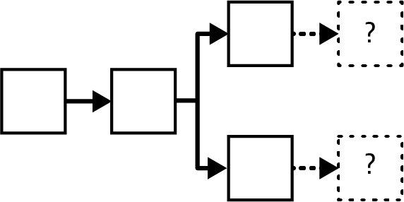
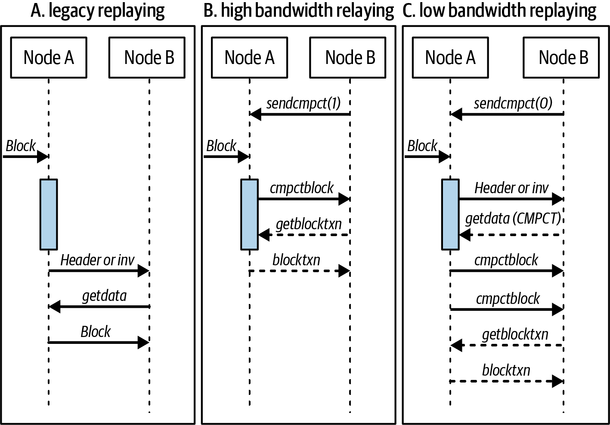
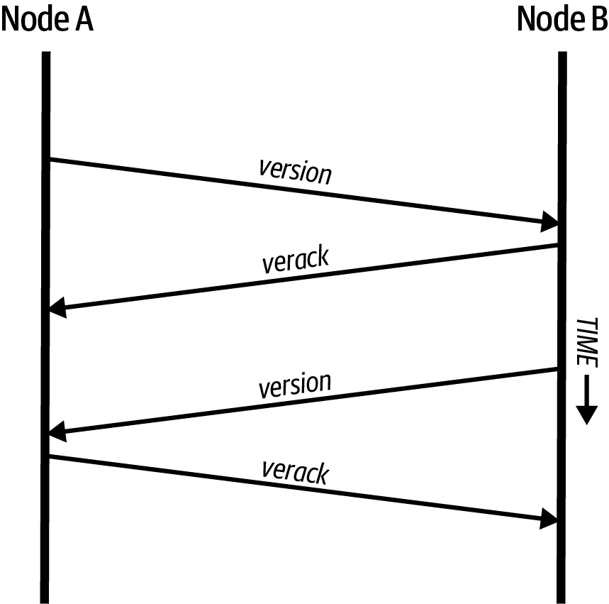
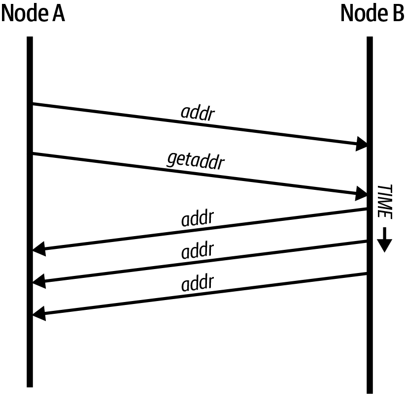
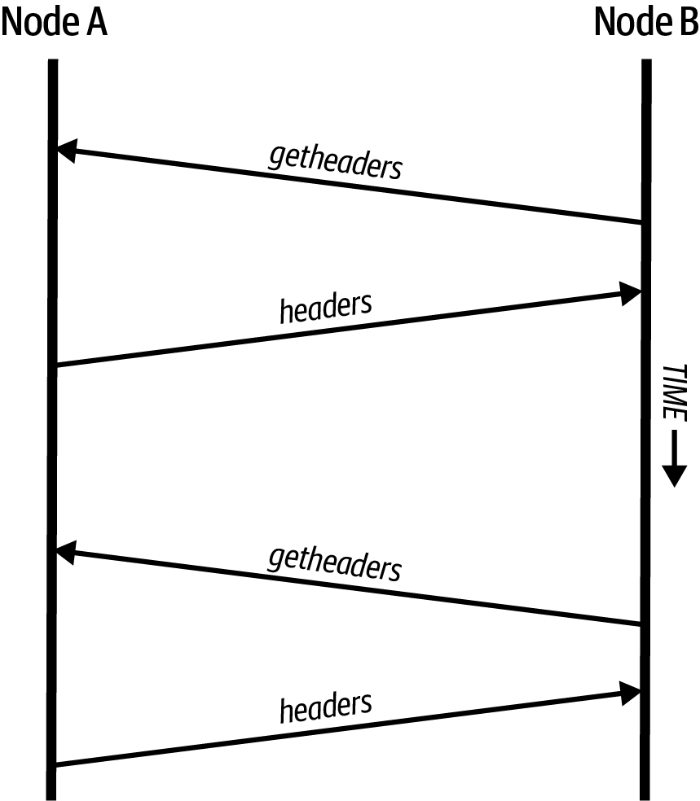
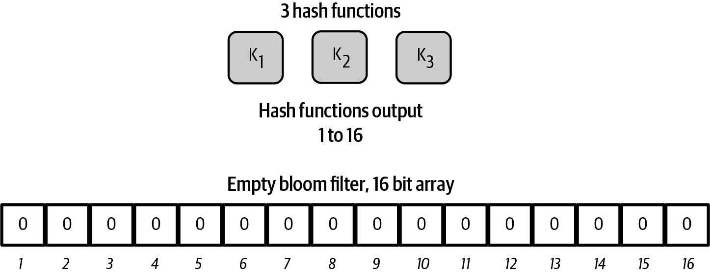
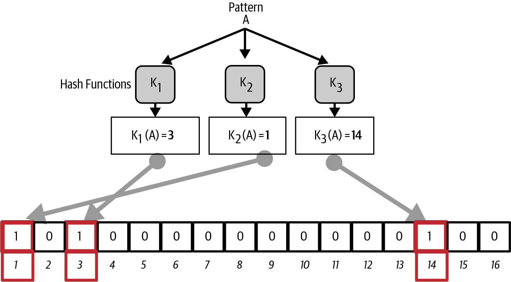
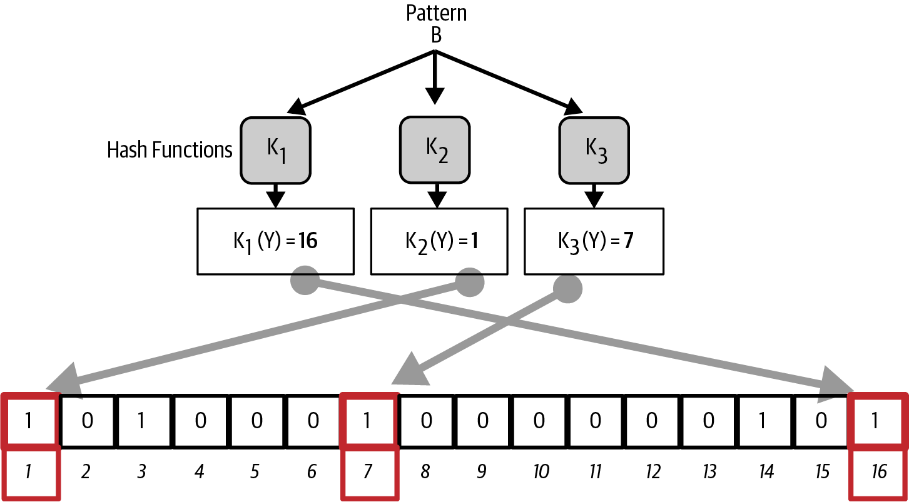
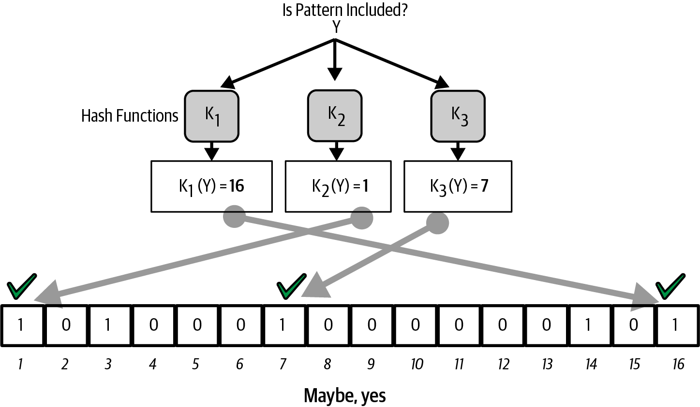
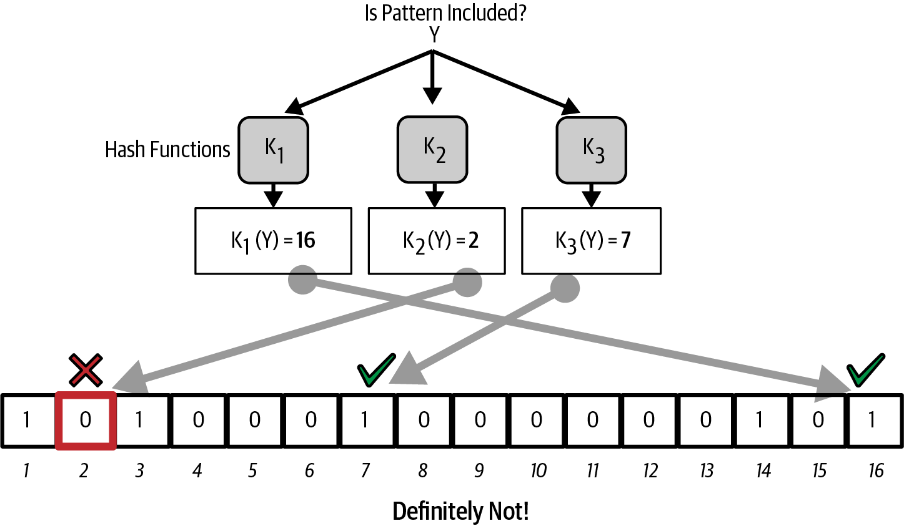

[[bitcoin_network_ch08]]
== The Bitcoin Network

Bitcoin is ((("Bitcoin", "as peer-to-peer network", secondary-sortas="peer-to-peer network", seealso="Bitcoin network")))((("peer-to-peer networks, Bitcoin as", seealso="Bitcoin network")))((("networks (Bitcoin)", see="Bitcoin network")))((("Bitcoin network")))structured as a peer-to-peer network architecture on
top of the internet. The term peer-to-peer, or P2P, means that the
full nodes that participate in the network are peers to each other, that
they can all perform the same functions, and that there are no "special" nodes.
The network nodes
interconnect in a mesh network with a "flat" topology. There is no
server, no centralized service, and no hierarchy within the network.
Nodes in a P2P network both provide and consume services at the same
time. P2P
networks are inherently resilient, decentralized, and open. A preeminent
example of a P2P network architecture was the early internet itself,
where nodes on the IP network were equal. Today's internet architecture
is more hierarchical, but the Internet Protocol still retains its
flat-topology essence. Beyond Bitcoin and the internet, the largest and most successful
application of P2P technologies is file sharing, with Napster as the
pioneer and BitTorrent as the most recent evolution of the architecture.

Bitcoin's P2P network architecture is much more than a topology choice.
Bitcoin is a P2P digital cash system by design, and the network
architecture is both a reflection and a foundation of that core
characteristic. Decentralization of control is a core design principle
that can only be achieved and maintained by a flat and decentralized P2P
consensus network.

The term "Bitcoin network" refers to
the collection of nodes running the Bitcoin P2P protocol. In addition to
the Bitcoin P2P protocol, there are other protocols that
are used for mining and lightweight wallets. These additional
protocols are provided by gateway routing servers that access the
Bitcoin network using the Bitcoin P2P protocol and then extend that
network to nodes running other protocols. For example, Stratum servers
connect Stratum mining nodes via the Stratum protocol to the main
Bitcoin network and bridge the Stratum protocol to the Bitcoin P2P
protocol. We will describe some of the most commonly used of those
protocols in this chapter in addition to the base Bitcoin P2P protocol.

=== Node Types and Roles

Although((("Bitcoin network", "nodes", "types of")))((("nodes", "types of")))((("full nodes", "purpose of")))((("peers"))) full nodes (peers) in the Bitcoin P2P network are equal to each other,
they may take on different roles depending on the functionality they are
supporting. A Bitcoin full node validates blocks and may contain other
functions, such as routing, mining, and wallet services.

Some nodes, called _archival full nodes_, also ((("archival full nodes")))maintain a
complete and up-to-date copy of the blockchain.
Those nodes can
serve data to clients that store
only a subset of the blockchain and partly verify transactions using a method
((("SPV (simplified-payment-verification) clients")))((("lightweight clients")))called _simplified payment verification_, or SPV. These clients are known as lightweight clients.

Miners compete to create new blocks by
running specialized hardware to solve the proof-of-work algorithm. Some
miners operate full nodes, validating every block on the
blockchain, while others are clients participating in pool
mining and depending on a pool server to provide them with work.

User wallets might connect to the user's own full node, as is sometimes the case with
desktop Bitcoin clients, but many user wallets, especially
those running on resource-constrained devices such as smartphones, are
lightweight nodes.

In addition to the main node types on the Bitcoin P2P protocol, there
are servers and nodes running other protocols, such as specialized
mining pool protocols and lightweight client-access protocols.

=== The Network

As ((("Bitcoin network", "nodes", "number of")))((("nodes", "number of")))of this writing, the main Bitcoin network,
running the Bitcoin P2P protocol, consists of about 10,000
listening nodes running various versions of Bitcoin Core and a few
hundred nodes running various other implementations of the Bitcoin P2P
protocol such as BitcoinJ, btcd, and bcoin. A small
percentage of the nodes on the Bitcoin P2P network are also mining
nodes. Various individuals and companies interface with the Bitcoin
network by running archival full nodes,
with full copies of the blockchain and a network node, but without
mining or wallet functions. These nodes act as network edge routers,
allowing various other services (exchanges, wallets, block explorers,
merchant payment processing) to be built on top.

[role="less_space pagebreak-before"]
=== Compact Block Relay

When a ((("Bitcoin network", "nodes", "compact block relay", id="bitcoin-network-node-compact-relay")))((("nodes", "compact block relay", id="node-compact-relay")))((("blocks", "compact block relay", id="block-compact-relay")))((("compact block relay", id="compact-block-relay")))((("mining", "blocks", "compact block relay", id="mining-block-compact-relay")))miner finds a new block, they announce it to the Bitcoin network
(which includes other miners).  The miner who found that block can start
building on top of it immediately; all other miners who haven't learned
about the block yet will continue building on top of the previous block
until they do learn about it.

If, before they learn about the new block, one of those other
miners creates a block, their block will be in competition with the
first miner's new block.  Only one of the blocks will ever be included
in the blockchain used by all full nodes, and miners only get paid for
blocks that are widely accepted.

Whichever block has a second block built on top of it first wins (unless
there's another near-tie), which is ((("block-finding races")))called a _block-finding race_ and is
illustrated in <<mining_race>>.
Block-finding races give the advantage to the largest miners, so they
act in opposition to Bitcoin's essential decentralization.  To prevent
block-finding races and allow miners of any size to participate equally
in the lottery that is Bitcoin mining, it's extremely useful to minimize
the time between when one miner announces a new block and when other
miners receive that block.

[[mining_race]]
.A blockchain fork requiring a mining race.

In 2015, a new version of Bitcoin Core added a feature called
_compact block relay_ (specified in BIP152) that allows transferring new
blocks both faster and with less bandwidth.

As background, full nodes that relay unconfirmed transactions also store
many of those transactions in their mempools (see <<mempool>>).  When
some of those transactions are confirmed in a new block, the node
doesn't need to receive a second copy of those transactions.

Instead of receiving redundant unconfirmed transactions, compact blocks
allow a peer to instead send a short 6-byte identifier for each transaction.
When your node receives a compact block with one or more identifiers, it
checks its mempool for those transactions and uses them if they are
found.  For any transaction that isn't found in your local node's
mempool, your node can send a request to the peer for a copy.

Conversely, if the remote peer believes your node's mempool doesn't have
some of the transactions that appear in the block, it can include a copy of
those transactions in the compact block.  For example, Bitcoin Core
always sends a block's coinbase transaction.

If the remote peer guesses correctly about what transactions your node
has in its mempool, and which it does not, it will send a block nearly
as efficiently as is theoretically possible (for a typical block, it'll
be between 97% and 99% efficient).

[TIP]
====
Compact block relay does not decrease the size of blocks.  It just
prevents the redundant transfer of information that a node already has.
When a node doesn't previously have information about a block, for
example when a node is first started, it must receive complete copies of
each block.
====

There are two modes that Bitcoin Core currently implements for sending
compact blocks, illustrated in <<bip152_illustration>>:

Low-bandwidth mode::
  When your((("low-bandwidth mode (compact block relay)"))) node requests that a peer use low-bandwidth mode (the default),
  that peer will tell your node the 32-byte identifier (header hash) of a
  new block but will not send your node any details about it.  If your
  node acquires that block first from another source, this avoids
  wasting any more of your bandwidth acquiring a redundant copy of that
  block.  If your node does need the block, it will request a compact
  block.

High-bandwidth mode::
  When your node ((("high-bandwidth mode (compact block relay)")))requests that a peer use high-bandwidth mode, that peer
  will send your node a compact block for a new block even before it has
  fully verified that the block is valid.  The only validation the peer
  will perform is ensuring that the block's header contains the correct
  amount of proof of work.  Since proof of work is expensive to generate
  (about $150,000 USD at the time of writing), it's unlikely that a
  miner would fake it just to waste the bandwidth of relay nodes.
  Skipping validation before relay allows new blocks to travel across
  the network with minimal delays at each hop.
+
The downside of high-bandwidth mode is that your node is likely to
receive redundant information from each high-bandwidth peer it chooses.
As of this writing, Bitcoin Core currently only asks three peers to use
high-bandwidth mode (and it tries to choose peers that have a history of
quickly announcing blocks).

// released into the public domain by Nicolas Dorier
[[bip152_illustration]]
.BIP152 modes compared (from BIP152).  The shaded bar indicates the time it takes the node to validate the block.

The names of the two methods (which are taken from BIP152) can be a bit
confusing.  Low-bandwidth mode saves bandwidth by not sending blocks in
most cases.  High-bandwidth mode uses more bandwidth than low-bandwidth
mode but, in most cases, much less bandwidth than was used for block
relay before compact blocks were ((("Bitcoin network", "nodes", "compact block relay", startref="bitcoin-network-node-compact-relay")))((("nodes", "compact block relay", startref="node-compact-relay")))((("blocks", "compact block relay", startref="block-compact-relay")))((("compact block relay", startref="compact-block-relay")))((("mining", "blocks", "compact block relay", startref="mining-block-compact-relay")))implemented.

=== Private Block Relay Networks

Although((("Bitcoin network", "nodes", "private block relay", id="bitcoin-network-node-private-relay")))((("nodes", "private block relay", id="node-private-relay")))((("blocks", "private block relay", id="block-private-relay")))((("private block relay", id="private-block-relay")))((("mining", "blocks", "private block relay", id="mining-block-private-relay"))) compact blocks go a long way toward minimizing the time it
takes for blocks to propagate across the network,
it's possible to minimize latency further.  Unlike
compact blocks, though, the other solutions involve trade-offs that
make them unavailable or unsuitable for the public P2P relay network.
For that reason, there has been experimentation with private relay
networks for blocks.

One simple technique is to preselect a route between endpoints.  For
example, a relay network with servers running in datacenters near major
trans-oceanic fiber optic lines might be able to forward new blocks
faster than waiting for the block to arrive at the node run by some home
user many kilometers away from the fiber optic line.

Another, more complex technique, is((("FEC (Forward Error Correction)")))((("Forward Error Correction (FEC)"))) Forward Error Correction (FEC).
This allows a compact block message to be split into several parts, with
each part having extra data appended.  If any of the parts isn't
received, that part can be reconstructed from the parts that are
received.  Depending on the settings, up to several parts may be
reconstructed if they are lost.

FEC avoids the problem of a compact block (or some parts of it) not
arriving due to problems with the underlying network connection.
Those problems frequently occur but we don't often notice them
because we mostly use protocols that automatically re-request the
missing data.  However, requesting missing data triples the time to
receive it.  For example:

1. Alice sends some data to Bob.
2. Bob doesn't receive the data (or it is damaged).   Bob re-requests
   the data from Alice.
3. Alice sends the data again.

A third technique is to assume all nodes receiving the data have
almost all of the same transactions in their mempool, so they can all
accept the same compact block.  That not only saves us time computing
a compact block at each hop, but it means that each hop can simply
relay the FEC packets to the next hop even before validating them.

The trade-off for each of the preceding methods is that they work well with
centralization but not in a decentralized network where individual nodes
can't trust other nodes.  Servers in datacenters cost money and can
often be accessed by operators of the datacenter, making them less
trustworthy than a secure home computer.  Relaying data before
validating makes it easy to waste bandwidth, so it can only reasonably
be used on a private network where there's some level of trust and
accountability between parties.

The original
https://oreil.ly/30ZKi[Bitcoin Relay Network] was((("Bitcoin Relay Network"))) created by
developer Matt Corallo in 2015 to enable fast synchronization of
blocks between miners with very low latency. The network consisted of
several virtual private servers (VPSes) hosted on
infrastructure around the world and served to connect the majority of
miners and mining pools.

The original Bitcoin Relay Network was replaced in 2016
with the introduction ((("FIBRE (Fast Internet Bitcoin Relay Engine)")))((("Fast Internet Bitcoin Relay Engine (FIBRE)")))of the _Fast Internet Bitcoin Relay Engine_ or
https://bitcoinfibre.org[_FIBRE_], also created by developer Matt
Corallo. FIBRE is software that allows operating a UDP-based relay network that relays blocks within a
network of nodes. FIBRE implements FEC and the _compact block_ optimization to
further reduce the amount of data transmitted and the ((("Bitcoin network", "nodes", "private block relay", startref="bitcoin-network-node-private-relay")))((("nodes", "private block relay", startref="node-private-relay")))((("blocks", "private block relay", startref="block-private-relay")))((("private block relay", startref="private-block-relay")))((("mining", "blocks", "private block relay", startref="mining-block-private-relay")))network latency.

=== Network Discovery

When a ((("Bitcoin network", "nodes", "network discovery", id="bitcoin-network-node-discovery")))((("nodes", "network discovery", id="node-discovery")))((("network discovery", id="network-discovery")))new node boots up, it must discover other
Bitcoin nodes on the network in order to participate. To start this
process, a new node must discover at least one existing node on the
network and connect to it. The geographic location of other nodes is
irrelevant; the Bitcoin network topology is not geographically defined.
Therefore, any existing Bitcoin nodes can be selected at random.

To connect to a known peer, nodes establish a TCP connection, usually to
port 8333 (the port generally known as the one used by Bitcoin), or an
alternative port if one is provided. Upon establishing a connection, the
node will start a "handshake" (see <<network_handshake>>) by
transmitting a  +version+ message, which contains basic identifying
information, including:

+Version+:: The Bitcoin P2P protocol version the client "speaks" (e.g., 70002)
+nLocalServices+:: A list of local services supported by the node
+nTime+:: The current time
+addrYou+:: The IP address of the remote node, as seen from this node
+addrMe+:: The IP address of the local node, as discovered by the local node
+subver+:: A subversion showing the type of software running on this node (e.g., [.keep-together]#+/Satoshi:0.9.2.1/+#)
+BestHeight+:: The block height of this node's blockchain
+fRelay+:: A field added by BIP37 for requesting not to receive unconfirmed transactions

The +version+ message is always the first message sent by any peer to
another peer. The local peer receiving a +version+ message will examine
the remote peer's reported +Version+ and decide if the remote peer is
compatible. If the remote peer is compatible, the local peer will
acknowledge the +version+ message and establish a connection by sending
a +verack+.

[role="less_space pagebreak-before"]
How does a new node find peers? The first method is to query DNS using a
number of _DNS seeds_, which are((("DNS seeds"))) DNS servers that provide a list of IP
addresses of Bitcoin nodes. Some of those DNS seeds provide a static
list of IP addresses of stable Bitcoin listening nodes. Some of the DNS
seeds are custom implementations of BIND (Berkeley Internet Name Daemon)
that return a random subset from a list of Bitcoin node addresses
collected by a crawler or a long-running Bitcoin node.  The Bitcoin Core
client contains the names of several different DNS seeds. The diversity of
ownership and diversity of implementation of the different DNS seeds
offers a high level of reliability for the initial bootstrapping
process. In the Bitcoin Core client, the option to use the DNS seeds is
controlled by the option switch +-dnsseed+ (set to 1 by default, to use
the DNS seed).

Alternatively, a bootstrapping node that knows nothing of the network
must be given the IP address of at least one Bitcoin node, after which
it can establish connections through further introductions. The
command-line argument +-seednode+ can be used to connect to one node
just for introductions using it as a seed. After the initial seed node
is used to form introductions, the client will disconnect from it and
use the newly discovered peers.

[[network_handshake]]
.The initial handshake between peers.

Once one or more connections are established, the new node will send an
+addr+ message containing its own IP address to its neighbors. The
neighbors will, in turn, forward the +addr+ message to their neighbors,
ensuring that the newly connected node becomes well known and better
connected. Additionally, the newly connected node can send +getaddr+ to
its neighbors, asking them to return a list of IP addresses of other
peers. That way, a node can find peers to connect to and advertise its
existence on the network for other nodes to find it.
<<address_propagation>> shows the address discovery protocol.

[[address_propagation]]
.Address propagation and discovery.

A node must connect to a few different peers in order to establish
diverse paths into the Bitcoin network. Paths are not reliable—nodes
come and go—and so the node must continue to discover new nodes as it
loses old connections as well as assist other nodes when they bootstrap.
Only one connection is needed to bootstrap because the first node can
offer introductions to its peer nodes and those peers can offer further
introductions. It's also unnecessary and wasteful of network resources
to connect to more than a handful of nodes. After bootstrapping, a node
will remember its most recent successful peer connections so if it
is rebooted, it can quickly reestablish connections with its former peer
network. If none of the former peers respond to its connection request,
the node can use the seed nodes to bootstrap again.

On a node running the Bitcoin Core client, you can list the peer
connections with the command +getpeerinfo+:

[source,bash]
----
$ bitcoin-cli getpeerinfo
----
[source,json]
----
[
  {
    "id": 0,
    "addr": "82.64.116.5:8333",
    "addrbind": "192.168.0.133:50564",
    "addrlocal": "72.253.6.11:50564",
    "network": "ipv4",
    "services": "0000000000000409",
    "servicesnames": [
      "NETWORK",
      "WITNESS",
      "NETWORK_LIMITED"
    ],
    "lastsend": 1683829947,
    "lastrecv": 1683829989,
    "last_transaction": 0,
    "last_block": 1683829989,
    "bytessent": 3558504,
    "bytesrecv": 6016081,
    "conntime": 1683647841,
    "timeoffset": 0,
    "pingtime": 0.204744,
    "minping": 0.20337,
    "version": 70016,
    "subver": "/Satoshi:24.0.1/",
    "inbound": false,
    "bip152_hb_to": true,
    "bip152_hb_from": false,
    "startingheight": 788954,
    "presynced_headers": -1,
    "synced_headers": 789281,
    "synced_blocks": 789281,
    "inflight": [
    ],
    "relaytxes": false,
    "minfeefilter": 0.00000000,
    "addr_relay_enabled": false,
    "addr_processed": 0,
    "addr_rate_limited": 0,
    "permissions": [
    ],
    "bytessent_per_msg": {
      ...
    },
    "bytesrecv_per_msg": {
      ...
    },
    "connection_type": "block-relay-only"
  },
]
----

To override the automatic management of peers and to specify a list of
IP addresses, users can provide the option +-connect=<IPAddress>+ and
specify one or more IP addresses. If this option is used, the node will
only connect to the selected IP addresses instead of discovering and
maintaining the peer connections automatically.

If there is no traffic on a connection, nodes will periodically send a
message to maintain the connection. If a node has not communicated on a
connection for too long, it is assumed to be disconnected
and a new peer will be sought. Thus, the network dynamically adjusts to
transient nodes and network problems and can organically grow and
shrink as needed without any ((("Bitcoin network", "nodes", "network discovery", startref="bitcoin-network-node-discovery")))((("nodes", "network discovery", startref="node-discovery")))((("network discovery", startref="network-discovery")))central control.

=== Full Nodes

Full nodes ((("Bitcoin network", "full nodes, purpose of")))((("full nodes", "purpose of")))are nodes that verify every transaction in every block on the
valid blockchain with the most proof of work.

Full nodes
independently process every block, starting after the very first
block (genesis block) and building up to the latest known block in the
network. A full node can independently and authoritatively
verify any transaction.
The full node relies on the network to
receive updates about new blocks of transactions, which it then verifies
and incorporates into its local view of which scripts control which
bitcoins, called the set ((("UTXOs (unspent transaction outputs)")))of _unspent transaction outputs_ (UTXOs).

Running a full node gives
you the pure Bitcoin experience: independent verification of all
transactions without the need to rely on, or trust, any other systems.

There are a few alternative implementations of
full nodes, built using different programming
languages and software architectures, or which made different design
decisions. However, the most common
implementation is Bitcoin Core.
More than 95% of full nodes on the Bitcoin network run
various versions of Bitcoin Core. It is identified as "Satoshi" in the
subversion string sent in the +version+ message and shown by the
command +getpeerinfo+ as we saw earlier; for example, [.keep-together]#+/Satoshi:24.0.1/+#.

=== Exchanging "Inventory"

The first thing((("Bitcoin network", "nodes", "syncing blockchain", id="bitcoin-network-node-sync")))((("nodes", "syncing blockchain", id="node-sync")))((("full nodes", "syncing blockchain", id="full-node-sync")))((("blockchain", "syncing", id="blockchain-sync")))((("syncing blockchain", id="sync-blockchain"))) a full
node will do once it connects to peers is try to construct a complete
chain of block headers. If it is a brand-new node and has no blockchain at all, it
only knows one block, the genesis block, which is statically embedded in
the client software. Starting after block #0 (the genesis block), the new
node will have to download hundreds of thousands of blocks to
synchronize with the network and reestablish the full blockchain.

The
process of syncing the blockchain starts with the +version+ message
because that contains +BestHeight+, a node's current blockchain height
(number of blocks). A node will see the +version+ messages from its
peers, know how many blocks they each have, and be able to compare to
how many blocks it has in its own blockchain. Peered nodes will exchange
a +getheaders+ message that contains the hash of the top
block on their local blockchain. One of the peers will be able to
identify the received hash as belonging to a block that is not at the
top, but rather belongs to an older block, thus deducing that its own
local blockchain is longer than the remote node's blockchain.

The peer that has the longer blockchain has more blocks than the other
node and can identify which headers the other node needs in order to
"catch up." It will identify the first 2,000 headers to share using a
+headers+ message.  The node will keep requesting additional headers
until it has received one for every block the remote peer claims to
have.

In parallel, the node will begin requesting the blocks for each header
it previously received using a +getdata+ message.  The node will request
different blocks from each of its selected peers, which allows it to drop
connections to peers that are significantly slower than the average in
order to find newer (and possibly faster) peers.

Let's assume, for example, that a node only has the genesis block. It
will then receive a +headers+ message from its peers containing the headers
of the next 2,000 blocks in the chain. It will start requesting blocks
from all of its connected peers, keeping a queue of up to 1,024 blocks.
Blocks need to be validated in order, so if the oldest block in the
queue--the block the node next needs to validate--hasn't been received
yet, the node drops the connection to the peer that was supposed to
provide that block.  It then finds a new peer that may be able to
provide one block before all of the node's other peers are able to
provide 1,023 blocks.

As each block is received, it is added to the
blockchain, as we will see in <<blockchain>>. As the local blockchain is
gradually built up, more blocks are requested and received, and the
process continues until the node catches up to the rest of the network.

This process of comparing the local blockchain with the peers and
retrieving any missing blocks happens any time a node has been offline for
an extended period((("Bitcoin network", "nodes", "syncing blockchain", startref="bitcoin-network-node-sync")))((("nodes", "syncing blockchain", startref="node-sync")))((("full nodes", "syncing blockchain", startref="full-node-sync")))((("blockchain", "syncing", startref="blockchain-sync")))((("syncing blockchain", startref="sync-blockchain"))) of time.

[[spv_nodes]]
=== Lightweight Clients

Many ((("Bitcoin network", "lightweight clients", id="bitcoin-network-lightweight")))((("lightweight clients", id="lightweight")))((("SPV (simplified-payment-verification) clients", id="spv-lightweight")))Bitcoin clients are designed to run on space- and
power-constrained devices, such as smartphones, tablets, or embedded
systems. For such devices, a _simplified payment verification_ (SPV)
method is used to allow them to operate without validating the full
blockchain. These types of clients are called lightweight
clients.

Lightweight clients download only the block headers and do not download the
transactions included in each block. The resulting chain of headers,
without transactions, is about 10,000 times smaller than the full blockchain.
Lightweight clients cannot construct a full picture of all the UTXOs that are
available for spending because they do not know about all the
transactions on the network. Instead, they verify transactions using a
slightly different method that relies on peers to provide partial views
of relevant parts of the blockchain on demand.

As an analogy, a full node is like a tourist in a strange city, equipped
with a detailed map of every street and every address. By comparison, a
lightweight client is like a tourist in a strange city asking random strangers for
turn-by-turn directions while knowing only one main avenue. Although
both tourists can verify the existence of a street by visiting it, the
tourist without a map doesn't know what lies down any of the side
streets and doesn't know what other streets exist. Positioned in front
of 23 Church Street, the tourist without a map cannot know if there are
a dozen other [.keep-together]#"23 Church# Street" addresses in the city and whether this
is the right one. The mapless tourist's best chance is to ask enough
people and hope some of them are not trying to mug him.

Lightweight clients verify transactions by reference to their _depth_ in the blockchain. Whereas a full node will construct a fully verified chain of thousands of blocks and millions of transactions reaching down the blockchain (back in time) all the way to the genesis block, a lightweight client will verify the proof of work of all blocks (but not whether the blocks and all of their transactions are valid) and link that chain to the transaction of interest.

For example, when examining a transaction in block 800,000, a full node
verifies all 800,000 blocks down to the genesis block and builds a full
database of UTXOs, establishing the validity of the transaction by
confirming that the transaction exists and its output remains unspent. A lightweight client can
only verify that the transaction exists. The client establishes a link
between the transaction and the block that contains it, using a _merkle
path_ (see <<merkle_trees>>). Then, the lightweight client waits until it sees the
six blocks 800,001 through 800,006 piled on top of the block containing
the transaction and verifies it by establishing its depth under blocks
800,006 to 800,001. The fact that other nodes on the network accepted
block 800,000 and that miners did the necessary work to produce six more blocks
on top of it is proof, by proxy, that the transaction actually exists.

A lightweight client cannot normally be persuaded that a transaction exists in a block
when the transaction does not in fact exist. The lightweight client establishes
the existence of a transaction in a block by requesting a merkle path
proof and by validating the proof of work in the chain of blocks.
However, a transaction's existence can be "hidden" from a lightweight client. A
lightweight client can definitely verify that a transaction exists but cannot
verify that a transaction, such as a double-spend of the same UTXO,
doesn't exist because it doesn't have a record of all transactions. This
vulnerability can be used in a denial-of-service attack or for a
double-spending attack against lightweight clients. To defend against this, a lightweight
client needs to connect randomly to several clients to increase the
probability that it is in contact with at least one honest node. This
need to randomly connect means that lightweight clients also are vulnerable to
network partitioning attacks or Sybil attacks, where they are connected
to fake nodes or fake networks and do not have access to honest nodes or
the real Bitcoin network.

For many practical purposes, well-connected lightweight clients are secure enough,
striking a balance between resource needs, practicality, and security.
For infallible security, however, nothing beats running a full
node.

[TIP]
====
A full node verifies a transaction by checking the entire chain of
thousands of blocks below it in order to guarantee that the UTXO exists
and is not spent, whereas a lightweight client only proves that a transaction
exists and checks that the block containing that transaction is
buried by a handful of blocks above it.
====

To get the block headers it needs to verify a transaction is part of the
chain, lightweight clients use a +getheaders+ message.
The responding peer will send up to 2,000 block headers
using a single +headers+ message.  See the illustration in
<<spv_synchronization>>.

[[spv_synchronization]]
.Lightweight client synchronizing the block headers.

Block headers allow a lightweight client to verify that any individual block
belongs to the blockchain with the most proof of work, but they don't
tell the client which blocks contain transactions that are interesting to
its wallet.  The client could download every block and check, but that
would use a large fraction of the resources it would take to run a full
node, so developers have looked for other ways to solve the problem.

Shortly after the introduction of lightweight clients, Bitcoin
developers added a feature called _bloom filters_ in an attempt to
reduce the bandwidth that lightweight clients needed to use to learn about their
incoming and outgoing transactions.
Bloom filters allow lightweight clients to receive a subset of
the transactions without directly revealing precisely which addresses they are
interested in, through a filtering mechanism that uses probabilities
rather than ((("Bitcoin network", "lightweight clients", startref="bitcoin-network-lightweight")))((("lightweight clients", startref="lightweight")))((("SPV (simplified-payment-verification) clients", startref="spv-lightweight")))fixed patterns.

[[bloom_filters]]
=== Bloom Filters

A bloom filter((("Bitcoin network", "bloom filters", "operational overview", id="bitcoin-network-bloom-overview")))((("bloom filters", "operational overview", id="bloom-overview"))) is a probabilistic search filter, a way
to describe a desired pattern without specifying it exactly. Bloom
filters offer an efficient way to express a search pattern while
protecting privacy. They are used by lightweight clients to ask their peers for
transactions matching a specific pattern without revealing exactly
which addresses, keys, or transactions they are searching for.

In our previous analogy, a tourist without a map is asking for
directions to a specific address, "23 Church St." If they ask a stranger
for directions to this street, they inadvertently reveal their
destination. A bloom filter is like asking, "Are there any streets in
this neighborhood whose name ends in R-C-H?" A question like that
reveals slightly less about the desired destination than asking for "23
Church St." Using this technique, a tourist could specify the desired
address in more detail such as "ending in U-R-C-H" or less detail such as
"ending in H." By varying the precision of the search, the tourist
reveals more or less information at the expense of getting more or less
specific results. If they ask for a less specific pattern, they get a lot
more possible addresses and better privacy, but many of the results are
irrelevant. If they ask for a very specific pattern, they get fewer
results but lose privacy.

Bloom filters serve this function by allowing a lightweight client to specify a
search pattern for transactions that can be tuned toward precision or
privacy. A more specific bloom filter will produce accurate results, but
at the expense of revealing what patterns the lightweight client is interested in,
thus revealing the addresses owned by the user's wallet. A less specific
bloom filter will produce more data about more transactions, many
irrelevant to the client, but will allow the client to maintain better
privacy.

==== How Bloom Filters Work

Bloom filters are implemented as a variable-size array of N binary
digits (a bit field) and a variable number of M hash functions. The hash
functions are designed to always produce an output that is between 1 and
N, corresponding to the array of binary digits. The hash functions are
generated deterministically, so that any client implementing a bloom
filter will always use the same hash functions and get the same results
for a specific input. By choosing different length (N) bloom filters and
a different number (M) of hash functions, the bloom filter can be tuned,
varying the level of accuracy and therefore privacy.

In <<bloom1>>, we use a very small array of 16 bits and a set of three
hash functions to demonstrate how bloom filters work.

[[bloom1]]
.An example of a simplistic bloom filter, with a 16-bit field and three hash functions.

The bloom filter is initialized so that the array of bits is all zeros.
To add a pattern to the bloom filter, the pattern is hashed by each hash
function in turn. Applying the first hash function to the input results
in a number between 1 and N. The corresponding bit in the array (indexed
from 1 to N) is found and set to +1+, thereby recording the output of
the hash function. Then, the next hash function is used to set another
bit and so on. Once all M hash functions have been applied, the search
pattern will be "recorded" in the bloom filter as M bits that have been
changed from +0+ to +1+.

<<bloom2>> is an example of adding a pattern "A" to the simple bloom filter shown in <<bloom1>>.

Adding a second pattern is as simple as repeating this process. The
pattern is hashed by each hash function in turn, and the result is
recorded by setting the bits to +1+. Note that as a bloom filter is
filled with more patterns, a hash function result might coincide with a
bit that is already set to +1+, in which case the bit is not changed. In
essence, as more patterns record on overlapping bits, the bloom filter
starts to become saturated with more bits set to +1+ and the accuracy of
the filter decreases. This is why the filter is a probabilistic data
structure—it gets less accurate as more patterns are added. The accuracy
depends on the number of patterns added versus the size of the bit array
(N) and number of hash functions (M). A larger bit array and more hash
functions can record more patterns with higher accuracy. A smaller bit
array or fewer hash functions will record fewer patterns and produce
less accuracy.

[[bloom2]]
.Adding a pattern "A" to our simple bloom filter.

<<bloom3>> is an example of adding a second pattern "B" to the simple bloom filter.

[[bloom3]]
.Adding a second pattern "B" to our simple bloom filter.

[role="less_space pagebreak-before"]
To test if a pattern is part of a bloom filter, the pattern is hashed by
each hash function and the resulting bit pattern is tested against the
bit array. If all the bits indexed by the hash functions are set to +1+,
then the pattern is _probably_ recorded in the bloom filter. Because the
bits may be set because of overlap from multiple patterns, the answer is
not certain, but is rather probabilistic. In simple terms, a bloom
filter positive match is a "Maybe, yes."

<<bloom4>> is an example of testing the existence of pattern "X" in the
simple bloom filter. The corresponding bits are set to +1+, so the
pattern is probably a match.

[[bloom4]]
.Testing the existence of pattern "X" in the bloom filter. The result is a probabilistic positive match, meaning "Maybe."

On the contrary, if a pattern is tested against the bloom filter and any
one of the bits is set to +0+, this proves that the pattern was not
recorded in the bloom filter. A negative result is not a probability, it
is a certainty. In simple terms, a negative match on a bloom filter is a
"Definitely not!"

<<bloom5>> is an example of testing the existence of pattern "Y" in the
simple bloom filter. One of the corresponding bits is set to +0+, so the
pattern is definitely((("Bitcoin network", "bloom filters", "operational overview", startref="bitcoin-network-bloom-overview")))((("bloom filters", "operational overview", startref="bloom-overview"))) not a match.

[[bloom5]]
.Testing the existence of pattern "Y" in the bloom filter. The result is a definitive negative match, meaning "Definitely Not!"

==== How Lightweight Clients Use Bloom Filters

Bloom filters ((("Bitcoin network", "bloom filters", "lightweight clients and", id="bitcoin-network-bloom-lightweight")))((("bloom filters", "lightweight clients and", id="bloom-lightweight")))((("lightweight clients", "bloom filters and", id="lightweight-bloom")))are used to filter the transactions (and blocks containing
them) that a lightweight client receives from its peers, selecting only
transactions of interest to the lightweight client without revealing exactly which
addresses or keys it is interested in.

A lightweight client will initialize a bloom filter
as "empty"; in that state, the bloom filter will not match any patterns.
The lightweight client will then make a list of all the addresses, keys, and
hashes that it is interested in. It will do this by extracting the
public key hash, script hash, and transaction IDs from any UTXO
controlled by its wallet. The lightweight client then adds each of these to the
bloom filter so that the bloom filter will "match" if these patterns
are present in a transaction, without revealing the patterns themselves.

The lightweight client will then send a
+filterload+ message to the peer containing the bloom filter to use on
the connection. On the peer, bloom filters are checked against each
incoming transaction. The full node checks several parts of the
transaction against the bloom filter, looking for a match including:

++++
<ul>
<li>The transaction ID</li>
<li>The data components from the scripts of each of the transaction outputs (every key and hash in the script)</li>
<li class="less_space pagebreak-before">Each of the transaction inputs</li>
<li>Each of the input signature data components (or witness scripts)</li>
</ul>
++++

By checking against all these components, bloom filters can be used to
match public key hashes, scripts, +OP_RETURN+ values, public keys in
signatures, or any future component of a smart contract or complex
script.

After a filter is established, the peer will then test each
transaction's outputs against the bloom filter. Only transactions that
match the filter are sent to the client.

In response to a +getdata+ message from the client, peers will send a
+merkleblock+ message that contains only block headers for blocks
matching the filter and a merkle path (see <<merkle_trees>>) for each
matching transaction. The peer will then also send +tx+ messages
containing the transactions matched by the filter.

As the full node sends transactions to the lightweight client, the lightweight client
discards any false positives and uses the correctly matched transactions
to update its UTXO set and wallet balance. As it updates its own view of
the UTXO set, it also modifies the bloom filter to match any future
transactions referencing the UTXO it just found. The full node then uses
the new bloom filter to match new transactions and the whole process
repeats.

The client setting the bloom filter can interactively add patterns to the
filter by sending a +filteradd+ message. To clear the bloom filter, the
client can send a +filterclear+ message. Because it is not possible to
remove a pattern from a bloom filter, a client has to clear and resend a
new bloom filter if a pattern is no longer desired.

The network protocol and bloom filter mechanism for lightweight clients is defined
in BIP37.

Unfortunately, after the deployment of bloom filters, it became clear
that they didn't offer very much privacy.  A full node receiving a bloom
filter from a peer could apply that filter to the entire blockchain to
find all of the client's transactions (plus false positives).  It could
then look for patterns and relationships between the transactions.
Randomly selected false positive transactions would be unlikely to have
a parent-child relationship from output to input, but transactions from
the user's wallet would be very likely to have that relationship.  If
all of the related transactions have certain characteristics, such as
at least one P2PKH output, then transactions without that characteristic
can be assumed not to belong to the wallet.

It was also discovered that specially constructed filters could force
the full nodes that processed them to perform a large amount of work,
which could lead to denial-of-service attacks.

For both of those reasons, Bitcoin Core eventually limited support for
bloom filters to only clients on IP addresses that were explicitly
allowed by the node operator.  This meant that an alternative method for
helping lightweight clients find their transactions((("Bitcoin network", "bloom filters", "lightweight clients and", startref="bitcoin-network-bloom-lightweight")))((("bloom filters", "lightweight clients and", startref="bloom-lightweight")))((("lightweight clients", "bloom filters and", startref="lightweight-bloom"))) was needed.

=== Compact Block Filters

// https://lists.linuxfoundation.org/pipermail/bitcoin-dev/2016-May/012636.html

An idea was ((("Bitcoin network", "compact block filters", id="bitcoin-network-compact-filter")))((("compact block filters", id="compact-block-filter")))((("blocks", "compact block filters", id="block-compact-filter")))posted to the Bitcoin-Dev mailing list by an anonymous
developer in 2016 of reversing the bloom filter process.  With a BIP37
bloom filter, each client hashes their addresses to create a bloom
filter and nodes hash parts of each transaction to attempt to match
that filter.  In the new proposal, nodes hash parts of each transaction
in a block to create a bloom filter and clients hash their addresses to
attempt to match that filter.  If a client finds a match, they download
the entire block.

[NOTE]
====
Despite the similarities in names, BIP152 _compact blocks_ and
BIP157/158 _compact block filters_ are unrelated.
====

This allows nodes to create a single filter for every block, which they
can save to disk and serve over and over, eliminating the
denial-of-service vulnerabilities with BIP37.  Clients don't give full
nodes any information about their past or future addresses.  They only
download blocks, which may contain thousands of transactions that
weren't created by the client.  They can even download each matching
block from a different peer, making it harder for full nodes to connect
transactions belonging to a single client across multiple blocks.

This idea for server-generated filters doesn't offer perfect privacy;
it still places some costs on full nodes (and it does require lightweight
clients to use more bandwidth for the block download), and the filters can
only be used for confirmed transactions (not unconfirmed transactions). However,
it is much more private and reliable than BIP37 client-requested
bloom filters.

After the description of the original idea based on bloom filters,
developers realized there was a better data structure for
server-generated filters, called Golomb-Rice Coded Sets (GCS).

==== Golomb-Rice Coded Sets (GCS)

Imagine ((("Bitcoin network", "compact block filters", "GCS (Golomb-Rice coded sets)", id="bitcoin-network-compact-filter-gcs")))((("compact block filters", "GCS (Golomb-Rice coded sets)", id="compact-block-filter-gcs")))((("blocks", "compact block filters", "GCS (Golomb-Rice coded sets)", id="block-compact-filter-gcs")))((("GCS (Golomb-Rice coded sets)", id="gcs-filter")))that Alice wants to send a list of numbers to Bob.  The simple
way to do that is to just send him the entire list of numbers:

----
849
653
476
900
379
----

But there's a more efficient way.  First, Alice puts the list in
numerical order:

----
379
476
653
849
900
----

Then, Alice sends the first number.  For the remaining numbers, she
sends the difference between that number and the preceding number.  For
example, for the second number, she sends 97 (476 – 379); for the third
number, she sends 177 (653 – 476); and so on:

----
379
97
177
196
51
----

We can see that the differences between two numbers in an ordered list
produces numbers that are shorter than the original numbers.  Upon
receiving this list, Bob can reconstruct the original list by simply
adding each number with its predecessor.  That means we save space
without losing any information, which is ((("lossless encoding")))called _lossless encoding_.

If we randomly select numbers within a fixed range of values, then the
more numbers we select, the smaller the average (mean) size of the
differences.  That means the amount of data we need to transfer doesn't
increase as fast as the length of our list increases (up to a point).

Even more usefully, the length of the randomly selected numbers in a
list of differences is naturally biased toward smaller lengths.
Consider selecting two random numbers from 1 to 6; this is the same
as rolling two dice.  There are 36 distinct combinations of two dice:

[cols="1,1,1,1,1,1"]
|===
| 1 1 | 1 2 | 1 3 | 1 4 | 1 5 | 1 6
| 2 1 | 2 2 | 2 3 | 2 4 | 2 5 | 2 6
| 3 1 | 3 2 | 3 3 | 3 4 | 3 5 | 3 6
| 4 1 | 4 2 | 4 3 | 4 4 | 4 5 | 4 6
| 5 1 | 5 2 | 5 3 | 5 4 | 5 5 | 5 6
| 6 1 | 6 2 | 6 3 | 6 4 | 6 5 | 6 6
|===

Let's find the difference between the larger of the numbers and the
smaller of the numbers:

[role="less_space pagebreak-before"]
[cols="1,1,1,1,1,1"]
|===
| 0 | 1 | 2 | 3 | 4 | 5
| 1 | 0 | 1 | 2 | 3 | 4
| 2 | 1 | 0 | 1 | 2 | 3
| 3 | 2 | 1 | 0 | 1 | 2
| 4 | 3 | 2 | 1 | 0 | 1
| 5 | 4 | 3 | 2 | 1 | 0
|===

If we count the frequency of each difference occurring, we see that the
small differences are much more likely to occur than the large
differences:

++++
<table>

<thead>
<tr>
<th>Difference</th>
<th>Occurrences</th>
</tr>
</thead>
<tbody>
<tr>
<td>
0
</td>
<td>
6
</td>
</tr>
<tr>
<td>
1
</td>
<td>
10
</td>
</tr>
<tr>
<td>
2
</td>
<td>
8
</td>
</tr>
<tr>
<td>
3
</td>
<td>
6
</td>
</tr>
<tr>
<td>
4
</td>
<td>
4
</td>
</tr>
<tr>
<td>
5
</td>
<td>
2
</td>
</tr>
</tbody>
</table>
++++

If we know that we might need to store large numbers (because large
differences can happen, even if they are rare), but we'll most often need
to store small numbers, we can encode each number using a system that
uses less space for small numbers and extra space for large numbers.
On average, that system will perform better than using the same amount
of space for every number.

Golomb coding provides that facility.  Rice coding is a subset of Golomb
coding that's more convenient to use in some situations, including the
application of Bitcoin ((("Bitcoin network", "compact block filters", "GCS (Golomb-Rice coded sets)", startref="bitcoin-network-compact-filter-gcs")))((("compact block filters", "GCS (Golomb-Rice coded sets)", startref="compact-block-filter-gcs")))((("blocks", "compact block filters", "GCS (Golomb-Rice coded sets)", startref="block-compact-filter-gcs")))((("GCS (Golomb-Rice coded sets)", startref="gcs-filter")))block filters.

==== What Data to Include in a Block Filter

Our primary ((("Bitcoin network", "compact block filters", "what to include", id="bitcoin-network-compact-filter-include")))((("compact block filters", "what to include", id="compact-block-filter-include")))((("blocks", "compact block filters", "what to include", id="block-compact-filter-include")))goal is to allow wallets to learn whether a block contains a
transaction affecting that wallet.  For a wallet to be effective, it
needs to learn two types of information:

When it has received money::

Specifically, when a transaction
   output contains a script that the wallet controls (such as by
   controlling the authorized private key)

When it has spent money::  

Specifically, when a transaction input
   references a previous transaction output that the wallet controlled

A secondary goal during the design of compact block filters was to allow
the wallet receiving the filter to verify that it received an accurate
filter from a peer.  For example, if the wallet downloaded the block
from which the filter was created, the wallet could generate its own
filter.  It could then compare its filter to the peer's filter and
verify that they were identical, proving the peer had generated an
accurate filter.

For both the primary and secondary goals to be met, a filter would need
to reference two types of information:

* The script for every output in every transaction in a block

* The outpoint for every input in every transaction in a block

An early design for compact block filters included both of those pieces
of information, but it was realized there was a more efficient way
to accomplish the primary goal if we sacrificed the secondary goal.  In
the new design, a block filter would still reference two types of
information, but they'd be more closely related:

* As before, the script for every output in every transaction in a
block.

* In a change, it would also reference the script of the output
referenced by the outpoint for every input in every transaction in a
block.  In other words, the output script being spent.

This had several advantages.  First, it meant that wallets didn't need
to track outpoints; they could instead just scan for the
output scripts to which they expected to receive money. Second, any time a
later transaction in a block spends the output of an earlier
transaction in the same block, they'll both reference the same
output script.  More than one reference to the same output script is
redundant in a compact block filter, so the redundant copies can be
removed, shrinking the size of the filters.

When full nodes validate a block, they need access to the output scripts
for both the current transaction outputs in a block and the transaction
outputs from previous blocks that are being referenced in inputs, so
they're able to build compact block filters in this simplified model.
But a block itself doesn't include the output scripts from transactions
included in previous blocks, so there's no convenient way for a client
to verify a block filter was built correctly.  However, there is an
alternative that can help a client detect if a peer is lying to it:
obtaining the same filter from ((("Bitcoin network", "compact block filters", "what to include", startref="bitcoin-network-compact-filter-include")))((("compact block filters", "what to include", startref="compact-block-filter-include")))((("blocks", "compact block filters", "what to include", startref="block-compact-filter-include")))multiple peers.

==== Downloading Block Filters from Multiple Peers

A peer ((("Bitcoin network", "compact block filters", "downloading multiple", id="bitcoin-network-compact-filter-download")))((("compact block filters", "downloading multiple", id="compact-block-filter-download")))((("blocks", "compact block filters", "downloading multiple", id="block-compact-filter-download")))((("downloading multiple block filters", id="download-multiple-block")))((("multiple block filters, downloading", id="multiple-block-download")))can provide a wallet with an inaccurate filter.  There are two ways
to create an inaccurate filter.  The peer can create a filter that
references transactions that don't actually appear in the associated
block (a false positive).  Alternatively, the peer can create a filter
that doesn't reference transactions that do actually appear in the
associated block (a false negative).

The first protection against an inaccurate filter is for a client to
obtain a filter from multiple peers.  The BIP157 protocol allows a
client to download just a short 32-byte commitment to a filter to
determine whether each peer is advertising the same filter as all of the
client's other peers.  That minimizes the amount of bandwidth the client
must expend to query many different peers for their filters, if all of
those peers agree.

If two or more different peers have different filters for the same
block, the client can download all of them.  It can then also download
the associated block.  If the block contains any transaction related to
the wallet that is not part of one of the filters, then the wallet can
be sure that whichever peer created that filter was
inaccurate--Golomb-Rice Coded Sets will always include a
potential match.

Alternatively, if the block doesn't contain a transaction that the
filter said might match the wallet, that isn't proof that the filter was
inaccurate.  To minimize the size of a GCS, we allow a certain number of
false positives.  What the wallet can do is continue downloading
additional filters from the peer, either randomly or when they indicate
a match, and then track the client's false positive rate.  If it
differs significantly from the false positive rate that filters were
designed to use, the wallet can stop using that peer.  In most cases,
the only consequence of the inaccurate filter is that the wallet uses
more bandwidth than((("Bitcoin network", "compact block filters", "downloading multiple", startref="bitcoin-network-compact-filter-download")))((("compact block filters", "downloading multiple", startref="compact-block-filter-download")))((("blocks", "compact block filters", "downloading multiple", startref="block-compact-filter-download")))((("downloading multiple block filters", startref="download-multiple-block")))((("multiple block filters, downloading", startref="multiple-block-download"))) expected.

==== Reducing Bandwidth with Lossy Encoding

The data ((("Bitcoin network", "compact block filters", "lossy encoding")))((("compact block filters", "lossy encoding")))((("blocks", "compact block filters", "lossy encoding")))((("lossy encoding")))about the transactions in a block that we want to communicate
is an output script.  Output scripts vary in length and follow patterns,
which means the differences between them won't be evenly distributed
like we want.  However, we've already seen in many places in this book
that we can use a hash function to create a commitment to some data and
also produce a value that looks like a randomly selected number.

In other places in this book, we've used a cryptographically secure hash
function that provides assurances about the strength of its commitment
and how indistinguishable from random its output is.  However, there are
faster and more configurable non-cryptographic hash functions, such as
the SipHash function we'll use for compact block filters.

The details of the algorithm used are described in BIP158, but the gist
is that each output script is reduced to a 64-bit commitment using
SipHash and some arithmetic operations.  You can think of this as
taking a set of large numbers and truncating them to shorter numbers, a
process that loses data (so it's called _lossy encoding_).  By losing
some information, we don't need to store as much information later,
which saves space.  In this case, we go from a typical output script
that's 160 bits or longer down to just 64 bits.

==== Using Compact Block Filters

The 64-bit values for every commitment to an output script in a block are
sorted, duplicate entries are removed, and the GCS is constructed by
finding the differences (deltas) between each entry.  That compact block
filter is then distributed by peers to their clients (such as wallets).

A client uses the deltas to reconstruct the original commitments.  The
client, such as a wallet, also takes all the output scripts it is
monitoring for and generates commitments in the same way as BIP158.  It
checks whether any of its generated commitments match the commitments in
the filter.

Recall our example of the lossiness of compact block filters being
similar to truncating a number.  Imagine a client is looking for a block
that contains the number 123456 and that an accurate (but lossy)
compact block filter contains the number 1234.  When a client sees that
1234, it will download the associated block.

There's a 100% guarantee that an accurate filter containing 1234 will
allow a client to learn about a block containing 123456, called a _true
positive_.  However, there's also a chance that the block might contain
123400, 123401, or almost a hundred other entries that are not what the
client is looking for (in this example), ((("false positives")))called a _false positive_.

A 100% true positive match rate is great.  It means that a wallet can
depend on compact block filters to find every transaction affecting that
wallet.  A nonzero false positive rate means that the wallet will end
up downloading some blocks that don't contain transactions interesting
to the wallet.  The main consequence of this is that the client will use
extra bandwidth, which is not a huge problem.  The actual
false positive rate for BIP158 compact block filters is very low, so
it's not a major problem.  A false positive rate can also help improve a
client's privacy, as it does with bloom filters, although anyone wanting
the best possible privacy should still use their own full node.

In the long term, some developers advocate for having blocks commit to
the filter for that block, with the most likely scheme having each
coinbase transaction commit to the filter for that block.  Full nodes
would calculate the filter for each block themselves and only accept a
block if it contained an accurate commitment.  That would allow a
lightweight client to download an 80-byte block header, a (usually)
small coinbase transaction, and the filter for that block to receive
strong evidence that the filter ((("Bitcoin network", "compact block filters", startref="bitcoin-network-compact-filter")))((("compact block filters", startref="compact-block-filter")))((("blocks", "compact block filters", startref="block-compact-filter")))was accurate.

[role="less_space pagebreak-before"]
=== Lightweight Clients and Privacy

Lightweight clients ((("Bitcoin network", "lightweight clients", "privacy")))((("lightweight clients", "privacy")))((("privacy", "lightweight clients")))have weaker privacy than a full node. A full
node downloads all transactions and therefore reveals no information
about whether it is using some address in its wallet. A lightweight client
only downloads transactions that are related to its wallet in some way.

Bloom filters and compact block filters are ways to reduce the loss of privacy. Without them, a
lightweight client would have to explicitly list the addresses it was interested
in, creating a serious breach of privacy. However, even with
filters, an adversary monitoring the traffic of a lightweight client or
connected to it directly as a node in the P2P network may be able to collect enough
information over time to learn the addresses in the wallet of the lightweight
client.

=== Encrypted and Authenticated Connections

Most new((("Bitcoin network", "encryption")))((("encryption")))((("Tor transport"))) users of
Bitcoin assume that the network communications of a Bitcoin node are
encrypted. In fact, the original implementation of Bitcoin communicates
entirely in the clear, as does the modern implementation of Bitcoin Core
at the time of writing.

As a way to increase the privacy and security of the Bitcoin P2P
network, there is a solution that provides encryption of the
communications: _Tor transport_.

Tor, which
stands for _The Onion Routing network_, is a software project and
network that offers encryption and encapsulation of data through
randomized network paths that offer anonymity, untraceability, and
privacy.

Bitcoin Core ((("Bitcoin Core", "Tor transport")))offers several configuration options that allow you to run
a Bitcoin node with its traffic transported over the Tor network. In
addition, Bitcoin Core can also offer a Tor hidden service allowing
other Tor nodes to connect to your node directly over Tor.

As of Bitcoin Core version 0.12, a node will offer a hidden Tor service
automatically if it is able to connect to a local Tor service. If you
have Tor installed and the Bitcoin Core process runs as a user with
adequate permissions to access the Tor authentication cookie, it should
work automatically. Use the +debug+ flag to turn on Bitcoin Core's
debugging for the Tor service like this:

----
$ bitcoind --daemon --debug=tor
----

You should see ++tor: ADD_ONION successful++ in the logs, indicating that
Bitcoin Core has added a hidden service to the Tor network.

You can find more instructions on running Bitcoin Core as a Tor hidden
service in the Bitcoin Core documentation (_docs/tor.md_) and various
online tutorials.

[role="less_space pagebreak-before"]
[[mempool]]
=== Mempools and Orphan Pools

Almost((("Bitcoin network", "mempools")))((("Bitcoin network", "orphan pools")))((("memory pool")))((("orphan pools")))((("unconfirmed transactions")))((("transactions", "unconfirmed"))) every node on the Bitcoin
network maintains a temporary list of unconfirmed transactions called
the _memory pool_ (_mempool_). Nodes use this pool
to keep track of transactions that are known to the network but are not
yet included in the blockchain, called _unconfirmed transactions_.

As unconfirmed transactions are received and verified, they are added to the
mempool and relayed to the neighboring nodes to propagate on
the network.

Some node
implementations also maintain a separate pool of orphaned transactions.
If a transaction's inputs refer to a transaction that is not yet known,
such as a missing parent, the orphan transaction will be stored
temporarily in the orphan pool until the parent transaction arrives.

When a transaction is added to the mempool, the orphan pool is
checked for any orphans that reference this transaction's outputs (its
children). Any matching orphans are then validated. If valid, they are
removed from the orphan pool and added to the mempool,
completing the chain that started with the parent transaction. In light
of the newly added transaction, which is no longer an orphan, the
process is repeated recursively looking for any further descendants
until no more descendants are found. Through this process, the arrival
of a parent transaction triggers a cascade reconstruction of an entire
chain of interdependent transactions by reuniting the orphans with
their parents all the way down the chain.

Some implementations of Bitcoin also maintain a UTXO
database, which is the set of all unspent outputs on the
blockchain. This represents a different set of data from the mempool. Unlike the
mempool and orphan pools, the UTXO database
contains millions of entries of unspent transaction outputs,
everything that is unspent from all the way back to the genesis block.
The UTXO database is stored as a
table on persistent storage.

Whereas the mempool and orphan pools represent a single node's local
perspective and might vary significantly from node to node depending
on when the node was started or restarted, the UTXO database represents
the emergent consensus of the network and therefore will not usually
vary between nodes.

Now that we have an understanding of many of the data types and
structures used by nodes and clients to send data across the Bitcoin
network, it's time to look at the software that's responsible for
keeping the network secure and operational.
