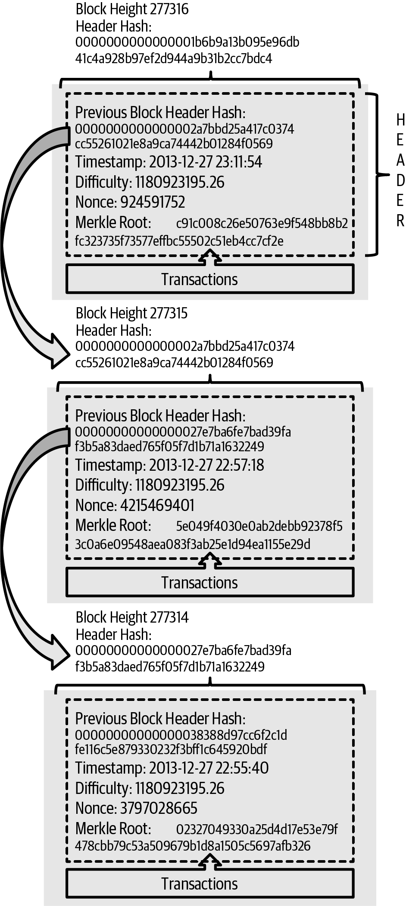
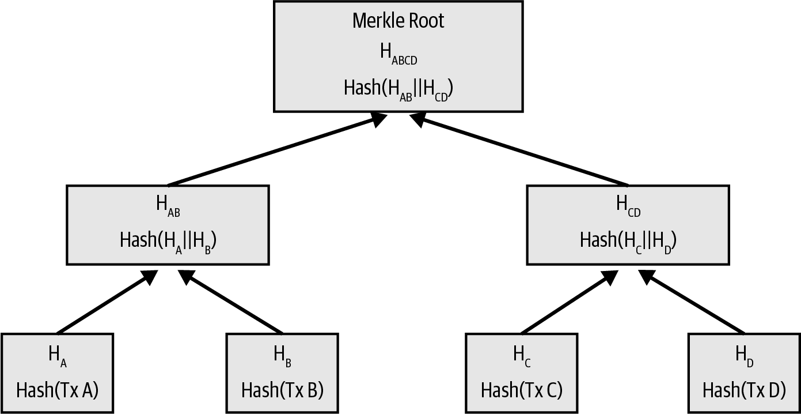
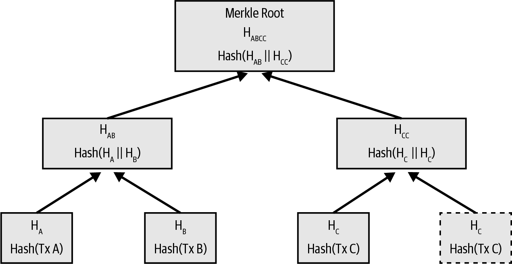
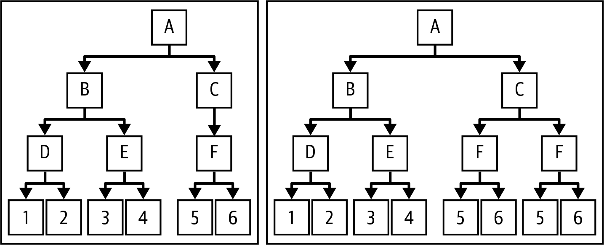
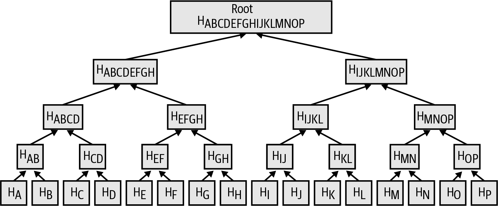
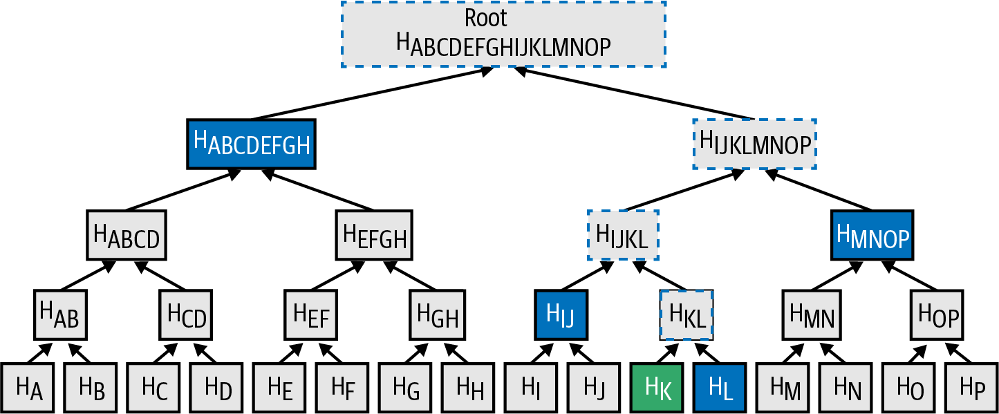

[[blockchain]]
== The Blockchain

The ((("blockchain", "explained", id="blockchain-explain")))blockchain is the history of every confirmed Bitcoin transaction.
It's what allows every full node to independently determine what keys and
scripts control which bitcoins.  In this chapter, we'll look at the
structure of the blockchain and see how it uses cryptographic
commitments and other clever tricks to make every part of it easy for
full nodes (and sometimes lightweight clients) to validate.

The blockchain data structure is
an ordered, back-linked list of blocks of transactions.  The blockchain
can be stored as a flat file or in a simple database.
Blocks are linked "back," each referring to the previous block in the
chain. The blockchain is often visualized
as a vertical stack, with blocks layered on top of each other and the
first block serving as the foundation of the stack. The visualization of
blocks stacked on top of each other results in the use of terms such as
"height" to refer to the distance from the first block, and "top" or
"tip" to refer to the most recently added block.

Each block
within the blockchain is identified by a hash, generated using the
SHA256 cryptographic hash algorithm on the header of the block. Each
block also commits to the previous block, known as ((("parent blocks")))the _parent_ block,
through the "previous block hash" field in the block header.
The sequence of hashes linking each block to its parent creates a chain
going back all the way to the first block ever created, known ((("genesis block")))as the
_genesis block_.

Although a block has just one parent, it can have ((("child blocks")))multiple
children. Each of the children commits to the same parent block.
Multiple children arise during a blockchain "fork," a temporary
situation that can occur when different blocks are discovered almost
simultaneously by different miners (see <<forks>>). Eventually only one
child block becomes part of the blockchain accepted by all full nodes, and the "fork" is resolved.

The "previous block hash" field is inside the block header and thereby
affects the _current_ block's hash.
Any change to a parent block
requires a child block's hash to change, which requires a change in the
pointer of the grandchild, which in turn changes the grandchild, and so
on. This sequence ensures that, once a block has many generations
following it, it cannot be changed without forcing a recalculation of
all subsequent blocks. Because such a recalculation would require
enormous computation (and therefore energy consumption), the existence
of a long chain of blocks makes the blockchain's deep history impractical to change,
which is a key feature of Bitcoin's security.

One way to think about the blockchain is like layers in a geological
formation, or glacier core sample. The surface layers might change with
the seasons, or even be blown away before they have time to settle. But
once you go a few inches deep, geological layers become more and more
stable. By the time you look a few hundred feet down, you are looking at
a snapshot of the past that has remained undisturbed for millions of
years. In the blockchain, the most recent few blocks might be revised if
there is a chain reorganization due to a fork. The top six blocks are
like a few inches of topsoil. But once you go more deeply into the
blockchain, beyond six blocks, blocks are less and less likely to
change. After 100 blocks back there is so much stability that
the coinbase transaction--the transaction containing the reward in
bitcoin for creating a new block--can be spent.
While the
protocol always allows a chain to be undone by a longer chain and while
the possibility of any block being reversed always exists, the
probability of such an event decreases as time passes until it ((("blockchain", "explained", startref="blockchain-explain")))becomes
infinitesimal.

=== Structure of a Block

A block ((("blocks", "structure of")))is a container data structure that aggregates
transactions for inclusion in the blockchain. The
block is made of a header, containing metadata, followed by a long list
of transactions that make up the bulk of its size. The block header is
80 bytes, whereas the total size of all transactions in a block can be
up to about 4,000,000 bytes.  A complete block,
with all transactions, can therefore be almost 50,000 times larger than the block
header. <<block_structure1>> describes how Bitcoin Core stores the structure of a block.

++++
<table id="block_structure1">
<caption>The structure of a block</caption>
<thead>
<tr>
<th>Size</th>
<th>Field</th>
<th>Description</th>
</tr>
</thead>
<tbody>
<tr>
<td>
4 bytes
</td>
<td>
Block Size
</td>
<td>
The size of the block, in bytes, following this field
</td>
</tr>
<tr>
<td>
80 bytes
</td>
<td>
Block Header
</td>
<td>
Several fields form the block header
</td>
</tr>
<tr>
<td>
1–3 bytes (compactSize)
</td>
<td>
Transaction Counter
</td>
<td>
How many transactions follow
</td>
</tr>
<tr>
<td>
Variable
</td>
<td>
Transactions
</td>
<td>
The transactions recorded in this block
</td>
</tr>
</tbody>
</table>
++++

[[block_header]]
=== Block Header

The ((("blocks", "block header")))((("block header")))block header consists of
block metadata as shown in <<block_header_structure_ch09>>.

++++
<table id="block_header_structure_ch09">
<caption>The structure of the block header</caption>
<thead>
<tr>
<th>Size</th>
<th>Field</th>
<th>Description</th>
</tr>
</thead>
<tbody>
<tr>
<td>
4 bytes
</td>
<td>
Version
</td>
<td>
Originally a version field; its use has evolved over time
</td>
</tr>
<tr>
<td>
32 bytes
</td>
<td>
Previous Block Hash
</td>
<td>
A hash of the previous (parent) block in the chain
</td>
</tr>
<tr>
<td>
32 bytes
</td>
<td>
Merkle Root
</td>
<td>
The root hash of the merkle tree of this block’s transactions
</td>
</tr>
<tr>
<td>
4 bytes
</td>
<td>
Timestamp
</td>
<td>
The approximate creation time of this block (Unix epoch time)
</td>
</tr>
<tr>
<td>
4 bytes
</td>
<td>
Target
</td>
<td>
A compact encoding of the proof-of-work target for this block
</td>
</tr>
<tr>
<td>
4 bytes
</td>
<td>
Nonce
</td>
<td>
Arbitrary data used for the proof-of-work algorithm
</td>
</tr>
</tbody>
</table>
++++

The nonce, target, and timestamp are used in the mining
process and will be discussed in more detail in <<mining>>.

[[block_hash]]
=== Block Identifiers: Block Header Hash and Block Height

The ((("blocks", "identifiers", id="block-identify")))((("block header hash", id="block-header-hash")))((("block height", id="block-height")))primary identifier of a block
is its cryptographic hash, a commitment made by hashing the
block header twice through the SHA256 algorithm. The resulting 32-byte
hash is called the _block hash_ but is more accurately the _block header
hash_, pass:[because only the block header is
used to compute it. For example,]
+000000000019d6689c085ae165831e934ff763ae46a2a6c172b3f1b60a8ce26f+ is
the block hash of the first block on Bitcoin's blockchain. The block hash
identifies a block uniquely and unambiguously and can be independently
derived by any node by simply hashing the block header.

Note that the block hash is not actually included inside the block's
data structure.
Instead, the block's hash is computed by each node as the
block is received from the network. The block hash might be stored in a
separate database table as part of the block's metadata, to facilitate
indexing and faster retrieval of blocks from disk.

A second way to identify a block is by its position in the blockchain,
called the pass:[<em>block height</em>. The
genesis block is at block height 0 (zero) and is the]
pass:[same block that was previously
referenced by the following block hash]
+000000000019d6689c085ae165831e934ff763ae46a2a6c172b3f1b60a8ce26f+. A
block can thus be identified in two ways: by referencing the block hash
or by referencing the block height. Each subsequent block added "on top"
of that first block is one position "higher" in the blockchain, like
boxes stacked one on top of the other. The block height 800,000 was
reached during the writing of this book in mid-2023, meaning there were
800,000 blocks stacked on top of the first block created in January
2009.

Unlike the block hash, the block height is not a unique identifier.
Although a single block will always have a specific and invariant block
height, the reverse is not true—the block height does not always
identify a single block. Two or more blocks might have the same block
height, competing for the same position in the blockchain. This scenario
is discussed in detail in the section <<forks>>.  In early blocks, the block height was
also not a part of the block's data structure; it was not stored within
the block. Each node dynamically identified a block's position (height)
in the blockchain when it was received from the Bitcoin network.  A
later protocol change (BIP34) began including the block height in the
coinbase transaction, although its purpose was to ensure each block had
a different coinbase transaction.  Nodes still need to dynamically
identify a block's height in order to validate the coinbase field.  The
block height might also be stored as metadata in an indexed database
table for faster retrieval.

[TIP]
====
A block's _block hash_ always identifies a single block uniquely. A
block also always has a specific _block height_. However, it is not
always the case that a specific block height identifies a single
block. Rather, two or more blocks might compete for a single position((("blocks", "identifiers", startref="block-identify")))((("block header hash", startref="block-header-hash")))((("block height", startref="block-height"))) in
the blockchain.
====

=== The Genesis Block

The first block((("blockchain", "genesis block", id="blockchain-genesis")))((("genesis block", id="genesis-block")))((("Bitcoin Core", "genesis block", id="bitcoin-core-genesis"))) in the blockchain is called the _genesis block_
and was created in 2009. It is the common ancestor of all the blocks in
the blockchain, meaning that if you start at any block and follow the
chain backward in time, you will eventually arrive at the genesis block.

Every node always starts with a blockchain of at least one block because
the genesis block is statically encoded within Bitcoin Core,
such that it cannot be altered. Every node always "knows" the
genesis block's hash and structure, the fixed time it was created, and
even the single transaction within. Thus, every node has the starting
point for the blockchain, a secure "root" from which to build a trusted
blockchain.

See the statically encoded genesis block inside the Bitcoin Core client
in https://oreil.ly/FqPW5[_chainparams.cpp_].

The following identifier hash belongs to the genesis block:

----
000000000019d6689c085ae165831e934ff763ae46a2a6c172b3f1b60a8ce26f
----

You can search for that block hash in almost any block explorer website, such
as _blockstream.info_, and you will find a page describing the contents
of this block, with a URL containing that hash:

[quote]
____
https://blockstream.info/block/000000000019d6689c085ae165831e934ff763ae46a2a6c172b3f1b60a8ce26f
____

Alternatively, you can get the block using Bitcoin Core on the command line:

----
$ bitcoin-cli getblock \
  000000000019d6689c085ae165831e934ff763ae46a2a6c172b3f1b60a8ce26f
----
[source,json]
----
{
  "hash": "000000000019d6689c085ae165831e934ff763ae46a2a6c172b3f1b60a8ce26f",
  "confirmations": 790496,
  "height": 0,
  "version": 1,
  "versionHex": "00000001",
  "merkleroot": "4a5e1e4baab89f3a32518a88c3[...]76673e2cc77ab2127b7afdeda33b",
  "time": 1231006505,
  "mediantime": 1231006505,
  "nonce": 2083236893,
  "bits": "1d00ffff",
  "difficulty": 1,
  "chainwork": "[...]000000000000000000000000000000000000000000000100010001",
  "nTx": 1,
  "nextblockhash": "00000000839a8e6886ab5951d7[...]fc90947ee320161bbf18eb6048",
  "strippedsize": 285,
  "size": 285,
  "weight": 1140,
  "tx": [
    "4a5e1e4baab89f3a32518a88c31bc87f618f76673e2cc77ab2127b7afdeda33b"
  ]
}
----

The genesis block contains a message within it. The coinbase
transaction input contains the text "The Times 03/Jan/2009 Chancellor on
brink of second bailout for banks." This message was intended to offer
proof of the earliest date this block could have been created, by referencing the
headline of the British newspaper _The Times_. It also serves as a
tongue-in-cheek reminder of the importance of an independent monetary
system, with Bitcoin's launch occurring at the same time as an
unprecedented worldwide monetary crisis. The message was embedded in the
first block by Satoshi Nakamoto, Bitcoin's ((("Nakamoto, Satoshi")))((("blockchain", "genesis block", startref="blockchain-genesis")))((("genesis block", startref="genesis-block")))((("Bitcoin Core", "genesis block", startref="bitcoin-core-genesis")))creator.

=== Linking Blocks in the Blockchain

Bitcoin((("blockchain", "linking blocks", id="blockchain-link")))((("blocks", "linking in blockchain", id="block-link")))((("linking blocks in blockchain", id="link-block"))) full nodes validate every
block in the blockchain after the genesis block. Their local view of
the blockchain is constantly updated as new blocks are found and used to
extend the chain. As a node receives incoming blocks from the network,
it will validate these blocks and then link them to its view of the existing
blockchain. To establish a link, a node will examine the incoming block
header and look for the "previous block hash."

[role="less_space pagebreak-before"]
Let's assume, for example, that a node has 277,314 blocks in the local
copy of the blockchain. The last block the node knows about is block
277,314, with a block header hash of:

----
00000000000000027e7ba6fe7bad39faf3b5a83daed765f05f7d1b71a1632249
----

The Bitcoin node then receives a new block from the network, which it
parses as follows:

[source,json]
----
{
    "size" : 43560,
    "version" : 2,
    "previousblockhash" :
        "00000000000000027e7ba6fe7bad39faf3b5a83daed765f05f7d1b71a1632249",
    "merkleroot" :
        "5e049f4030e0ab2debb92378f53c0a6e09548aea083f3ab25e1d94ea1155e29d",
    "time" : 1388185038,
    "difficulty" : 1180923195.25802612,
    "nonce" : 4215469401,
    "tx" : [
        "257e7497fb8bc68421eb2c7b699dbab234831600e7352f0d9e6522c7cf3f6c77",
        "[... many more transactions omitted ...]",
        "05cfd38f6ae6aa83674cc99e4d75a1458c165b7ab84725eda41d018a09176634"
    ]
}
----

Looking at this new block, the node finds the +previousblockhash+ field,
which contains the hash of its parent block. It is a hash known to the
node, that of the last block on the chain at height 277,314. Therefore,
this new block is a child of the last block on the chain and extends the
existing blockchain. The node adds this new block to the end of the
chain, making the blockchain longer with a new height of 277,315.
<<chain_of_blocks>> shows the chain of three blocks, linked by
references in((("blockchain", "linking blocks", startref="blockchain-link")))((("blocks", "linking in blockchain", startref="block-link")))((("linking blocks in blockchain", startref="link-block"))) the +previousblockhash+ field.

[[chain_of_blocks]]
.Blocks linked in a chain by each referencing the previous block header hash.

[[merkle_trees]]
=== Merkle Trees

Each block((("blockchain", "merkle trees", id="blockchain-merkle")))((("merkle trees", id="merkle-tree-explain"))) in the Bitcoin blockchain contains
a summary of all the transactions in the block using a _merkle tree_.

A _merkle tree_, also known
as a _binary hash tree_, is ((("binary hash trees")))a data structure used for efficiently
summarizing and verifying the integrity of large sets of data. Merkle
trees are binary trees containing cryptographic hashes. The term "tree"
is used in computer science to describe a branching data structure, but
these trees are usually displayed upside down with the "root" at the top
and the "leaves" at the bottom of a diagram, as you will see in the
examples that follow.

Merkle trees are used in Bitcoin to summarize all the transactions in a
block, producing an overall commitment to the entire set of
transactions and permitting a very efficient process to verify whether a
transaction is included in a block. A merkle tree is constructed by
recursively hashing pairs of elements until there is only one hash, called
the _root_, or _merkle root_. The cryptographic hash algorithm used in
Bitcoin's merkle trees is SHA256 applied twice, also known as
double-SHA256.

When N data elements are hashed and summarized in a merkle tree, you can
check to see if any one data element is included in the tree with 
about +log~2~(N)+ calculations, making this a very efficient data
structure.

The merkle tree is constructed bottom-up. In the following example, we
start with four transactions, A, B, C, and D, which form the _leaves_ of
the merkle tree, as shown in <<simple_merkle>>. The transactions are not
stored in the merkle tree; rather, their data is hashed and the
resulting hash is stored in each leaf node as H~A~, H~B~, H~C~, and
H~D~:

++++
<pre data-type="codelisting">
HA = SHA256(SHA256(Transaction A))
</pre>
++++

Consecutive pairs of leaf nodes are then summarized in a parent node by
concatenating the two hashes and hashing them together. For example, to
construct the parent node H~AB~, the two 32-byte hashes of the children
are concatenated to create a 64-byte string. That string is then
double-hashed to produce the parent node's hash:

++++
<pre data-type="codelisting">
HAB = SHA256(SHA256(HA || HB))
</pre>
++++

The process continues until there is only one node at the top, the node
known as the merkle root. That 32-byte hash is stored in the block
header and summarizes all the data in all four transactions.
<<simple_merkle>> shows how the root is calculated by pair-wise hashes
of the nodes.

[[simple_merkle]]
.Calculating the nodes in a merkle tree.

Because the merkle tree is a binary tree, it needs
an even number of leaf nodes. If there are an odd number of transactions
to summarize, the last transaction hash will be duplicated to create an
even number of leaf nodes, also known ((("balanced merkle trees")))as a _balanced tree_. This is
shown in <<merkle_tree_odd>>, where transaction C is duplicated.
Similarly, if there are an odd number of hashes to process at any level,
the last hash is duplicated.

[[merkle_tree_odd]]
.Duplicating one data element achieves an even number of data elements.

.A Design Flaw in Bitcoin's Merkle Tree
****
An extended comment in Bitcoin Core's source code, reproduced here with slight revisions, describes a
significant problem in the design of Bitcoin's duplication of odd
elements in its merkle tree:

____
WARNING! If you're reading this because you're learning about crypto
and/or designing a new system that will use merkle trees, keep in mind
that the following merkle tree algorithm has a serious flaw related to
duplicate txids, resulting in a vulnerability (CVE-2012-2459).

The reason is that if the number of hashes in the list at a given level
is odd, the last one is duplicated before computing the next level (which
is unusual in merkle trees). This results in certain sequences of
transactions leading to the same merkle root. For example, the two
trees in <<cve_tree>>:

[[cve_tree]]
[role="width-90"]
.Two Bitcoin-style merkle trees with the same root but a different number of leaves.

The transaction lists [1,2,3,4,5,6] and [1,2,3,4,5,6,5,6] (where 5 and
6 are repeated) result in the same root hash A (because the hash of both
of (F) and (F,F) is C).

The vulnerability results from being able to send a block with such a
transaction list, with the same merkle root, and the same block hash as
the original without duplication, resulting in failed validation. If the
receiving node proceeds to mark that block as permanently invalid
however, it will fail to accept further unmodified (and thus potentially
valid) versions of the same block. We defend against this by detecting
the case where we would hash two identical hashes at the end of the list
together, and treating that identically to the block having an invalid
merkle root. Assuming no double-SHA256 collisions, this will detect all
known ways of changing the transactions without affecting the merkle
root.

++++

Bitcoin Core <em>src/consensus/merkle.cpp</em>

++++
____

****

[role="less_space pagebreak-before"]
The same method for constructing a tree from four transactions can be
generalized to construct trees of any size. In Bitcoin it is common to
have several thousand transactions in a single
block, which are summarized in exactly the same way, producing just 32
bytes of data as the single merkle root. In <<merkle_tree_large>>, you
will see a tree built from 16 transactions. Note that although the root
looks bigger than the leaf nodes in the diagram, it is the exact same
size, just 32 bytes. Whether there is one transaction or ten
thousand transactions in the block, the merkle root always summarizes
them into 32 bytes.

To prove that a specific transaction is
included in a block, a node only needs to produce approximately +log~2~(N)+ 32-byte
hashes, constituting ((("authentication path")))((("merkle path")))an _authentication path_ or _merkle path_
connecting the specific transaction to the root of the tree. This is
especially important as the number of transactions increases because
the base-2 logarithm of the number of transactions increases much more
slowly. This allows Bitcoin nodes to efficiently produce paths of 10 or
12 hashes (320–384 bytes), which can provide proof of a single
transaction out of more than a thousand transactions in a multimegabyte
block.

[[merkle_tree_large]]
.A merkle tree summarizing many data elements.

In <<merkle_tree_path>>, a node can prove that a transaction K is
included in the block by producing a merkle path that is only four
32-byte hashes long (128 bytes total). The path consists of the four
hashes (shown with a shaded background) H~L~,
H~IJ~, H~MNOP~, and H~ABCDEFGH~. With those four hashes provided as an
authentication path, any node can prove that H~K~ (with a black
background at the bottom of the diagram) is included in the merkle root
by computing four additional pair-wise hashes H~KL~, H~IJKL~,
H~IJKLMNOP~, and the merkle tree root (outlined in a dashed line in the
diagram).

[[merkle_tree_path]]
.A merkle path used to prove inclusion of a data element.

The efficiency of merkle trees becomes obvious as the scale increases.
The largest possible block can hold almost 16,000 transactions in 4,000,000
bytes, but proving any particular one of those 16,000 transactions
is a part of that block only requires a copy of the transaction, a copy
of the 80-byte block header, and 448 bytes for the merkle proof.  That
makes the largest possible proof almost 10,000 times smaller than the
largest possible Bitcoin block.

=== Merkle Trees and Lightweight Clients

Merkle trees are ((("Bitcoin network", "lightweight clients", "merkle trees and")))((("lightweight clients", "merkle trees and")))used extensively by lightweight clients. Lightweight clients don't
have all transactions and do not download full blocks, just block
headers. In order to verify that a transaction is included in a block,
without having to download all the transactions in the block, they use
a merkle path.

Consider, for example, a lightweight client that is interested in incoming
payments to an address contained in its wallet. The lightweight client will
establish a bloom filter (see <<bloom_filters>>) on its connections to
peers to limit the transactions received to only those containing
addresses of interest. When a peer sees a transaction that matches the
bloom filter, it will send that block using a +merkleblock+ message. The
+merkleblock+ message contains the block header as well as a merkle path
that links the transaction of interest to the merkle root in the block.
The lightweight client can use this merkle path to connect the transaction to the
block header and verify that the transaction is included in the block. The lightweight
client also uses the block header to link the block to the rest of the
blockchain. The combination of these two links, between the transaction
and block and between the block and blockchain, proves that the
transaction is recorded in the blockchain. All in all, the lightweight client will
have received less than a kilobyte of data for the block header and
merkle path, an amount of data that is more than a thousand times less
than a full block (about 2 MB ((("blockchain", "merkle trees", startref="blockchain-merkle")))((("merkle trees", startref="merkle-tree-explain")))currently).

=== Bitcoin's Test Blockchains

You might be
surprised to learn that there is more than one blockchain used with Bitcoin. The
"main" Bitcoin blockchain, the one created by Satoshi Nakamoto on
January 3rd, 2009, the one with the genesis block we studied in this
chapter, is ((("mainnet")))called _mainnet_.  There are other Bitcoin blockchains that
are used for testing purposes: at this time _testnet_, _signet_, and
_regtest_. Let's look at each in turn.

==== Testnet: Bitcoin's Testing Playground

Testnet is ((("blockchain", "test blockchains", "testnet", id="blockchain-test-testnet")))((("test blockchains", "testnet", id="test-block-testnet")))((("testnet", id="testnet")))the name of the test blockchain, network, and currency that
is used for testing purposes. The testnet is a fully featured live P2P
network, with wallets, test bitcoins (testnet coins), mining, and all
the other features of mainnet.  The most important difference is that
testnet coins are meant to be worthless.

Any software development that is intended for production use on
Bitcoin's mainnet can first be tested on testnet with test coins.
This protects both the developers from monetary losses due to bugs and
the network from unintended behavior due to bugs.

The current testnet is called _testnet3_, the third iteration of
testnet, restarted in February 2011 to reset the difficulty from the
previous testnet.  Testnet3 is a large blockchain, in excess of 30 GB in
2023. It will take a while to sync fully and use up resources
on your computer. Not as much as mainnet, but not exactly "lightweight"
either.

[TIP]
====
Testnet and the other test blockchains described in this book don't use
the same address prefixes as mainnet addresses to prevent someone from
accidentally sending real bitcoins to a test address.  Mainnet addresses
begin with +1+, +3+, or +bc1+.  Addresses for the test networks
mentioned in this book begin with +m+, +n+, or +tb1+.  Other test
networks, or new protocols being developed on test networks, may use
other address prefixes or alterations.
====

===== Using testnet

Bitcoin Core, like((("Bitcoin Core", "testnet"))) many other Bitcoin programs, has full support
for operation on testnet as an alternative mainnet. All of Bitcoin Core's
functions work on testnet, including the wallet, mining testnet coins,
and syncing a full testnet node.

[role="less_space pagebreak-before"]
To start Bitcoin Core on testnet instead of mainnet you use the
+testnet+ switch:

----
$ bitcoind -testnet
----

In the logs you should see that bitcoind is building a new blockchain in
the +testnet3+ subdirectory of the default bitcoind directory:

----
bitcoind: Using data directory /home/username/.bitcoin/testnet3
----

To connect to bitcoind, you use the +bitcoin-cli+ command-line tool, but
you must also switch it to testnet mode:

----
$ bitcoin-cli -testnet getblockchaininfo
{
  "chain": "test",
  "blocks": 1088,
  "headers": 139999,
  "bestblockhash": "0000000063d29909d475a1c[...]368e56cce5d925097bf3a2084370128",
  "difficulty": 1,
  "mediantime": 1337966158,
  "verificationprogress": 0.001644065914099759,
  "chainwork": "[...]000000000000000000000000000000000000000000044104410441",
  "pruned": false,
  "softforks": [

  [...]
----

You can also run on testnet3 with other full-node implementations, such
as +btcd+ (written in Go) and +bcoin+ (written in JavaScript), to
experiment and learn in other programming languages and frameworks.

Testnet3 supports all the features of mainnet, including
segregated witness v0 and v1 (see <<segwit>> and <<taproot>>). Therefore, testnet3 can also be
used to test segregated witness features.

===== Problems with testnet

Testnet doesn't just use the same data structures as Bitcoin, it also
uses almost exactly the same proof-of-work security mechanism as
Bitcoin.  The notable differences for testnet are that its minimum
difficulty is half that of Bitcoin and that it's allowed to include a
block at the minimum difficulty if that block's timestamp is more than
20 minutes after the previous block.

Unfortunately, Bitcoin's PoW security mechanism was designed to depend
on economic incentives--incentives which don't exist in a test
blockchain that is forbidden from having value.  On mainnet, miners are
incentivized to include user transactions in their blocks because those
transactions pay fees.  On testnet, transactions still contain something
called fees, but those fees don't have any economic value.  That means
the only incentive for a testnet miner to include transactions is
because they want to help users and developers to test their software.

Alas, people who like to disrupt systems often feel a stronger
incentive, at least in the short term.  Because PoW mining is designed
to be permissionless, anyone can mine, whether their intention is good
or not.  That means disruptive miners can create many blocks in a row on
testnet without including any user transactions.  When those attacks
happen, testnet becomes unusable for users and ((("blockchain", "test blockchains", "testnet", startref="blockchain-test-testnet")))((("test blockchains", "testnet", startref="test-block-testnet")))((("testnet", startref="testnet")))developers.

==== Signet: The Proof of Authority Testnet

There's no ((("blockchain", "test blockchains", "signet", id="blockchain-test-signet")))((("test blockchains", "signet", id="test-block-signet")))((("signet", id="signet")))known way for a system dependent on permissionless PoW to
provide a highly usable blockchain without introducing economic
incentives, so Bitcoin protocol developers began considering
alternatives.  The primary goal was to preserve as much of the structure of
Bitcoin as possible so that software could run on a testnet with minimal
changes--but to also provide an environment that would remain useful.
A secondary goal was to produce a reusable design that would allow
developers of new software to easily create their own test networks.

The solution implemented in Bitcoin Core and other software is called
_signet_, as defined by BIP325.  A signet is a test network where each
block must contain proof (such as a signature) that the creation of that
block was sanctioned by a trusted authority.

Whereas mining in Bitcoin is permissionless--anyone can do it--mining on
signet is fully permissioned.  Only those with permission can do it.
This would be a completely unacceptable change to Bitcoin's mainnet--no
one would use that software--but it's reasonable on a testnet where coins have
no value and the only purpose is testing software and systems.

BIP325 signets are designed to make it very easy to create your own.  If
you disagree with how someone else is running their signet, you can
start your own signet and connect your software to it.

===== The default signet and custom signets

Bitcoin Core supports((("Bitcoin Core", "signet")))((("default signet")))((("custom signets"))) a default signet, which we believe to be the most
widely used signet at the time of writing.  It is currently operated by
two contributors to that project.  If you start Bitcoin Core with the
+signet+ parameter and no other signet-related parameters, this is the
signet you will be using.

As of this writing, the default signet has about 150,000 blocks and is
about a gigabyte in size.  It supports all of the same features as
Bitcoin's mainnet and is also used for testing proposed upgrades through
the Bitcoin Inquisition project, which is a software fork of Bitcoin
Core that's only designed to run on signet.

If you want to use a different signet, called a _custom signet_, you
will need to know the script used to determine when a block is
authorized, called((("challenge script"))) the _challenge_ script.  This is a standard Bitcoin
script, so it can use features such as multisig to allow multiple people
to authorize blocks.  You may also need to connect to a seed node that
will provide you with the addresses of peers on the custom signet.  For
example:

----
bitcoind -signet -signetchallenge=0123...cdef -signetseednode=example.com:1234
----

As of this writing, we generally recommend that the public testing of
mining software occur on testnet3 and that all other public testing of
Bitcoin software occur on the default signet.

To interact with your chosen signet, you can use the +-signet+ parameter
with +bitcoin-cli+, similar to how you used testnet.  For((("blockchain", "test blockchains", "signet", startref="blockchain-test-signet")))((("test blockchains", "signet", startref="test-block-signet")))((("signet", startref="signet"))) example:

----
$ bitcoin-cli -signet getblockchaininfo
{
  "chain": "signet",
  "blocks": 143619,
  "headers": 143619,
  "bestblockhash": "000000c46cb3505ddd296537[...]ad1c5768e2908439382447572a93",
  "difficulty": 0.003020638517858618,
  "time": 1684530244,
  "mediantime": 1684526116,
  "verificationprogress": 0.999997961940662,
  "initialblockdownload": false,
  "chainwork": "[...]000000000000000000000000000000000000000000019ab37d2194",
  "size_on_disk": 769525915,
  "pruned": false,
  "warnings": ""
}
----

==== Regtest: The Local Blockchain

Regtest, ((("blockchain", "test blockchains", "regtest", id="blockchain-test-regtest")))((("test blockchains", "regtest", id="test-block-regtest")))((("regtest", id="regtest")))which stands for
"Regression Testing," is a Bitcoin Core feature that allows you to
create a local blockchain for testing purposes. Unlike signet and testnet3, which
are public and shared test blockchains, the regtest blockchains are
intended to be run as closed systems for local testing. You launch a
regtest blockchain from scratch. You may
add other nodes to the network or run it with a single node only to
test the Bitcoin Core software.

To start ((("Bitcoin Core", "regtest")))Bitcoin Core in regtest mode, you use the +regtest+ flag:

----
$ bitcoind -regtest
----

Just like with testnet, Bitcoin Core will initialize a new blockchain
under the _regtest_ subdirectory of your bitcoind default directory:

----
bitcoind: Using data directory /home/username/.bitcoin/regtest
----

[role="less_space pagebreak-before"]
To use the command-line tool, you need to specify the +regtest+ flag
too. Let's try the +getblockchaininfo+ command to inspect the regtest
blockchain:

----
$ bitcoin-cli -regtest getblockchaininfo
{
  "chain": "regtest",
  "blocks": 0,
  "headers": 0,
  "bestblockhash": "0f9188f13cb7b2c71f2a335e3[...]b436012afca590b1a11466e2206",
  "difficulty": 4.656542373906925e-10,
  "mediantime": 1296688602,
  "verificationprogress": 1,
  "chainwork": "[...]000000000000000000000000000000000000000000000000000002",
  "pruned": false,
  [...]
----

As you can see, there are no blocks yet. Let's create a default wallet,
get an address, and then mine some (500 blocks) to earn the reward:

----
$ bitcoin-cli -regtest createwallet ""

$ bitcoin-cli -regtest getnewaddress
bcrt1qwvfhw8pf79kw6tvpmtxyxwcfnd2t4e8v6qfv4a

$ bitcoin-cli -regtest generatetoaddress 500 \
  bcrt1qwvfhw8pf79kw6tvpmtxyxwcfnd2t4e8v6qfv4a
[
  "3153518205e4630d2800a4cb65b9d2691ac68eea99afa7fd36289cb266b9c2c0",
  "621330dd5bdabcc03582b0e49993702a8d4c41df60f729cc81d94b6e3a5b1556",
  "32d3d83538ba128be3ba7f9dbb8d1ef03e1b536f65e8701893f70dcc1fe2dbf2",
  ...,
  "32d55180d010ffebabf1c3231e1666e9eeed02c905195f2568c987c2751623c7"
]
----

It will only take a few seconds to mine all these blocks, which
certainly makes it easy for testing. If you check your wallet balance,
you will see that you earned the rewards for the first 400 blocks (coinbase
rewards must be 100 blocks deep before you can ((("blockchain", "test blockchains", "regtest", startref="blockchain-test-regtest")))((("test blockchains", "regtest", startref="test-block-regtest")))((("regtest", startref="regtest")))spend them):

----
$ bitcoin-cli -regtest getbalance
12462.50000000
----

=== Using Test Blockchains for Development

Bitcoin's ((("blockchain", "test blockchains", "development usage")))((("test blockchains", "development usage")))various
blockchains (regtest, signet, testnet3, mainnet) offer a range
of testing environments for bitcoin development. Use the test
blockchains whether you are developing for Bitcoin Core or another
full-node consensus client; developing an application such as a wallet, exchange,
ecommerce site; or even developing novel smart contracts and complex
scripts).

You can use the test blockchains to establish a development pipeline.
Test your code locally on a regtest as you develop it. Once you are
ready to try it on a public network, switch to signet or testnet to expose your
code to a more dynamic environment with more diversity of code and
applications. Finally, once you are confident your code works as
expected, switch to mainnet to deploy it in production. As you make
changes, improvements, bug fixes, etc., start the pipeline again,
deploying each change first on regtest, then on signet or testnet, and finally
into production.

Now that we know what data the blockchain contains and how cryptographic
commitments securely tie the various parts together, we will look at the
special commitment that both provide computational security and
ensure no block can be changed without invalidating all other blocks
built on top of it: Bitcoin's mining function.
