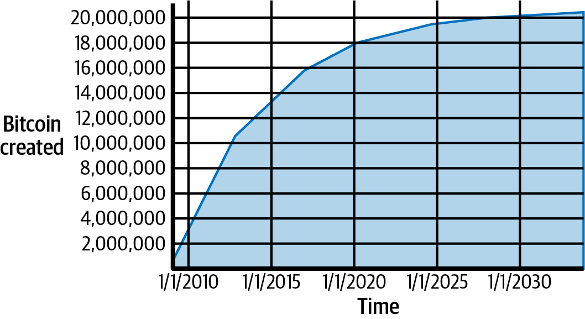
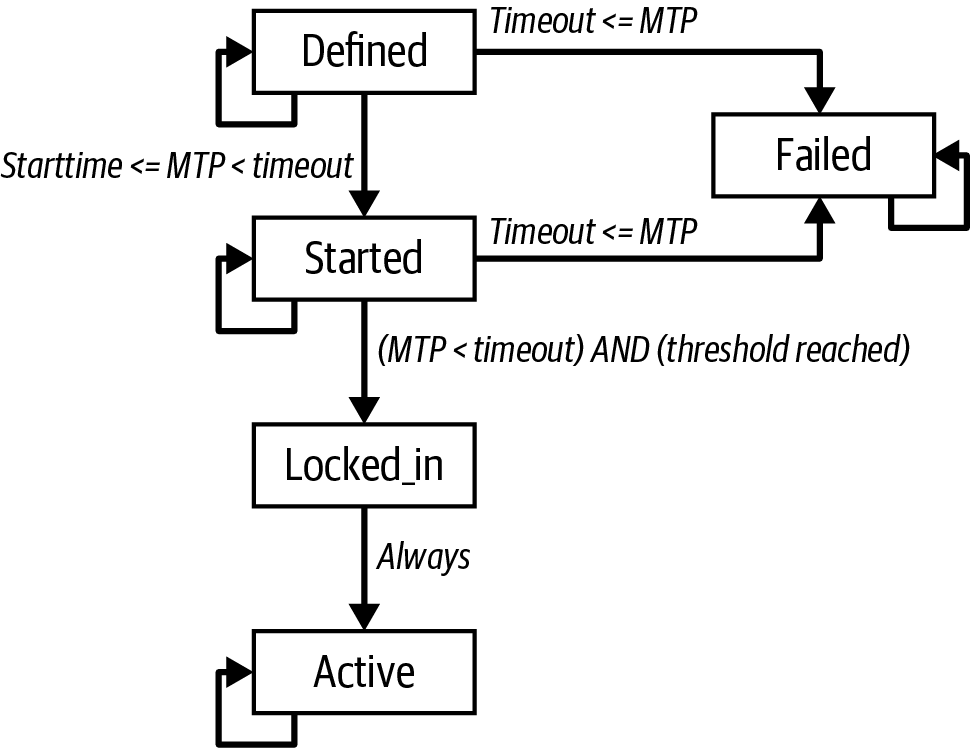

[[mining]]
== Mining and Consensus

The ((("mining", "purpose of")))word "mining" is somewhat
misleading. By evoking the extraction of precious metals, it focuses our
attention on the reward for mining, the new bitcoins created in each
block. Although mining is incentivized by this reward, the primary
purpose of mining is not the reward or the generation of new bitcoins. If
you view mining only as the process by which bitcoins are created, you are
mistaking the means (incentives) as the goal of the process. Mining is
the mechanism that underpins the decentralized clearinghouse, by which
transactions are validated and cleared. Mining is one of the inventions that
makes Bitcoin special, a decentralized consensus mechanism that is the
basis for P2P digital cash.

Mining _secures the Bitcoin system_ and enables the
emergence of network-wide _consensus without a central authority_.
The reward of newly minted bitcoins and
transaction fees is an incentive scheme that aligns the actions of
miners with the security of the network, while simultaneously
implementing the monetary supply.

[TIP]
====

Mining
is one of the mechanisms by which Bitcoin's _consensus security_ is _decentralized_.
====

Miners ((("mining", "operational overview", id="mining-overview")))record new transactions on the global blockchain. A
new block, containing transactions that occurred since the last block,
is _mined_ every 10 minutes on average, thereby adding those
transactions to the blockchain. Transactions that become part of a block
and added to the blockchain are considered _confirmed_, which allows the
new owners of the bitcoins to know that irrevocable effort was expended
securing the bitcoins they received in those
transactions.

Additionally, transactions in the blockchain have a _topological order_
defined by their position in the blockchain.  One transaction is
earlier than another if it appears in an earlier block or if it appears
earlier in the same block.  In the Bitcoin protocol, a transaction is
only valid if it spends the outputs of transactions that appeared
earlier in the blockchain (whether they are earlier in the same block or
in an earlier block), and only if no previous transaction spent any of
those same outputs.  Within a single chain of blocks, the enforcement of
topological ordering ensures no two valid transactions can spend the same
output, eliminating the problem of _double spending_.

In some protocols built on top of Bitcoin, the topological order of
Bitcoin transactions is also used to establish a sequence of events;
we'll discuss that idea further in <<single_use_seals>>.

Miners((("bitcoins", "mining", "incentives")))((("mining", "incentives")))((("incentives"))) receive two types of rewards in
return for the security provided by mining: new bitcoins created with each
new block (called the _subsidy_), and transaction fees from all the transactions included in
the block. To earn this reward, miners compete to satisfy a challenge
based on a cryptographic hash algorithm. The
solution to the problem, called the proof of work, is included in the
new block and acts as proof that the miner expended significant
computing effort. The competition to solve the proof-of-work algorithm
to earn the reward and the right to record transactions on the
blockchain is the basis for Bitcoin's security model.

Bitcoin's money supply is created in a process that's similar to how
a central bank issues new money by printing bank notes. The maximum
amount of newly created bitcoin a miner can add to a block decreases
approximately every four years (or precisely every 210,000 blocks). It
started at 50 bitcoins per block in January 2009 and halved to 25
bitcoins per block in November 2012. It halved again to 12.5 bitcoins
in July 2016, and again to 6.25 in May 2020. Based on this formula, mining rewards decrease
exponentially until approximately the year 2140, when all bitcoins
will have been issued. After 2140, no new bitcoin
will be issued.

Bitcoin miners ((("transaction fees")))also earn fees from transactions. Every transaction may
include a transaction fee in the form of a surplus of bitcoins between
the transaction's inputs and outputs. The winning bitcoin miner gets to
"keep the change" on the transactions included in the winning block.
Today, the fees usually represent only a small percentage of a
miner's income, with the
vast majority coming from the newly minted bitcoins. However, as the
reward decreases over time and the number of transactions per block
increases, a greater proportion of mining earnings will come
from fees. Gradually, the mining reward will be dominated by transaction
fees, which will form the primary incentive for miners. After 2140, the
amount of new bitcoins in each block drops to zero and mining
will be incentivized only by transaction fees.

In this chapter, we will first examine mining as a monetary supply
mechanism and then look at the most important function of mining: the
decentralized consensus mechanism that underpins Bitcoin's security.

To understand mining and consensus, we will track Alice's transaction
as it is received and added to a block by Jing's mining equipment. Then
we will follow the block as it is mined, added to the blockchain, and
accepted by the Bitcoin network through the process of ((("mining", "operational overview", startref="mining-overview")))emergent
consensus.

=== Bitcoin Economics and Currency Creation

Bitcoin are ((("bitcoins", "mining", "currency creation", id="bitcoin-mining-create")))((("mining", "currency creation", id="mining-create")))((("currency creation", id="currency-create")))((("Bitcoin", "economics of", id="bitcoin-economics")))((("economics of Bitcoin", id="economics")))minted during the creation of each block at a
fixed and diminishing rate. Each block, generated on average every 10
minutes, contains entirely new bitcoins, created from nothing. Every
210,000 blocks, or approximately every four years, the currency issuance
rate is decreased by 50%. For the first four years of operation of the
network, each block contained 50 new bitcoins.

The first halving occurred at block 210,000.  The next expected halving
after publication of this book will occur at block 840,000, which will
probably be produced in April or May of 2024.
The rate of new bitcoins decreases
exponentially over 32 of these _halvings_ until block 6,720,000 (mined
approximately in year 2137), when it reaches the minimum currency unit
of 1 satoshi. Finally, after 6.93 million blocks, in approximately 2140,
almost 2,099,999,997,690,000 satoshis, or almost 21 million bitcoin,
will have been issued. Thereafter, blocks will contain no new bitcoins, and
miners will be rewarded solely through the transaction fees.
<<bitcoin_money_supply>> shows the total bitcoins in circulation over
time, as the issuance of currency decreases.

[[bitcoin_money_supply]]
.Supply of bitcoin currency over time based on a geometrically decreasing issuance rate.

[NOTE]
====
The maximum number of bitcoins mined is the _upper limit_ of possible
mining rewards for Bitcoin. In practice, a miner may intentionally mine
a block taking less than the full reward. Such blocks have already been
mined and more may be mined in the future, resulting in a lower total
issuance of the currency.
====

In the code in <<max_money>>, we calculate the total amount of
bitcoin that will be issued.

[[max_money]]
.A script for calculating how much total bitcoin will be issued
====
[source, python]
----
include::code/max_money.py[]
----
====

<<max_money_run>> shows the output produced by running this script.

[[max_money_run]]
.Running the max_money.py script
====
[source,bash]
----
$ python max_money.py
Total BTC to ever be created: 2099999997690000 Satoshis
----
====

The finite and diminishing issuance creates a fixed monetary supply that
resists inflation. Unlike a fiat currency, which can be printed in
infinite numbers by a central bank, no individual party has the ability
to inflate the supply of ((("bitcoins", "mining", "currency creation", startref="bitcoin-mining-create")))((("mining", "currency creation", startref="mining-create")))((("currency creation", startref="currency-create")))bitcoin.

.Deflationary Money
****
The most ((("deflation", id="deflation")))((("inflation", id="inflation")))important and debated consequence of
fixed and diminishing monetary issuance is that the currency tends to be
inherently _deflationary_. Deflation is the phenomenon of appreciation
of value due to a mismatch in supply and demand that drives up the value
(and exchange rate) of a currency. Price deflation is the opposite of inflation; it means that the money has more purchasing power over time.

Many economists argue that a deflationary economy is a disaster that
should be avoided at all costs. That is because in a period of rapid
deflation, people tend to hoard money instead of spending it, hoping
that prices will fall. Such a phenomenon unfolded during Japan's "Lost
Decade," when a complete collapse of demand pushed the currency into a
deflationary spiral.

Bitcoin experts argue that deflation is not bad per se. Rather,
deflation is associated with a collapse in demand because that is the
most obvious example of deflation we have to study. In a fiat currency with the
possibility of unlimited printing, it is very difficult to enter a
deflationary spiral unless there is a complete collapse in demand and an
unwillingness to print money. Deflation in Bitcoin is not caused by a
collapse in demand, but by a predictably constrained supply.

The positive aspect of deflation, of course, is that it is the opposite
of inflation. Inflation causes a slow but inevitable debasement of
currency, resulting in a form of hidden taxation that punishes savers in
order to bail out debtors (including the biggest debtors, governments
themselves). Currencies under government control suffer from the moral
hazard of easy debt issuance that can later be erased through debasement
at the expense of savers.

It remains to be seen whether the deflationary aspect of the currency is
a problem when it is not driven by rapid economic retraction, or an
advantage because the protection from inflation and debasement
outweighs the risks of((("Bitcoin", "economics of", startref="bitcoin-economics")))((("economics of Bitcoin", startref="economics")))((("deflation", startref="deflation")))((("inflation", startref="inflation"))) deflation.
****

=== Decentralized Consensus

In the ((("mining", "decentralized consensus", id="mining-consensus")))((("decentralized consensus", id="decentral-consensus")))((("emergent consensus", id="emergent-consensus")))((("consensus", see="decentralized consensus")))previous chapter we looked at the
blockchain, the global list of all transactions, which
everyone in the Bitcoin network accepts as the authoritative record of
ownership transfers.

But how can everyone in the network agree on a single universal "truth"
about who owns what, without having to trust anyone? All traditional
payment systems depend on a trust model that has a central authority
providing a clearinghouse service, basically verifying and clearing all
transactions. Bitcoin has no central authority, yet somehow every full
node has a complete copy of a public blockchain that it can trust as the
authoritative record. The blockchain is not created by a central
authority but is assembled independently by every node in the network.
Somehow, every node in the network, acting on information transmitted
across insecure network connections, can arrive at the same conclusion
and assemble a copy of the same blockchain as everyone else. This
chapter examines the process by which the Bitcoin network achieves
global consensus without central authority.

One of Satoshi Nakamoto's inventions is the decentralized
mechanism for _emergent consensus_. Emergent because consensus is not
achieved explicitly—there is no election or fixed moment when consensus
occurs. Instead, consensus is an emergent artifact of the asynchronous
interaction of thousands of independent nodes, all following simple
rules. All the properties of Bitcoin, including currency, transactions,
payments, and the security model that does not depend on central
authority or trust, derive from this invention.

Bitcoin's decentralized consensus emerges from the interplay of four
processes that occur independently on nodes across the network:

- Independent verification of each transaction, by every full node,
  based on a comprehensive list of criteria

- Independent aggregation of those transactions into new blocks by
  mining nodes, coupled with demonstrated computation through a
  proof-of-work algorithm

- Independent verification of the new blocks by every node and assembly
  into a chain

- Independent selection, by every node, of the chain with the most
  cumulative computation demonstrated through proof of work

In the next few sections, we will examine these processes and how they
interact to create the emergent property of network-wide consensus that
allows any Bitcoin node to assemble its own copy of the authoritative,
trusted, public, global ((("mining", "decentralized consensus", startref="mining-consensus")))((("decentralized consensus", startref="decentral-consensus")))((("emergent consensus", startref="emergent-consensus")))blockchain.

[[tx_verification]]
=== Independent Verification of Transactions

In
<<c_transactions>>, we saw ((("mining", "independent transaction verification", id="mining-verify")))((("transactions", "independent verification", id="transaction-verify")))((("independent transaction verification", id="independent-transaction-verify")))((("verifying", "transactions", id="verify-transaction")))((("nodes", "transaction verification", id="node-verify")))how wallet software creates transactions by
collecting UTXOs, providing the appropriate authentication data, and then
constructing new outputs assigned to a new owner. The resulting
transaction is then sent to the neighboring nodes in the Bitcoin network
so that it can be propagated across the entire Bitcoin network.

However, before forwarding transactions to its neighbors, every Bitcoin
node that receives a transaction will first verify the transaction. This
ensures that only valid transactions are propagated across the network,
while invalid transactions are discarded at the first node that
encounters them.

Each node verifies every transaction against a long checklist of
criteria:

- The transaction's syntax and data structure must be correct.

- Neither lists of inputs nor outputs are empty.

- The transaction weight is low enough to allow it to fit in a block.

- Each output value, as well as the total, must be within the allowed
  range of values (zero or more, but not exceeding 21 million bitcoins).

- Lock time is equal to +INT_MAX+, or lock time and sequence
  values are satisfied according to the lock time and BIP68 rules.

- The number of signature operations (SIGOPS) contained in the
  transaction is less than the signature operation limit.

- The outputs being spent match outputs in the mempool or unspent
  outputs in a block in the main branch.

- For each input, if the referenced output transaction is a coinbase
  output, it must have at least +COINBASE_MATURITY+ (100) confirmations.
  Any absolute or relative lock time must also be satisfied.  Nodes may
  relay transactions a block before they mature since they will be
  mature if included in the next block.

- Reject if the sum of input values is less than sum of output values.

- The scripts for each input must validate against the
  corresponding output scripts.

Note that the conditions change over time, to add new features or
address new types of denial-of-service attacks.

By independently verifying each transaction as it is received and before
propagating it, every node builds a pool of valid (but unconfirmed)
transactions known ((("mining", "independent transaction verification", startref="mining-verify")))((("transactions", "independent verification", startref="transaction-verify")))((("independent transaction verification", startref="independent-transaction-verify")))((("verifying", "transactions", startref="verify-transaction")))((("nodes", "transaction verification", startref="node-verify")))((("memory pool")))as the _memory pool_ or
_mempool_.

=== Mining Nodes

Some of the((("mining", "miner nodes, purpose of", id="mining-nodes-purpose")))((("nodes", "miner nodes", "purpose of", id="nodes-miner-purpose"))) nodes on the Bitcoin network are specialized nodes
called _miners_. Jing is a
Bitcoin miner; he
earns bitcoin by running a "mining rig," which is a specialized
computer-hardware system designed to mine bitcoin. Jing's specialized
mining hardware is connected to a server running a full node.
Like every other full node, Jing's node receives and
propagates unconfirmed transactions on the Bitcoin network. Jing's node,
however, also aggregates these transactions into new blocks.

Let's follow the blocks that were created during the time Alice made a
purchase from Bob (see <<spending_bitcoin>>).  For the purpose of
demonstrating the concepts in this chapter, let's assume the block
containing Alice's transaction was mined by Jing's mining system and
follow Alice's transaction as it becomes part of this new block.

Jing's mining node maintains a local copy of the blockchain. By the time
Alice buys something, Jing's
node is caught up with the chain of blocks with the most proof of work.
Jing's node is listening
for transactions, trying to mine a new block and also listening for
blocks discovered by other nodes. As Jing's node is mining, it receives
a new block through the Bitcoin network. The arrival of this block
signifies the end of the search for that block and the beginning
of the search to create the next block.

During the previous several minutes, while Jing's node was searching for a
solution to the previous block, it was also collecting transactions in
preparation for the next block. By now it has collected a few thousand
transactions in its memory pool. Upon receiving the new block and
validating it, Jing's node will also compare it against all the
transactions in the memory pool and remove any that were included in
that block. Whatever transactions remain in the memory pool are
unconfirmed and are waiting to be recorded in a new block.

Jing's node immediately constructs a new partial block, a
candidate for the next block. This block is ((("candidate blocks")))((("blocks", "candidate blocks")))called a _candidate block_
because it is not yet a valid block, as it does not contain a valid
proof-of-work. The block becomes valid only if the miner succeeds in
finding a solution according to the proof-of-work algorithm.

When Jing's node aggregates all the transactions from the memory pool,
the new candidate block has several thousand transactions that each pay
transaction fees he'll attempt to((("mining", "miner nodes, purpose of", startref="mining-nodes-purpose")))((("nodes", "miner nodes", "purpose of", startref="nodes-miner-purpose"))) claim.

==== The Coinbase Transaction

The ((("bitcoins", "mining", "coinbase transactions", id="bitcoin-mining-coinbase")))((("mining", "coinbase transactions", id="mining-coinbase")))((("nodes", "miner nodes", "coinbase transactions", id="nodes-miner-coinbase")))((("coinbase transactions", id="coinbase")))((("transactions", "coinbase", id="transaction-coinbase")))first transaction in any
block is a special transaction, called a _coinbase transaction_. This
transaction is constructed by Jing's node and pays out his _reward_ for
the mining effort.

Jing's node creates the coinbase transaction as a payment to his own
wallet. The total amount of
reward that Jing collects for mining a block is the sum of the block
subsidy (6.25 new bitcoins in 2023) and the transaction fees from all
the transactions included in the block.

Unlike regular transactions, the coinbase transaction does not consume
(spend) UTXOs as inputs. Instead, it has only one input, called the
_coinbase input_, which implicitly contains the block reward. The coinbase transaction
must have at least one output and may have as many outputs as will fit
in the block.  It's common for coinbase transactions in 2023 to have two
outputs: one of these is a zero-value output that uses +OP_RETURN+ to
commit to all of the witnesses for segregated witness (segwit)
transactions in the block.  The other output pays the miner their
reward.

==== Coinbase Reward and Fees

To construct((("rewards", id="reward-coinbase")))((("transaction fees", "in coinbase transactions", secondary-sortas="coinbase transactions", id="transaction-fee-coinbase"))) the
coinbase transaction, Jing's node first calculates the total amount of
transaction fees:

[latexmath]
++++
\begin{equation}
Total\:Fees = Sum(Inputs) - Sum(Outputs)
\end{equation}
++++

Next, Jing's node calculates the correct reward for the new block. The
reward is calculated based on the block height, starting at 50 bitcoin
per block and reduced by half every 210,000 blocks.

The calculation can be seen in function +GetBlockSubsidy+ in the Bitcoin
Core client, as shown in <<getblocksubsidy_source>>.

[[getblocksubsidy_source]]
.Calculating the block reward&#x2014;Function [.plain]#+GetBlockSubsidy+,# Bitcoin Core Client, [.plain]#main.cpp#
====
[role="c_less_space"]
[source, cpp]
----
CAmount GetBlockSubsidy(int nHeight, const Consensus::Params& consensusParams)
{
    int halvings = nHeight / consensusParams.nSubsidyHalvingInterval;
    // Force block reward to zero when right shift is undefined.
    if (halvings >= 64)
        return 0;

    CAmount nSubsidy = 50 * COIN;
    // Subsidy is cut in half every 210,000 blocks.
    nSubsidy >>= halvings;
    return nSubsidy;
}
----
====

The initial subsidy is calculated in satoshis by multiplying 50 with the
+COIN+ constant (100,000,000 satoshis). This sets the initial reward
(+nSubsidy+) at 5 billion satoshis.

Next, the function calculates the number of +halvings+
that have occurred by dividing the current block height by the halving
interval (+SubsidyHalvingInterval+).

Next, the function uses the binary-right-shift operator to divide the
reward [.keep-together]#(+nSubsidy+)# by two for each round of halving. In the case of
block 277,316, this would binary-right-shift the reward of 5 billion
satoshis once (one halving) and result in 2.5 billion satoshis, or 25
bitcoins. After the 33rd halving, the subsidy will be rounded down to
zero.  The binary-right-shift operator is used because it is more
efficient than multiple repeated divisions. To avoid a potential bug,
the shift operation is skipped after 63 halvings, and the subsidy is set
to 0.

Finally, the coinbase reward (+nSubsidy+) is added to the transaction
fees (+nFees+), and the sum is returned.

[TIP]
====
If Jing's mining node writes the coinbase transaction, what stops Jing
from "rewarding" himself 100 or 1,000 bitcoin? The answer is that an
inflated reward would result in the block being deemed invalid by
everyone else, wasting Jing's electricity used for PoW. Jing
only gets to spend the reward if the block is accepted by ((("rewards", startref="reward-coinbase")))((("transaction fees", "in coinbase transactions", secondary-sortas="coinbase transactions", startref="transaction-fee-coinbase")))everyone.
====

==== Structure of the Coinbase Transaction

With these calculations,
Jing's node then constructs the coinbase transaction to pay himself
the block reward.

The coinbase transaction
has a special format. Instead of a transaction input specifying a
previous UTXO to spend, it has a "coinbase" input. We examined
transaction inputs in <<inputs>>. Let's compare a regular transaction
input with a coinbase transaction input. <<table_8-1>> shows the
structure of a regular transaction, while <<table_8-2>> shows the
structure of the((("inputs", "coinbase versus regular transactions"))) coinbase transaction's input.

++++
<table id="table_8-1">
<caption>The structure of a “normal” transaction input</caption>
<thead>
<tr>
<th>Size</th>
<th>Field</th>
<th>Description</th>
</tr>
</thead>
<tbody>
<tr>
<td>
32 bytes
</td>
<td>
Transaction Hash
</td>
<td>
Pointer to the transaction containing the UTXO to be spent
</td>
</tr>
<tr>
<td>
4 bytes
</td>
<td>
Output Index
</td>
<td>
The index number of the UTXO to be spent, first one is 0
</td>
</tr>
<tr>
<td>
1–9 bytes (compactSize)
</td>
<td>
Script Size
</td>
<td>
Script length in bytes, to follow
</td>
</tr>
<tr>
<td>
Variable
</td>
<td>
Input Script
</td>
<td>
A script that fulfills the conditions of the UTXO output script
</td>
</tr>
<tr>
<td>
4 bytes
</td>
<td>
Sequence Number
</td>
<td>
Multipurpose field used for BIP68 timelocks and transaction replacement signaling
</td>
</tr>
</tbody>
</table>
<table id="table_8-2">
<caption>The structure of a coinbase transaction input</caption>
<thead>
<tr>
<th>Size</th>
<th>Field</th>
<th>Description</th>
</tr>
</thead>
<tbody>
<tr>
<td>
32 bytes
</td>
<td>
Transaction Hash
</td>
<td>
All bits are zero: Not a transaction hash reference
</td>
</tr>
<tr>
<td>
4 bytes
</td>
<td>
Output Index
</td>
<td>
All bits are ones: 0xFFFFFFFF
</td>
</tr>
<tr>
<td>
1 byte
</td>
<td>
Coinbase Data Size
</td>
<td>
Length of the coinbase data, from 2 to 100 bytes
</td>
</tr>
<tr>
<td>
Variable
</td>
<td>
Coinbase Data
</td>
<td>
Arbitrary data used for extra nonce and mining tags; in v2 blocks, must begin with block height
</td>
</tr>
<tr>
<td>
4 bytes
</td>
<td>
Sequence Number
</td>
<td>
Set to 0xFFFFFFFF
</td>
</tr>
</tbody>
</table>
++++

In a coinbase transaction, the first two fields are set to values that
do not represent a UTXO reference. Instead of a "transaction hash," the
first field is filled with 32 bytes all set to zero. The "output index"
is filled with 4 bytes all set to 0xFF (255 decimal). The
input script is replaced by coinbase data, a data field used by
the miners, as we will see next.

[[duplicate_transactions]]
==== Coinbase Data

Coinbase ((("coinbase data")))transactions do
not have an input script field. Instead, this
field is replaced by coinbase data, which must be between 2 and 100
bytes. Except for the first few bytes, the rest of the coinbase data can
be used by miners in any way they want; it is arbitrary data.

In the genesis block, for
example, Satoshi Nakamoto added the text "The Times 03/Jan/2009
Chancellor on brink of second bailout for banks" in the coinbase data,
using it as a proof of the earliest date this block could have been
created and to convey a message. Currently,
miners often use the coinbase data to include extra nonce values and strings
identifying the mining pool.

[role="less_space pagebreak-before"]
The first few bytes of the coinbase used to be arbitrary, but that is no
longer the case. As per BIP34, version-2 blocks (blocks with the
version field set to 2 or higher) must contain the block height as a script
"push" operation in the beginning of the ((("bitcoins", "mining", "coinbase transactions", startref="bitcoin-mining-coinbase")))((("mining", "coinbase transactions", startref="mining-coinbase")))((("nodes", "miner nodes", "coinbase transactions", startref="nodes-miner-coinbase")))((("coinbase transactions", startref="coinbase")))((("transactions", "coinbase", startref="transaction-coinbase")))coinbase field.

=== Constructing the Block Header

To
construct ((("mining", "constructing block header", id="mining-blockheader")))((("nodes", "miner nodes", "constructing block header", id="nodes-miner-blockheader")))((("block header", "constructing", id="block-header-construct")))the block header, the mining node needs to fill in six fields,
as listed in <<block_header_structure_ch10>>.

++++
<table id="block_header_structure_ch10">
<caption>The structure of the block header</caption>
<thead>
<tr>
<th>Size</th>
<th>Field</th>
<th>Description</th>
</tr>
</thead>
<tbody>
<tr>
<td>
4 bytes
</td>
<td>
Version
</td>
<td>
A multipurpose bitfield
</td>
</tr>
<tr>
<td>
32 bytes
</td>
<td>
Previous Block Hash
</td>
<td>
A reference to the hash of the previous (parent) block in the chain
</td>
</tr>
<tr>
<td>
32 bytes
</td>
<td>
Merkle Root
</td>
<td>
A hash that is the root of the merkle tree of this block’s transactions
</td>
</tr>
<tr>
<td>
4 bytes
</td>
<td>
Timestamp
</td>
<td>
The approximate creation time of this block (seconds from Unix Epoch)
</td>
</tr>
<tr>
<td>
4 bytes
</td>
<td>
Target
</td>
<td>
The proof-of-work algorithm target for this block
</td>
</tr>
<tr>
<td>
4 bytes
</td>
<td>
Nonce
</td>
<td>
A counter used for the proof-of-work algorithm
</td>
</tr>
</tbody>
</table>
++++

The version field was originally an integer field and was used in three
upgrades to the Bitcoin network, those defined in BIPs 34, 66, and 65.
Each time, the version number was incremented.  Later upgrades defined
the version field as a bitfield, called _versionbits_, allowing up to 29
upgrades to be in progress simultaneously; see <<bip9>> for details.
Even later, miners began using some of the versionbits as an auxiliary
nonce field.

[TIP]
====
The protocol upgrades defined in BIPs 34, 66, and 65 occurred in that
order, with BIP66 (strict DER) occurring before BIP65
(+OP_CHECKTIMELOCKVERIFY+), so Bitcoin developers often list them in
that order rather than sorted numerically.
====

Today, the versionbits field has no meaning unless there's an attempt to
upgrade the consensus protocol underway, in which case you will need to
read its documentation to determine how it is using versionbits.

Next, the mining
node needs to add the "Previous Block Hash" (also known as [.keep-together]#+prevhash+).#
That is the hash of the block header of the previous block
received from the network, which Jing's node has accepted and
selected as the _parent_ of his candidate block.

[TIP]
====
By selecting the specific _parent_ block, indicated by the Previous
Block Hash field in the candidate block header, Jing is committing his
mining power to extending the chain that ends in that specific block.
====

The next
step is to commit to all the transactions using merkle trees.  Each
transaction is listed using its witness transaction identifier (_wtxid_)
in topographical order, with 32 0x00 bytes standing in for the wtxid of
the first transaction (the coinbase).  As we saw in the <<merkle_trees>>
the last wtxid is hashed with itself if there are an odd number of wtxids,
creating nodes that each contain the hash of one transaction. The
transaction hashes are then combined, in pairs, creating each level of
the tree, until all the transactions are summarized into one node at the
"root" of the tree. The root of the merkle tree summarizes all the
transactions into a single 32-byte value, which is the _witness root
hash_.

The witness root hash is added to an output of the coinbase transaction.
This step may be skipped if none of the transactions in the block are
required to contain a witness structure.  Each transaction (including
the coinbase transaction) is then listed using its transaction
identifier (txid) and used to build a second merkle tree, the root of
which becomes the merkle root, to which the block header commits.

Jing's mining node will then add a 4-byte timestamp, encoded as a Unix
"epoch" timestamp, which is based on the number of seconds elapsed from
January 1, 1970, midnight UTC/GMT.

Jing's node then fills in the nBits target, which must be set to a
compact representation of the required
PoW to make this a valid block. The target is stored in the
block as a "target bits" metric, which is a mantissa-exponent encoding
of the target. The encoding has a 1-byte exponent, followed by a 3-byte
mantissa (coefficient). In block 277,316, for example, the target bits
value is +0x1903a30c+. The first part +0x19+ is a hexadecimal exponent,
while the next part, +0x03a30c+, is the coefficient. The concept of a
target is explained in <<target>> and the "target bits" representation
is explained in <<target_bits>>.

The final field is the nonce, which is initialized to zero.

With all the other fields filled, the header of the candidate block is now complete and
the process of mining can begin. The goal is now to find a header
that results in a hash that is less than the target.
The mining node will need to test billions or trillions of variations of
the header before a version is found that satisfies the((("mining", "constructing block header", startref="mining-blockheader")))((("nodes", "miner nodes", "constructing block header", startref="nodes-miner-blockheader")))((("block header", "constructing", startref="block-header-construct"))) requirement.

[role="less_space pagebreak-before"]
=== Mining the Block

Now
that((("candidate blocks", "mining", id="candidate-mine")))((("blocks", "candidate blocks", "mining", id="block-candidate-mine")))((("mining", "candidate blocks", id="mining-candidate"))) a candidate block has been constructed by Jing's node, it is time
for Jing's hardware mining rig to "mine" the block, to find a solution
to the proof-of-work algorithm that makes the block valid. Throughout
this book we have studied cryptographic hash functions as used in
various aspects of the Bitcoin system. The hash function SHA256 is the
function used in Bitcoin's mining process.

In the simplest terms, mining is
the process of hashing the candidate block header repeatedly, changing one
parameter, until the resulting hash matches a specific target. The hash
function's result cannot be determined in advance, nor can a pattern be
created that will produce a specific hash value. This feature of hash
functions means that the only way to produce a hash result matching a
specific target is to try again and again, modifying the input
until the desired hash result appears by chance.

==== Proof-of-Work Algorithm

A hash((("mining", "proof-of-work algorithm", id="mining-proof")))((("hash functions", "proof-of-work algorithm", id="hash-proof")))((("proof-of-work algorithm", id="proof-mining"))) algorithm takes an
arbitrary-length data input and produces a fixed-length deterministic
result, called a _digest_.  The digest is a digital commitment to the
input. For any specific input, the resulting digest will always be the
same and can be easily calculated and
verified by anyone implementing the same hash algorithm.
A key characteristic of a cryptographic hash
algorithm is that it is computationally infeasible to find two different
inputs that produce the same digest (known as a _collision_). As a
corollary, it is also virtually impossible to select an input in such a
way as to produce a desired digest, other than trying random
inputs.

With((("SHA256 hash function"))) SHA256, the output is always 256 bits long, regardless of the size
of the input. For example, we will calculate the SHA256 hash of the
phrase, "Hello, World!":

----
$ echo "Hello, world!" | sha256sum
d9014c4624844aa5bac314773d6b689ad467fa4e1d1a50a1b8a99d5a95f72ff5  -
----

This
256-bit output (represented in hex) is the _hash_ or _digest_ of the phrase and depends on
every part of the phrase. Adding a single letter, punctuation mark, or
any other character will produce a different hash.

A variable used in such a scenario is called a _nonce_.
The nonce is used to vary the output of a cryptographic function, in
this case to vary the output of the SHA256 commitment to the phrase.

To make a challenge out of this algorithm, let's set a target: find a
phrase that produces a hexadecimal hash that starts with a zero.
Fortunately, this isn't difficult, as shown in <<sha256_example_generator_output2>>.

[[sha256_example_generator_output2]]
.Simple proof-of-work implementation
====
----
$ for nonce in $( seq 100 ) ; do echo "Hello, world! $nonce" | sha256sum ; done
3194835d60e85bf7f728f3e3f4e4e1f5c752398cbcc5c45e048e4dbcae6be782  -
bfa474bbe2d9626f578d7d8c3acc1b604ec4a7052b188453565a3c77df41b79e  -
[...]
f75a100821c34c84395403afd1a8135f685ca69ccf4168e61a90e50f47552f61  -
09cb91f8250df04a3db8bd98f47c7cecb712c99835f4123e8ea51460ccbec314  -
----
====

The phrase "Hello, World! 32" produces the following hash, which fits our criteria: 
+09cb91f8250df04a3db8bd98f47c7cecb712c99835f4123e8ea51460ccbec314+. It took 32 attempts to find it. In terms of
probabilities, if the output of the hash function is evenly distributed,
we would expect to find a result with a 0 as the hexadecimal prefix once
every 16 hashes (one out of 16 hexadecimal digits 0 through F). In
numerical terms, that means finding a hash value that is less than
+0x1000000000000000000000000000000000000000000000000000000000000000+. We
call this threshold the _target_, and the goal is to find a hash that is
numerically less than the target. If we decrease the target, the task of
finding a hash that is less than the target becomes more and more
difficult.

++++

To give a simple analogy, imagine a game where players throw a pair of
dice repeatedly, trying to throw less than a specified target. In the
first round, the target is 12. Unless you throw double-6, you win. In
the next round the target is 11. Players must throw 10 or less to win,
again an easy task. Let's say a few rounds later the target is down to
5. Now, more than half the dice throws will exceed the target and
therefore be invalid. It takes more dice throws to win
the lower the target gets. Eventually, when the target is 3 (the minimum
possible), only one throw out of every 36, or about 3% of them, will produce a
winning result.

++++

From the perspective of an observer who knows that the target of the
dice game is 3, if someone has succeeded in casting a winning throw it
can be assumed that they attempted, on average, 36 throws. In other
words, one can estimate the amount of work it takes to succeed from the
difficulty imposed by the target. When the algorithm is based on a
deterministic function such as SHA256, the input itself constitutes
_proof_ that a certain amount of _work_ was done to produce a result
below the target. Hence, _proof of work_.

[TIP]
====
Even though each attempt produces a random outcome, the probability of
any possible outcome can be calculated in advance. Therefore, an outcome
of specified difficulty constitutes proof of a specific amount of work.
====

In <<sha256_example_generator_output2>>, the winning "nonce" is 32, and
this result can be confirmed by anyone independently. Anyone can add the
number 32 as a suffix to the phrase "Hello, world!" and compute
the hash, verifying that it is less than the target:

----
$ echo "Hello, world! 32" | sha256sum
09cb91f8250df04a3db8bd98f47c7cecb712c99835f4123e8ea51460ccbec314  -
----

++++

Although it only takes one hash computation to verify, it took
us 32 hash computations to find a nonce that worked. If we had a lower
target (higher difficulty), it would take many more hash computations to
find a suitable nonce, but only one hash computation for anyone to
verify. And by knowing the target, anyone can estimate the
difficulty using statistics and therefore know roughly how much work was needed
to find such a nonce.

++++

[TIP]
====
The PoW must produce a hash that is _less than_ the target. A
higher target means it is less difficult to find a hash that is below
the target. A lower target means it is more difficult to find a hash
below the target. The target and difficulty are inversely related.
====

++++

Bitcoin's PoW is very similar to the challenge
shown in <a data-type="xref" href="#sha256_example_generator_output2">#sha256_example_generator_output2</a>. The miner constructs a
candidate block filled with transactions. Next, the miner calculates the
hash of this block's header and sees if it is smaller than the current
<em>target</em>. If the hash is not less than the target, the miner will modify
the nonce (usually just incrementing it by one) and try again. At the
current difficulty in the Bitcoin network, miners have to try
a huge number of times before finding a nonce that results in a low
enough block header hash.

++++

[[target_bits]]
==== Target Representation

//TODO:use visual representation like I did on bitcoin.org

Block headers ((("mining", "proof-of-work algorithm", startref="mining-proof")))((("hash functions", "proof-of-work algorithm", startref="hash-proof")))((("proof-of-work algorithm", startref="proof-mining")))((("mining", "target representation", id="mining-target")))((("targets", "representation of", id="target-represent")))((("proof-of-work algorithm", "target representation", id="proof-target")))contain the target in a notation called "target
bits" or just "bits," which in block 277,316 has the value of
+0x1903a30c+. This notation expresses the proof-of-work target as a
coefficient/exponent format, with the first two hexadecimal digits for
the exponent and the next six hex digits as the coefficient. In this
block, therefore, the exponent is +0x19+ and the coefficient is
+0x03a30c+.

The formula to calculate the difficulty target from this representation
is:

++++
<ul class="simplelist">
  <li>target = coefficient × 2(8 × (exponent – 3))</li>
</ul>
++++

Using that formula, and the difficulty bits value 0x1903a30c, we get:

++++
<ul class="simplelist">
  <li>target = 0x03a30c × 20x08 × (0x19 – 0x03)</li>
</ul>
++++

which is:

++++
<ul class="simplelist">
  <li>22,829,202,948,393,929,850,749,706,076,701,368,331,072,452,018,388,575,715,328</li>
</ul>
++++

Or, in hexadecimal:

++++
<ul class="simplelist">
  <li>0x0000000000000003A30C00000000000000000000000000000000000000000000</li>
</ul>
++++

This means that a valid block for height 277,316 is one that has a block
header hash less than the target. In binary that number must
have more than 60 leading bits set to zero. With this level of
difficulty, a single miner processing 1 trillion hashes per second (1
terahash per second or 1 TH/sec) would only find a solution once every
8,496 blocks or once every 59 days, ((("mining", "target representation", startref="mining-target")))((("targets", "representation of", startref="target-represent")))((("proof-of-work algorithm", "target representation", startref="proof-target")))on average.

[[target]]
==== Retargeting to Adjust Difficulty

As we saw, ((("mining", "adjusting difficulty", id="mining-difficulty")))((("targets", "adjusting difficulty", id="target-difficulty")))((("proof-of-work algorithm", "adjusting difficulty", id="proof-difficulty")))((("difficulty", "adjusting", id="difficulty-adjust")))the target determines the difficulty and
therefore affects how long it takes to find a solution to the
proof-of-work algorithm. This leads to the obvious questions: Why is the
difficulty adjustable, who adjusts it, and how?

Bitcoin's blocks are generated every 10 minutes, on average. This is
Bitcoin's heartbeat and underpins the frequency of currency issuance and
the speed of transaction settlement. It has to remain constant not just
over the short term, but over a period of many decades. Over this time,
it is expected that computer power will continue to increase at a rapid
pace. Furthermore, the number of participants in mining and the
computers they use will also constantly change. To keep the block
generation time at 10 minutes, the difficulty of mining must be adjusted
to account for these changes. In fact, the proof-of-work target is a
dynamic parameter that is periodically adjusted to meet a 10-minute
block interval goal. In simple terms, the target is set so that the
current mining power will result in a 10-minute block interval.

How, then, is such an adjustment made in a completely decentralized
network? Retargeting occurs automatically and on every node
independently. Every 2,016 blocks, all nodes retarget the PoW.
The ratio between the actual time span and desired time span of 10
minutes per block is calculated and a
proportionate adjustment (up or down) is made to the target. In simple
terms: If the network is finding blocks faster than every 10 minutes,
the difficulty increases (target decreases). If block discovery is
slower than expected, the difficulty decreases (target increases).

The equation can be summarized as:

----
New Target = Old Target * (20,160 minutes / Actual Time of Last 2015 Blocks)
----

[NOTE]
====
While the target calibration happens every 2,016 blocks, because of an
off-by-one error in the original Bitcoin software, it is based on the
total time of the previous 2,015 blocks (not 2,016 as it should be),
resulting in a retargeting bias toward higher difficulty by 0.05%.
====

<<retarget_code>> shows the code used in the Bitcoin Core client.

[[retarget_code]]
.Retargeting the proof of work: [.plain]#++CalculateNextWorkRequired()++# in [.plain]#pow.cpp#
====
[source,cpp]
----

   // Limit adjustment step
    int64_t nActualTimespan = pindexLast->GetBlockTime() - nFirstBlockTime;
    LogPrintf("  nActualTimespan = %d  before bounds\n", nActualTimespan);
    if (nActualTimespan < params.nPowTargetTimespan/4)
        nActualTimespan = params.nPowTargetTimespan/4;
    if (nActualTimespan > params.nPowTargetTimespan*4)
        nActualTimespan = params.nPowTargetTimespan*4;

    // Retarget
    const arith_uint256 bnPowLimit = UintToArith256(params.powLimit);
    arith_uint256 bnNew;
    arith_uint256 bnOld;
    bnNew.SetCompact(pindexLast->nBits);
    bnOld = bnNew;
    bnNew *= nActualTimespan;
    bnNew /= params.nPowTargetTimespan;

    if (bnNew > bnPowLimit)
        bnNew = bnPowLimit;

----
====

The parameters +Interval+ (2,016 blocks) and +TargetTimespan+ (two weeks
as 1,209,600 seconds) are defined in _chainparams.cpp_.

To avoid extreme volatility in the difficulty, the retargeting
adjustment must be less than a factor of four (4) per cycle. If the
required target adjustment is greater than a factor of four, it will be
adjusted by a factor of 4 and not more. Any further adjustment will be
accomplished in the next retargeting period because the imbalance will
persist through the next 2,016 blocks. Therefore, large discrepancies
between hashing power and difficulty might take several 2,016-block
cycles to balance out.

Note that the target is independent of the number of transactions or the
value of transactions. This means that the amount of hashing power and
therefore electricity expended to secure bitcoin is also entirely
independent of the number of transactions. Bitcoin can scale up
and remain secure without any increase in hashing
power from today's level. The increase in hashing power represents
market forces as new miners enter the market.
As long as enough hashing power is under the control of miners acting
honestly in pursuit of the reward, it is enough to prevent "takeover"
attacks and, therefore, it is enough to secure bitcoin.

The difficulty of mining is closely related to the cost of electricity
and the exchange rate of bitcoin vis-a-vis the currency used to pay for
electricity. High-performance mining systems are about as efficient as
possible with the current generation of silicon fabrication, converting
electricity into hashing computation at the highest rate possible. The
primary influence on the mining market is the price of one kilowatt-hour
of electricity in bitcoin because that determines the profitability of
mining and therefore the incentives to enter or exit the ((("mining", "adjusting difficulty", startref="mining-difficulty")))((("targets", "adjusting difficulty", startref="target-difficulty")))((("proof-of-work algorithm", "adjusting difficulty", startref="proof-difficulty")))((("difficulty", "adjusting", startref="difficulty-adjust")))mining
market.

[[mtp]]
=== Median Time Past (MTP)

In Bitcoin ((("decentralized consensus", "timestamps and", id="decentral-consensus-timestamp")))((("consensus rules", "timestamps and", id="consensus-timestamp")))((("timestamps", id="timestamp")))((("median time past (MTP)", id="median-time-past")))((("MTP (median time past)", id="mtp-median")))((("mining", "timestamps", id="mining-timestamps")))there is a subtle, but very
significant, difference between wall time and consensus time. Bitcoin is
a decentralized network, which means that each participant has his or
her own perspective of time. Events on the network do not occur
instantaneously everywhere. Network latency must be factored into the
perspective of each node. Eventually everything is synchronized to
create a common blockchain. Bitcoin reaches consensus every 10 minutes about
the state of the blockchain as it existed in the _past_.

++++

The timestamps set in block headers are set by the miners. There is a
certain degree of latitude allowed by the consensus rules to account for
differences in clock accuracy between decentralized nodes. However, this
creates an unfortunate incentive for miners to lie about the time in a
block.  For example, if a miner sets their time in the future, they can
lower difficulty, allowing them to mine more blocks and claim some of
the block subsidy reserved for future miners.  If they can set their
times in the past for some blocks, they can use the current time for
some other blocks, and so again make it look like there's a long time
between blocks for the purpose of manipulating difficulty.

++++

To prevent manipulation, Bitcoin has two consensus rules.  The first is
that no node will accept any block with a time further in the future
than two hours.  The second is that no node will accept a block with a
time less than or equal to the median time of the last 11 blocks, called
_median time past_ (MTP).

As part of the activation of BIP68 relative timelocks,
there was also a change in the way "time" is calculated for timelocks
(both absolute and relative) in transactions.   Previously, a miner
could include any transaction in a block with a timelock equal to or
below the time of the block.  That incentivized miners to use the latest
time they thought was possible (close to two hours in the future)
so that more transactions would be eligible for their block.

To remove the incentive to lie and strengthen the security of timelocks,
BIP113 was proposed and activated at the same time as the BIPs for
relative timelocks.
The MTP became the consensus
time used for all timelock calculations. By taking the midpoint
from approximately two hours in the past, the influence of any one
block's timestamp is reduced. By incorporating 11 blocks, no single
miner can influence the timestamps in order to gain fees from
transactions with a timelock that hasn't yet matured.

MTP changes the implementation of time calculations for
lock time, +CLTV+, sequence, and +CSV+. The consensus time
calculated by MTP is usually about one hour behind
wall clock time. If you create timelock transactions, you should account
for it when estimating the desired value to encode in lock time,
sequence, +CLTV+, and +CSV+.

=== Successfully Mining the Block

++++

As
we saw earlier, Jing's node has constructed a candidate block and
prepared it for mining. Jing has several hardware mining rigs with
application-specific integrated circuits, where hundreds of thousands of
integrated circuits run Bitcoin's double SHA256 algorithm in parallel at incredible
speeds. Many of these specialized machines are connected to his mining
node over USB or a local area network. Next, the mining node running on
Jing's desktop transmits the block header to his mining hardware, which
starts testing trillions of variations of the header per second. Because
the nonce is only
32 bits, after exhausting all the nonce possibilities (about 4 billion),
the mining hardware changes the block header (adjusting the coinbase
extra nonce space, versionbits, or timestamp) and resets the nonce counter, testing
new combinations.

++++

Almost 11 minutes after starting to mine a particular block, one of the
hardware mining machines finds a solution and sends it back to the
mining node.

Immediately, Jing's mining node transmits the block to all its peers.
They receive, validate, and then propagate the new block. As the block
ripples out across the network, each node adds it to its own copy of the
blockchain, extending it to a new height. As mining
nodes receive and validate the block, they abandon their efforts to find
a block at the same height and immediately start computing the next
block in the chain, using Jing's block as the "parent." By building on
top of Jing's newly discovered block, the other miners are essentially
using their mining power to endorse Jing's block and the
chain((("candidate blocks", "mining", startref="candidate-mine")))((("blocks", "candidate blocks", "mining", startref="block-candidate-mine")))((("mining", "candidate blocks", startref="mining-candidate"))) it extends.

In the next section, we'll look at the process each node uses to
validate a block and select the most-work chain, creating the consensus
that forms the decentralized blockchain.

=== Validating a New Block

The third ((("mining", "validating blocks", id="mining-validate")))((("blocks", "validating", id="block-validate")))((("validating", "blocks", id="validate-block")))((("decentralized consensus", "validating blocks", id="decentral-consensus-validate")))((("nodes", "validating blocks", id="nodes-validate")))step in Bitcoin's
consensus mechanism is independent validation of each new block by every
node on the network. As the newly solved block moves across the network,
each node performs a series of tests to validate it.
The independent validation also ensures that only blocks that follow the
consensus rules are incorporated in the blockchain, thus earning
their miners the reward. Blocks that violate the rules are rejected
and not only lose their miners the reward, but also waste the effort expended to find
a proof-of-work solution, thus incurring upon those miners all of the costs of creating a
block but giving them none of the rewards.

When a node receives a new block, it will validate the block by checking
it against a long list of criteria that must all be met; otherwise, the
block is rejected. These criteria can be seen in the Bitcoin Core client
in the functions +CheckBlock+ and +CheckBlockHeader+ and include:

- The block data structure is syntactically valid.

- The block header hash is less than the target (enforces the
  proof of work).

- The block timestamp is between the MTP and two
  hours in the future (allowing for time errors).

- The block weight is within acceptable limits.

- The first transaction (and only the first) is a coinbase transaction.

- All transactions within the block are valid using the transaction
  checklist discussed in <<tx_verification>>.

The independent validation of each new block by every node on the
network ensures that the miners cannot cheat. In previous sections we
saw how miners get to write a transaction that awards them the new
bitcoin created within the block and claim the transaction fees. Why
don't miners write themselves a transaction for a thousand bitcoins
instead of the correct reward? Because every node validates blocks
according to the same rules. An invalid coinbase transaction would make
the entire block invalid, which would result in the block being rejected
and, therefore, that transaction would never become part of the blockchain.
The miners have to construct a block, based on the shared rules
that all nodes follow, and mine it with a correct solution to the
PoW. To do so, they expend a lot of electricity in mining, and
if they cheat, all the electricity and effort is wasted. This is why
independent validation is a key component of ((("mining", "validating blocks", startref="mining-validate")))((("blocks", "validating", startref="block-validate")))((("validating", "blocks", startref="validate-block")))((("decentralized consensus", "validating blocks", startref="decentral-consensus-validate")))((("nodes", "validating blocks", startref="nodes-validate")))decentralized consensus.

//FIXME:normalize terminology between "block-finding race", "mining
//race", and "forks"
[[forks]]
=== Assembling and Selecting Chains of Blocks

The final ((("mining", "assembling blockchain", id="mining-assemble")))((("blockchain", "assembling", id="blockchain-assemble")))((("decentralized consensus", "assembling blockchain", id="decentral-consensus-assemble")))part in Bitcoin's decentralized
consensus mechanism is the assembly of blocks into chains and the
selection of the chain with the most proof of work.

A _best blockchain_ is whichever valid chain of blocks has
the most cumulative PoW associated with it.
The
best chain may also have branches with blocks that are "siblings" to
the blocks on the best chain. These blocks are valid but not part of the
best chain. They are kept for future reference in case one of those
secondary chains later becomes primary.  When sibling blocks occur,
they're usually the result of an
almost simultaneous mining of different blocks at the same height.

When a new block is received, a node will try to add it onto the
existing blockchain. The node will look at the block's "previous block
hash" field, which is the reference to the block's parent. Then, the
node will attempt to find that parent in the existing blockchain. Most
of the time, the parent will be the "tip" of the best chain, meaning
this new block extends the best chain.

Sometimes the new block does not extend
the best chain.  In that case, the node will attach the new block's
header to a
secondary chain and then compare the work of the secondary chain to the
previous best chain. If the secondary chain is now the best chain, the
node will accordingly _reorganize_ its view of confirmed transactions
and available UTXOs.  If the node is a miner, it will now construct a
candidate block extending this new, more-proof-of-work, chain.

By selecting the greatest-cumulative-work valid chain, all nodes
eventually achieve network-wide consensus. Temporary discrepancies
between chains are resolved eventually as more work is added, extending
one of the possible chains.

[TIP]
====
The blockchain forks ((("blockchain", "forks")))((("forks")))described in this section occur naturally as a
result of transmission delays in the global network. We will also look
at deliberately induced forks later in this chapter.
====

Forks are almost always resolved within one block.
It is possible for an accidental fork to extend to two blocks if both
blocks are found almost simultaneously by miners on opposite "sides" of
a previous fork. However, the chance of that happening is low.

Bitcoin's block interval of 10 minutes is a design compromise between
fast confirmation times and the probability
of a fork. A faster block time would make transactions seem to clear faster but
lead to more frequent blockchain forks, whereas a slower block time
would decrease the number of forks but make settlement seem slower.

[NOTE]
====
Which is more secure: a transaction included in one block where the
average time between blocks is 10 minutes, or a transaction included in
a block with nine blocks built on top of it where the average time
between blocks is one minute?  The answer is that they're equally
secure.  A malicious miner wanting to double spend that transaction
would need to do an amount of work equal to 10 minutes of the total
network hash rate in order to create a chain with equal proof of work.

Shorter times between blocks doesn't result in earlier settlement.  Its
only advantage is providing weaker guarantees to people who are willing
to accept those guarantees.  For example, if you're willing to accept
three minutes of miners agreeing on the best blockchain as sufficient
security, you'd prefer a system with 1-minute blocks, where you could
wait for three blocks, over a system with 10-minute blocks.  The shorter
the time between blocks, the more miner work is wasted on accidental
forks (in addition to other problems), so many people prefer Bitcoin's
10-minute blocks over shorter block ((("mining", "assembling blockchain", startref="mining-assemble")))((("blockchain", "assembling", startref="blockchain-assemble")))((("decentralized consensus", "assembling blockchain", startref="decentral-consensus-assemble")))intervals.
====

=== Mining and the Hash Lottery

Bitcoin mining ((("mining", "competitiveness of", id="mining-competitive")))is an extremely competitive industry.
The hashing power has increased exponentially every year of Bitcoin's
existence. Some years the growth has reflected a complete change of
technology, such as in 2010 and 2011 when many miners switched from
using CPU mining to GPU mining and field programmable gate array (FPGA)
mining. In 2013 the introduction of ASIC mining led to another giant
leap in mining power, by placing the double-SHA256 function directly on silicon
chips specialized for the purpose of mining. The first such chips could
deliver more mining power in a single box than the entire Bitcoin
network in 2010.

At the time of writing, it is believed that there are no more giant
leaps left in Bitcoin mining equipment
because the industry has reached the forefront of((("Moore&#x27;s Law"))) Moore's Law, which
stipulates that computing density will double approximately every 18
months. Still, the mining power of the network continues to advance at
a rapid pace.

[[extra_nonce]]
==== The Extra Nonce Solution

Since 2012, mining((("mining", "extra nonce solution", id="mining-nonce")))((("extra nonce solution", id="extra-nonce"))) has evolved to resolve a
fundamental limitation in the structure of the block header. In the
early days of Bitcoin, a miner could find a block by iterating through
the nonce until the resulting hash was below the target. As difficulty
increased, miners often cycled through all 4 billion values of the nonce
without finding a block. However, this was easily resolved by updating
the block timestamp to account for the elapsed time. Because the
timestamp is part of the header, the change would allow miners to
iterate through the values of the nonce again with different results.
Once mining hardware exceeded 4 GH/sec, however, this approach became
increasingly difficult because the nonce values were exhausted in less
than a second. As ASIC mining equipment started 
exceeding the TH/sec hash rate, the mining software needed more space
for nonce values in order to find valid blocks. The timestamp could be
stretched a bit, but moving it too far into the future would cause the
block to become invalid. A new source of variation was needed in the
block header.

One solution that was widely implemented was to use the coinbase transaction as a
source of extra nonce values. Because the coinbase script can store
between 2 and 100 bytes of data, miners started using that space as
extra nonce space, allowing them to explore a much larger range of block
header values to find valid blocks. The coinbase transaction is included
in the merkle tree, which means that any change in the coinbase script
causes the merkle root to change. Eight bytes of extra nonce, plus the 4
bytes of "standard" nonce, allow miners to explore a total 2^96^ (8
followed by 28 zeros) possibilities _per second_ without having to
modify the timestamp.

Another solution widely used today is to use up to 16 bits of the block
header versionbits field for mining, as described in BIP320.  If each
piece of mining equipment has its own coinbase transaction, this allows
an individual piece of mining equipment to perform up to 281 TH/s by
only making changes to the block header.  This keeps mining equipment
and protocols simpler than incrementing the extra nonce in the coinbase
transaction every 4 billion hashes, which requires recalculating the
entire left flank of the merkle tree up to ((("mining", "extra nonce solution", startref="mining-nonce")))((("extra nonce solution", startref="extra-nonce")))the root.

[[mining_pools]]
==== Mining Pools

In this ((("mining", "mining pools", id="mining-mining-pools")))((("mining pools", id="mining-pools")))highly competitive environment, individual miners working
alone (also known as solo miners) don't stand a chance. The likelihood
of them finding a block to offset their electricity and hardware costs
is so low that it represents a gamble, like playing the lottery. Even
the fastest consumer ASIC mining system cannot keep up with commercial
operations that stack tens of thousands of these systems in giant warehouses
near powerstations. Many miners now collaborate to form mining
pools, pooling their hashing power and sharing the reward among
thousands of participants. By participating in a pool, miners get a
smaller share of the overall reward, but typically get rewarded every
day, reducing uncertainty.

Let's look at a specific example. Assume a miner has purchased mining
hardware with a combined hashing rate of 0.0001% of current the total
network hash rate.  If the protocol difficulty never changes, that miner
will find a new block approximately once every 20 years.  That's a
potentially long time to wait to get paid.  However, if that miner works
together in a mining pool with other miners whose aggregate hash rate is
1% of the total network hash rate, they'll average more than one block
per day.  That miner will only receive their portion of the rewards
(minus any fees charged by the pool), so they'll only receive a small
amount per day.  If they mined every day for 20 years, they'd earn the
same amount (not counting pool fees) as if they found an average block
on their own.  The only fundamental difference is the frequency of the
payments they receive.

Mining pools coordinate many hundreds or thousands of miners over
specialized pool-mining protocols. The individual miners configure their
mining equipment to connect to a pool server, after creating an account
with the pool. Their mining hardware remains connected to the pool
server while mining, synchronizing their efforts with the other miners.
Thus, the pool miners share the effort to mine a block and then share in
the rewards.

Successful blocks pay the reward to a pool Bitcoin address rather than to
individual miners. The pool server will periodically make payments to
the miners' Bitcoin addresses once their share of the rewards has
reached a certain threshold. Typically, the pool server charges a
percentage fee of the rewards for providing the pool-mining service.

Miners participating in a pool split
the work of searching for a solution to a candidate block, earning
"shares" for their mining contribution. The mining pool sets a higher
target (lower difficulty) for earning a share, typically more than 1,000
times easier than the Bitcoin network's target. When someone in the pool
successfully mines a block, the reward is earned by the pool and then
shared with all miners in proportion to the number of shares they
contributed to the effort.

Many pools are open to any miner, big or small, professional or amateur. A
pool will therefore have some participants with a single small mining
machine, and others with a garage full of high-end mining hardware. Some
will be mining with a few tens of a kilowatt of electricity, others will
be running a data center consuming megawatts of power. How does a
mining pool measure the individual contributions, so as to fairly
distribute the rewards, without the possibility of cheating? The answer
is to use Bitcoin's proof-of-work algorithm to measure each pool miner's
contribution, but set at a lower difficulty so that even the smallest
pool miners win a share frequently enough to make it worthwhile to
contribute to the pool. By setting a lower difficulty for earning
shares, the pool measures the amount of work done by each miner. Each
time a pool miner finds a block header hash that is less than the pool
target, they prove they have done the hashing work to find that result.
That header ultimately commits to the coinbase transaction and can
be used to prove the miner used a coinbase transaction that would have
paid the block reward to the pool.  Each pool miner is given a
slightly different coinbase transaction template so each of them hashes
different candidate block headers, preventing duplication of effort.

The work to find shares contributes, in a
statistically measurable way, to the overall effort to find a hash lower
than the Bitcoin network's target. Thousands of miners trying to find
low-value hashes will eventually find one low enough to satisfy the
Bitcoin network target.

Let's return to the analogy of a dice game. If the dice players are
throwing dice with a goal of throwing less than four (the overall
network difficulty), a pool would set an easier target, counting how
many times the pool players managed to throw less than eight. When pool
players throw less than eight (the pool share target), they earn shares,
but they don't win the game because they don't achieve the game target
(less than four). The pool players will achieve the easier pool target
much more often, earning them shares very regularly, even when they
don't achieve the harder target of winning the game. Every now and then,
one of the pool players will throw a combined dice throw of less than
four and the pool wins. Then, the earnings can be distributed to the
pool players based on the shares they earned. Even though the target of
eight-or-less wasn't winning, it was a fair way to measure dice throws
for the players, and it occasionally produces a less-than-four throw.

Similarly, a mining pool will set a (higher and easier) pool target that
will ensure that an individual pool miner frequently earns shares by finding block header hashes that are less than the pool target. Every now and
then, one of these attempts will produce a block header hash that is
less than the Bitcoin network target, making it a valid block and the
whole pool wins.

===== Managed pools

Most((("managed pools", id="manage-pool"))) mining pools are "managed," meaning that
there is a company or individual running a pool server. The owner of the
pool server is called the _pool operator_, and they charge pool miners a
percentage fee of the earnings.

The pool server runs specialized software and a pool-mining protocol
that coordinate the activities of the pool miners. The pool server is
also connected to one or more full Bitcoin nodes.
This allows the pool server
to validate blocks and transactions on behalf of the pool miners,
relieving them of the burden of running a full node.
For some miners,
the ability to mine without running a full node is another benefit
of joining a managed pool.

Pool miners connect to the pool server using a mining protocol((("Stratum"))) such as
Stratum (either version 1 or version 2).
Stratum v1 creates block _templates_ that contain a template of a
candidate block header. The pool server constructs a candidate block by
aggregating transactions, adding a coinbase transaction (with extra
nonce space), calculating the merkle root, and linking to the previous
block hash. The header of the candidate block is then sent to each of
the pool miners as a template. Each pool miner then mines using the
block template, at a higher (easier) target than the Bitcoin network
target, and sends any successful results back to the pool server to earn
shares.

Stratum v2 optionally allows individual miners in the pool to choose
which transactions appear in their own blocks, which they can select
using their own full node.

===== Peer-to-peer mining pool (P2Pool)

Managed pools ((("P2Pool (peer-to-peer mining pool)", id="p2pool")))using Stratum v1 create the possibility of cheating by
the pool operator, who might direct the pool effort to double-spend
transactions or invalidate blocks (see <<consensus_attacks>>).
Furthermore, centralized pool servers represent a
single point of failure. If the pool server is down or is slowed by a
denial-of-service attack, the pool miners cannot mine. In 2011, to
resolve these issues of centralization, a new pool mining method was
proposed and implemented: P2Pool, a peer-to-peer mining pool without a
central operator.

P2Pool works by decentralizing the functions of the pool server,
implementing a parallel blockchain-like system called((("share chains"))) a _share chain_. A
share chain is a blockchain running at a lower difficulty than the
Bitcoin blockchain. The share chain allows pool miners to collaborate in
a decentralized pool by mining shares on the share chain at a rate of
one share block every 30 seconds. Each of the blocks on the share chain
records a proportionate share reward for the pool miners who contribute
work, carrying the shares forward from the previous share block. When
one of the share blocks also achieves the Bitcoin network target, it is
propagated and included on the Bitcoin blockchain, rewarding all the
pool miners who contributed to all the shares that preceded the winning
share block. Essentially, instead of a pool server keeping track of pool
miner shares and rewards, the share chain allows all pool miners to keep
track of all shares using a decentralized consensus mechanism like
Bitcoin's blockchain consensus mechanism.

P2Pool mining is more complex than pool mining because it requires that
the pool miners run a dedicated computer with enough disk space, memory,
and internet bandwidth to support a Bitcoin full node and the P2Pool
node software. P2Pool miners connect their mining hardware to their
local P2Pool node, which simulates the functions of a pool server by
sending block templates to the mining hardware. On P2Pool, individual
pool miners construct their own candidate blocks, aggregating
transactions much like solo miners, but then mine collaboratively on the
share chain. P2Pool is a hybrid approach that has the advantage of much
more granular payouts than solo mining, but without giving too much
control to a pool operator like managed pools.

Even though P2Pool reduces the concentration of power by mining pool
operators, it is conceivably vulnerable to 51% attacks against the share
chain itself. A much broader adoption of P2Pool does not solve the 51%
attack problem for Bitcoin itself. Rather, P2Pool makes Bitcoin more
robust overall, as part of a diversified mining ecosystem.  As of this
writing, P2Pool has fallen into disuse, but new protocols such as
Stratum v2 can allow individual miners to choose the transactions they
include in their((("mining", "competitiveness of", startref="mining-competitive")))((("mining", "mining pools", startref="mining-mining-pools")))((("mining pools", startref="mining-pools")))((("P2Pool (peer-to-peer mining pool)", startref="p2pool"))) blocks.

[[consensus_attacks]]
=== Hashrate Attacks

Bitcoin's ((("decentralized consensus", "hashrate attacks", id="decentral-consensus-hashrate")))((("mining", "hashrate attacks", id="mining-hashrate")))((("hashrate attacks", id="hashrate")))((("forks", "hashrate attacks", id="fork-hashrate")))consensus mechanism is, at least
theoretically, vulnerable to attack by miners (or pools) that attempt to
use their hashing power to dishonest or destructive ends. As we saw, the
consensus mechanism depends on having a majority of the miners acting
honestly out of self-interest. However, if a miner or group of miners
can achieve a significant share of the mining power, they can attack the
consensus mechanism so as to disrupt the security and availability of
the Bitcoin network.

It is important to note that hashrate attacks have the greatest effect on future
consensus. Confirmed transactions on the best blockchain
 become more and more immutable as time passes. While in theory,
a fork can be achieved at any depth, in practice, the computing power
needed to force a very deep fork is immense, making old blocks
very hard to change. Hashrate attacks also do not affect the security
of the private keys and signing algorithms.

One attack scenario against the consensus mechanism is ((("majority attacks", id="majority-attack")))((("51% attacks", id="attack-51")))((("double-spend attacks", id="double-spend")))called the _majority
attack_ or _51% attack._ In this scenario a group of miners, controlling a majority
of the total network's hashing power (such as 51%), collude to attack Bitcoin.
With the ability to mine the majority of the blocks, the attacking
miners can cause deliberate "forks" in the blockchain and double-spend
transactions or execute denial-of-service attacks against specific
transactions or addresses. A fork/double-spend attack is where the
attacker causes previously confirmed blocks to be invalidated by forking
below them and reconverging on an alternate chain. With sufficient
power, an attacker can invalidate six or more blocks in a row, causing
transactions that were considered immutable (six confirmations) to be
invalidated. Note that a double-spend can only be done on the attacker's
own transactions, for which the attacker can produce a valid signature.
Double-spending one's own transactions can be profitable if invalidating
a transaction allows the attacker to get an irreversible exchange payment or
product without paying for it.

Let's examine a practical example of a 51% attack. In the first chapter,
we looked at a transaction between Alice and Bob. Bob, the seller, is
willing to accept payment without waiting for
confirmation (mining in a block) because the risk of a double-spend on
a small item is low in comparison to the convenience of rapid
customer service. This is similar to the practice of coffee shops that
accept credit card payments without a signature for amounts below $25,
because the risk of a credit-card chargeback is low while the cost of
delaying the transaction to obtain a signature is comparatively larger.
In contrast, selling a more expensive item for bitcoins runs the risk of
a double-spend attack, where the buyer broadcasts a competing
transaction that spends one of the same inputs (UTXOs) and cancels the payment
to the merchant.
A 51% attack allows attackers
to double-spend their own transactions in the new chain, thus undoing
the corresponding transaction in the old chain.

//TODO:distinguish between majority attack and sub-majority "reorg"
//attack.

In our example, malicious attacker Mallory goes to Carol's gallery and purchases a
set of beautiful paintings depicting Satoshi Nakamoto as Prometheus.
Carol sells the paintings for $250,000 in bitcoins to
Mallory. Instead of waiting for six or more confirmations on the
transaction, Carol wraps and hands the paintings to Mallory after only
one confirmation. Mallory works with an accomplice, Paul, who operates a
large mining pool, and the accomplice launches an attack as soon as
Mallory's transaction is included in a block. Paul directs the mining
pool to remine the same block height as the block containing Mallory's
transaction, replacing Mallory's payment to Carol with a transaction
that double-spends the same input as Mallory's payment. The double-spend
transaction consumes the same UTXO and pays it back to Mallory's wallet
instead of paying it to Carol, essentially allowing Mallory to keep the
bitcoins. Paul then directs the mining pool to mine an additional block,
so as to make the chain containing the double-spend transaction longer
than the original chain (causing a fork below the block containing
Mallory's transaction). When the blockchain fork resolves in favor of
the new (longer) chain, the double-spent transaction replaces the
original payment to Carol. Carol is now missing the three paintings and
also has no payment. Throughout all this activity, Paul's mining
pool participants might remain blissfully unaware of the double-spend
attempt because they mine with automated miners and cannot monitor
every transaction or block.

To protect against this
kind of attack, a merchant selling large-value items must wait at least
six confirmations before giving the product to the buyer. Waiting for
more than six confirmations may sometimes be warranted.  Alternatively,
the merchant should use an escrow multisignature account, again waiting
for several confirmations after the escrow account is funded. The more
confirmations elapse, the harder it becomes to invalidate a transaction
by reorganizing the blockchain. For high-value items, payment by bitcoin will still
be convenient and efficient even if the buyer has to wait 24 hours for
delivery, which would correspond to approximately 144 confirmations.

In addition to a double-spend attack, the other scenario for a consensus
attack is to deny service to specific participants (specific
Bitcoin addresses). An attacker with a majority of the mining power can
censor transactions. If they are included in a block
mined by another miner, the attacker can deliberately fork and remine
that block, again excluding the specific transactions. This type of
attack can result in a sustained denial-of-service against a specific
address or set of addresses for as long as the attacker controls the
majority of the mining power.

//TODO: update to not use 51% attack name (see other TODO in this
//chapter)

Despite its ((("majority attacks", startref="majority-attack")))((("51% attacks", startref="attack-51")))((("double-spend attacks", startref="double-spend")))name, the 51% attack scenario doesn't actually require 51%
of the hashing power. In fact, such an attack can be attempted with a
smaller percentage of the hashing power. The 51% threshold is simply the
level at which such an attack is almost guaranteed to succeed. A
hashrate attack is essentially a tug-of-war for the next block, and the
"stronger" group is more likely to win. With less hashing power, the
probability of success is reduced because other miners control the
generation of some blocks with their "honest" mining power. One way to
look at it is that the more hashing power an attacker has, the longer
the fork he can deliberately create, the more blocks in the recent past
he can invalidate, or the more blocks in the future he can control.
Security research groups have used statistical modeling to claim that
various types of hashrate attacks are possible with as little as 30% of
the hashing power.

The centralization of control ((("mining pools")))caused by mining pools has
introduced the risk of for-profit attacks by a mining pool operator. The
pool operator in a managed pool controls the construction of candidate
blocks and also controls which transactions are included. This gives the
pool operator the power to exclude transactions or introduce
double-spend transactions. If such abuse of power is done in a limited
and subtle way, a pool operator could conceivably profit from a
hashrate attack without being noticed.

Not all attackers will be motivated by profit, however. One potential
attack scenario is where an attacker intends to disrupt the Bitcoin
network without the possibility of profiting from such disruption. A
malicious attack aimed at crippling Bitcoin would require enormous
investment and covert planning but could conceivably be launched by a
well-funded, most likely state-sponsored, attacker. Alternatively, a
well-funded attacker could attack Bitcoin by simultaneously
amassing mining hardware, compromising pool operators, and attacking
other pools with denial-of-service. All of these scenarios are
theoretically possible.

Undoubtedly, a serious hashrate attack would erode confidence in
Bitcoin in the short term, possibly causing a significant price decline.
However, the Bitcoin network and software are constantly evolving, so
attacks would be met with countermeasures by the
Bitcoin ((("decentralized consensus", "hashrate attacks", startref="decentral-consensus-hashrate")))((("mining", "hashrate attacks", startref="mining-hashrate")))((("hashrate attacks", startref="hashrate")))((("forks", "hashrate attacks", startref="fork-hashrate")))community.

[[consensus_changes]]
=== Changing the Consensus Rules

The rules((("consensus rules"))) of consensus determine the validity of
transactions and blocks. These rules are the basis for collaboration
between all Bitcoin nodes and are responsible for the convergence of all
local perspectives into a single consistent blockchain across the entire
network.

While the consensus rules are invariable in the short term and must be
consistent across all nodes, they are not invariable in the long term.
In order to evolve and develop the Bitcoin system, the rules can
change from time to time to accommodate new features, improvements, or
bug fixes. Unlike traditional software development, however, upgrades to
a consensus system are much more difficult and require coordination
between all participants.

[[hard_forks]]
==== Hard Forks

In <<forks>> we looked((("consensus rules", "hard forks", "explained", id="consensus-hard-fork")))((("forks", "hard forks", "explained", id="forks-hard")))((("hard forks", "explained", id="hard-forks-ch12"))) at how
the Bitcoin network may briefly diverge, with two parts of the network
following two different branches of the blockchain for a short time. We
saw how this process occurs naturally, as part of the normal operation
of the network and how the network converges on a common blockchain
after one or more blocks are mined.

There is another scenario in which the network may diverge into
following two chains: a change in the consensus rules. This type of fork
is called a _hard fork_, because after the fork, the network may not
converge onto a single chain. Instead, the two chains can evolve
independently. Hard forks occur when part of the network is operating
under a different set of consensus rules than the rest of the network.
This may occur because of a bug or because of a deliberate change in the
implementation of the consensus rules.

Hard forks can be used to change the rules of consensus, but they
require coordination between all participants in the system. Any nodes
that do not upgrade to the new consensus rules are unable to participate
in the consensus mechanism and are forced onto a separate chain at the
moment of the hard fork. Thus, a change introduced by a hard fork can be
thought of as not "forward compatible," in that nonupgraded systems can
no longer process blocks because of the new consensus rules.

Let's examine the mechanics of a hard fork with a specific example.

<<blockchainwithforks>> shows a blockchain with two forks. At block
height 4, a one-block fork occurs. This is the type of spontaneous fork
we saw in <<forks>>. With the mining of block 5, the network converges
on one chain and the fork is resolved.

[[blockchainwithforks]]
.A blockchain with forks.
image::images/mbc3_1202.png[A blockchain with forks]

Later, however, at block height 6,
a new implementation of the client is released with a change in the
consensus rules. Starting on block height 7, miners running this new
implementation will accept a new type of bitcoin; let's call
it a "foocoin." Immediately after, a
node running the new implementation creates a transaction that contains
a foocoin and a miner with the updated software mines block 7b
containing this transaction.

Any node or miner that has not upgraded the software to validate foocoin
is now unable to process block 7b. From their perspective,
both the transaction that contained a foocoin and block 7b that
contained that transaction are invalid because they are evaluating them
based upon the old consensus rules. These nodes will reject the
transaction and the block and will not propagate them. Any miners that
are using the old rules will not accept block 7b and will continue to
mine a candidate block whose parent is block 6. In fact, miners using
the old rules may not even receive block 7b if all the nodes they are
connected to are also obeying the old rules and therefore not
propagating the block. Eventually, they will be able to mine block 7a,
which is valid under the old rules and does not contain any transactions
with foocoins.

The two chains continue to diverge from this point. Miners on the "b"
chain will continue to accept and mine transactions containing foocoins,
while miners on the "a" chain will continue to ignore these
transactions. Even if block 8b does not contain any foocoin
transactions, the miners on the "a" chain cannot process it. To them it
appears to be an invalid block, as its parent "7b" is not recognized as a
((("consensus rules", "hard forks", "explained", startref="consensus-hard-fork")))((("forks", "hard forks", "explained", startref="forks-hard")))((("hard forks", "explained", startref="hard-forks-ch12")))valid block.

===== Hard forks: Software, network, mining, and chain

For ((("software forks", id="software-fork")))((("network forks", id="network-fork")))((("mining forks", id="mining-fork")))((("chain forks", id="chain-fork")))((("consensus rules", "hard forks", "types of", id="consensus-hard-fork-type")))((("forks", "hard forks", "types of", id="forks-hard-type")))((("hard forks", "types of", id="hard-forks-type")))software
developers, the term "fork" has another meaning, adding confusion to the
term "hard fork." In open source software, a fork occurs when a group of
developers choose to follow a different software roadmap and start a
competing implementation of an open source project. We've already
discussed two circumstances that will lead to a hard fork: a bug in the
consensus rules and a deliberate modification of the consensus rules. In
the case of a deliberate change to the consensus rules, a software fork
precedes the hard fork. However, for this type of hard fork to occur, a
new software implementation of the consensus rules must be developed,
adopted, and launched.

Examples of software forks that have attempted to change consensus rules
include Bitcoin XT and Bitcoin Classic.
However, neither of those programs resulted in a hard
fork. While a software fork is a necessary precondition, it is not in
itself sufficient for a hard fork to occur. For a hard fork to occur,
the competing implementation must be adopted and the new rules
activated, by miners, wallets, and intermediary nodes. Conversely, there
are numerous alternative implementations of Bitcoin Core, and even
software forks, that do not change the consensus rules and barring a
bug, can coexist on the network and interoperate without causing a hard
fork.

Consensus rules may differ in obvious and explicit ways, in the
validation of transactions or blocks. The rules may also differ in more
subtle ways, in the implementation of the consensus rules as they apply
to Bitcoin scripts or cryptographic primitives such as digital
signatures. Finally, the consensus rules may differ in unanticipated
ways because of implicit consensus constraints imposed by system
limitations or implementation details. An example of the latter was seen
in the unanticipated hard fork during the upgrade of Bitcoin Core 0.7 to
0.8, which was caused by a limitation in the Berkeley DB implementation
used to store blocks.

Conceptually, we can think of a hard fork as developing in four stages:
a software fork, a network fork, a mining fork, and a chain fork.
The process begins when an alternative implementation of the client,
with modified consensus rules, is created by developers.

When this forked implementation is deployed in the network, a certain
percentage of miners, wallet users, and intermediate nodes may adopt and
run this implementation.
First, the network will fork. Nodes based on the original implementation
of the consensus rules will reject any transactions and blocks that are
created under the new rules. Furthermore, the nodes following the
original consensus rules may disconnect from any
nodes that are sending them these invalid transactions and blocks. As a
result, the network may partition into two: old nodes will only remain
connected to old nodes and new nodes will only be connected to new
nodes. A single block based on the new rules will ripple
through the network and result in a partition into two networks.

New miners may mine on top of the new block,
while old miners will mine a separate chain based on the old rules. The
partitioned network will make it so that the miners operating on
separate consensus rules won't likely receive each other's blocks, as
they are connected to two separate ((("software forks", startref="software-fork")))((("network forks", startref="network-fork")))((("mining forks", startref="mining-fork")))((("chain forks", startref="chain-fork")))((("consensus rules", "hard forks", "types of", startref="consensus-hard-fork-type")))((("forks", "hard forks", "types of", startref="forks-hard-type")))((("hard forks", "types of", startref="hard-forks-type")))networks.

===== Diverging miners and difficulty

As miners ((("consensus rules", "hard forks", "difficulty and", id="consensus-hard-fork-difficult")))((("forks", "hard forks", "difficulty and", id="forks-hard-difficult")))((("hard forks", "difficulty and", id="hard-forks-difficult")))((("difficulty", "hard forks and", id="difficulty-hardfork")))diverge into mining two different chains, the
hashing power is split between the chains. The mining power can be split
in any proportion between the two chains. The new rules may only be
followed by a minority, or by the vast majority of the mining power.

Let's assume, for example, an 80%&#x2013;20% split, with the majority of
the mining power using the new consensus rules. Let's also assume that
the fork occurs immediately after a retargeting period.

The two chains would each inherit the difficulty from the retargeting
period. The new consensus rules would have 80% of the previously
available mining power committed to them. From the perspective of this
chain, the mining power has suddenly declined by 20% vis-a-vis the
previous period. Blocks will be found on average every 12.5 minutes,
representing the 20% decline in mining power available to extend this
chain. This rate of block issuance will continue (barring any changes in
hashing power) until 2,016 blocks are mined, which will take
approximately 25,200 minutes (at 12.5 minutes per block), or 17.5 days.
After 17.5 days, a retarget will occur and the difficulty will adjust
(reduced by 20%) to produce 10-minute blocks again, based on the reduced
amount of hashing power in this chain.

The minority chain, mining under the old rules with only 20% of the
hashing power, will face a much more difficult task. On this chain,
blocks will now be mined every 50 minutes on average. The difficulty
will not be adjusted for 2,016 blocks, which will take 100,800 minutes,
or approximately 10 weeks to mine. Assuming a fixed capacity per block,
this will also result in a reduction of transaction capacity by a factor
of 5, as there are fewer blocks per hour available to record transactions.

===== Contentious hard forks

This is ((("consensus rules", "hard forks", "contentious forks")))((("forks", "hard forks", "contentious forks")))((("hard forks", "contentious forks")))((("contentious hard forks")))the dawn of the development of software
for decentralized consensus. Just as other innovations in development changed both the methods
and products of software and created new methodologies, new tools, and
new communities in its wake, consensus software development also
represents a new frontier in computer science. Out of the debates,
experiments, and tribulations of Bitcoin development, we
will see new development tools, practices, methodologies, and
communities emerge.

Hard forks are seen as risky because they force a minority to either
upgrade or remain on a minority chain. The risk of splitting the entire
system into two competing systems is seen by many as an unacceptable
risk. As a result, many developers are reluctant to use the hard fork
mechanism to implement upgrades to the consensus rules, unless there is
near-unanimous support from the entire network. Any hard fork proposals
that do not have near-unanimous support are considered too contentious
to attempt without risking a partition of the system.

Already we have seen the emergence of new methodologies to address the
risks of hard forks. In the next section, we will look at soft forks
and the methods for signaling and activation of
consensus modifications.

==== Soft Forks

Not all((("consensus rules", "soft forks", "explained", id="consensus-soft-explain")))((("forks", "soft forks", "explained", id="fork-soft-explain")))((("soft forks", "explained", id="soft-fork-explain"))) consensus rule changes cause a hard fork. Only
consensus changes that are forward-incompatible cause a fork. If the
change is implemented in such a way that an unmodified client still sees
the transaction or block as valid under the previous rules, the change
can happen without a fork.

The term _soft fork_ was introduced to distinguish this upgrade method
from a "hard fork." In practice, a soft fork is not a fork at all. A
soft fork is a forward-compatible change to the consensus rules that
allows unupgraded clients to continue to operate in consensus with the
new rules.

One aspect of soft forks that is not immediately obvious is that soft
fork upgrades can only be used to constrain the consensus rules, not to
expand them. In order to be forward compatible, transactions and blocks
created under the new rules must be valid under the old rules too, but
not vice versa. The new rules can only limit what is valid; otherwise,
they will trigger a hard fork when rejected under the old rules.

Soft forks can be implemented in a number of ways&#x2014;the term does
not specify a particular method, but rather a set of methods that all have
one thing in common: they don't require all nodes to upgrade or force
nonupgraded nodes out of consensus.

Two soft forks have been
implemented in Bitcoin, based on the re-interpretation((("NOP opcodes")))((("OP_NOP opcodes"))) of NOP opcodes.
Bitcoin Script had 10 opcodes reserved for future use, NOP1 through
NOP10. Under the consensus rules, the presence of these opcodes in a
script is interpreted as a null-potent operator, meaning they have no
effect. Execution continues after the NOP opcode as if it wasn't there.

A soft fork therefore can modify the semantics of a NOP code to give it
new meaning. For example, BIP65 (+CHECKLOCKTIMEVERIFY+) reinterpreted
the NOP2 opcode. Clients implementing BIP65 interpret NOP2 as
+OP_CHECKLOCKTIMEVERIFY+ and impose an absolute lock time consensus rule
on UTXOs that contain this opcode in their locking scripts. This change
is a soft fork because a transaction that is valid under BIP65 is also
valid on any client that is not implementing (ignorant of) BIP65. To
the old clients, the script contains an NOP code, which is((("consensus rules", "soft forks", "explained", startref="consensus-soft-explain")))((("forks", "soft forks", "explained", startref="fork-soft-explain")))((("soft forks", "explained", startref="soft-fork-explain"))) ignored.

===== Criticisms of soft forks

Soft forks ((("consensus rules", "soft forks", "criticisms of", id="consensus-soft-critic")))((("forks", "soft forks", "criticisms of", id="fork-soft-critic")))((("soft forks", "criticisms of", id="soft-fork-critic")))based on the NOP opcodes are
relatively uncontroversial. The NOP opcodes were placed in Bitcoin
Script with the explicit goal of allowing non-disruptive upgrades.

However, many developers are concerned that other methods of soft fork
upgrades make unacceptable trade-offs. Common criticisms of soft fork
changes include:

Technical debt:: Because soft forks are more technically complex than a
hard fork upgrade, they ((("technical debt")))introduce _technical debt_, a term that refers
to increasing the future cost of code maintenance because of design
trade-offs made in the past. Code complexity in turn increases the
likelihood of bugs and security vulnerabilities.

Validation relaxation:: Unmodified clients see transactions as valid
without evaluating the modified consensus rules. In effect, the
unmodified clients are not validating using the full range of consensus
rules, as they are blind to the new rules. This applies to NOP-based
upgrades, as well as other soft fork upgrades.

Irreversible upgrades:: Because soft forks create transactions with
additional consensus constraints, they become irreversible upgrades in
practice. If a soft fork upgrade were to be reversed after being
activated, any transactions created under the new rules could result in
a loss of funds under the old rules. For example, if a CLTV transaction
is evaluated under the old rules, there is no timelock constraint and it
can be spent at any time. Therefore, critics contend that a failed soft
fork that had to be reversed because of a bug would almost certainly
lead to loss of funds.

[[softforksignaling]]
===== Soft fork signaling with block version

Since soft forks allow
unmodified clients to continue to operate within consensus, one
mechanism for "activating" a soft fork is through miners signaling that
they are ready and willing to enforce the new consensus rules.  If
all miners enforce the new rules, there's no risk of unmodified
nodes accepting a block that upgraded nodes would reject.
This mechanism was introduced by BIP34.

===== BIP34: Signaling and activation

BIP34 used ((("consensus rules", "soft forks", "BIP34 signaling/activation", tertiary-sortas="BIP034", id="consensus-soft-bip34")))((("forks", "soft forks", "BIP34 signaling/activation", tertiary-sortas="BIP034", id="fork-soft-bip34")))((("soft forks", "BIP34 signaling/activation", secondary-sortas="BIP034", id="soft-fork-bip34")))((("signaling", "BIP34", secondary-sortas="BIP034", id="signal-bip34")))((("activation (soft forks)", "BIP34", secondary-sortas="BIP034", id="activation-bip34")))((("BIP34 signaling/activation", primary-sortas="BIP034", id="bip34")))the block version
field to allow miners to signal readiness for a specific consensus rule
change. Prior to BIP34, the block version was set to "1" by
_convention_ not enforced by _consensus_.

BIP34 defined a consensus rule change that required the coinbase field
(input) of the coinbase transaction to contain the block height. Prior
to BIP34, the coinbase could contain any arbitrary data the miners
chose to include. After activation of BIP34, valid blocks had to
contain a specific block height at the beginning of the coinbase and be
identified with a block version number greater than or equal to "2."

To signal their readiness to enforce the rules of BIP34, miners set the block
version to "2," instead of "1." This did not immediately make version
"1" blocks invalid. Once activated, version "1" blocks would become
invalid and all version "2" blocks would be required to contain the
block height in the coinbase to be valid.

BIP34 defined a two-step activation mechanism based on a rolling
window of 1,000 blocks. A miner would signal their individual
readiness for BIP34 by constructing blocks with "2" as the version
number. Strictly speaking, these blocks did not yet have to comply with
the new consensus rule of including the block height in the coinbase
transaction because the consensus rule had not yet been activated. The
consensus rules activated in two steps:

- If 75% (750 of the most recent 1,000 blocks) are marked with version
  "2," then version "2" blocks must contain block height in the coinbase
  transaction or they are rejected as invalid. Version "1" blocks are
  still accepted by the network and do not need to contain block height.
  The old and new consensus rules coexist during this period.

- When 95% (950 of the most recent 1,000 blocks) are version "2," version
  "1" blocks are no longer considered valid. Version "2" blocks are
  valid only if they contain the block height in the coinbase (as per
  the previous threshold). Thereafter, all blocks must comply with the
  new consensus rules, and all valid blocks must contain block height in
  the coinbase transaction.

After successful signaling and activation under the BIP34 rules, this
mechanism was used twice more to activate soft forks:

- https://oreil.ly/Xes2l[BIP66]
  Strict DER Encoding of Signatures was activated by BIP34 style
  signaling with a block version "3."

- https://oreil.ly/pk8tz[BIP65]
  +CHECKLOCKTIMEVERIFY+ was activated by BIP34 style signaling with a
  block version "4."

After the activation of BIP65, the signaling and activation mechanism
of BIP34 was retired and replaced with ((("consensus rules", "soft forks", "BIP34 signaling/activation", tertiary-sortas="BIP034", startref="consensus-soft-bip34")))((("forks", "soft forks", "BIP34 signaling/activation", tertiary-sortas="BIP034", startref="fork-soft-bip34")))((("soft forks", "BIP34 signaling/activation", secondary-sortas="BIP034", startref="soft-fork-bip34")))((("signaling", "BIP34", secondary-sortas="BIP034", startref="signal-bip34")))((("activation (soft forks)", "BIP34", secondary-sortas="BIP034", startref="activation-bip34")))((("BIP34 signaling/activation", primary-sortas="BIP034", startref="bip34")))the BIP9 signaling mechanism
described next.

[role="less_space pagebreak-before"]
[[bip9]]
===== BIP9: Signaling and activation

The ((("consensus rules", "soft forks", "BIP9 signaling/activation", tertiary-sortas="BIP009", id="consensus-soft-bip9")))((("forks", "soft forks", "BIP9 signaling/activation", tertiary-sortas="BIP009", id="fork-soft-bip9")))((("soft forks", "BIP9 signaling/activation", secondary-sortas="BIP009", id="soft-fork-bip9")))((("signaling", "BIP9", secondary-sortas="BIP009", id="signal-bip9")))((("activation (soft forks)", "BIP9", secondary-sortas="BIP009", id="activation-bip9")))((("BIP9 signaling/activation", primary-sortas="BIP009", id="bip9-ch12")))mechanism used by BIP34, BIP66, and BIP65 was
successful in activating three soft forks. However, it was replaced
because it had several limitations:

- By using the integer value of the block version, only one soft fork
  could be activated at a time, so it required coordination between soft
  fork proposals and agreement on their prioritization and sequencing.

- Furthermore, because the block version was incremented, the mechanism
  didn't offer a straightforward way to reject a change and then propose
  a different one. If old clients were still running, they could mistake
  signaling for a new change as signaling for the previously rejected
  change.

- Each new change irrevocably reduced the available block versions for
  future changes.

BIP9 was proposed to overcome these challenges and improve the rate and
ease of implementing future changes.

BIP9 interprets the block version as a bit field instead of an integer.
Because the block version was originally used as an integer for versions 1
through 4, only 29 bits remain available to be used as a bit field. This
leaves 29 bits that can be used to independently and simultaneously
signal readiness on 29 different proposals.

BIP9 also sets a maximum time for signaling and activation. This way
miners don't need to signal forever. If a proposal is not activated
within the +TIMEOUT+ period (defined in the proposal), the proposal is
considered rejected. The proposal may be resubmitted for signaling with
a different bit, renewing the activation period.

Furthermore, after the +TIMEOUT+ has passed and a feature has been
activated or rejected, the signaling bit can be reused for another
feature without confusion. Therefore, up to 29 changes can be signaled
in parallel. After +TIMEOUT+, the bits can be "recycled" to propose
new changes.

[NOTE]
====
While signaling bits can be reused or recycled, as long as the voting
period does not overlap, the authors of BIP9 recommend that bits are
reused only when necessary; unexpected behavior could occur due to bugs
in older software. In short, we should not expect to see reuse until all
29 bits have been used once.
====

Proposed changes are identified by a data structure that contains the following fields:

name:: A short description used to distinguish between proposals. Most
often the BIP describing the proposal, as "bipN," where N is the BIP
number.

bit:: 0 through 28, the bit in the block version that miners use to
signal approval for this proposal.

starttime:: The time (based on MTP) that signaling
starts after which the bit's value is interpreted as signaling readiness
for the proposal.

endtime:: The time (based on MTP) after which the change is considered
rejected if it has not reached the activation threshold.

Unlike BIP34, BIP9 counts activation signaling in whole intervals
based on the difficulty retarget period of 2,016 blocks. For every
retarget period, if the sum of blocks signaling for a proposal exceeds
95% (1,916 of 2,016), the proposal will be activated one retarget period
later.

BIP9 offers a proposal state diagram to illustrate the various stages
and transitions for a proposal, as shown in <<bip9states>>.

[[bip9states]]
.BIP9 state transition diagram.

Proposals start in the +DEFINED+ state once their parameters are known
(defined) in the Bitcoin software. For blocks with MTP after the start
time, the proposal state transitions to +STARTED+. If the voting
threshold is exceeded within a retarget period and the timeout has not
been exceeded, the proposal state transitions to +LOCKED_IN+. One
retarget period later, the proposal becomes +ACTIVE+. Proposals remain
in the +ACTIVE+ state perpetually once they reach that state. If the
timeout elapses before the voting threshold has been reached, the
proposal state changes to +FAILED+, indicating a rejected proposal.
+FAILED+ proposals remain in that state perpetually.

BIP9 was first implemented for the activation of +CHECKSEQUENCEVERIFY+
and associated BIPs (68, 112, 113). The proposal named "csv" was
activated successfully in July of 2016.

The ((("consensus rules", "soft forks", "BIP9 signaling/activation", tertiary-sortas="BIP009", startref="consensus-soft-bip9")))((("forks", "soft forks", "BIP9 signaling/activation", tertiary-sortas="BIP009", startref="fork-soft-bip9")))((("soft forks", "BIP9 signaling/activation", secondary-sortas="BIP009", startref="soft-fork-bip9")))((("signaling", "BIP9", secondary-sortas="BIP009", startref="signal-bip9")))((("activation (soft forks)", "BIP9", secondary-sortas="BIP009", startref="activation-bip9")))((("BIP9 signaling/activation", primary-sortas="BIP009", startref="bip9-ch12")))standard is defined in
https://oreil.ly/FoCsz[BIP9
(Version bits with timeout and delay)].

===== BIP8: Mandatory lock-in with early activation

After((("consensus rules", "soft forks", "BIP8 mandatory lock-in", tertiary-sortas="BIP008", id="consensus-soft-bip8")))((("forks", "soft forks", "BIP8 mandatory lock-in", tertiary-sortas="BIP008", id="fork-soft-bip8")))((("soft forks", "BIP8 mandatory lock-in", secondary-sortas="BIP008", id="soft-fork-bip8")))((("activation (soft forks)", "BIP8", secondary-sortas="BIP008", id="activate-soft-fork-bip8")))((("BIP8 mandatory lock-in", primary-sortas="BIP008", id="bip8")))((("mandatory lock-in", id="mandatory-lockin")))((("lock-in, mandatory", id="lockin-mandatory")))((("segregated witness (segwit)", id="segwit-bip8"))) BIP9 was successfully used for the CSV-related soft fork, the next
implementation of a soft fork consensus change also attempted to use it
for miner-enforced activation.  However, some people opposed that soft
fork proposal, called _segwit_, and very few miners signaled readiness
to enforce segwit for several months.

It was later discovered that some miners, especially miners associated
with the dissenters, may have been using hardware that gave them a
hidden advantage over other miners using a feature called _covert
ASICBoost_.  Unintentionally, segwit interfered with the ability to use
covert ASICBoost--if segwit was activated, the miners using it would
lose their hidden advantage.

After the community discovered this conflict of interest, some users
decided they wanted to exercise their power not to accept blocks from
miners unless those blocks followed certain rules.  The rules the users
ultimately wanted were the new rules added by segwit, but the users
wanted to multiply their efforts by taking advantage of the large
numbers of nodes that planned to enforce the rules of segwit if enough
miners signaled readiness for it.  A pseudonymous developer proposed
BIP148, ((("BIP148 activation of segwit")))which required any node implementing it to reject all blocks
that didn't signal for segwit starting on a certain date and continuing
until segwit activated.

Although only a limited number of users actually ran BIP148 code, many
other users seemed to agree with the sentiment and may have been
prepared to commit to BIP148.  A few days before BIP148 was due to go
into effect, almost all miners began signaling their readiness to
enforce segwit's rules.  Segwit reached its lock-in threshold about two
weeks later and activated about two weeks after that.

Many users came to believe that it was a flaw in BIP9 that miners could
prevent an activation attempt from being successful by not signaling for
a year.  They wanted a mechanism that would ensure a soft fork was
activated by a particular block height but which also allowed miners to
signal they were ready to lock it in earlier.

The method developed for that was BIP8, which is similar to BIP9 except
that it defines a +MUST_SIGNAL+ period where miners must signal that
they are ready to enforce the soft fork proposal.

Software was published that used BIP8 to attempt to activate the
taproot proposal in 2021, and there was evidence that at least a
small number of users ran that software.  Some of those users also claim
that their willingness to use BIP8 to force miners to activate taproot
was the reason it did eventually activate.  They claim that if taproot
had not been activated quickly, other users would have also begun
running BIP8.  Unfortunately, there's no way to prove what would have
happened, and so we can't say for sure how much BIP8 contributed to the
activation of((("consensus rules", "soft forks", "BIP8 mandatory lock-in", tertiary-sortas="BIP008", startref="consensus-soft-bip8")))((("forks", "soft forks", "BIP8 mandatory lock-in", tertiary-sortas="BIP008", startref="fork-soft-bip8")))((("soft forks", "BIP8 mandatory lock-in", secondary-sortas="BIP008", startref="soft-fork-bip8")))((("activation (soft forks)", "BIP8", secondary-sortas="BIP008", startref="activate-soft-fork-bip8")))((("BIP8 mandatory lock-in", primary-sortas="BIP008", startref="bip8")))((("mandatory lock-in", startref="mandatory-lockin")))((("lock-in, mandatory", startref="lockin-mandatory")))((("segregated witness (segwit)", startref="segwit-bip8"))) taproot.

===== Speedy trial: Fail fast or succeed eventually

Although ((("consensus rules", "soft forks", "speedy trial activation", id="consensus-soft-speed")))((("forks", "soft forks", "speedy trial activation", id="fork-soft-speed")))((("soft forks", "speedy trial activation", id="soft-fork-speed")))((("speedy trial activation", id="speed-trial")))((("activation (soft forks)", "speedy trial", id="activation-speed")))BIP9 by itself did not seem to result in the activation of
segwit despite widespread support for the proposal, it was unclear to
many protocol developers that BIP9 was itself a failure.  As mentioned,
the failure of miners to initially signal support for segwit may have
been largely the result of a one-time conflict of interest that wouldn't
apply in the future.  To some, it seemed worth trying BIP9 again.
Others disagreed and wanted to use BIP8.

After months of discussions between those who were the most interested
in specific activation ideas, a compromise was suggested in order to
activate taproot.  A modified version of BIP9 was suggested that would
only give miners a very short amount of time to signal their intention
to enforce taproot rules.  If signaling was unsuccessful, a different
activation mechanism could be used (or, potentially, the idea could be
abandoned).  If signaling was successful, enforcement would begin about
six months later at a specified block height.  This mechanism was named
_speedy trial_ by one of the people who helped promote it.

Speedy trial activation was tried, miners quickly signaled their
willingness to enforce the rules of taproot, and taproot was successfully
activated about six months later.  To proponents of speedy trial, it was
a clear success.  Others were still disappointed that BIP8 wasn't used.

It's not clear whether or not speedy trial will be used again for a
future attempt to activate a soft fork.

==== Consensus Software Development

Consensus software((("consensus rules", "software development")))((("software development for consensus rules")))((("forks", "consensus rule software development"))) continues to evolve, and there is much
discussion on the various mechanisms for changing the consensus rules.
By its very nature, Bitcoin sets a very high bar on coordination and
consensus for changes. As a decentralized system, it has no "authority"
that can impose its will on the participants of the network. Power is
diffused between multiple constituencies such as miners, protocol
developers, wallet developers, exchanges, merchants, and end users.
Decisions cannot be made unilaterally by any of these constituencies.
For example, while miners can censor transactions by simple
majority (51%), they are constrained by the consent of the other
constituencies. If they act unilaterally, the rest of the participants
may refuse to accept their blocks, keeping the economic activity on a
minority chain. Without economic activity (transactions, merchants,
wallets, exchanges), the miners will be mining a worthless currency with
empty blocks. This diffusion of power means that all the participants
must coordinate, or no changes can be made. Status quo is the stable
state of this system with only a few changes possible if there is strong
consensus by a very large majority. The 95% threshold for soft forks is
reflective of this reality.

It is important to recognize that there is no perfect
solution for consensus development. Both hard forks and soft forks
involve trade-offs. For some types of changes, soft forks may be a better
choice; for others, hard forks may be a better choice. There is no
perfect choice; both carry risks. The one constant characteristic of
consensus software development is that change is difficult and consensus
forces compromise.

Some see this as a weakness of consensus systems. In time, you may come
to see it as the system's greatest strength.

At this point in the book, we've finished talking about the Bitcoin
system itself.  What's left are software, tools, and other protocols
built on top of Bitcoin.
