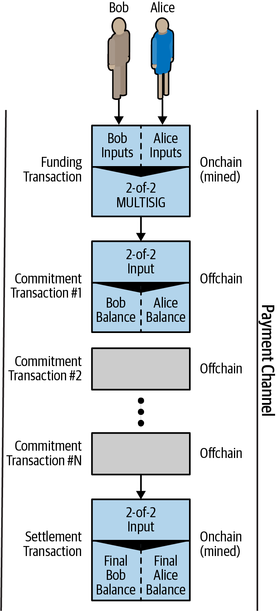
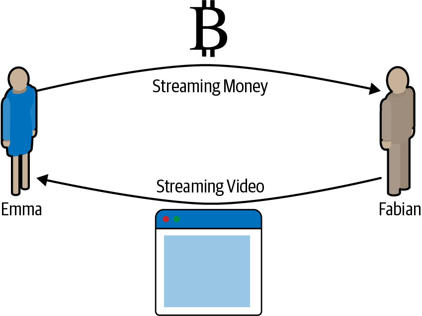
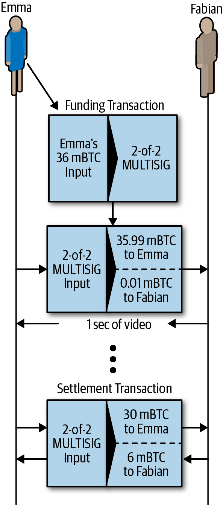
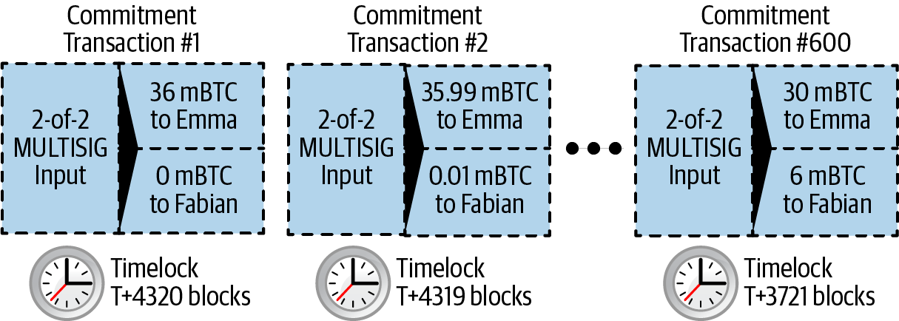
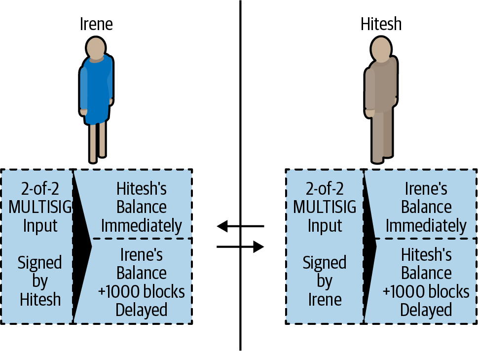
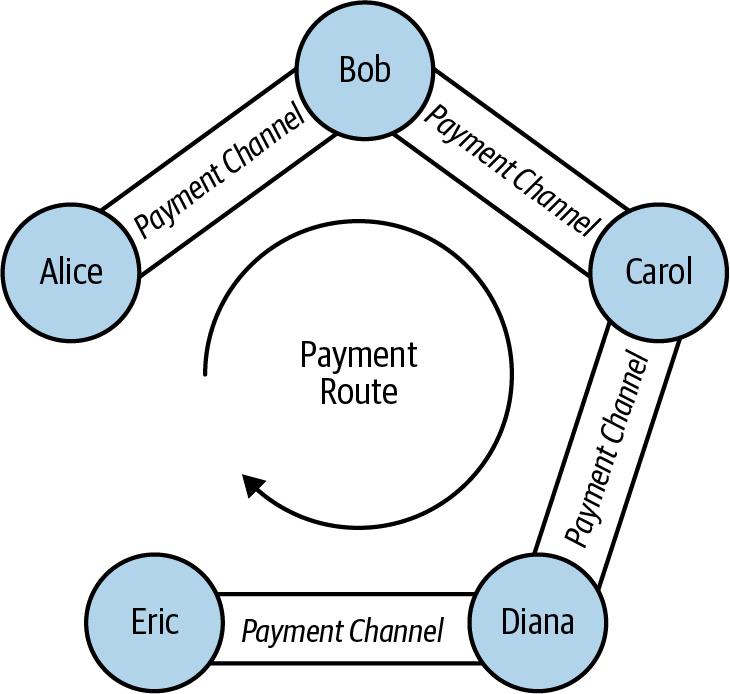
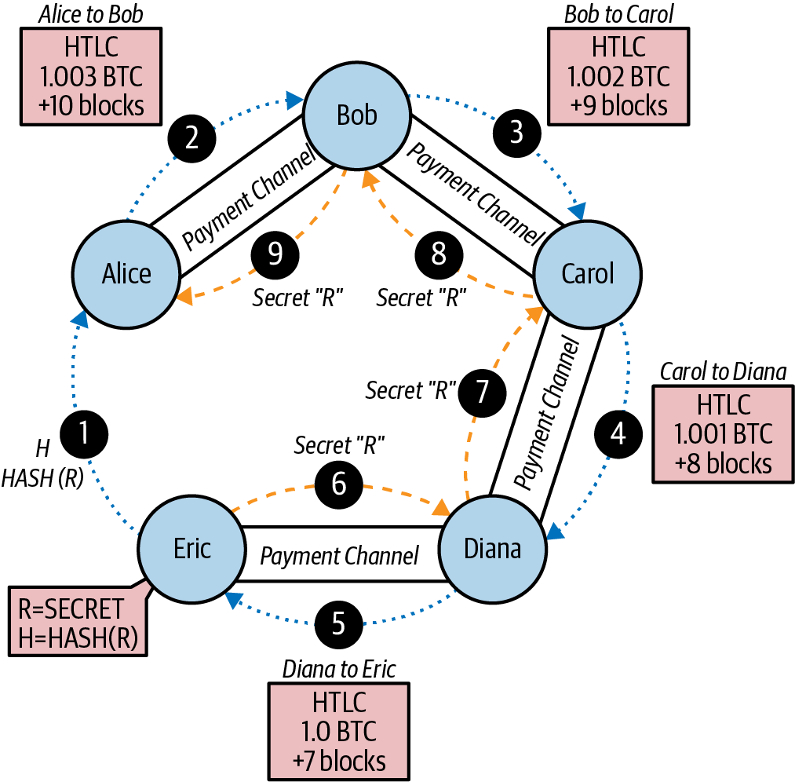

[[ch12]]
== Second-Layer Applications

Let's now build on our understanding of the primary Bitcoin system (the
_first layer_) by looking at it as a
platform for other applications, or _second layers_. 
In this chapter we will look at the features offered by Bitcoin
as an application platform. We will consider the application
building _primitives_, which form the building blocks of any blockchain
application. We will look at several important applications that use
these primitives, such as client-side validation, payment channels, and
routed payment channels (Lightning Network).

=== Building Blocks (Primitives)

When ((("Bitcoin", "as application platform", "primitives, list of", secondary-sortas="application platform", id="bitcoin-app-platform-primitive")))((("application platform, Bitcoin as", "primitives, list of", id="app-platform-primitive")))((("primitives", id="primitive-list")))((("building blocks", id="build-block")))operating correctly and over the
long term, the Bitcoin system offers certain guarantees, which can be
used as building blocks to create applications. These include:

No double-spend:: The most fundamental guarantee of Bitcoin's
decentralized consensus algorithm ensures that no UTXO can be spent
twice in the same valid chain of blocks.

Immutability:: Once a transaction is recorded in the blockchain and
sufficient work has been added with subsequent blocks, the transaction's
data becomes practically immutable. Immutability is underwritten by energy, as
rewriting the blockchain requires the expenditure of energy to produce
PoW. The energy required and therefore the degree of
immutability increases with the amount of work committed on top of the
block containing a transaction.

[role="less_space pagebreak-before"]
Neutrality:: The decentralized Bitcoin network propagates valid
transactions regardless of the origin of those transactions.
This means that anyone can create a valid transaction with sufficient
fees and trust they will be able to transmit that transaction and have
it included in the blockchain at any time.

Secure timestamping:: The consensus rules reject any block whose
timestamp is too far in the future and attempt to prevent blocks with
timestamps too far in the past. This ensures that timestamps
on blocks can be trusted to a certain degree. The timestamp on a block implies an
unspent-before reference for the inputs of all included transactions.

Authorization:: Digital signatures, validated in a decentralized
network, offer authorization guarantees. Scripts that contain a
requirement for a digital signature cannot be executed without
authorization by the holder of the private key implied in the script.

Auditability:: All transactions are public and can be audited. All
transactions and blocks can be linked back in an unbroken chain to the
genesis block.

Accounting:: In any transaction (except the coinbase transaction) the
value of inputs is equal to the value of outputs plus fees. It is not
possible to create or destroy bitcoin value in a transaction. The
outputs cannot exceed the inputs.

Nonexpiration:: A valid transaction does not expire. If it is valid
today, it will be valid in the near future, as long as the inputs remain
unspent and the consensus rules do not change.

Integrity:: The outputs of a Bitcoin transaction signed with +SIGHASH_ALL+ or parts of
a transaction signed by another +SIGHASH+ type cannot be modified
without invalidating the signature, thus invalidating the transaction
itself.

Transaction atomicity:: Bitcoin transactions are atomic. They are either
valid and confirmed (mined) or not. Partial transactions cannot be mined,
and there is no interim state for a transaction. At any point in time a
transaction is either mined or not.

Discrete (indivisible) units of value:: Transaction outputs are discrete
and indivisible units of value. They can either be spent or unspent, in
full. They cannot be divided or partially spent.

Quorum of control:: Multisignature constraints in scripts impose a
quorum of authorization, predefined in the multisignature scheme. The
requirement is enforced by the consensus rules.

Timelock/aging:: Any script clause containing a relative or absolute
timelock can only be executed after its age exceeds the time specified.

Replication:: The decentralized storage of the blockchain ensures that
when a transaction is mined, after sufficient confirmations, it is
replicated across the network and becomes durable and resilient to power
loss, data loss, etc.

Forgery protection:: A transaction can only spend existing, validated
outputs. It is not possible to create or counterfeit value.

Consistency:: In the absence of miner partitions, blocks that are
recorded in the blockchain are subject to reorganization or disagreement
with exponentially decreasing likelihood, based on the depth at which
they are recorded. Once deeply recorded, the computation and energy
required to change makes change practically infeasible.

Recording external state:: A transaction can commit to a data value, via
+OP_RETURN+ or pay to contract, representing a state transition in an external state
machine.

Predictable issuance:: Less than 21 million bitcoin will be issued at a
predictable rate.

The list of building blocks is not complete, and more are added with each
new feature introduced ((("Bitcoin", "as application platform", "primitives, list of", secondary-sortas="application platform", startref="bitcoin-app-platform-primitive")))((("application platform, Bitcoin as", "primitives, list of", startref="app-platform-primitive")))((("primitives", startref="primitive-list")))((("building blocks", startref="build-block")))into Bitcoin.

=== Applications from Building Blocks

The ((("Bitcoin", "as application platform", "example applications", secondary-sortas="application platform", id="bitcoin-app-platform-example")))((("application platform, Bitcoin as", "example applications", id="app-platform-example")))building blocks
offered by Bitcoin are elements of a trust platform that can be used to
compose applications. Here are some examples of applications that exist
today and the building blocks they use:

Proof-of-Existence (Digital Notary):: Immutability + Timestamp + Durability.
A transaction on the blockchain can commit to a value,
proving that a piece of data existed at the time
it was recorded (Timestamp). The commitment cannot be modified ex-post-facto
(Immutability), and the proof will be stored permanently (Durability).

Kickstarter (Lighthouse):: Consistency + Atomicity + Integrity. If you
sign one input and the output (Integrity) of a fundraiser transaction,
others can contribute to the fundraiser but it cannot be spent
(Atomicity) until the goal (output amount) is funded (Consistency).

Payment Channels:: Quorum of Control + Timelock + No Double Spend + Nonexpiration
+ Censorship Resistance + Authorization. A multisig 2-of-2
(Quorum) with a timelock (Timelock) used as the "settlement" transaction
of a payment channel can be held (Nonexpiration) and spent at any time
(Censorship Resistance) by either party (Authorization). The two parties
can then create commitment transactions that supersede (No
Double-Spend) the settlement on a shorter timelock((("Bitcoin", "as application platform", "example applications", secondary-sortas="application platform", startref="bitcoin-app-platform-example")))((("application platform, Bitcoin as", "example applications", startref="app-platform-example"))) (Timelock).

=== Colored Coins

The first
blockchain((("Bitcoin", "as application platform", "colored coins application", secondary-sortas="application platform", id="bitcoin-app-platform-color")))((("application platform, Bitcoin as", "colored coins application", id="app-platform-color")))((("colored coins application", id="color-coin"))) application we will discuss is _colored coins_.

Colored coins refers to a set of
similar technologies that use Bitcoin transactions to record the
creation, ownership, and transfer of extrinsic assets other than
bitcoin. By "extrinsic" we mean assets that are not stored directly on
the Bitcoin blockchain, as opposed to bitcoin itself, which is an asset
intrinsic to the blockchain.

Colored coins are used to track digital
assets as well as physical assets held by third parties and traded
through certificates of ownership associated with colored coins. Digital asset colored
coins can represent intangible assets such as a stock certificate,
license, virtual property (game items), or most any form of licensed
intellectual property (trademarks, copyrights, etc.). Tangible asset
colored coins can represent certificates of ownership of commodities
(gold, silver, oil), land titles, automobiles, boats, aircraft, etc.

The term derives
from the idea of "coloring" or marking a nominal amount of bitcoin, for
example, a single satoshi, to represent something other than the bitcoin
amount itself. As an analogy, consider stamping a $1 note with a message
saying, "this is a stock certificate of ACME" or "this note can be
redeemed for 1 oz of silver" and then trading the $1 note as a
certificate of ownership of this other asset. The first implementation
of colored coins, named _Enhanced Padded-Order-Based Coloring_ or
_EPOBC_, assigned extrinsic assets to a 1-satoshi output. In this way,
it was a true "colored coin," as each asset was added as an attribute
(color) of a single satoshi.

More recent implementations of colored coins use other mechanisms
to attach metadata with a transaction, in conjunction with external
data stores that associate the metadata to specific assets.  The three
main mechanisms used as of this writing are single-use seals,
pay to contract, and client-side validation.

[[single_use_seals]]
==== Single-Use Seals

Single-use seals ((("colored coins application", "single-use seals")))((("single-use seals")))originate in physical security.  Someone shipping an
item through a third party needs a way to detect tampering, so they
secure their package with a special mechanism that will become clearly
damaged if the package is opened.  If the package arrives with the seal
intact, the sender and receiver can be confident that the package wasn't
opened in transit.

In the context of colored coins, single-use seals refer to a data
structure than can only be associated with another data structure once.
In Bitcoin, this((("UTXOs (unspent transaction outputs)"))) definition is fulfilled by unspent transaction outputs
(UTXOs).  A UTXO can only be spent once within a valid blockchain, and
the process of spending them associates them with the data in the
spending transaction.

This provides part of the basis for the modern transfer for colored
coins.  One or more colored coins are received to a UTXO.  When that
UTXO is spent, the spending transaction must describe how the colored
coins are to be spent.  That brings us to pay to contract (P2C).

[[p2c_for_colored_coins]]
==== Pay to Contract (P2C)

We ((("colored coins application", "P2C (pay to contract)", id="color-coin-p2c")))((("P2C (pay to contract)", id="p2c-color-coin")))previously learned about P2C in <<pay_to_contract>>, where it became
part of the basis for the taproot upgrade to Bitcoin's consensus rules.
As a short reminder, P2C allows a spender (Bob) and receiver (Alice) to
agree on some data, such as a contract, and then((("key tweaks"))) tweak Alice's public
key so that it commits to the contract.  At any time, Bob can reveal
Alice's underlying key and the tweak used to commit to the contract,
proving that she received the funds.  If Alice spends the funds, that
fully proves that she knew about the contract, since the only way she
could spend the funds received to a P2C tweaked key is by knowing the
tweak (the contract).

A powerful attribute of P2C tweaked keys is that they look like any
other public keys to everyone besides Alice and Bob, unless they choose
to reveal the contract used to tweak the keys.  Nothing is publicly
revealed about the contract--not even that a contract between them
exists.

A P2C contract can be arbitrarily long and detailed, the terms can be written
in any language, and it can reference anything the participants want
because the contract is not validated by full nodes and only the public
key with the commitment is published to the blockchain.

In the context of colored coins, Bob can open the single-use seal
containing his colored coins by spending the associated UTXO.  In the
transaction spending that UTXO, he can commit to a contract indicating
the terms that the next owner (or owners) of the colored coins must
fulfill in order to further spend the coins.  The new owner doesn't need
to be Alice, even though Alice is the one receiving the UTXO that Bob
spends and Alice has tweaked her public key by the contract terms.

Because full nodes don't (and can't) validate that the contract is
followed correctly, we need to figure out who is responsible for
validation.  That brings ((("colored coins application", "P2C (pay to contract)", startref="color-coin-p2c")))((("P2C (pay to contract)", startref="p2c-color-coin")))us to _client-side validation._

==== Client-Side Validation

Bob had ((("colored coins application", "client-side validation")))((("client-side validation")))((("validating", "with client-side validation", secondary-sortas="client-side validation")))some colored coins associated with a UTXO.  He spent that UTXO
in a way that committed to a contract that indicated how the next
receiver (or receivers) of the colored coins will prove their ownership
over the coins in order to further spend them.

In practice, Bob's P2C contract likely simply committed to one or more
unique identifiers for the UTXOs that will be used as single-use seals
for deciding when the colored coins are next spent.  For example, Bob's
contract may have indicated that the UTXO Alice received to her P2C
tweaked public key now controls half of his colored coins, with the
other half of his colored coins now being assigned to a different UTXO
that may have nothing to do with the transaction between Alice and Bob.
This provides significant privacy against blockchain surveillance.

When Alice later wants to spend her colored coins to Dan, she first
needs to prove to Dan that she controls the colored coins.  Alice can do
this by revealing to Dan her underlying P2C public key and the P2C contract
terms chosen by Bob.  Alice also reveals to Dan the UTXO that Bob used
as the single-use seal and any information that Bob gave her about the
previous owners of the colored coins.  In short, Alice gives Dan a
complete set of history about every previous transfer of the colored
coins, with each step anchored in the Bitcoin blockchain (but not
storing any special data in the chain--just regular public keys).  That
history is a lot like the history of regular Bitcoin transactions that
we call the blockchain, but the colored history is completely invisible
to other users of the blockchain.

Dan validates this history using his software, called _client-side
validation_.  Notably, Dan only needs to receive and validate the parts
of history that pertain to the colored coins he wants to receive.  He
doesn't need information about what happened to other people's colored
coins--for example, he'll never need to know what happened to the other
half of Bob's coins, the ones that Bob didn't transfer to Alice.  This
helps enhance the privacy of the colored coin protocol.

Now that we've learned about single-use seals, pay to contract, and
client-side validation, we can look at the two main protocols that use
them as of this writing, RGB and Taproot Assets.

==== RGB

Developers ((("colored coins application", "RGB protocol", id="color-coin-rgb")))((("RGB protocol", id="rgb")))of the RGB protocol pioneered many of the ideas used in
modern Bitcoin-based colored coin protocols.  A primary requirement of
the design for RGB was making the protocol compatible with offchain
payment channels (see <<state_channels>>), such as those used in
Lightning Network (LN).  That's accomplished at each layer of the RGB
protocol:

Single-use seals:: 
To create a payment channel, Bob assigns his colored
  coins to a UTXO that requires signatures from both him and Alice to
  spend.  Their mutual control over that UTXO serves as the single-use
  seal for future transfers.

Pay to contract (P2C)::
Alice and Bob can now sign multiple versions of
  a P2C contract.  The enforcement mechanism of the underlying payment
  channel ensures that both parties are incentivized to only publish the
  latest version of the contract onchain.

Client-side validation::
To ensure that neither Alice nor Bob needs to
  trust each other, they each check all previous transfers of the
  colored coins back to their creation to ensure all contract rules were
  followed correctly.

The developers of RGB have described other uses for their protocol, such
as creating identity tokens that can be periodically updated to protect
against private key compromise.

For more information, ((("colored coins application", "RGB protocol", startref="color-coin-rgb")))((("RGB protocol", startref="rgb")))see https://rgb.tech[RGB's documentation].

==== Taproot Assets

Formerly ((("colored coins application", "Taproot Assets", id="color-coin-taproot")))((("Taproot Assets", id="taproot-assets")))called Taro, Taproot Assets are a colored coin protocol that is
heavily influenced by RGB.  Compared to RGB, Taproot Assets use a form
of P2C contracts that is very similar to the version used by taproot for
enabling MAST functionality (see <<mast>>).  The claimed advantage of
Taproot Assets over RGB is that its similarity to the widely used
taproot protocol makes it simpler for wallets and other software to
implement.  One downside is that it may not be as flexible as the RGB
protocol, especially when it comes to implementing nonasset features
such as identity tokens.

[NOTE]
====
_Taproot_ is part of the Bitcoin protocol.  _Taproot Assets_ is not,
despite the similar name.  Both RGB and Taproot Assets are protocols
built on top of the Bitcoin protocol.  The only asset natively supported
by Bitcoin is bitcoin.
====

Even more than RGB, Taproot Assets has been designed to be compatible
with LN.  One challenge with forwarding nonbitcoin assets
over LN is that there are two ways to accomplish the
sending, each with a different set of trade-offs:

Native forwarding::
  Every ((("native forwarding")))hop in the path between the spender and the receiver must know
  about the particular asset (type of colored coin) and have a
  sufficient balance of it to support forwarding a payment.

Translated forwarding::
  The hop next to the spender and((("translated forwarding"))) the hop next to the receiver must know
  about the particular asset and have a sufficient balance of it to
  support forwarding a payment, but every other hop only needs to
  support forwarding bitcoin [.keep-together]#payments.#

Native forwarding is conceptually simpler but essentially requires a
separate Lightning-type network for every asset.  Translated forwarding
allows building on the economies of scale of the Bitcoin LN, but it may be vulnerable to a problem called((("free American call option"))) the _free American
call option_, where a receiver may selectively accept or reject certain
payments depending on recent changes to the exchange rate in order to
siphon money from the hop next to them.  Although there's no known
perfect solution to the free American call option, there may be
practical solutions that limit its harm.

Both Taproot Assets and RGB can technically support both native and
translated forwarding.  Taproot Assets is specifically designed around
translated forwarding, whereas RGB has seen proposals to implement both.

For more information, see
https://oreil.ly/Ef4hb[Taproot
Asset's documentation].  Additionally, the Taproot Asset developers are
working on BIPs that may be available after this book goes((("Bitcoin", "as application platform", "colored coins application", secondary-sortas="application platform", startref="bitcoin-app-platform-color")))((("application platform, Bitcoin as", "colored coins application", startref="app-platform-color")))((("colored coins application", startref="color-coin")))((("colored coins application", "Taproot Assets", startref="color-coin-taproot")))((("Taproot Assets", startref="taproot-assets"))) into print.

[[state_channels]]
=== Payment Channels and State Channels

_Payment channels_ are ((("Bitcoin", "as application platform", "payment channels", secondary-sortas="application platform", id="bitcoin-app-platform-payment")))((("application platform, Bitcoin as", "payment channels", id="app-platform-payment")))((("payment channels", id="payment-channel")))a trustless mechanism for exchanging Bitcoin
transactions between two parties outside of the Bitcoin blockchain.
These transactions, which would be valid if settled on the Bitcoin
blockchain, are held offchain instead, waiting for
eventual batch settlement. Because the transactions are not settled,
they can be exchanged without the usual settlement latency, allowing
extremely high transaction throughput, low latency, and
fine granularity.

Actually, the term _channel_ is a metaphor. State channels are virtual
constructs represented by the exchange of state between two parties
outside of the blockchain. There are no "channels" per se, and the
underlying data transport mechanism is not the channel. We use the term
_channel_ to represent the relationship and shared state between two
parties outside of the blockchain.

To further explain this
concept, think of a TCP stream. From the perspective of higher-level
protocols, it is a "socket" connecting two applications across the
internet. But if you look at the network traffic, a TCP stream is just a
virtual channel over IP packets. Each endpoint of the TCP stream
sequences and assembles IP packets to create the illusion of a stream of
bytes. Underneath, it's all disconnected packets. Similarly, a payment
channel is just a series of transactions. If properly sequenced and
connected, they create redeemable obligations that you can trust even
though you don't trust the other side of the channel.

In this section we will look at various forms of payment channels.
First, we will examine the mechanisms used to construct a one-way
(unidirectional) payment channel for a metered micropayment service,
such as streaming video. Then, we will expand on this mechanism and
introduce bidirectional payment channels. Finally, we will look at how
bidirectional channels can be connected end-to-end to form multihop
channels in a routed network, first proposed under the name _Lightning
Network_.

Payment channels are part of the broader concept of a _state channel_,
which represents an offchain alteration of state, secured by eventual
settlement in a blockchain. A payment channel is a state channel where
the state being altered is the balance of a virtual currency.

==== State Channels&#x2014;Basic Concepts and Terminology

A state channel((("payment channels", "state channels", id="payment-channel-state")))((("state channels", id="state-channel-terminology")))((("transactions", "state channels", id="transaction-state"))) is
established between two parties through a transaction that locks a
shared state on the blockchain. This is called ((("funding transactions")))the _funding transaction_.
This single transaction must be transmitted to
the network and mined to establish the channel. In the example of a
payment channel, the locked state is the initial balance (in currency)
of the channel.

The two parties then exchange signed transactions, ((("commitment transactions")))called _commitment
transactions_, that alter the initial state. These transactions are
valid transactions in that they _could_ be submitted for settlement by
either party, but instead are held offchain by each party pending the
channel closure. State updates can be created as fast as each party can
create, sign, and transmit a transaction to the other party. In practice
this means that dozens of transactions per second can be exchanged.

When exchanging commitment transactions the two parties also discourage
use of the previous states, so that the most up-to-date commitment transaction
is always the best one to be redeemed. This discourages either party
from cheating by unilaterally closing the channel with a prior
state that is more favorable to them than the current state. We will
examine the various mechanisms that can be used to discourage
publication of prior states in the rest of this chapter.

Finally, the channel can be closed either cooperatively, by ((("settlement transactions")))submitting a
final _settlement transaction_ to the blockchain, or unilaterally, by
either party submitting the last commitment transaction to the
blockchain. A unilateral close option is needed in case one of the
parties unexpectedly disconnects. The settlement transaction represents
the final state of the channel and is settled on the blockchain.

In the entire lifetime of the channel, only two transactions need to be
submitted for mining on the blockchain: the funding and settlement
transactions. In between these two states, the two parties can exchange
any number of commitment transactions that are never seen by anyone
else or submitted to the blockchain.

<<payment_channel>> illustrates a payment channel between Bob and Alice,
showing the funding, commitment, and settlement ((("payment channels", "state channels", startref="payment-channel-state")))((("state channels", startref="state-channel-terminology")))((("transactions", "state channels", startref="transaction-state")))transactions.

[[payment_channel]]
.A payment channel between Bob and Alice, showing the funding, commitment, and settlement transactions.

==== Simple Payment Channel Example

To
explain ((("payment channels", "example of", id="payment-channel-example")))state channels, we start with a very simple example. We
demonstrate a one-way channel, meaning that value is flowing in one
direction only. We will also start with the naive assumption that no one
is trying to cheat to keep things simple. Once we have the basic
channel idea explained, we will then look at what it takes to make it
trustless so that neither party _can_ cheat, even if they are trying to.

//TODO:change to using sats rather than millibits.  Or maybe drop
//specific amounts so that the example doesn't become outdated as price
//changes.

For this example we will assume two participants: Emma and Fabian.
Fabian offers a video streaming service that is billed by the second
using a micropayment channel. Fabian charges 0.01 millibit (0.00001 BTC)
per second of video, equivalent to 36 millibits (0.036 BTC) per hour of
video. Emma is a user who purchases this streaming video service from
Fabian. <<emma_fabian_streaming_video>> shows Emma buying the video
streaming service from Fabian using a payment channel.

[[emma_fabian_streaming_video]]
.Emma purchases streaming video from Fabian with a payment channel, paying for each second of video.

In this example, Fabian and Emma are using special software that handles
both the payment channel and the video streaming. Emma is running the
software in her browser; Fabian is running it on a server. The software
includes basic Bitcoin wallet functionality and can create and sign
Bitcoin transactions. Both the concept and the term "payment channel"
are completely hidden from the users. What they see is video that is
paid for by the second.

To set up the payment channel, Emma and Fabian establish a 2-of-2
multisignature address, with each of them holding one of the keys. From
Emma's perspective, the software in her browser presents a QR code with
the address, and asks her to submit a "deposit"
for up to 1 hour of video. The address is then funded by Emma. Emma's
transaction, paying to the multisignature address, is the funding or
anchor transaction for the payment channel.

For this example, let's say that Emma funds the channel with 36
millibits (0.036 BTC). This will allow Emma to consume _up to_ 1 hour of
streaming video. The funding transaction in this case sets the maximum
amount that can be transmitted in this channel, setting the _channel
capacity_.

The funding transaction consumes one or more inputs from Emma's wallet,
sourcing the funds. It creates one output with an amount of 36 millibits
paid to the multisignature 2-of-2 address controlled jointly between
Emma and Fabian. It may have additional outputs for change back to
Emma's wallet.

After the funding transaction is confirmed to a sufficient depth, Emma can start streaming
video. Emma's software creates and signs a commitment transaction that
changes the channel balance to credit 0.01 millibit to Fabian's address
and refund 35.99 millibits back to Emma. The transaction signed by Emma
consumes the 36 millibits output created by the funding transaction and
creates two outputs: one for her refund, the other for Fabian's payment.
The transaction is only partially signed&#x2014;it requires two
signatures (2-of-2), but only has Emma's signature. When Fabian's server
receives this transaction, it adds the second signature (for the 2-of-2
input) and returns it to Emma together with 1 second worth of video. Now
both parties have a fully signed commitment transaction that either can
redeem, representing the correct up-to-date balance of the channel.
Neither party broadcasts this transaction to the network.

In the next round, Emma's software creates and signs another commitment
transaction (commitment #2) that consumes the _same_ 2-of-2 output from
the funding transaction. The second commitment transaction allocates one
output of 0.02 millibits to Fabian's address and one output of 35.98
millibits back to Emma's address. This new transaction is payment for
two cumulative seconds of video. Fabian's software signs and returns the
second commitment transaction, together with another second of video.

In this way, Emma's software continues to send commitment transactions
to Fabian's server in exchange for streaming video. The balance of the
channel gradually accumulates in favor of Fabian as Emma consumes more
seconds of video. Let's say Emma watches 600 seconds (10 minutes) of
video, creating and signing 600 commitment transactions. The last
commitment transaction (#600) will have two outputs, splitting the
balance of the channel, 6 millibits to Fabian and 30 millibits to Emma.

Finally, Emma clicks "Stop" to stop streaming video. Either Fabian or
Emma can now transmit the final state transaction for settlement. This
last transaction is the _settlement transaction_ and pays Fabian for all
the video Emma consumed, refunding the remainder of the funding
transaction to Emma.

<<video_payment_channel>> shows the channel between Emma and Fabian and
the commitment transactions that update the balance of the channel.

In the end, only two transactions are recorded on the blockchain: the
funding transaction that established the channel and a settlement
transaction that allocated the final balance correctly between((("payment channels", "example of", startref="payment-channel-example"))) the two
participants.

[[video_payment_channel]]
.Emma's payment channel with Fabian, showing the commitment transactions that update the balance of the channel.

==== Making Trustless Channels

The channel ((("payment channels", "trustless channels", id="payment-channel-trustless")))((("trustless channels", id="trustless-channel")))((("timelocks", "trustless channels", id="timelock-trustless")))((("commitment transactions", "trustless channels", id="commit-trustless")))we just described works, but only if both
parties cooperate, without any failures or attempts to cheat. Let's look
at some of the scenarios that break this channel and see what is needed
to fix those:

[role="less_space pagebreak-before"]
- Once the funding transaction happens, Emma needs Fabian's signature to
  get any money back. If Fabian disappears, Emma's funds are locked in a
  2-of-2 and effectively lost. This channel, as constructed, leads to a
  loss of funds if one of the parties becomes unavailable before there is at
  least one commitment transaction signed by both parties.

- While the channel is running, Emma can take any of the commitment
  transactions Fabian has countersigned and transmit one to the
  blockchain. Why pay for 600 seconds of video if she can transmit
  commitment transaction #1 and only pay for 1 second of video? The
  channel fails because Emma can cheat by broadcasting a prior
  commitment that is in her favor.

Both of these problems can be solved with timelocks&#x2014;let's look at
how we could use transaction-level timelocks.

Emma cannot risk funding a 2-of-2 multisig unless she has a guaranteed
refund. To solve this problem, Emma constructs the funding and refund
transaction at the same time. She signs the funding transaction but
doesn't transmit it to anyone. Emma transmits only the refund
transaction to Fabian and obtains his signature.

The refund transaction acts as the first commitment transaction, and its
timelock establishes the upper bound for the channel's life. In this
case, Emma could set the lock time to 30 days or 4,320 blocks into the
future. All subsequent commitment transactions must have a shorter
timelock so they can be redeemed before the refund transaction.

Now that Emma has a fully signed refund transaction, she can confidently
transmit the signed funding transaction knowing that she can eventually,
after the timelock expires, redeem the refund transaction even if Fabian
disappears.

Every commitment transaction the parties exchange during the life of the
channel will be timelocked into the future. But the delay will be
slightly shorter for each commitment, so the most recent commitment can
be redeemed before the prior commitment it invalidates. Because of the
lock time, neither party can successfully propagate any of the
commitment transactions until their timelock expires. If all goes well,
they will cooperate and close the channel gracefully with a settlement
transaction, making it unnecessary to transmit an intermediate
commitment transaction. If not, the most recent commitment transaction
can be propagated to settle the account and invalidate all prior
commitment transactions.

For example, if commitment transaction #1 is timelocked to 4,320 blocks
in the future, then commitment transaction #2 is timelocked to 4,319
blocks in the future. Commitment transaction #600 can be spent 600
blocks before commitment transaction #1 becomes valid.

<<timelocked_commitments>> shows each commitment transaction setting a
shorter timelock, allowing it to be spent before the previous
commitments become valid.

[[timelocked_commitments]]
.Each commitment sets a shorter timelock, allowing it to be spent before the previous commitments become valid.

Each subsequent commitment transaction must have a shorter timelock so
that it may be broadcast before its predecessors and before the refund
transaction. The ability to broadcast a commitment earlier ensures it
will be able to spend the funding output and preclude any other
commitment transaction from being redeemed by spending the output. The
guarantees offered by the Bitcoin blockchain, preventing double-spends
and enforcing timelocks, effectively allow each commitment transaction
to invalidate its predecessors.

State channels use timelocks to enforce smart contracts across a time
dimension. In this example we saw how the time dimension guarantees that
the most recent commitment transaction becomes valid before any earlier
commitments. Thus, the most recent commitment transaction can be
transmitted, spending the inputs and invalidating prior commitment
transactions. The enforcement of smart contracts with absolute timelocks
protects against cheating by one of the parties. This implementation
needs nothing more than absolute transaction-level lock time.
Next, we will see how script-level timelocks,
+CHECKLOCKTIMEVERIFY+ and +CHECKSEQUENCEVERIFY+, can be used to
construct more flexible, useful, and sophisticated state channels.

Timelocks are not the only way to invalidate prior commitment
transactions. In the next sections we will see how a revocation key can
be used to achieve the same result. Timelocks are effective, but they
have two distinct disadvantages. By establishing a maximum timelock when
the channel is first opened, they limit the lifetime of the channel.
Worse, they force channel implementations to strike a balance between
allowing long-lived channels and forcing one of the participants to wait
a very long time for a refund in case of premature closure. For example,
if you allow the channel to remain open for 30 days by setting the
refund timelock to 30 days, if one of the parties disappears immediately,
the other party must wait 30 days for a refund. The more distant the
endpoint, the more distant the refund.

The second problem is that since each subsequent commitment transaction
must decrement the timelock, there is an explicit limit on the number of
commitment transactions that can be exchanged between the parties. For
example, a 30-day channel, setting a timelock of 4,320 blocks into the
future, can only accommodate 4,320 intermediate commitment transactions
before it must be closed. There is a danger in setting the timelock
commitment transaction interval at 1 block. By setting the timelock
interval between commitment transactions to 1 block, a developer is
creating a very high burden for the channel participants who have to be
vigilant, remain online and watching, and be ready to transmit the right
commitment transaction at any time.

In the preceding example of a single-direction channel, it's easy to
eliminate the per-commitment timelock.  After Emma receives the
signature on the timelocked refund transaction from Fabian, no timelocks
are placed on the commitment transactions.  Instead, Emma sends her
signature on each commitment transaction to Fabian but Fabian doesn't
send her any of his signatures on the commitment transactions.  That
means only Fabian has both signatures for a commitment transaction, so
only he can broadcast one of those commitments.  When Emma finishes
streaming video, Fabian will always prefer to broadcast the transaction
that pays him the most--which will be the latest state.  This
construction in called a Spillman-style payment channel, which was first
described and implemented in 2013, although they are only safe to use
with witness (segwit) transactions, which didn't become available until
2017.

Now that we understand how timelocks can be used to invalidate prior
commitments, we can see the difference between closing the channel
cooperatively and closing it unilaterally by broadcasting a commitment
transaction. All commitment transactions in our prior example were timelocked, therefore
broadcasting a commitment transaction will always involve waiting until
the timelock has expired. But if the two parties agree on what the final
balance is and know they both hold commitment transactions that will
eventually make that balance a reality, they can construct a settlement
transaction without a timelock representing that same balance. In a
cooperative close, either party takes the most recent commitment
transaction and builds a settlement transaction that is identical in
every way except that it omits the timelock. Both parties can sign this
settlement transaction knowing there is no way to cheat and get a more
favorable balance. By cooperatively signing and transmitting the
settlement transaction, they can close the channel and redeem their
balance immediately. Worst case, one of the parties can be petty, refuse
to cooperate, and force the other party to do a unilateral close with
the most recent commitment transaction. If they do that, they have
to wait for their funds ((("payment channels", "trustless channels", startref="payment-channel-trustless")))((("trustless channels", startref="trustless-channel")))((("timelocks", "trustless channels", startref="timelock-trustless")))((("commitment transactions", "trustless channels", startref="commit-trustless")))too.

[role="less_space pagebreak-before"]
==== Asymmetric Revocable Commitments

Another way((("payment channels", "asymmetric revocable commitments", id="payment-channel-revoke")))((("asymmetric revocable commitments", id="asymmetric-revoke-commit")))((("commitment transactions", "asymmetric revocable commitments", id="commit-revoke")))((("revocable commitments", id="revoke-commit"))) to handle the prior commitment states
is to explicitly revoke them. However, this is not easy to achieve. A
key characteristic of Bitcoin is that once a transaction is valid, it
remains valid and does not expire. The only way to cancel a transaction
is to get a conflicting transaction confirmed.
That's why we used timelocks in the simple payment channel
example to ensure that more recent commitments could be spent
before older commitments were valid. However, sequencing commitments in
time creates a number of constraints that make payment channels
difficult to use.

Even though a transaction cannot be canceled, it can be constructed in
such a way as to make it undesirable to use. The way we do that is by
giving each party a _revocation key_ that can be used to punish the
other party if they try to cheat. This mechanism for revoking prior
commitment transactions was first proposed as part of the LN.

To explain revocation keys, we will construct a more complex payment
channel between two exchanges run by Hitesh and Irene. Hitesh and Irene
run Bitcoin exchanges in India and the USA, respectively. Customers of
Hitesh's Indian exchange often send payments to customers of Irene's USA
exchange and vice versa. Currently, these transactions occur on the
Bitcoin blockchain, but this means paying fees and waiting several
blocks for confirmations. Setting up a payment channel between the
exchanges will significantly reduce the cost and accelerate the
transaction flow.

Hitesh and Irene start the channel by collaboratively constructing a
funding transaction, each funding the channel with 5 bitcoin.  Before
they sign the funding transaction, they must sign the first set of
commitments (called the _refund_) that assigns the
initial balance of 5 bitcoin for Hitesh and 5 bitcoin for Irene. The
funding transaction locks the channel state in a 2-of-2 multisig, just
like in the example of a simple channel.

The funding transaction may have one or more inputs from Hitesh (adding
up to 5 bitcoins or more), and one or more inputs from Irene (adding up
to 5 bitcoins or more). The inputs have to slightly exceed the channel
capacity in order to cover the transaction fees. The transaction has one
output that locks the 10 total bitcoins to a 2-of-2 multisig address
controlled by both Hitesh and Irene. The funding transaction may also
have one or more outputs returning change to Hitesh and Irene if their
inputs exceeded their intended channel contribution. This is a single
transaction with inputs offered and signed by two parties. It has to be
constructed in collaboration and signed by each party before it is
transmitted.

Now, instead of creating a single commitment transaction that both
parties sign, Hitesh and Irene create two different commitment
transactions that are _asymmetric_.

[role="less_space pagebreak-before"]
Hitesh has a commitment transaction with two outputs. The first output
pays Irene the 5 bitcoins she is owed _immediately_. The second output
pays Hitesh the 5 bitcoins he is owed, but only after a timelock of 1,000
blocks. The transaction outputs look like this:

----
Input: 2-of-2 funding output, signed by Irene

Output 0 <5 bitcoins>:
    <Irene's Public Key> CHECKSIG

Output 1 <5 bitcoins>:
    <1000 blocks>
    CHECKSEQUENCEVERIFY
    DROP
    <Hitesh's Public Key> CHECKSIG
----

Irene has a different commitment transaction with two outputs. The first
output pays Hitesh the 5 bitcoins he is owed immediately. The second
output pays Irene the 5 bitcoins she is owed but only after a timelock of
1,000 blocks. The commitment transaction Irene holds (signed by Hitesh)
looks like this:

----
Input: 2-of-2 funding output, signed by Hitesh

Output 0 <5 bitcoins>:
    <Hitesh's Public Key> CHECKSIG

Output 1 <5 bitcoins>:
    <1000 blocks>
    CHECKSEQUENCEVERIFY
    DROP
    <Irene's Public Key> CHECKSIG
----

This way, each party has a commitment transaction, spending the 2-of-2
funding output. This input is signed by the _other_ party. At any time
the party holding the transaction can also sign (completing the 2-of-2)
and broadcast. However, if they broadcast the commitment transaction, it
pays the other party immediately, whereas they have to wait for a
timelock to expire. By imposing a delay on the redemption of one of the
outputs, we put each party at a slight disadvantage when they choose to
unilaterally broadcast a commitment transaction. But a time delay alone
isn't enough to encourage fair conduct.

<<asymmetric_commitments>> shows two asymmetric commitment transactions,
where the output paying the holder of the commitment is delayed.

[[asymmetric_commitments]]
.Two asymmetric commitment transactions with delayed payment for the party holding the transaction.

Now we introduce the final element of this scheme: a revocation key that
prevents a cheater from broadcasting an expired commitment. The
revocation key allows the wronged party to punish the cheater by taking
the entire balance of the channel.

The revocation key is composed of two secrets, each half generated
independently by each channel participant. It is similar to a 2-of-2
multisig, but constructed using elliptic curve arithmetic, so that both
parties know the revocation public key but each party knows only half
the revocation secret key.

In each round, both parties reveal their half of the revocation secret
to the other party, thereby giving the other party (who now has both
halves) the means to claim the penalty output if this revoked
transaction is ever broadcast.

Each of the commitment transactions has a "delayed" output. The
redemption script for that output allows one party to redeem it after
1,000 blocks, _or_ the other party to redeem it if they have a revocation
key, penalizing transmission of a revoked commitment.

So when Hitesh creates a commitment transaction for Irene to sign, he
makes the second output payable to himself after 1,000 blocks or to the
revocation public key (of which he only knows half the secret). Hitesh
constructs this transaction. He will only reveal his half of the
revocation secret to Irene when he is ready to move to a new channel
state and wants to revoke this commitment.

[role="less_space pagebreak-before"]
The second output's script looks like this:

----
Output 0 <5 bitcoins>:
    <Irene's Public Key> CHECKSIG

Output 1 <5 bitcoins>:
IF
    # Revocation penalty output
    <Revocation Public Key>
ELSE
    <1000 blocks>
    CHECKSEQUENCEVERIFY
    DROP
    <Hitesh's Public Key>
ENDIF
CHECKSIG
----

Irene can confidently sign this transaction since if transmitted, it
will immediately pay her what she is owed. Hitesh holds the transaction
but knows that if he transmits it in a unilateral channel closing, he
will have to wait 1,000 blocks to get paid.

After the channel is advanced to the next state, Hitesh has to _revoke_
this commitment transaction before Irene will agree to sign any further
commitment transactions. To do that, all he has to do is send his half of
the _revocation key_ to Irene. Once Irene has both halves of the
revocation secret key for this commitment, she can sign a future
commitment with confidence. She knows that if Hitesh tries to cheat by
publishing the prior commitment, she can use the revocation key to
redeem Hitesh's delayed output. _If Hitesh cheats, Irene gets BOTH
outputs_. Meanwhile, Hitesh only has half the revocation secret for that
revocation public key and can't redeem the output until 1,000 blocks.
Irene will be able to redeem the output and punish Hitesh before the
1,000 blocks have elapsed.

The revocation protocol is bilateral, meaning that in each round, as the
channel state is advanced, the two parties exchange new commitments,
exchange revocation secrets for the previous commitments, and sign each
other's new commitment transactions. After they accept a new state, they
make the prior state impossible to use by giving each other the
necessary revocation secrets to punish any cheating.

Let's look at an example of how it works. One of Irene's customers wants
to send 2 bitcoins to one of Hitesh's customers. To transmit 2 bitcoins
across the channel, Hitesh and Irene must advance the channel state to
reflect the new balance. They will commit to a new state (state number
2) where the channel's 10 bitcoins are split, 7 bitcoins to Hitesh and 3
bitcoins to Irene. To advance the state of the channel, they will each
create new commitment transactions reflecting the new channel balance.

[role="less_space pagebreak-before"]
As before, these commitment transactions are asymmetric so the
commitment transaction each party holds forces them to wait if they
redeem it. Crucially, before signing new commitment transactions, they
must first exchange revocation keys to invalidate any outdated commitments.
In this particular case, Hitesh's interests are aligned with the real
state of the channel and therefore he has no reason to broadcast a prior
state. However, for Irene, state number 1 leaves her with a higher
balance than state 2. When Irene gives Hitesh the revocation key for her
prior commitment transaction (state number 1), she is effectively
revoking her ability to profit from regressing the channel to a prior
state because with the revocation key, Hitesh can redeem both outputs of
the prior commitment transaction without delay. Meaning if Irene
broadcasts the prior state, Hitesh can exercise his right to take all of
the outputs.

Importantly, the revocation doesn't happen automatically. While Hitesh
has the ability to punish Irene for cheating, he has to watch the
blockchain diligently for signs of cheating. If he sees a prior
commitment transaction broadcast, he has 1,000 blocks to take action and
use the revocation key to thwart Irene's cheating and punish her by
taking the entire balance, all 10 bitcoins.

Asymmetric revocable commitments with relative time locks (+CSV+) are a
much better way to implement payment channels and a very significant
innovation in this technology.  With this construct, the channel can
remain open indefinitely and can have billions of intermediate
commitment transactions. In implementations of LN, the commitment state is identified by a 48-bit index, allowing
more than 281 trillion (2.8 × 10^14^) state transitions in ((("payment channels", "asymmetric revocable commitments", startref="payment-channel-revoke")))((("asymmetric revocable commitments", startref="asymmetric-revoke-commit")))((("commitment transactions", "asymmetric revocable commitments", startref="commit-revoke")))((("revocable commitments", startref="revoke-commit")))any single
channel.

==== Hash Time Lock Contracts (HTLC)

Payment channels ((("payment channels", "HTLC (Hash Time Lock Contract)", id="payment-channel-htlc")))((("HTLC (Hash Time Lock Contract)", id="htlc")))((("Hash Time Lock Contract (HTLC)", id="hash-time-lock-contract")))can be further
extended with a special type of smart contract that allows the
participants to commit funds to a redeemable secret, with an expiration
time. This feature is called a _hash time lock contract_, or _HTLC_, and
is used in both bidirectional and routed payment channels.

Let's first explain the "hash" part of the HTLC. To create an HTLC, the
intended recipient of the payment will first create a secret _R_. They
then calculate the hash of this secret _H_:

[latexmath]
++++
\begin{equation}
H = Hash(R)
\end{equation}
++++

This produces a hash _H_ that can be included in an output's
script. Whoever knows the secret can use it to redeem the output. The
secret _R_ is also referred to as a _preimage_ to the hash function. The
preimage is just the data that is used as input to a hash function.

[role="less_space pagebreak-before"]
The second part of an HTLC is the "time lock" component. If the secret
is not revealed, the payer of the HTLC can get a "refund" after some
time. This is achieved with an absolute timelock using
+CHECKLOCKTIMEVERIFY+.

The script implementing an HTLC might look like this:

----
IF
    # Payment if you have the secret R
    HASH160 <H> EQUALVERIFY
    <Receiver Public Key> CHECKSIG
ELSE
    # Refund after timeout.
    <lock time> CHECKLOCKTIMEVERIFY DROP
    <Payer Public Key> CHECKSIG
ENDIF
----

Anyone who knows the secret _R_, which when hashed equals to _H_, can
redeem this output by exercising the first clause of the +IF+ flow.

If the secret is not revealed and the HTLC claimed after a certain
number of blocks, the payer can claim a refund using the second clause in
the +IF+ flow.

This is a basic implementation of an HTLC. This type of HTLC can be
redeemed by _anyone_ who has the secret _R_. An HTLC can take many
different forms with slight variations to the script. For example,
adding a +CHECKSIG+ operator and a public key in the first clause
restricts redemption of the hash to a particular recipient, who must also
know the((("Bitcoin", "as application platform", "payment channels", secondary-sortas="application platform", startref="bitcoin-app-platform-payment")))((("application platform, Bitcoin as", "payment channels", startref="app-platform-payment")))((("payment channels", startref="payment-channel")))((("payment channels", "HTLC (Hash Time Lock Contract)", startref="payment-channel-htlc")))((("HTLC (Hash Time Lock Contract)", startref="htlc")))((("Hash Time Lock Contract (HTLC)", startref="hash-time-lock-contract"))) secret _R_.

[[lightning_network]]
=== Routed Payment Channels (Lightning Network)

The((("LN", see="Lightning Network")))((("Bitcoin", "as application platform", "routed payment channels (Lightning Network)", secondary-sortas="application platform", id="bitcoin-app-platform-ln")))((("application platform, Bitcoin as", "routed payment channels (Lightning Network)", id="app-platform-ln")))((("payment channels", "Lightning Network", id="payment-channel-ln")))((("Lightning Network (LN)", id="lightning")))((("routed payment channels", see="Lightning Network"))) Lightning Network (LN) is a proposed routed network of
bidirectional payment channels connected end-to-end. A network like this
can allow any participant to route a payment from channel to channel
without trusting any of the intermediaries. The LN was
https://oreil.ly/NM8LC[first described by
Joseph Poon and Thadeus Dryja in February 2015], building on the concept
of payment channels as proposed and elaborated upon by many others.

"Lightning Network" refers to a specific design for a routed payment
channel network, which has now been implemented by at least five
different open source teams. The independent implementations are coordinated by a set of
interoperability standards described in the
https://oreil.ly/lIGIA[_Basics of Lightning Technology (BOLT)_ repository].

[role="less_space pagebreak-before"]
==== Basic Lightning Network Example

Let's ((("payment channels", "Lightning Network", "example of", id="payment-channel-ln-example")))((("Lightning Network (LN)", "example of", id="lightning-example")))see how this works.

In this example, we have five participants: Alice, Bob, Carol, Diana,
and Eric. These five participants have opened payment channels with each
other, in pairs. Alice has a payment channel with Bob. Bob is connected
to Carol, Carol to Diana, and Diana to Eric. For simplicity let's assume
each channel is funded with 2 bitcoins by each participant, for a total
capacity of 4 bitcoins in each channel.

<<lightning_network_fig>> shows five participants in an LN, connected by bidirectional payment channels that can be linked
to make a payment from Alice to Eric (see <<lightning_network>>).

[[lightning_network_fig]]
.A series of bidirectional payment channels linked to form an LN that can route a payment from Alice to Eric.

Alice wants to pay Eric 1 bitcoin. However, Alice is not connected to
Eric by a payment channel. Creating a payment channel requires a funding
transaction, which must be committed to the Bitcoin blockchain. Alice
does not want to open a new payment channel and commit more of her
funds. Is there a way to pay Eric indirectly?

<<ln_payment_process>> shows the step-by-step process of routing a
payment from Alice to Eric, through a series of HTLC commitments on the
payment channels connecting the participants.

[[ln_payment_process]]
.Step-by-step payment routing through an LN.

Alice is running an LN node that is keeping track of
her payment channel to Bob and has the ability to discover routes
between payment channels. Alice's LN node also has the ability to
connect over the internet to Eric's LN node. Eric's LN node creates a
secret +R+ using a random number generator. Eric's node does not reveal
this secret to anyone. Instead, Eric's node calculates a hash +H+ of the
secret +R+ and transmits this hash to Alice's node in the form of an
invoice (see <<ln_payment_process>>, [.keep-together]#step 1).#

Now Alice's LN node constructs a route between Alice's LN node and
Eric's LN node. The pathfinding algorithm used will be examined in more
detail later, but for now let's assume that Alice's node can find an
efficient route.

Alice's node then constructs an HTLC, payable to the hash +H+, with a
10-block refund timeout (current block + 10), for an amount of 1.003
bitcoins (see <<ln_payment_process>>, step 2). The extra 0.003 will be
used to compensate the intermediate nodes for their participation in
this payment route. Alice offers this HTLC to Bob, deducting 1.003
bitcoins from her channel balance with Bob and committing it to the HTLC.
The HTLC has the following meaning: _"Alice is committing 1.003 bitcoins of her
channel balance to be paid to Bob if Bob knows the secret, or refunded
back to Alice's balance if 10 blocks elapse."_ The channel balance
between Alice and Bob is now expressed by commitment transactions with
three outputs: 2 bitcoins balance to Bob, 0.997 bitcoins balance to Alice,
1.003 bitcoins committed in Alice's HTLC. Alice's balance is reduced by
the amount committed to the HTLC.

Bob now has a commitment that if he is able to get the secret +R+ within
the next 10 blocks, he can claim the 1.003 bitcoins locked by Alice. With this
commitment in hand, Bob's node constructs an HTLC on his payment channel
with Carol. Bob's HTLC commits 1.002 bitcoins to hash +H+ for 9 blocks,
which Carol can redeem if she has secret +R+ (see <<ln_payment_process>>
step 3). Bob knows that if Carol can claim his HTLC, she has to produce
+R+. If Bob has +R+ in nine blocks, he can use it to claim Alice's HTLC
to him. He also makes 0.001 bitcoins for committing his channel balance
for nine blocks. If Carol is unable to claim his HTLC and he is unable
to claim Alice's HTLC, everything reverts back to the prior channel
balances and no one is at a loss. The channel balance between Bob and
Carol is now: 2 to Carol, 0.998 to Bob, 1.002 committed by Bob to the
HTLC.

Carol now has a commitment that if she gets +R+ within the next nine
blocks, she can claim 1.002 bitcoins locked by Bob. Now she can make an
HTLC commitment on her channel with Diana. She commits an HTLC of 1.001
bitcoins to hash +H+, for eight blocks, which Diana can redeem if she has
secret +R+ (see <<ln_payment_process>>, step 4). From Carol's
perspective, if this works she is 0.001 bitcoins better off and if it
doesn't she loses nothing. Her HTLC to Diana is only viable if +R+ is
revealed, at which point she can claim the HTLC from Bob. The channel
balance between Carol and Diana is now: 2 to Diana, 0.999 to Carol,
1.001 committed by Carol to the HTLC.

Finally, Diana can offer an HTLC to Eric, committing 1 bitcoin for seven
blocks to hash +H+ (see <<ln_payment_process>>, step 5). The channel
balance between Diana and Eric is now: 2 to Eric, 1 to Diana, 1
committed by Diana to the HTLC.

However, at this hop in the route, Eric _has_ secret +R+. He can
therefore claim the HTLC offered by Diana. He sends +R+ to Diana and
claims the 1 bitcoin, adding it to his channel balance (see
<<ln_payment_process>>, step 6). The channel balance is now: 1 to Diana,
3 to Eric.

Now, Diana has secret +R+. Therefore, she can now claim the HTLC from
Carol. Diana transmits +R+ to Carol and adds the 1.001 bitcoins to her
channel balance (see <<ln_payment_process>>, step 7). Now the channel
balance between Carol and Diana is: 0.999 to Carol, 3.001 to Diana.
Diana has "earned" 0.001 for participating in this payment route.

Flowing back through the route, the secret +R+ allows each participant
to claim the outstanding HTLCs. Carol claims 1.002 from Bob, setting the
balance on their channel to: 0.998 to Bob, 3.002 to Carol (see
<<ln_payment_process>>, step 8). Finally, Bob claims the HTLC from Alice
(see <<ln_payment_process>>, step 9). Their channel balance is updated
as: 0.997 to Alice, 3.003 to Bob.

Alice has paid Eric 1 bitcoin without opening a channel to Eric. None of
the intermediate parties in the payment route had to trust each other.
For the short-term commitment of their funds in the channel they are
able to earn a small fee, with the only risk being a small delay in
refund if the channel was closed or the routed payment((("payment channels", "Lightning Network", "example of", startref="payment-channel-ln-example")))((("Lightning Network (LN)", "example of", startref="lightning-example"))) failed.

==== Lightning Network Transport and Pathfinding

All ((("payment channels", "Lightning Network", "pathfinding", id="payment-channel-ln-path")))((("Lightning Network (LN)", "pathfinding", id="lightning-path")))((("pathfinding in Lightning Network", id="path-lightning")))communications
between LN nodes are encrypted point-to-point. In addition, nodes have a
long-term public key that they use as an
identifier and to authenticate each other.

Whenever a node wishes to send a payment to another node, it must first
construct a _path_ through the network by connecting payment channels
with sufficient capacity. Nodes advertise routing information, including
what channels they have open, how much capacity each channel has, and
what fees they charge to route payments. The routing information can be
shared in a variety of ways, and different pathfinding protocols have
emerged as LN technology has advanced.
Current implementations of
route discovery use a P2P model where nodes propagate channel
announcements to their peers in a "flooding" model, similar to how
Bitcoin propagates transactions.

++++

In our previous example, Alice's node uses one of these route discovery
mechanisms to find one or more paths connecting her node to Eric's node.
Once Alice's node has constructed a path, she will initialize that path
through the network by propagating a series of encrypted and nested
instructions to connect each of the adjacent payment channels.

Importantly, this path is only known to Alice's node. All other
participants in the payment route see only the adjacent nodes. From
Carol's perspective, this looks like a payment from Bob to Diana. Carol
does not know that Bob is actually relaying a payment from Alice. She
also doesn't know that Diana will be relaying a payment to Eric.

++++

This is a critical feature of the LN because it ensures
privacy of payments and makes it difficult to apply surveillance,
censorship, or blacklists. But how does Alice establish this payment
path without revealing anything to the intermediary nodes?

The LN implements an onion-routed protocol based on a
scheme called https://oreil.ly/fuCiK[Sphinx]. This routing protocol
ensures that a payment sender can construct and communicate a path
through the LN such that:

++++
<ul>
<li> Intermediate nodes can verify and decrypt their portion of route
  information and find the next hop.</li>

<li> Other than the previous and next hops, they cannot learn about any
  other nodes that are part of the path.</li>

<li>They cannot identify the length of the payment path or their own
  position in that path.</li>

<li>Each part of the path is encrypted in such a way that a network-level
  attacker cannot associate the packets from different parts of the path
  to each other.</li>

<li>
Unlike Tor (an onion-routed anonymization protocol on the internet),
  there are no "exit nodes" that can be placed under surveillance. The
  payments do not need to be transmitted to the Bitcoin blockchain; the
  nodes just update channel balances.

  </li>
  </ul>
++++

Using this onion-routed protocol, Alice wraps each element of the path
in a layer of encryption, starting with the end and working backward.
She encrypts a message to Eric with Eric's public key. This message is
wrapped in a message encrypted to Diana, identifying Eric as the next
recipient. The message to Diana is wrapped in a message encrypted to
Carol's public key and identifying Diana as the next recipient. The
message to Carol is encrypted to Bob's key. Thus, Alice has constructed
this encrypted multilayer "onion" of messages. She sends this to Bob,
who can only decrypt and unwrap the outer layer. Inside, Bob finds a
message addressed to Carol that he can forward to Carol but cannot
decipher himself. Following the path, the messages get forwarded,
decrypted, forwarded, etc., all the way to Eric. Each participant knows
only the previous and next node in each hop.

Each element of the path contains information on the HTLC that must be
extended to the next hop, the amount that is being sent, the fee to
include, and the CLTV lock time (in blocks) expiration of the HTLC. As
the route information propagates, the nodes make HTLC commitments
forward to the next hop.

At this point, you might be wondering how it is possible that the nodes
do not know the length of the path and their position in that path.
After all, they receive a message and forward it to the next hop.
Doesn't it get shorter, allowing them to deduce the path size and their
position? To prevent this, the packet size is fixed and
padded with random data. Each node sees the next hop and a fixed-length
encrypted message to forward. Only the final recipient sees that there
is no next hop. To everyone else it seems as if there are always ((("payment channels", "Lightning Network", "pathfinding", startref="payment-channel-ln-path")))((("Lightning Network (LN)", "pathfinding", startref="lightning-path")))((("pathfinding in Lightning Network", startref="path-lightning")))more
hops to go.

==== Lightning Network Benefits

An((("payment channels", "Lightning Network", "benefits of", id="payment-channel-ln-benefits")))((("Lightning Network (LN)", "benefits of", id="lightning-benefits"))) LN is a
second-layer routing technology. It can be applied to any blockchain
that supports some basic capabilities, such as multisignature
transactions, timelocks, and basic smart contracts.

LN is layered on top of the Bitcoin network, giving
Bitcoin a significant increase in capacity, privacy,
granularity, and speed, without sacrificing the principles of trustless
operation without intermediaries:

Privacy:: LN payments are much more private than payments
on the Bitcoin blockchain, as they are not public. While participants in
a route can see payments propagated across their channels, they do not
know the sender or recipient.

Fungibility:: An LN makes it much more difficult to apply
surveillance and blacklists on Bitcoin, increasing the fungibility of
the currency.

Speed:: Bitcoin transactions using LN are settled in
milliseconds, rather than minutes or hours, as HTLCs are cleared without
committing transactions to a block.

Granularity:: An LN can enable payments at least as small
as the Bitcoin "dust" limit, perhaps even smaller.

Capacity:: An LN increases the capacity of the Bitcoin
system by several orders of magnitude. The upper bound
to the number of payments per second that can be routed over a Lightning
Network depends only on the capacity and speed of each node.

Trustless Operation:: An LN uses Bitcoin transactions
between nodes that operate as peers without trusting each other. Thus, an LN preserves the principles of the Bitcoin system, while
expanding its operating parameters ((("Bitcoin", "as application platform", "routed payment channels (Lightning Network)", secondary-sortas="application platform", startref="bitcoin-app-platform-ln")))((("application platform, Bitcoin as", "routed payment channels (Lightning Network)", startref="app-platform-ln")))((("payment channels", "Lightning Network", startref="payment-channel-ln")))((("Lightning Network (LN)", startref="lightning")))((("payment channels", "Lightning Network", "benefits of", startref="payment-channel-ln-benefits")))((("Lightning Network (LN)", "benefits of", startref="lightning-benefits")))significantly.

We have examined just a few of the emerging applications that can be
built using the Bitcoin blockchain as a trust platform. These
applications expand the scope of Bitcoin beyond payments.

Now that you have reached the end of this book, what will you do with
the knowledge you have gained?  Millions of people, perhaps billions,
know the name "Bitcoin," but only a small percentage of them know as
much about how Bitcoin works as you now do.  That knowledge is precious.
Even more precious are the people, such as yourself, who are so
interested in Bitcoin that you are willing to read several hundred pages
about it.

If you haven't already begun doing so, please consider contributing to
Bitcoin in some way.  You can run a full node to validate the Bitcoin
payments you receive, build applications that make it easier for other
people to use Bitcoin, or help educate other people about Bitcoin and
its potential.  You can even take the rare step of contributing to open
source Bitcoin infrastructure software, such as Bitcoin Core, carefully
working with a small number of incredibly smart people to build tools
that no one will ever pay for but that billions may one day depend upon.

Whatever your Bitcoin journey, we thank you for making _Mastering
Bitcoin_ a part [.keep-together]#of it.#
