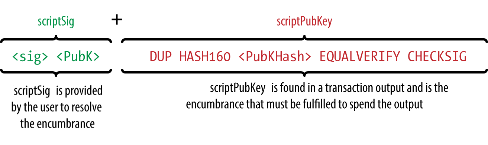
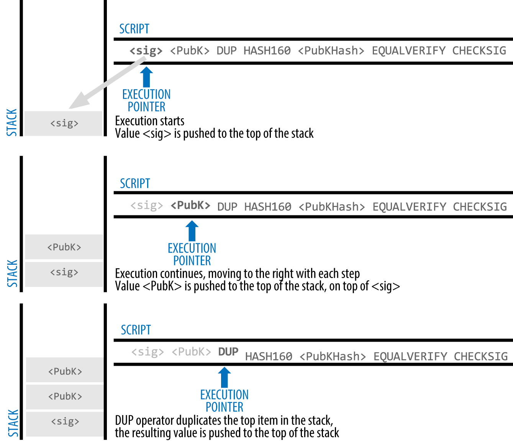

[[c_authorization_authentication]]
=== Authorization and Authentication with Scripts and Witnesses

FIXME

[[tx_script]]
[role="pagebreak-before less_space_h1"]
=== Transaction Scripts and Script Language

((("transactions", "scripts and Script language",
id="Tsript06")))((("scripting", "transactions and",
id="Stransact06")))The bitcoin transaction script language, called
_Script_, is a Forth-like reverse-polish notation stack-based execution
language. If that sounds like gibberish, you probably haven't studied
1960s programming languages, but that's ok&#x2014;we will explain it all
in this chapter. Both the locking script placed on an UTXO and the
unlocking script are written in this scripting language. When a
transaction is validated, the unlocking script in each input is executed
alongside the corresponding locking script to see if it satisfies the
spending condition.

Script is a very simple language that was designed to be limited in
scope and executable on a range of hardware, perhaps as simple as an
embedded device. It requires minimal processing and cannot do many of
the fancy things modern programming languages can do. For its use in
validating programmable money, this is a deliberate security feature.

((("Pay-to-Public-Key-Hash (P2PKH)")))Today, most transactions processed
through the Bitcoin network have the form "Payment to Bob's Bitcoin
address" and are based on a script called a Pay-to-Public-Key-Hash
script.  However, bitcoin transactions are not limited to the "Payment
to Bob's Bitcoin address" script. In fact, locking scripts can be
written to express a vast variety of complex conditions. In order to
understand these more complex scripts, we must first understand the
basics of transaction scripts and script language.

In this section, we will demonstrate the basic components of the bitcoin
transaction scripting language and show how it can be used to express
conditions for spending and how those conditions can be satisfied.

[TIP]
====
((("programmable money")))Bitcoin transaction validation is not based on
a static pattern, but instead is achieved through the execution of a
scripting language. This language allows for a nearly infinite variety
of conditions to be expressed.
====

==== Turing Incompleteness

((("Turing incompleteness")))The bitcoin transaction script language
contains many operators, but is deliberately limited in one important
way--there are no loops or complex flow control capabilities other than
conditional flow control. This ensures that the language is not _Turing
Complete_, meaning that scripts have limited complexity and predictable
execution times. Script is not a general-purpose language.
((("denial-of-service attacks")))((("denial-of-service attacks",
see="also security")))((("security", "denial-of-service attacks")))These
limitations ensure that the language cannot be used to create an
infinite loop or other form of "logic bomb" that could be embedded in a
transaction in a way that causes a denial-of-service attack against the
Bitcoin network. Remember, every transaction is validated by every full
node on the Bitcoin network. A limited language prevents the transaction
validation mechanism from being used as a vulnerability.

==== Stateless Verification

((("stateless verification")))The bitcoin transaction script language is
stateless, in that there is no state prior to execution of the script,
or state saved after execution of the script. All the
information needed to execute a script is contained within the script
and the transaction executing the script.  A
script will predictably execute the same way on any system. If your
system verifies a script, you can be sure that every other system in the
Bitcoin network will also verify the script, meaning that a valid
transaction is valid for everyone and everyone knows this. This
predictability of outcomes is an essential benefit of the Bitcoin
system.

[[tx_lock_unlock]]
==== Script Construction

Bitcoin's legacy transaction validation engine relies on two types of scripts
to validate transactions: a scriptPubKey and a scriptSig.

A scriptPubKey is a spending condition placed on an output:
it specifies the conditions that must be met to spend the output in the
future, such as who is authorized to spend the output and how they will
be authenticated.

A scriptSig is a script that satisfies the
conditions placed on an output by a scriptPubKey and allows the output
to be spent. ScriptSigs are part of every transaction input. Most
of the time they contain a digital signature produced by the user's
wallet from his or her private key, but not all scriptSigs
must contain signatures.

Every bitcoin validating node will validate transactions by executing
the scriptPubKey and scriptSig together.  As we saw in
<<c_transactions>>, each input contains an outpoint which refers to a
previous transaction output.  The input also contains a scriptSig.  The
validation software will copy the scriptSig, retrieve the UTXO
referenced by the input, and copy the scriptPubKey from that UTXO. The
scriptSig and scriptPubKey are then executed in sequence. The input is
valid if the scriptSig satisfies the scriptPubUey conditions
(see <<script_exec>>). All the inputs are validated independently, as
part of the overall validation of the transaction.

Note that the UTXO is permanently recorded in the blockchain, and
therefore is invariable and is unaffected by failed attempts to spend it
by reference in a new transaction. Only a valid transaction that
correctly satisfies the conditions of the output results in the output
being considered as "spent" and removed from the set of unspent
transaction outputs (UTXO set).

<<scriptSig_and_scriptPubKey>> is an example of the scriptPubKey and
scriptSig for the most common type of legacy Bitcoin transaction (a
payment to a public key hash), showing the combined script resulting
from the concatenation of the scripts prior to
validation.

[[scriptSig_and_scriptPubKey]]
.Combining scriptSig and scriptPubKey to evaluate a transaction script

===== The script execution stack

Bitcoin's scripting language is called a stack-based language because it
uses a data structure called a _stack_. A stack is a very simple data
structure that can be visualized as a stack of cards. A stack allows two
operations: push and pop. Push adds an item on top of the stack. Pop
removes the top item from the stack. Operations on a stack can only act
on the topmost item on the stack. A stack data structure is also called
a Last-In-First-Out, or "LIFO" queue.

The scripting language executes the script by processing each item from
left to right. Numbers (data constants) are pushed onto the stack.
Operators push or pop one or more parameters from the stack, act on
them, and might push a result onto the stack. For example, +OP_ADD+ will
pop two items from the stack, add them, and push the resulting sum onto
the stack.

Conditional operators evaluate a condition, producing a boolean result
of TRUE or FALSE. For example, +OP_EQUAL+ pops two items from the stack
and pushes TRUE (TRUE is represented by the number 1) if they are equal
or FALSE (represented by zero) if they are not equal. Bitcoin
transaction scripts usually contain a conditional operator, so that they
can produce the TRUE result that signifies a valid transaction.

===== A simple script

Now let's apply what we've learned about scripts and stacks to some simple examples.

In <<simplemath_script>>, the script +2 3 OP_ADD 5 OP_EQUAL+
demonstrates the arithmetic addition operator +OP_ADD+, adding two
numbers and putting the result on the stack, followed by the conditional
operator +OP_EQUAL+, which checks that the resulting sum is equal to
+5+. For brevity, the +OP_+ prefix may sometimes be omitted in examples
in this book. For more details on the available script operators and
functions, see <<tx_script_ops>>.

Although most legacy scriptPubKeys refer to a public key hash (essentially, a
legacy Bitcoin address), thereby requiring proof of ownership to spend the
funds, the script does not have to be that complex. Any combination of
scriptPubKey and scriptSig that results in a TRUE value is valid. The
simple arithmetic we used as an example of the scripting language is
also a valid script.

Use part of the arithmetic example script as the scriptPubKey:

----
3 OP_ADD 5 OP_EQUAL
----

which can be satisfied by a transaction containing an input with the
scriptSig:

----
2
----

The validation software combines the scripts:

----
2 3 OP_ADD 5 OP_EQUAL
----

As we saw in the step-by-step example in <<simplemath_script>>, when
this script is executed, the result is +OP_TRUE+, making the transaction
valid. Not only have we shown a valid transaction output scriptPubKey, but
the resulting UTXO could be spent by anyone with the arithmetic skills
to know that the number 2 satisfies the script.

[TIP]
====
((("transactions", "valid and invalid")))Transactions are valid if the
top result on the stack is +TRUE+, which is any
non-zero value.
Transactions are invalid if the top value on the stack is +FALSE+ (the
value zero or an empty stack), the script
execution is halted explicitly by an operator (such as +VERIFY+,
+OP_RETURN+), or the script was not semantically valid (such as
containing an +OP_IF+ statement that was not terminated by an +OP_ENDIF+
opcode). See
<<tx_script_ops>> for details.
====

[[simplemath_script]]
.Bitcoin's script validation doing simple math
image::../images/mbc2_0604.png["TxScriptSimpleMathExample"]

[role="pagebreak-before"]
The following is a slightly more complex script, which calculates ++2 +
7 -- 3 + 1++. Notice that when the script contains several operators in
a row, the stack allows the results of one operator to be acted upon by
the next operator:

----
2 7 OP_ADD 3 OP_SUB 1 OP_ADD 7 OP_EQUAL
----

Try validating the preceding script yourself using pencil and paper.
When the script execution ends, you should be left with the value +TRUE+
on the stack.

[[script_exec]]
===== Separate execution of scriptPubKey and scriptSig

In the original Bitcoin
client, scriptPubKey and scriptSig were concatenated and executed
in sequence. For security reasons, this was changed in 2010 because of
a vulnerability known as the +1 OP_RETURN+ bug.  In the current
implementation, the scripts are executed separately with the stack
transferred between the two executions, as described next.

First, the scriptSig executed using the stack execution
engine. If the scriptSig is executed without errors and has
no operations left over, the stack is copied and the
scriptPubKey is executed. If the result of executing scriptPubKey
with the stack data copied from scriptSig is "TRUE,"
the scriptSig has succeeded in resolving the conditions imposed
by the scriptPubKey and, therefore, the input is a valid authorization
to spend the UTXO. If any result other than "TRUE" remains after
execution of the combined script, the input is invalid because it has
failed to satisfy the spending conditions placed on the output.

[[p2pkh]]
==== Pay-to-Public-Key-Hash (P2PKH)

((("Pay-to-Public-Key-Hash (P2PKH)")))
A Pay-to-Public-Key-Hash or "P2PKH" script uses a scriptPubKey that
contains a hash which commits to a public key.  P2PKH is best known as a
the basis for a legacy Bitcoin address. An P2PKH output can be spent by
presenting a public key which matches the hash commitment and a digital
signature created by the corresponding private key (see
<<digital_sigs>>).  Let's look at an example of a P2PKH scriptPubKey:

----
OP_DUP OP_HASH160 <Key Hash> OP_EQUALVERIFY OP_CHECKSIG
----

The +Key Hash+ the data that would be encoded into a legacy Base58Check
address.  Most applications would show the _public key hash_ in a script
using hexadecimal encoding and not the familiar Bitcoin
address Base58Check format that begins with a "1."

The preceding scriptPubKey can be satisfied with a scriptSig
of the form:

----
<Signature> <Public Key>
----

The two scripts together would form the following combined validation
script:

----
<Sig> <Pubkey> OP_DUP OP_HASH160 <Hash> OP_EQUALVERIFY OP_CHECKSIG
----

When executed, this combined script will evaluate to TRUE if, and only
if, the scriptSig matches the conditions set by the scriptPubKey.
In other words, the result will be TRUE if the scriptSig
has a valid signature from Bob's private key that corresponds to
the public key hash set as an encumbrance.

Figures pass:[<a data-type="xref" href="#P2PubKHash1"
data-xrefstyle="select: labelnumber">#P2PubKHash1</a>] and pass:[<a
data-type="xref" href="#P2PubKHash2" data-xrefstyle="select:
labelnumber">#P2PubKHash2</a>] show (in two parts) a step-by-step
execution of the combined script, which will prove this is a valid
transaction.((("", startref="Tsript06")))((("",
startref="Stransact06")))

[[P2PubKHash1]]
.Evaluating a script for a P2PKH transaction (part 1 of 2)

[[P2PubKHash2]]
.Evaluating a script for a P2PKH transaction (part 2 of 2)

[[ch07_intro]]
=== Introduction

In the previous chapter, we introduced the basic elements of bitcoin
transactions and looked at the most common type of transaction script,
the P2PKH script. In this chapter we will look at more advanced
scripting and how we can use it to build transactions with complex
conditions.

First, we will look at _multisignature_ scripts. Next, we will examine
the second most common transaction script, _Pay-to-Script-Hash_, which
opens up a whole world of complex scripts. Then, we will examine new
script operators that add a time dimension to bitcoin, through
_timelocks_. Finally, we will look at _Segregated Witness_, an
architectural change to the structure of transactions.
image::../images/mbc2_0606.png["Tx_Script_P2PubKeyHash_2"]

[[multisig]]
=== Multisignature

((("transactions", "advanced", "multisignature
scripts")))((("transactions", "advanced", id="Tadv07")))((("scripting",
"multisignature scripts", id="Smulti07")))((("multisignature
scripts")))Multisignature scripts set a condition where N public keys
are recorded in the script and at least K of those must provide
signatures to spend the funds. This is also known as a K-of-N scheme,
where N is the total number of keys and K is the threshold of signatures
required for validation. For example, a 2-of-3 multisignature is one
where three public keys are listed as potential signers and at least two
of those must be used to create signatures for a valid transaction to
spend the funds.

[TIP]
====
Some Bitcoin documentation, including earlier editions of this book,
uses the term M-of-N for traditional multisignature.  However, it's hard
to tell "M" and "N" apart when they're spoken, so we use the alternative
K-of-N.  Both phrases refer to the same type of signature scheme.
====

At this time, _standard_ multisignature scriptPubKeys are limited to at most 3
listed public keys, meaning you can do anything from a 1-of-1 to a
3-of-3 multisignature or any combination within that range.
You may want to check the +IsStandard()+ function to see what is currently
accepted by the network. Note that the limit of 3 keys applies only to
standard (also known as "bare") multisignature scripts, not to
multisignature scripts wrapped in a Pay-to-Script-Hash (P2SH) script.
P2SH multisignature scripts are limited to 15 keys, allowing for up to
15-of-15 multisignature. We will learn about P2SH in <<p2sh>>.

The general form of a scriptPubKey setting an K-of-N multisignature
condition is:

----
K <Public Key 1> <Public Key 2> ... <Public Key N> N OP_CHECKMULTISIG
----

where N is the total number of listed public keys and K is the threshold
of required signatures to spend the output.

A scriptPubKey setting a 2-of-3 multisignature condition looks like
this:

----
2 <Public Key A> <Public Key B> <Public Key C> 3 OP_CHECKMULTISIG
----

The preceding scriptPubKey can be satisfied with a scriptSig
containing pairs of signatures and public keys:

----
<Signature B> <Signature C>
----

or any combination of two signatures from the private keys corresponding
to the three listed public keys.

The two scripts together would form the combined validation script:

----
<Signature B> <Signature C> 2 <Public Key A> <Public Key B> <Public Key C> 3 OP_CHECKMULTISIG
----

When executed, this combined script will evaluate to TRUE if, and only
if, the scriptSig script matches the conditions set by the scriptPubKey.
In this case, the condition is whether the scriptSig has
a valid signature from the two private keys that correspond to two of
the three public keys set as an encumbrance.

[[multisig_bug]]
==== An oddity in CHECKMULTISIG execution

((("scripting", "multisignature scripts", "OP_CHECKMULTISIG
oddity")))((("OP_CHECKMULTISIG oddity workaround")))There is an oddity in
++OP_CHECKMULTISIG++'s execution that requires a slight workaround. When
+OP_CHECKMULTISIG+ executes, it should consume K+N+2 items on the stack as
parameters. However, due to the oddity, +OP_CHECKMULTISIG+ will pop an extra
value or one value more than expected.

Let's look at this in greater detail using the previous validation
example:

----
<Signature B> <Signature C> 2 <Public Key A> <Public Key B> <Public Key C> 3 OP_CHECKMULTISIG
----

First, +OP_CHECKMULTISIG+ pops the top item, which is +N+ (in this example
"3"). Then it pops +N+ items, which are the public keys that can sign.
In this example, public keys A, B, and C. Then, it pops one item, which
is +K+, the quorum (how many signatures are needed). Here M = 2. At this
point, +OP_CHECKMULTISIG+ should pop the final +K+ items, which are the
signatures, and see if they are valid. However, unfortunately, an oddity in
the implementation causes +OP_CHECKMULTISIG+ to pop one more item (K+1
total) than it should. The extra item is called the _dummy stack
element_ and it is disregarded when checking the
signatures so it has no direct effect on +OP_CHECKMULTISIG+ itself.
However, the dummy element must be present because, if it is not present,
when +OP_CHECKMULTISIG+ attempts to pop on an empty stack, it will cause a
stack error and script failure (marking the transaction as invalid).
Because the dummy element is disregarded it can be anything, but
it became the custom early on to use +OP_0+, which later became a
relay policy rule and eventually a consensus rule (with the enforcement of BIP147).

Because popping the dummy element is part of the consensus rules, it must now be
replicated forever. Therefore the correct script validation would look
like this:

----
OP_0 <Signature B> <Signature C> 2 <Public Key A> <Public Key B> <Public Key C> 3 OP_CHECKMULTISIG
----

Thus the scriptSig actually used in multisig is not:

----
<Signature B> <Signature C>
----

but instead it is:

----
OP_0 <Signature B> <Signature C>
----

Some people believe this oddity was a bug in the original code for
Bitcoin, but a plausible alternative explanation exists.  Verifying
K-of-N signatures can require many more than K or N signature checking
operations.  Let's consider a simple example of 1-in-3, with the
following combined script:

----
<dummy> <Sig4> 1 <key0> <key1> <key2> <key3> <key4> 5 OP_CHECKMULTISIG
----

The signature is checked first against +key0+, then +key1+, and then
the other keys before it is finally compared to its corresponding
+key4+.  That means five signature checking operations need to be
performed even though there's only one signature.  One way to eliminate
this redundancy would have been to provide OP_CHECKMULTISIG a map
indicating which provided signature corresponds to which public key,
allowing the OP_CHECKMULTISIG operation to only perform exactly K
signature-checking operations.  It's possible that Bitcoin's original
developer added the extra element (which we now call the dummy stack
element) in the original version of Bitcoin so that they could add the
feature for allowing a map to be passed in a later soft fork.  However,
that feature was never implemented and the BIP147 update to the
consensus rules in 2017 makes it impossible to add that feature in the
future.

Only Bitcoin's original developer could tell us whether the dummy stack
element was the result of a bug or a plan for a future upgrade.  In this
book, we simply call it an oddity.

From now on, if you see a multisig script, you should expect
to see an extra +OP_0+ in the beginning, whose only purpose is as a
workaround to an oddity in the consensus rules.((("",
startref="Smulti07")))

[[p2sh]]
=== Pay-to-Script-Hash (P2SH)

((("transactions", "advanced", "Pay-to-Script-Hash")))((("scripting",
"Pay-to-Script-Hash", id="Spay07")))Pay-to-Script-Hash (P2SH) was
introduced in 2012 as a powerful new type of transaction that greatly
simplifies the use of complex transaction scripts. To explain the need
for P2SH, let's look at a practical example.

((("use cases", "import/export", id="mohamseven")))((("scripting",
"Pay-to-Script-Hash", "import/export example")))((("Pay-to-Script-Hash
(P2SH)", "import/export example")))In <<ch01_intro_what_is_bitcoin>> we
introduced Mohammed, an electronics importer based in Dubai. Mohammed's
company uses bitcoin's multisignature feature extensively for its
corporate accounts. Multisignature scripts are one of the most common
uses of bitcoin's advanced scripting capabilities and are a very
powerful feature. ((("accounts receivable (AR)")))Mohammed's company
uses a multisignature script for all customer payments, known in
accounting terms as "accounts receivable," or AR. With the
multisignature scheme, any payments made by customers are locked in such
a way that they require at least two signatures to release, from
Mohammed and one of his partners or from his attorney who has a backup
key. A multisignature scheme like that offers corporate governance
controls and protects against theft, embezzlement, or loss.

The resulting script is quite long and looks like this:

----
2 <Mohammed's Public Key> <Partner1 Public Key> <Partner2 Public Key> <Partner3 Public Key> <Attorney Public Key> 5 OP_CHECKMULTISIG
----

Although multisignature scripts are a powerful feature, they are
cumbersome to use. Given the preceding script, Mohammed would have to
communicate this script to every customer prior to payment. Each
customer would have to use special bitcoin wallet software with the
ability to create custom transaction scripts, and each customer would
have to understand how to create a transaction using custom scripts.
Furthermore, the resulting transaction would be about five times larger
than a simple payment transaction, because this script contains very
long public keys. The burden of that extra data would be
borne by the customer in the form of extra transaction fees. Finally, a large transaction
script like this would be carried in the UTXO set in every full
node, until it was spent. All of these issues make using complex scriptPubKeys
difficult in practice.

P2SH was developed to resolve these practical difficulties and to make
the use of complex scripts as easy as a payment to a Bitcoin address.
With P2SH payments, the complex script is replaced with a
commitment, the digest of a cryptographic hash. When a transaction attempting
to spend the UTXO is presented later, it must contain the script that
matches the commitment in addition to the data which satisifies the script. In simple terms,
P2SH means "pay to a script matching this hash, a script that will be
presented later when this output is spent."

((("redeemScripts")))((("scripting", "redeemScripts")))In P2SH
transactions, the script that is replaced by a hash is referred
to as the _redeemScript_ because it is presented to the system at
redemption time rather than as a scriptPubKey. <<without_p2sh>> shows
the script without P2SH and <<with_p2sh>> shows the same script encoded
with P2SH.

[[without_p2sh]]
.Complex script without P2SH
|=======
| ScriptPubKey | 2 PubKey1 PubKey2 PubKey3 PubKey4 PubKey5 5 OP_CHECKMULTISIG
| ScriptSig | Sig1 Sig2
|=======

[[with_p2sh]]
.Complex script as P2SH
|=======
| RedeemScript | 2 PubKey1 PubKey2 PubKey3 PubKey4 PubKey5 5 OP_CHECKMULTISIG
| ScriptPubKey | OP_HASH160 <20-byte hash of redeemScript> OP_EQUAL
| ScriptSig | Sig1 Sig2 <redeemScript>
|=======

As you can see from the tables, with P2SH the complex script that
details the conditions for spending the output (redeemScript) is not
presented in the scriptPubKey. Instead, only a hash of it is in the
scriptPubKey and the reedemScript itself is presented later, as part
of the scriptSig when the output is spent. This shifts the burden
in fees and complexity from the sender to the recipient (spender) of the
transaction.

Let's look at Mohammed's company, the complex multisignature script, and
the resulting P2SH scripts.

First, the multisignature script that Mohammed's company uses for all
incoming payments from customers:

----
2 <Mohammed's Public Key> <Partner1 Public Key> <Partner2 Public Key> <Partner3 Public Key> <Attorney Public Key> 5 OP_CHECKMULTISIG
----

If the placeholders are replaced by actual public keys (shown here as
520-bit numbers starting with 04) you can see that this script becomes
very long:

----
2
04C16B8698A9ABF84250A7C3EA7EEDEF9897D1C8C6ADF47F06CF73370D74DCCA01CDCA79DCC5C395D7EEC6984D83F1F50C900A24DD47F569FD4193AF5DE762C58704A2192968D8655D6A935BEAF2CA23E3FB87A3495E7AF308EDF08DAC3C1FCBFC2C75B4B0F4D0B1B70CD2423657738C0C2B1D5CE65C97D78D0E34224858008E8B49047E63248B75DB7379BE9CDA8CE5751D16485F431E46117B9D0C1837C9D5737812F393DA7D4420D7E1A9162F0279CFC10F1E8E8F3020DECDBC3C0DD389D99779650421D65CBD7149B255382ED7F78E946580657EE6FDA162A187543A9D85BAAA93A4AB3A8F044DADA618D087227440645ABE8A35DA8C5B73997AD343BE5C2AFD94A5043752580AFA1ECED3C68D446BCAB69AC0BA7DF50D56231BE0AABF1FDEEC78A6A45E394BA29A1EDF518C022DD618DA774D207D137AAB59E0B000EB7ED238F4D800 5 OP_CHECKMULTISIG
----

This entire script can instead be represented by a 20-byte cryptographic
hash, by first applying the SHA256 hashing algorithm and then applying
the RIPEMD160 algorithm on the result.

We use +libbitcoin-explorer+ (+bx+) on the command-line to produce the
script hash, as follows:

----
echo \
2 \
[04C16B8698A9ABF84250A7C3EA7EEDEF9897D1C8C6ADF47F06CF73370D74DCCA01CDCA79DCC5C395D7EEC6984D83F1F50C900A24DD47F569FD4193AF5DE762C587] \
[04A2192968D8655D6A935BEAF2CA23E3FB87A3495E7AF308EDF08DAC3C1FCBFC2C75B4B0F4D0B1B70CD2423657738C0C2B1D5CE65C97D78D0E34224858008E8B49] \
[047E63248B75DB7379BE9CDA8CE5751D16485F431E46117B9D0C1837C9D5737812F393DA7D4420D7E1A9162F0279CFC10F1E8E8F3020DECDBC3C0DD389D9977965] \
[0421D65CBD7149B255382ED7F78E946580657EE6FDA162A187543A9D85BAAA93A4AB3A8F044DADA618D087227440645ABE8A35DA8C5B73997AD343BE5C2AFD94A5] \
[043752580AFA1ECED3C68D446BCAB69AC0BA7DF50D56231BE0AABF1FDEEC78A6A45E394BA29A1EDF518C022DD618DA774D207D137AAB59E0B000EB7ED238F4D800] \
5 CHECKMULTISIG \
| bx script-encode | bx sha256 | bx ripemd160
54c557e07dde5bb6cb791c7a540e0a4796f5e97e
----

The series of commands above first encodes Mohammed's multisig
redeemScript as a serialized hex-encoded bitcoin Script. The next +bx+ command
calculates the SHA256 hash of that. The next +bx+ command hashes again
with RIPEMD160, producing the final script-hash:

The 20-byte hash of Mohammed's redeemScript is:

----
54c557e07dde5bb6cb791c7a540e0a4796f5e97e
----

A P2SH transaction locks the output to this hash instead of the longer
redeemScript, using a special scriptPubKey template:

----
OP_HASH160 54c557e07dde5bb6cb791c7a540e0a4796f5e97e OP_EQUAL
----

which, as you can see, is much shorter. Instead of "pay to this 5-key
multisignature script," the P2SH equivalent transaction is "pay to a
script with this hash." A customer making a payment to Mohammed's
company need only include this much shorter scriptPubKey in his
payment. When Mohammed and his partners want to spend this UTXO, they
must present the original redeemScript (the one whose hash locked the
UTXO) and the signatures necessary to unlock it, like this:

----
<Sig1> <Sig2> <2 PK1 PK2 PK3 PK4 PK5 5 OP_CHECKMULTISIG>
----

The two scripts are combined in two stages. First, the redeemScript is
checked against the scriptPubKey to make sure the hash matches:

----
<2 PK1 PK2 PK3 PK4 PK5 5 OP_CHECKMULTISIG> OP_HASH160 <redeemScript hash> OP_EQUAL
----

If the redeemScript hash matches, the redeemScript is executed:

----
<Sig1> <Sig2> 2 PK1 PK2 PK3 PK4 PK5 5 OP_CHECKMULTISIG
----

==== P2SH Addresses

((("scripting", "Pay-to-Script-Hash",
"addresses")))((("Pay-to-Script-Hash (P2SH)", "addresses")))((("bitcoin
improvement proposals", "Address Format for P2SH (BIP13)")))Another
important part of the P2SH feature is the ability to encode a script
hash as an address, as defined in BIP13. P2SH addresses are Base58Check
encodings of the 20-byte hash of a script, just like Bitcoin addresses
are Base58Check encodings of the 20-byte hash of a public key. P2SH
addresses use the version prefix "5," which results in
Base58Check-encoded addresses that start with a "3."

For example, Mohammed's complex script, hashed and Base58Check-encoded
as a P2SH address, becomes +39RF6JqABiHdYHkfChV6USGMe6Nsr66Gzw+. We can
confirm that with the +bx+ command:

----
echo \
'54c557e07dde5bb6cb791c7a540e0a4796f5e97e'\
 | bx address-encode -v 5
39RF6JqABiHdYHkfChV6USGMe6Nsr66Gzw
----

Now, Mohammed can give this "address" to his customers and they can use
almost any bitcoin wallet to make a simple payment, as if it were a
Bitcoin address. The 3 prefix gives them a hint that this is a special
type of address, one corresponding to a script instead of a public key,
but otherwise it works in exactly the same way as a payment to a Bitcoin
address.

P2SH addresses hide all of the complexity, so that the person making a
payment does not see the script.

==== Benefits of P2SH

((("scripting", "Pay-to-Script-Hash", "benefits
of")))((("Pay-to-Script-Hash (P2SH)", "benefits of")))The P2SH feature
offers the following benefits compared to the direct use of complex
scripts in outputs:

- Complex scripts are replaced by shorter commitments in the
  transaction output, making the transaction smaller.

- Scripts can be coded as an address, so the sender and the sender's
  wallet don't need complex engineering to implement P2SH.

- P2SH shifts the burden of constructing the script to the recipient,
  not the sender.

- P2SH shifts the burden in data storage for the long script from the
  output (which additionally to being stored on the blockchain is in the
  UTXO set) to the input (only stored on the blockchain).

- P2SH shifts the burden in data storage for the long script from the
  present time (payment) to a future time (when it is spent).

- P2SH shifts the transaction fee cost of a long script from the sender
  to the recipient, who has to include the long redeemScript to spend
  it.

==== RedeemScript and Validation

You are not able to put a P2SH inside a P2SH redeemScript, because the
P2SH specification is not recursive. Also, while it is technically
possible to include +OP_RETURN+ (see <<op_return>>) in a redeemScript, as
nothing in the rules prevents you from doing so, it is of no practical
use because executing +OP_RETURN+ during validation will cause the
transaction to be marked invalid.

Note that because the redeemScript is not presented to the network
until you attempt to spend a P2SH output, if you create an output with the
hash of an invalid redeemScript, you will not be able to spend
it.  The spending transaction, which includes the redeemScript,
will not be accepted because it is an invalid script. This creates a
risk, because you can send bitcoin to a P2SH address that cannot be spent later.

[WARNING]
====
((("warnings and cautions", "accidental bitcoin invalidation")))P2SH scriptPubKeys
contain the hash of a redeemScript, which gives no clues as to
the content of the redeemScript. The P2SH transaction will be
considered valid and accepted even if the redeemScript is invalid. You
might accidentally receive bitcoin in such a way that it cannot later be
spent.
====

[[op_return]]
=== Data Recording Output (OP_RETURN)

((("transactions", "advanced", "data recording output")))((("scripting",
"data recording output")))((("OP_RETURN operator")))((("data recording
(nonpayment data)")))((("nonpayment data")))((("blockchain (the)",
"nonpayment data recording")))((("digital notary services")))Bitcoin's
distributed and timestamped ledger, the blockchain, has potential uses
beyond payments. Many developers have tried to use the transaction
scripting language to take advantage of the security and resilience of
the system for applications such as digital notary services
and smart contracts. Early attempts to use bitcoin's
script language for these purposes involved creating transaction outputs
that recorded data on the blockchain; for example, to record a digital
fingerprint of a file in such a way that anyone could establish
proof-of-existence of that file on a specific date by reference to that
transaction.

((("blockchain bloat")))((("bloat")))((("unspent transaction outputs
(UTXO)")))((("UTXO sets")))The use of bitcoin's blockchain to store data
unrelated to bitcoin payments is a controversial subject. Many
developers consider such use abusive and want to discourage it. Others
view it as a demonstration of the powerful capabilities of blockchain
technology and want to encourage such experimentation. Those who object
to the inclusion of nonpayment data argue that it causes "blockchain
bloat," burdening those running full Bitcoin nodes with carrying the
cost of disk storage for data that the blockchain was not intended to
carry. Moreover, such transactions create UTXO that cannot be spent,
using the destination Bitcoin address as a freeform 20-byte field.
Because the address is used for data, it doesn't correspond to a private
key and the resulting UTXO can _never_ be spent; it's a fake payment.
These transactions that can never be spent are therefore never removed
from the UTXO set and cause the size of the UTXO database to forever
increase, or "bloat."

A compromise was reached
that allows the a scriptPubKey starting with +OP_RETURN+ to
add nonpayment data to a transaction output. However, unlike
the use of "fake" UTXO, the +OP_RETURN+ operator creates an explicitly
_provably unspendable_ output, which does not need to be stored in the
UTXO set. +OP_RETURN+ outputs are recorded on the blockchain, so they
consume disk space and contribute to the increase in the blockchain's
size, but they are not stored in the UTXO set and therefore do not bloat
the UTXO memory pool and burden full nodes with the cost of more
expensive database operations.

+OP_RETURN+ scripts look like this:

----
OP_RETURN <data>
----

((("Proof of Existence")))((("DOCPROOF prefix")))The data portion is
often represents a hash, such as the output
from the SHA256 algorithm (32 bytes). Some applications put a prefix in
front of the data to help identify the application. For example, the
http://proofofexistence.com[Proof of Existence] digital notarization
service uses the 8-byte prefix +DOCPROOF+, which is ASCII encoded as +44
4f 43 50 52 4f 4f 46+ in hexadecimal.

Keep in mind that there is no scriptSig that corresponds to
+OP_RETURN+ that could possibly be used to "spend" an +OP_RETURN+ output. The
whole point of an +OP_RETURN+ output is that you can't spend the money locked in that
output, and therefore it does not need to be held in the UTXO set as
potentially spendable--+OP_RETURN+ is _provably unspendable_. +OP_RETURN+ is
usually an output with a zero amount, because any bitcoins
assigned to such an output is effectively lost forever. If an +OP_RETURN+ is
referenced as an input in a transaction, the script validation engine
will halt the execution of the validation script and mark the
transaction as invalid. The execution of +OP_RETURN+ essentially causes the
script to "RETURN" with a +FALSE+ and halt. Thus, if you accidentally
reference a +OP_RETURN+ output as an input in a transaction, that
transaction is invalid.

[[locktime_limitations]]
===== Transaction locktime limitations

+nLockTime+ has the limitation that while it makes it possible to spend some outputs in the future, it does not make it impossible to spend them until that time. Let's explain that with the following example.

((("use cases", "buying coffee", id="alicesseven")))Alice signs a transaction spending one of her outputs to Bob's address, and sets the transaction +nLockTime+ to 3 months in the future. Alice sends that transaction to Bob to hold. With this transaction Alice and Bob know that:

* Bob cannot transmit the transaction to redeem the funds until 3 months have elapsed.
* Bob may transmit the transaction after 3 months.

However:

* Alice can create another transaction, double-spending the same inputs without a locktime. Thus, Alice can spend the same UTXO before the 3 months have elapsed.
* Bob has no guarantee that Alice won't do that.

It is important to understand the limitations of transaction +nLockTime+. The only guarantee is that Bob will not be able to redeem it before 3 months have elapsed. There is no guarantee that Bob will get the funds. To achieve such a guarantee, the timelock restriction must be placed on the UTXO itself and be part of the script, rather than on the transaction. This is achieved by the next form of timelock, called Check Lock Time Verify.

==== Check Lock Time Verify (OP_CLTV)

((("Check Lock Time Verify (OP_CLTV)", id="cltv07")))((("timelocks", "Check
Lock Time Verify (OP_CLTV)")))((("scripting", "timelocks", "Check Lock Time
Verify (OP_CLTV)")))((("bitcoin improvement proposals",
"OP_CHECKLOCKTIMEVERIFY (BIP65)")))In December 2015, a new form of
timelock was introduced to Bitcoin as a soft fork upgrade. Based on a
specification in BIP65, a new script operator called
_OP_CHECKLOCKTIMEVERIFY_ (_CLTV_) was added to the scripting language.
+OP_CLTV+ is a per-output timelock, rather than a per-transaction timelock
as is the case with +nLockTime+. This allows for much greater
flexibility in the way timelocks are applied.

In simple terms, by adding the +OP_CLTV+ opcode in the redeemScript of an
output it restricts the output, so that it can only be spent after the
specified time has elapsed.

[TIP]
====
While +nLockTime+ is a transaction-level timelock, +OP_CLTV+ is an
output-based timelock.
====

+OP_CLTV+ doesn't replace +nLockTime+, but rather restricts specific UTXO
such that they can only be spent in a future transaction with
+nLockTime+ set to a greater or equal value.

The +OP_CLTV+ opcode takes one parameter as input, expressed as a number in
the same format as +nLockTime+ (either a block height or Unix epoch
time). As indicated by the +VERIFY+ suffix, +OP_CLTV+ is the type of opcode
that halts execution of the script if the outcome is +FALSE+. If it
results in TRUE, execution continues.

In order to use +OP_CLTV+, you insert it into the redeemScript of the
output in the transaction that creates the output. For
example, if Alice is paying Bob's address, the output would normally
contain a P2PKH script like this:

----
OP_DUP OP_HASH160 <Bob's Public Key Hash> OP_EQUALVERIFY OP_CHECKSIG
----

To lock it to a time, say 3 months from now, the transaction would be a
P2SH transaction with a redeemScript like this:

----
<now + 3 months> OP_CHECKLOCKTIMEVERIFY OP_DROP OP_DUP OP_HASH160 <Bob's Public Key Hash> OP_EQUALVERIFY OP_CHECKSIG
----

where +<now {plus} 3 months>+ is a block height or time value estimated
3 months from the time the transaction is mined: current block height
{plus} 12,960 (blocks) or current Unix epoch time {plus} 7,760,000
(seconds). For now, don't worry about the +OP_DROP+ opcode that follows
+OP_CHECKLOCKTIMEVERIFY+; it will be explained shortly.

When Bob tries to spend this UTXO, he constructs a transaction that
references the UTXO as an input. He uses his signature and public key in
the scriptSig of that input and sets the transaction +nLockTime+
to be equal or greater to the timelock in the +OP_CHECKLOCKTIMEVERIFY+
Alice set. Bob then broadcasts the transaction on the Bitcoin network.

Bob's transaction is evaluated as follows. If the +OP_CHECKLOCKTIMEVERIFY+
parameter Alice set is less than or equal the spending transaction's
+nLockTime+, script execution continues (acts as if a _no
operation_ or OP_NOP opcode was executed). Otherwise, script
execution halts and the transaction is deemed invalid.

More precisely, +OP_CHECKLOCKTIMEVERIFY+ fails and halts execution, marking
the transaction invalid if (source: BIP65):

1. the stack is empty; or
1. the top item on the stack is less than 0; or
1. the lock-time type (height versus timestamp) of the top stack item and the +nLockTime+ field are not the same; or
1. the top stack item is greater than the transaction's +nLockTime+ field; or
1. the +nSequence+ field of the input is 0xffffffff.

[NOTE]
====
+OP_CLTV+ and +nLockTime+ use the same format to describe timelocks, either
a block height or the time elapsed in seconds since Unix epoch.
Critically, when used together, the format of +nLockTime+ must match
that of +OP_CLTV+ in the outputs--they must both reference either
block height or time in seconds.
====

After execution, if +OP_CLTV+ is satisfied, the parameter that
preceded it remains as the top item on the stack and may need to be
dropped, with +OP_DROP+, for correct execution of subsequent script
opcodes. You will often see +OP_CHECKLOCKTIMEVERIFY+ followed by +OP_DROP+ in
scripts for this reason.

By using nLockTime in conjunction with +OP_CLTV+, the scenario described in
<<locktime_limitations>> changes. Alice can no longer spend the money
(because it's locked with Bob's key) and Bob cannot spend it before the
3-month locktime has expired.((("", startref="alicesseven")))

By introducing timelock functionality directly into the scripting
language, +OP_CLTV+ allows us to develop some very interesting complex
scripts.((("", startref="cltv07")))

The standard is defined in
https://github.com/bitcoin/bips/blob/master/bip-0065.mediawiki[BIP65
(OP_CHECKLOCKTIMEVERIFY)].

==== Relative Timelocks

+nLockTime+ and +OP_CLTV+ are ((("timelocks", "relative timelocks",
id="Trelative07")))((("scripting", "timelocks", "relative
timelocks")))((("relative timelocks", id="relativetime07")))both
_absolute timelocks_ in that they specify an absolute point in time. The
next two timelock features we will examine are _relative timelocks_ in
that they specify, as a condition of spending an output, an elapsed time
from the confirmation of the output in the blockchain.

Relative timelocks are useful because they allow a chain of two or more
interdependent transactions to be held off chain, while imposing a time
constraint on one transaction that is dependent on the elapsed time from
the confirmation of a previous transaction. In other words, the clock
doesn't start counting until the UTXO is recorded on the blockchain.
This functionality is especially useful in bidirectional state channels
and Lightning Networks, as we will see in <<state_channels>>.

Relative timelocks, like absolute timelocks, are implemented with both a
transaction-level feature and a script-level opcode. The
transaction-level relative timelock is implemented as a consensus rule
on the value of +nSequence+, a transaction field that is set in every
transaction input. Script-level relative timelocks are implemented with
the +OP_CHECKSEQUENCEVERIFY+ (OP_CSV) opcode.

((("bitcoin improvement proposals", "Relative lock-time using
consensus-enforced sequence numbers (BIP68)")))((("bitcoin improvement
proposals", "CHECKSEQUENCEVERIFY (BIP112)")))Relative timelocks are
implemented according to the specifications in
https://github.com/bitcoin/bips/blob/master/bip-0068.mediawiki[BIP68,
Relative lock-time using consensus-enforced sequence numbers] and
https://github.com/bitcoin/bips/blob/master/bip-0112.mediawiki[BIP112,
OP_CHECKSEQUENCEVERIFY].

BIP68 and BIP112 were activated in May 2016 as a soft fork upgrade to
the consensus rules.

==== Relative Timelocks with OP_CSV

((("scripting", "timelocks", "relative timelocks with
CHECKSEQUENCEVERIFY")))((("CHECKSEQUENCEVERIFY (CSV)")))Just like OP_CLTV
and +nLockTime+, there is a script opcode for relative timelocks that
leverages the +nSequence+ value in scripts. That opcode is
+OP_CHECKSEQUENCEVERIFY+, commonly referred to as +OP_CSV+ for short.

The +OP_CSV+ opcode when evaluated in an UTXO's script allows
spending only in a transaction whose input +nSequence+ value is greater
than or equal to the +OP_CSV+ parameter. Essentially, this restricts
spending the UTXO until a certain number of blocks or seconds have
elapsed relative to the time the UTXO was mined.

As with CLTV, the value in +OP_CSV+ must match the format in the
corresponding +nSequence+ value. If +OP_CSV+ is specified in terms of
blocks, then so must +nSequence+. If +OP_CSV+ is specified in terms of
seconds, then so must +nSequence+.

Relative timelocks with +CSV+ are especially useful when several
(chained) transactions are created and signed, but not propagated, when
they're kept "off-chain." A child transaction cannot be used until the
parent transaction has been propagated, mined, and aged by the time
specified in the relative timelock. One application of this use case can
be seen in <<state_channels>> and <<lightning_network>>.((("",
startref="relativetime07")))((("", startref="Trelative07")))

+OP_CSV+ is defined in detail in
https://github.com/bitcoin/bips/blob/master/bip-0112.mediawiki[BIP112,
CHECKSEQUENCEVERIFY].

=== Scripts with Flow Control (Conditional Clauses)

((("transactions", "advanced", "flow control scripts")))((("scripting",
"flow control scripts", id="Sflow07")))((("conditional clauses",
id="condition07")))((("flow control", id="flow07")))One of the more
powerful features of Bitcoin Script is flow control, also known as
conditional clauses. You are probably familiar with flow control in
various programming languages that use the construct +IF...THEN...ELSE+.
Bitcoin conditional clauses look a bit different, but are essentially
the same construct.

At a basic level, bitcoin conditional opcodes allow us to construct a
script that has two ways of being unlocked, depending on a
+TRUE+/+FALSE+ outcome of evaluating a logical condition. For example,
if x is +TRUE+, the redeemScript is A and the ELSE redeemScript is B.

Additionally, bitcoin conditional expressions can be "nested"
indefinitely, meaning that a conditional clause can contain another
within it, which contains another, etc. Bitcoin Script flow control can
be used to construct very complex scripts with hundreds or even
thousands of possible execution paths. There is no limit to nesting, but
consensus rules impose a limit on the maximum size, in bytes, of a
script.

Bitcoin implements flow control using the +OP_IF+, +OP_ELSE+, +OP_ENDIF+, and
+OP_NOTIF+ opcodes. Additionally, conditional expressions can contain
boolean operators such as +OP_BOOLAND+, +OP_BOOLOR+, and +OP_NOT+.

At first glance, you may find the bitcoin's flow control scripts
confusing. That is because Bitcoin Script is a stack language. The same
way that +1 {plus} 1+ looks "backward" when expressed as +1 1 OP_ADD+, flow
control clauses in bitcoin also look "backward."

In most traditional (procedural) programming languages, flow control
looks like this:

.Pseudocode of flow control in most programming languages
----
if (condition):
  code to run when condition is true
else:
  code to run when condition is false
code to run in either case
----

In a stack-based language like Bitcoin Script, the logical condition
comes before the +IF+, which makes it look "backward," like this:

.Bitcoin Script flow control
----
condition
IF
  code to run when condition is true
OP_ELSE
  code to run when condition is false
OP_ENDIF
code to run in either case
----

When reading Bitcoin Script, remember that the condition being evaluated
comes _before_ the +IF+ opcode.

==== Conditional Clauses with VERIFY Opcodes

((("VERIFY opcodes")))((("IF clauses")))((("opcodes", "VERIFY")))Another
form of conditional in Bitcoin Script is any opcode that ends in
+VERIFY+. The +VERIFY+ suffix means that if the condition evaluated is
not +TRUE+, execution of the script terminates immediately and the
transaction is deemed invalid.

((("guard clauses")))Unlike an +IF+ clause, which offers alternative
execution paths, the +VERIFY+ suffix acts as a _guard clause_,
continuing only if a precondition is met.

For example, the following script requires Bob's signature and a
pre-image (secret) that produces a specific hash. Both conditions must
be satisfied to unlock:

.A script with an +OP_EQUALVERIFY+  guard clause.
----
OP_HASH160 <expected hash> OP_EQUALVERIFY <Bob's Pubkey> OP_CHECKSIG
----

To spend this, Bob must present a
valid pre-image and a signature:

.Satisfying the above script
----
<Bob's Sig> <hash pre-image>
----

Without presenting the pre-image, Bob can't get to the part of the
script that checks for his signature.

[role="pagebreak-after"]
This script can be written with an +OP_IF+ instead:

.A script with an +IF+ guard clause
----
OP_HASH160 <expected hash> OP_EQUAL
OP_IF
   <Bob's Pubkey> OP_CHECKSIG
OP_ENDIF
----

Bob's authentication data identical:

.Satisfying the above script
----
<Bob's Sig> <hash pre-image>
----

The script with +OP_IF+ does the same thing as using an opcode with a
+VERIFY+ suffix; they both operate as guard clauses. However, the
+VERIFY+ construction is more efficient, using two fewer opcodes.

So, when do we use +VERIFY+ and when do we use +OP_IF+? If all we are
trying to do is to attach a precondition (guard clause), then +VERIFY+
is better. If, however, we want to have more than one execution path
(flow control), then we need an +OP_IF...OP_ELSE+ flow control clause.

==== Using Flow Control in Scripts

A very common use for flow control in Bitcoin Script is to construct a
script that offers multiple execution paths, each a different way
of redeeming the UTXO.

((("use cases", "buying coffee")))Let's look at a simple example, where
we have two signers, Alice and Bob, and either one is able to redeem.
With multisig, this would be expressed as a 1-of-2 multisig script. For
the sake of demonstration, we will do the same thing with an +OP_IF+
clause:

----
OP_IF
 <Alice's Pubkey> OP_CHECKSIG
OP_ELSE
 <Bob's Pubkey> OP_CHECKSIG
OP_ENDIF
----

Looking at this redeemScript, you may be wondering: "Where is the
condition? There is nothing preceding the +IF+ clause!"

The condition is not part of the script. Instead, the condition
will be offered at spending time, allowing Alice and Bob to
"choose" which execution path they want.

.Alice satisifies the above script:
----
<Alice's Sig> OP_TRUE
----

The +OP_TRUE+ at the end serves as the condition (+TRUE+) that will make the
+OP_IF+ clause execute the first redemption path for which Alice has a
signature.  The +OP_TRUE+ opcode, also known as +OP_1+, will put the
number 1 on the stack.

For Bob to redeem this, he would have to choose the second execution
path in +OP_IF+ by giving a +FALSE+ value.  The +OP_FALSE+ opcode, also
known as +OP_0+, pushes an empty byte array to the stack.

----
<Bob's Sig> OP_FALSE
----

Bob's scriptSig puts a +0+ on the stack, causing the +OP_IF+ clause
to execute the second (+OP_ELSE+) script, which requires Bob's signature.

Since +OP_IF+ clauses can be nested, we can create a "maze" of execution
paths. The scriptSig can provide a "map" selecting which
execution path is actually executed:

----
OP_IF
  subscript A
OP_ELSE
  OP_IF
    subscript B
  OP_ELSE
    subscript C
  OP_ENDIF
OP_ENDIF
----

In this scenario, there are three execution paths (+subscript A+, +subscript
B+, and +subscript C+). The scriptSig provides a path in the form of
a sequence of +TRUE+ or +FALSE+ values. To select path +subscript B+, for
example, the scriptSig must end in +OP_1 OP_0+ (+TRUE+, +FALSE+). These
values will be pushed onto the stack, so that the second value (+FALSE+)
ends up at the top of the stack. The outer +OP_IF+ clause pops the +FALSE+
value and executes the first +OP_ELSE+ clause. Then the +TRUE+ value moves
to the top of the stack and is evaluated by the inner (nested) +OP_IF+,
selecting the +B+ execution path.

Using this construct, we can build redeemScripts with tens or hundreds
of execution paths, each offering a different way to redeem the UTXO. To
spend, we construct an scriptSig that navigates the execution
path by putting the appropriate +TRUE+ and +FALSE+ values on the stack
at each flow control point.((("", startref="Sflow07")))((("",
startref="flow07")))((("", startref="condition07")))

=== Complex Script Example

((("transactions", "advanced", "example")))((("scripting", "complex
script example", id="Scomplex07")))In this section we combine many of
the concepts from this chapter into a single example.

((("use cases", "import/export", id="mohamseventwo")))Our example uses
the story of Mohammed, the company owner in Dubai who is operating an
import/export business.

((("transactions", "advanced", "multisignature
scripts")))((("scripting", "multisignature scripts", "import/export
example")))((("multisignature scripts")))In this example, Mohammed
wishes to construct a company capital account with flexible rules. The
scheme he creates requires different levels of authorization depending
on timelocks. The participants in the multisig scheme are Mohammed, his
two partners Saeed and Zaira, and their company lawyer Abdul. The three
partners make decisions based on a majority rule, so two of the three
must agree. However, in the case of a problem with their keys, they want
their lawyer to be able to recover the funds with one of the three
partner signatures. Finally, if all partners are unavailable or
incapacitated for a while, they want the lawyer to be able to manage the
account directly.

Here's the redeemScript that Mohammed designs to achieve this (line
number prefix as XX):

.Variable Multi-Signature with Timelock
----
01  OP_IF
02    OP_IF
03      2
04    OP_ELSE
05      <30 days> OP_CHECKSEQUENCEVERIFY OP_DROP
06      <Abdul the Lawyer's Pubkey> OP_CHECKSIGVERIFY
07      1
08    OP_ENDIF
09    <Mohammed's Pubkey> <Saeed's Pubkey> <Zaira's Pubkey> 3 OP_CHECKMULTISIG
10  OP_ELSE
11    <90 days> OP_CHECKSEQUENCEVERIFY OP_DROP
12    <Abdul the Lawyer's Pubkey> OP_CHECKSIG
13  OP_ENDIF
----

Mohammed's script implements three execution paths using nested
+OP_IF...OP_ELSE+ flow control clauses.

In the first execution path, this script operates as a simple 2-of-3
multisig with the three partners. This execution path consists of lines
3 and 9. Line 3 sets the quorum of the multisig to +2+ (2-of-3). This
execution path can be selected by putting +OP_TRUE OP_TRUE+ at the end of the
scriptSig:

.Spending data for the first execution path (2-of-3 multisig)
----
OP_0 <Mohammed's Sig> <Zaira's Sig> OP_TRUE OP_TRUE
----

[TIP]
====
The +OP_0+ at the beginning of this scriptSig is because of an oddity in
+OP_CHECKMULTISIG+ that pops an extra value from the stack. The extra value
is disregarded by the +OP_CHECKMULTISIG+, but it must be present or the
script fails. Pushing an empty byte array with +OP_0+ is a workaround to the bug, as
described in <<multisig_bug>>.
====

The second execution path can only be used after 30 days have elapsed
from the creation of the UTXO. At that time, it requires the signature
of Abdul the lawyer and one of the three partners (a 1-of-3 multisig).
This is achieved by line 7, which sets the quorum for the multisig to
+1+. To select this execution path, the scriptSig would end in
+OP_FALSE OP_TRUE+:

.Spending data for the second execution path (Lawyer + 1-of-3)
----
0 <Saeed's Sig> <Abdul's Sig> OP_FALSE OP_TRUE
----

[TIP]
====
Why +OP_FALSE OP_TRUE+? Isn't that backward? Because the two values are pushed
on to the stack, with +FALSE+ pushed first, then +TRUE+ pushed second.
+TRUE+ is therefore popped _first_ by the first +OP_IF+ opcode.
====

Finally, the third execution path allows Abdul the lawyer to spend the
funds alone, but only after 90 days. To select this execution path, the
scriptSig has to end in +OP_FALSE+:

.ScriptSig for the third execution path (Lawyer only)
----
<Abdul's Sig> OP_FALSE
----

Try running the script on paper to see how it behaves on the stack.

A few more things to consider when reading this example. See if you can
find the answers:

- Why can't the lawyer redeem the third execution path at any time by
  selecting it with +OP_FALSE+ on the scriptSig?

* How many execution paths can be used 5, 35, and 105 days,
* respectively, after the UTXO is mined?

* Are the funds lost if the lawyer loses his key? Does your answer
* change if 91 days have elapsed?

* How do the partners "reset" the clock every 29 or 89 days to prevent
* the lawyer from accessing the funds?

- Why do some +OP_CHECKSIG+ opcodes in this script have the +VERIFY+ suffix
  while others don't?((("", startref="Scomplex07")))((("",
  startref="mohamseventwo")))

==== Segregated Witness Output and Transaction Examples

Let’s look at some of our example transactions and see how they would
change with Segregated Witness. We’ll first look at how a
Pay-to-Public-Key-Hash (P2PKH) payment is transformed with the
Segregated Witness program. Then, we’ll look at the Segregated Witness
equivalent for Pay-to-Script-Hash (P2SH) scripts. Finally, we’ll look at
how both of the preceding Segregated Witness programs can be embedded
inside a P2SH script.

[[p2wpkh]]
===== Pay-to-Witness-Public-Key-Hash (P2WPKH)

In <<spending_bitcoin>>, ((("use cases", "buying coffee",
id="aliced")))Let's start by looking at the example of a P2PKH
scriptPubKey:

.Example P2PKH scriptPubKey
----
OP_DUP OP_HASH160 ab68025513c3dbd2f7b92a94e0581f5d50f654e7 OP_EQUALVERIFY OP_CHECKSIG
----

With Segregated Witness, Alice would create a
Pay-to-Witness-Public-Key-Hash (P2WPKH) script, which looks like this:

.Example P2WPKH output script
----
0 ab68025513c3dbd2f7b92a94e0581f5d50f654e7
----

As you can see, a P2WPKH scriptPubKey is much
simpler than the P2PKH equivilent. It consists of two values that are
pushed on to the script evaluation stack. To an old (nonsegwit-aware)
Bitcoin client, the two pushes would look like an output that anyone can
spend and does not require a signature (or rather, can be spent with an
empty signature). To a newer, segwit-aware client, the first number (0)
is interpreted as a version number (the _witness version_) and the
second part (20 bytes) is a
_witness program_. The 20-byte witness program is simply the hash of the
public key, as in a P2PKH script

Now, let’s look at the corresponding transaction that Bob uses to spend
this output. For the original script (nonsegwit), Bob’s transaction
would have to include a signature within the transaction input:

.Decoded transaction showing a P2PKH output being spent with a signature
----
[...]
“Vin” : [
"txid": "0627052b6f28912f2703066a912ea577f2ce4da4caa5a5fbd8a57286c345c2f2",
"vout": 0,
     	 "scriptSig": “<Bob’s scriptSig>”,
]
[...]
----

However, to spend the Segregated Witness output, the transaction has no
signature on that input. Instead, Bob’s transaction has an empty
+scriptSig+ and includes a Segregated Witness, outside the transaction
itself:

.Decoded transaction showing a P2WPKH output being spent with separate witness data
----
[...]
“Vin” : [
"txid": "0627052b6f28912f2703066a912ea577f2ce4da4caa5a5fbd8a57286c345c2f2",
"vout": 0,
     	 "scriptSig": “”,
]
[...]
“witness”: “<Bob’s witness data>”
[...]
----

===== Wallet construction of P2WPKH

It is extremely important to note that P2WPKH should only be created by
the payee (recipient) and not converted by the sender from a known
public key, P2PKH script, or address. The sender has no way of knowing
if the recipient's wallet has the ability to construct segwit
transactions and spend P2WPKH outputs.

Additionally, P2WPKH outputs must be constructed from the hash of a
_compressed_ public key. Uncompressed public keys are nonstandard in
segwit and may be explicitly disabled by a future soft fork. If the hash
used in the P2WPKH came from an uncompressed public key, it may be
unspendable and you may lose funds. P2WPKH outputs should be created by
the payee's wallet by deriving a compressed public key from their
private key.

[WARNING]
====
P2WPKH should be constructed by the payee (recipient) by converting a
compressed public key to a P2WPKH hash. You should never transform a
P2PKH script, Bitcoin address, or uncompressed public key to a P2WPKH
witness script.
====

[[p2wsh]]
===== Pay-to-Witness-Script-Hash (P2WSH)

The ((("use cases", "import/export", id="mohamappd")))second type of
witness program corresponds to a Pay-to-Script-Hash (P2SH) script. We
saw this type of script in <<p2sh>>. In that example, P2SH was used by
Mohammed's company to express a multisignature script. Payments to
Mohammed's company were encoded with a script like this:

.Example P2SH output script
----
OP_HASH160 54c557e07dde5bb6cb791c7a540e0a4796f5e97e OP_EQUAL
----

This P2SH script references the hash of a _redeemScript_ that defines a
2-of-3 multisignature requirement to spend funds. To spend this output,
Mohammed's company would present the redeemScript (whose hash matches
the script hash in the P2SH output) and the signatures necessary to
satisfy that redeemScript, all inside the transaction input:

.Decoded transaction showing a P2SH output being spent
----
[...]
“Vin” : [
"txid": "abcdef12345...",
"vout": 0,
     	 "scriptSig": “<SigA> <SigB> <2 PubA PubB PubC PubD PubE 5 OP_CHECKMULTISIG>”,
]
----

Now, let's look at how this entire example would be upgraded to segwit.
If Mohammed's customers were using a segwit-compatible wallet, they
would make a payment, creating a Pay-to-Witness-Script-Hash (P2WSH)
output that would look like this:

.Example P2WSH output script
----
0 a9b7b38d972cabc7961dbfbcb841ad4508d133c47ba87457b4a0e8aae86dbb89
----

Again, as with the example of P2WPKH, you can see that the Segregated
Witness equivalent script is a lot simpler and omits the various script
operands that you see in P2SH scripts. Instead, the Segregated Witness
program consists of two values pushed to the stack: a witness version
(0) and the 32-byte SHA256 hash of the witness script.

[TIP]
====
While P2SH uses the 20-byte +RIPEMD160(SHA256(script))+ hash, the P2WSH
witness program uses a 32-byte +SHA256(script)+ hash. This difference in
the selection of the hashing algorithm is deliberate and is used to
differentiate between the two types of witness programs (P2WPKH and
P2WSH) by the length of the hash and to provide stronger security to
P2WSH (128 bits of security in P2WSH versus 80 bits of security in
P2SH).
====

Mohammed's company can spend outputs the P2WSH output by presenting the
redeem script and the signatures would be segregated _outside_ the
spending transaction as part of the witness data. Within the transaction
input, Mohammed's ((("", startref="mohamappd")))wallet would put an
empty +scriptSig+:
correct witness script and sufficient signatures to satisfy it. Both the

.Decoded transaction showing a P2WSH output being spent with separate witness data
----
[...]
“Vin” : [
"txid": "abcdef12345...",
"vout": 0,
     	 "scriptSig": “”,
]
[...]
“witness”: “<SigA> <SigB> <2 PubA PubB PubC PubD PubE 5 OP_CHECKMULTISIG>”
[...]
----

===== Differentiating between P2WPKH and P2WSH

In the previous two sections, we demonstrated two types of witness
programs: <<p2wpkh>> and <<p2wsh>>. Both types of witness programs
consist of a single byte version number followed by a longer hash. They
look very similar, but are interpreted very differently: one is
interpreted as a public key hash, which is satisfied by a signature and
critical difference between them is the length of the hash:
the other as a script hash, which is satisfied by a witness script. The

- The public key hash in P2WPKH is 20 bytes
- The script hash in P2WSH is 32 bytes

This is the one difference that allows a wallet to differentiate between
the two types of witness programs. By looking at the length of the hash,
a wallet can determine what type of witness program it is, P2WPKH or
P2WSH.

==== Upgrading to Segregated Witness

As we can see from the previous examples, upgrading to Segregated
Witness is a two-step process. First, wallets must create special segwit
type outputs. Then, these outputs can be spent by wallets that know how
to construct Segregated Witness transactions. In the examples, Alice's
wallet was segwit-aware and able to create special outputs with
Segregated Witness scripts. Bob's wallet is also segwit-aware and able
to spend those outputs. What may not be obvious from the example is that
in practice, Alice's wallet needs to _know_ that Bob uses a segwit-aware
wallet and can spend these outputs. Otherwise, if Bob's wallet is not
upgraded and Alice tries to make segwit payments to Bob, Bob's wallet
will not be able to detect these payments.

[TIP]
====
For P2WPKH and P2WSH payment types, both the sender and the recipient
wallets need to be upgraded to be able to use segwit. Furthermore, the
sender's wallet needs to know that the recipient's wallet is
segwit-aware.
====

Segregated Witness will not be implemented simultaneously across the
entire network. Rather, Segregated Witness is implemented as a
backward-compatible upgrade, where _old and new clients can coexist_.
Wallet developers will independently upgrade wallet software to add
segwit capabilities. The P2WPKH and P2WSH payment types are used when
both sender and recipient are segwit-aware. The traditional P2PKH and
P2SH will continue to work for nonupgraded wallets. That leaves two
important scenarios, which are addressed in the next section:

- Ability of a sender's wallet that is not segwit-aware to make a
  payment to a recipient's wallet that can process segwit transactions

- Ability of a sender's wallet that is segwit-aware to recognize and
  distinguish between recipients that are segwit-aware and ones that are
  not, by their _addresses_.

===== Embedding Segregated Witness inside P2SH

Let's assume, for example, that Alice's wallet is not upgraded to
segwit, but Bob's wallet is upgraded and can handle segwit transactions.
Alice and Bob can use "old" non-segwit transactions. But Bob would
likely want to use segwit to reduce transaction fees, taking advantage
of the discount that applies to witness data.

In this case Bob's wallet can construct a P2SH address that contains a
segwit script inside it. Alice's wallet sees this as a "normal" P2SH
address and can make payments to it without any knowledge of segwit.
Bob's wallet can then spend this payment with a segwit transaction,
taking full advantage of segwit and reducing transaction fees.

Both forms of witness scripts, P2WPKH and P2WSH, can be embedded in a
P2SH address. The first is noted as nested P2WPKH and the second is noted
as nested P2WSH.

===== Nested Pay-to-Witness-Public-Key-Hash

The first form of witness script we will examine is nested P2WPKH. This
is a Pay-to-Witness-Public-Key-Hash witness program, embedded inside a
Pay-to-Script-Hash script, so that it can be used by a wallet that is
not aware of segwit.

Bob's wallet constructs a P2WPKH witness program with Bob's public key.
This witness program is then hashed and the resulting hash is encoded as
a P2SH script. The P2SH script is converted to a Bitcoin address, one
that starts with a "3," as we saw in the <<p2sh>> section.

Bob's wallet starts with the P2WPKH witness program we saw earlier:

.Bob's P2WPKH witness program
----
0 ab68025513c3dbd2f7b92a94e0581f5d50f654e7
----

The P2WPKH witness program consists of the witness version and Bob's
20-byte public key hash.

Bob's wallet then hashes the preceding witness program, first with
SHA256, then with RIPEMD160, producing another 20-byte hash.

Let's use +bx+ on the command-line to replicate that:

.HASH160 of the P2WPKH witness program
----
echo \
'0 [ab68025513c3dbd2f7b92a94e0581f5d50f654e7]'\
 | bx script-encode | bx sha256 | bx ripemd160
3e0547268b3b19288b3adef9719ec8659f4b2b0b
----

Next, the redeemScript hash is converted to a Bitcoin address. Let's
use +bx+ on the command-line again:

.P2SH address
----
echo \
'3e0547268b3b19288b3adef9719ec8659f4b2b0b' \
| bx address-encode -v 5
37Lx99uaGn5avKBxiW26HjedQE3LrDCZru
----

Now, Bob can display this address for customers to pay for their coffee.
Alice's wallet can make a payment to
+37Lx99uaGn5avKBxiW26HjedQE3LrDCZru+, just as it would to any other
Bitcoin address.

To pay Bob, Alice's wallet would lock the output with a P2SH script:
----
OP_HASH160 3e0547268b3b19288b3adef9719ec8659f4b2b0b OP_EQUAL
----

Even though Alice's wallet has no support for segwit, the payment it
creates can be spent by Bob with a segwit transaction.((("",
startref="aliced")))

===== Pay-to-Witness-Script-Hash inside Pay-to-Script-Hash

Similarly, a P2WSH witness program for a multisig script or other
complicated script can be embedded inside a P2SH script and address,
making it possible for any wallet to make payments that are segwit
compatible.

As we saw in <<p2wsh>>, Mohammed's ((("use cases",
"import/export")))company is using Segregated Witness payments to
multisignature scripts. To make it possible for any client to pay his
company, regardless of whether their wallets are upgraded for segwit,
Mohammed's wallet can embed the P2WSH witness program inside a P2SH
script.

First, Mohammed's wallet hashes the redeemScript with SHA256 (just
once). Let's use +bx+ to do that on the command-line:

.Mohammed's wallet creates a P2WSH witness program
----
echo \
2 \ [04C16B8698A9ABF84250A7C3EA7EEDEF9897D1C8C6ADF47F06CF73370D74DCCA01CDCA79DCC5C395D7EEC6984D83F1F50C900A24DD47F569FD4193AF5DE762C587] \
[04A2192968D8655D6A935BEAF2CA23E3FB87A3495E7AF308EDF08DAC3C1FCBFC2C75B4B0F4D0B1B70CD2423657738C0C2B1D5CE65C97D78D0E34224858008E8B49] \
[047E63248B75DB7379BE9CDA8CE5751D16485F431E46117B9D0C1837C9D5737812F393DA7D4420D7E1A9162F0279CFC10F1E8E8F3020DECDBC3C0DD389D9977965] \
[0421D65CBD7149B255382ED7F78E946580657EE6FDA162A187543A9D85BAAA93A4AB3A8F044DADA618D087227440645ABE8A35DA8C5B73997AD343BE5C2AFD94A5] \
[043752580AFA1ECED3C68D446BCAB69AC0BA7DF50D56231BE0AABF1FDEEC78A6A45E394BA29A1EDF518C022DD618DA774D207D137AAB59E0B000EB7ED238F4D800] \
5 CHECKMULTISIG \
| bx script-encode | bx sha256
9592d601848d04b172905e0ddb0adde59f1590f1e553ffc81ddc4b0ed927dd73
----

Next, the hashed redeemScript is turned into a P2WSH witness program:

----
0 9592d601848d04b172905e0ddb0adde59f1590f1e553ffc81ddc4b0ed927dd73
----

Then, the witness program itself is hashed with SHA256 and RIPEMD160,
producing a new 20-byte hash, as used in traditional P2SH. Let's use
+bx+ on the command-line to do that:

.The HASH160 of the P2WSH witness program
----
 echo \
'0 [9592d601848d04b172905e0ddb0adde59f1590f1e553ffc81ddc4b0ed927dd73]'\
 | bx script-encode | bx sha256 | bx ripemd160
86762607e8fe87c0c37740cddee880988b9455b2
----

Next, the wallet constructs a P2SH Bitcoin address from this hash.
Again, we use +bx+ to calculate on the command-line:

.P2SH Bitcoin address
----
echo \
'86762607e8fe87c0c37740cddee880988b9455b2'\
 | bx address-encode -v 5
3Dwz1MXhM6EfFoJChHCxh1jWHb8GQqRenG
----

Now, Mohammed's clients can make payments to this address without any
need to support segwit. To send a payment to Mohammed, a wallet would
lock the output with the following P2SH script:

.P2SH script used to lock payments to Mohammed's multisig
----
OP_HASH160 86762607e8fe87c0c37740cddee880988b9455b2 OP_EQUAL
----

Mohammed's company can then construct segwit transactions to spend these
payments, taking advantage of segwit features including lower
transaction fees.
